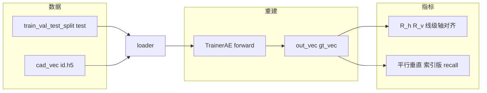

# DeepCAD 原始模型 — 测试集约束相关评估口径

本文档与脚本 [`eval_original_deepcad_axis_constraints.py`](eval_original_deepcad_axis_constraints.py) 保持一致，说明当前采用的统计定义、输出字段与运行方式。

---

## 1. 目标与数据流

- **模型**：原版 DeepCAD 自编码器（`TrainerAE`），对测试集做 **重建（rec）**。
- **输入数据**：`{data_root}/train_val_test_split.json` 中的 `test` 列表；向量来自 `{data_root}/cad_vec/{id}.h5` 的 `vec`。
- **推理对齐**：与项目 [`test.py`](../../test.py) 的 `rec` 模式一致 — 按 **GT 序列中首个 EOS** 截断，保存 `gt_vec` 与 `out_vec` 至 `reconstruction/*_vec.h5`。
- **几何与约束规则**：与 [`constraint_fused_deepcad/sketch_preparation/constraint_extractor.py`](../../constraint_fused_deepcad/sketch_preparation/constraint_extractor.py) 中 `ConstraintExtractor` 一致（`angle_thresh`、`grid_size=256` 等）。



---

## 2. 水平 / 竖直（线级数量比）\(R_h\)、\(R_v\)

### 2.1 定义

- 将 `gt_vec` / `out_vec` 解析为 `CADSequence`，收集序列中 **所有** `Line`（跨所有 Extrude、所有 Loop 展平后的列表）。
- 调用 `ConstraintExtractor.extract_raw_from_lines`：
  - **水平**：直线方向与 **x 轴单位向量** 的无向夹角 \(<\) `angle_thresh`（度）。
  - **竖直**：与 **y 轴单位向量** 的无向夹角 \(<\) `angle_thresh`。
- **全局指标**（测试集汇总，非逐样本平均）：

\[
R_h = \frac{\sum_{\text{样本}} h^{\mathrm{pred}}}{\sum_{\text{样本}} h^{\mathrm{gt}}}, \quad
R_v = \frac{\sum_{\text{样本}} v^{\mathrm{pred}}}{\sum_{\text{样本}} v^{\mathrm{gt}}}
\]

其中 \(h^{\mathrm{gt}}\)、\(v^{\mathrm{gt}}\) 等为该样本 GT 上满足条件的 **Line 条数**；预测侧同理。

### 2.2 说明

- 仅统计 **Line**，不含 Arc/Circle。
- \(R_h,R_v\) **可以大于 1**（预测水平/竖直线总数多于 GT）。
- 分母为 0 时全局比值在 `summary.json` 中记为 `null` 并带 `*_defined: false`（若实现）。

---

## 3. 平行 / 垂直：**索引对齐 Recall**（唯一线对口径）

不再使用「预测线对总数 / GT 线对总数」类 **总量比**（已移除），避免跨 Extrude 错误配对及比值难以解释等问题。

### 3.1 作用域：按 Extrude，且线数须一致

对每个样本：

1. 将 GT、pred 解析为 `CADSequence`，得到拉伸序列 `seq`。
2. 仅处理下标 \(k = 0,\ldots,\min(n_{\mathrm{gt\_ext}}, n_{\mathrm{pred\_ext}})-1\) 的 **同一 Extrude**。
3. 对该 Extrude，按 **Profile → Loop → 曲线** 顺序收集所有 `Line`，得到 `gt_lines`、`pred_lines`（**顺序即索引顺序**）。
4. **若** \(\lvert \text{gt\_lines}\rvert \neq \lvert \text{pred\_lines}\rvert\)：**该 Extrude 不参与** 平行/垂直 recall（不计入分母）；并累计 `pair_recall_extrudes_skipped_line_mismatch`。
5. 若 \(\lvert \text{gt\_seq}\rvert \neq \lvert \text{pred\_seq}\rvert\)：样本级标记 `pair_recall_extrude_count_mismatch = true`，且超出 `min` 的 Extrude 不参与对齐。

### 3.2 GT 线对清单

在 **线数一致** 的 Extrude 内，对 `gt_lines` 调用 `extract_raw_from_lines`，得到：

- `raw.parallel`：无序对 \((i,j)\)，\(i<j\)，GT 上两线方向无向夹角 \(<\) `angle_thresh`（与提取器内「平行」定义一致）。
- `raw.perpendicular`：无序对 \((i,j)\)，无向夹角与 \(90^\circ\) 之差 \(<\) `angle_thresh`。

### 3.3 预测侧判定（同索引）

对同一 Extrude 的 `pred_lines`，计算每条线的 **单位 2D 方向** `pred_dirs[t]`（与提取器一致，用 `Line.direction` 的 xy 分量归一化）。

- **平行 recall 分项**：对 GT 的每个平行对 \((i,j)\)，若 `undirected_angle(pred_dirs[i], pred_dirs[j]) < angle_thresh` 则 **命中 +1**。
- **垂直 recall 分项**：对 GT 的每个垂直对 \((i,j)\)，若 `|undirected_angle(pred_dirs[i], pred_dirs[j]) - 90°| < angle_thresh` 则 **命中 +1**。

### 3.4 全局 Recall

\[
\text{parallel\_recall} = \frac{\sum \text{par\_hits}}{\sum \text{par\_denom}}, \quad
\text{perp\_recall} = \frac{\sum \text{perp\_hits}}{\sum \text{perp\_denom}}
\]

只对 **进入分母的 GT 线对** 统计；故 **Recall \(\in [0,1]\)**（分母为 0 时全局值为 `null`）。

### 3.5 与「总量比」的区别（已废止）

| 已废止 | 现行 |
|--------|------|
| 全样本上「pred 垂直对总数 / GT 垂直对总数」 | 仅针对 **GT 列出的** \((i,j)\)，在 **pred 同下标** 上是否仍满足角度阈值 |
| 易出现 \(>1\)、且与约束「是否保留」语义不一致 | 语义为 **GT 约束对在重建中保留的比例**（在索引对齐前提下） |

---

## 4. 输出文件

| 路径 | 内容 |
|------|------|
| `reconstruction/*_vec.h5` | `gt_vec`、`out_vec`（整型，至 EOS） |
| `per_sample_counts.csv` | 逐样本：\(R_h,R_v\) 相关列 + `par_recall_*` + `perp_recall_*` + `pair_recall_*` + `parse_ok_*` |
| `summary.json` | 全测试集汇总：`ratio_h`、`ratio_v`、`parallel_recall_index_aligned*`、`perpendicular_recall_index_aligned*`、`n_samples_extrude_count_mismatch`、`n_extrudes_skipped_line_count_mismatch_total`、`pair_recall_index_aligned_note` 等 |

### 4.1 `per_sample_counts.csv` 主要列（约束相关）

- `id`：样本名（与 `*_vec.h5` 文件名一致，不含后缀）。
- `n_lines_gt` / `n_lines_pred`：解析后 `ConstraintExtractor.collect_lines_from_cad_sequence` 收集到的 **Line** 总数。
- `n_line_cmds_gt` / `n_line_cmds_pred`：向量中 **命令通道** 上 `LINE` 的出现次数（与几何解析后的线数可不同）。
- `gt_h`, `gt_v`, `pred_h`, `pred_v`：线级水平/竖直条数。
- `ratio_h_sample`, `ratio_v_sample`：单样本 \(h^{\mathrm{pred}}/h^{\mathrm{gt}}\) 等（GT 为 0 时为空）。
- `par_recall_hits`, `par_recall_denom`, `par_recall_index_aligned`。
- `perp_recall_hits`, `perp_recall_denom`, `perp_recall_index_aligned`。
- `pair_recall_extrude_count_mismatch`：该样本 GT/pred 拉伸段数是否不一致。
- `pair_recall_extrudes_skipped_line_mismatch`：该样本内因 **线数不一致** 而跳过的 Extrude 个数。

---

## 5. 运行方式

在仓库根目录执行（示例）：

```powershell
Set-Location d:\DeepCAD\DeepCAD
python "论文尝试\DeepCAD原始约束指标\eval_original_deepcad_axis_constraints.py" `
  --proj_dir proj_log --exp_name newDeepCAD --ckpt latest `
  --data_root data -g 0 `
  --out_dir "论文尝试\DeepCAD原始约束指标"
```

仅基于已有 `reconstruction/` 重算 CSV / `summary.json`（不跑 GPU 推理）：

```powershell
python "论文尝试\DeepCAD原始约束指标\eval_original_deepcad_axis_constraints.py" `
  --skip_reconstruct `
  --angle_thresh 0.1 `
  --out_dir "论文尝试\DeepCAD原始约束指标" `
  --reconstruction_dir "论文尝试\DeepCAD原始约束指标\reconstruction"
```

常用参数：`--angle_thresh`、`--grid_size`、`--reconstruction_dir`、`--reconstruct_only`（只写 h5）。

---

## 6. 实现依赖摘要

- 线收集顺序：`_lines_in_extrude` — 按 `ext.profile.children` 中各 `loop.children` 顺序追加 `Line`。
- 角度函数：`_undirected_line_angle_deg`（与 `ConstraintExtractor` 同源）。
- `ANGLE_THRESH` 默认值以 `constraint_extractor` 中常量为准；可通过 CLI 覆盖。

---

## 7. 修订记录（口径演进）

- **当前**：平行/垂直 **仅** 保留 **per-Extrude + 线数一致 + 索引对齐** 的 recall。
- **已移除**：在多个 Extrude 间展平所有直线后做全局两两配对，以及对应的 **pred/gt 线对总量比**（易产生跨草图错误配对或比值 \(>1\) 难以解释）。

如有变更，请同步更新本文件与脚本 docstring。
