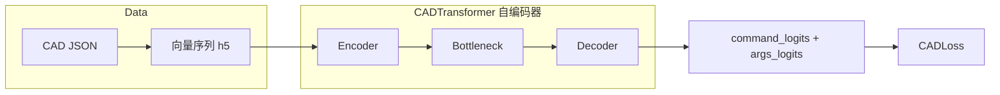

# DeepCAD 原始技术方案

本文档依据仓库实现（`model/`、`dataset/`、`trainer/`、`cadlib/`、`config/`）整理，便于快速理解 **DeepCAD** 的数据表示、网络结构与训练目标。更直观的结构图见同目录 [`deepcad_original_architecture.html`](./deepcad_original_architecture.html)。

---

## 一、方案目标

**DeepCAD** 将 CAD 建模过程表示为**离散命令序列**（草图几何命令 + 拉伸等特征命令），用 **Transformer 自编码器**学习紧凑的潜在表示 \(z\)，并能够从 \(z\) **自回归式地解码**重建整条序列。核心目标包括：

1. **序列重建**：给定真实 CAD 向量序列，编码为 \(z\) 再解码，使命令类别与参数尽可能与真值一致。  
2. **表示学习**：\(z\) 可作为后续生成模型（如 Latent GAN）的条件或采样空间（本仓库中 `latentGAN.py` 等扩展与此配合）。  
3. **与 CAD 内核一致**：数据侧通过 `cadlib` 与 Fusion360 风格 JSON 对齐，保证向量可反解析为几何操作。

---

## 二、整体架构

数据流与网络可概括为：



| 阶段 | 内容 | 典型形状（配置默认） |
|------|------|----------------------|
| 输入 | `command`：每步命令类别；`args`：每步多维离散参数 | `(N, S)`、`(N, S, N_ARGS)`，`S ≤ MAX_TOTAL_LEN`（如 60） |
| 编码器 | 嵌入 + 多层自注意力 + **序列均值池化**（掩码掉 EOS 后填充） | 中间 `(S, N, d_model)`，汇聚为 `(1, N, d_model)` |
| 瓶颈 | `Linear(d_model → dim_z)` + `Tanh` | `(1, N, dim_z)` |
| 解码器 | 可学习“空序列”位置嵌入 + **全局 \(z\) 注入**的 Transformer 解码栈 + 双头 FCN | 输出 `(N, S, n_commands)`、`(N, S, n_args, args_dim+1)` |

**关键超参**（见 `config/configAE.py`）：`d_model=256`，`dim_z=256`，`n_layers=4`（编码），`n_layers_decode=4`（解码），`n_heads=8`，`dim_feedforward=512`，`use_group_emb=True` 等。

---

## 三、各模块架构

以下每节包含：**模块作用**、**模块原理**、**代码**、**举例说明**。

### 3.1 数据与 CAD 向量表示（`cadlib` + `dataset`）

#### 模块作用

将原始 **CAD JSON** 转为固定schema的**整数向量序列**，供网络训练；并负责 padding、可选数据增强。

#### 模块原理

- 命令集合与参数布局由 `cadlib/macro.py` 定义：`Line` / `Arc` / `Circle` / `EOS` / `SOL` / `Ext`，以及 `N_ARGS`、`CMD_ARGS_MASK`（标定每种命令下哪些参数参与损失）。  
- `json2vec.py`：`CADSequence.from_dict` → `normalize` → `numericalize` → `to_vector`，写入 `data/cad_vec/*.h5`。  
- `CADDataset`：读 `vec`，不足长度用 **EOS 行**填充；训练期可选 **按 Extrude 块打乱替换**的增强。

#### 代码

命令与掩码定义（节选）：

```27:32:d:\DeepCAD\DeepCAD\cadlib\macro.py
CMD_ARGS_MASK = np.array([[1, 1, 0, 0, 0, *[0]*N_ARGS_EXT],  # line
                          [1, 1, 1, 1, 0, *[0]*N_ARGS_EXT],  # arc
                          [1, 1, 0, 0, 1, *[0]*N_ARGS_EXT],  # circle
                          [0, 0, 0, 0, 0, *[0]*N_ARGS_EXT],  # EOS
                          [0, 0, 0, 0, 0, *[0]*N_ARGS_EXT],  # SOL
                          [*[0]*N_ARGS_SKETCH, *[1]*N_ARGS_EXT]]) # Extrude
```

命令枚举见同文件 `ALL_COMMANDS` 与 `EOS_IDX`、`EXT_IDX` 等常量。

Dataset 填充与字段：

```74:81:d:\DeepCAD\DeepCAD\dataset\cad_dataset.py
        pad_len = self.max_total_len - cad_vec.shape[0]
        cad_vec = np.concatenate([cad_vec, EOS_VEC[np.newaxis].repeat(pad_len, axis=0)], axis=0)

        command = cad_vec[:, 0]
        args = cad_vec[:, 1:]
        command = torch.tensor(command, dtype=torch.long)
        args = torch.tensor(args, dtype=torch.long)
        return {"command": command, "args": args, "id": data_id}
```

#### 举例说明

一条简化逻辑序列可视为：`SOL` → 若干 `Line`/`Arc`/`Circle` 描述草图 → `Ext`（带平面、平移、拉伸参数）→ … → 最终 `EOS`。  
填充部分全为 `EOS`，编码器侧通过 `EOS` 的累积位置构造 **padding mask**，避免注意力关注无效尾部。

---

### 3.2 CAD 嵌入与编码器（`CADEmbedding` + `Encoder`）

#### 模块作用

将离散的 `commands` 与 `args` 映射为 `d_model` 维序列表示，经 **Transformer 编码器**提取上下文，再 **池化成单一全局向量**（每样本一个序列级表示）。

#### 模块原理

- **命令嵌入**：`nn.Embedding(n_commands, d_model)`。  
- **参数嵌入**：每个参数槽先 `Embedding(args_dim+1, 64)`（`+1` 与 `PAD_VAL=-1` 偏移对齐），展平后 `Linear` 到 `d_model`。  
- **位置编码**：`PositionalEncodingLUT`（可学习位置表）。  
- **可选组嵌入**：`use_group_emb` 时，按 `Ext` 出现次数为 token 分配 **组 id**，强化“第几个拉伸块”的段信息。  
- **编码器**：`TransformerEncoderLayerImproved`（Pre-LN 风格的改进块）× `n_layers`。  
- **汇聚**：对 EOS 之前有效位置做掩码平均，得到 `(1, N, d_model)`。

#### 代码

```28:38:d:\DeepCAD\DeepCAD\model\autoencoder.py
    def forward(self, commands, args, groups=None):
        S, N = commands.shape

        src = self.command_embed(commands.long()) + \
              self.embed_fcn(self.arg_embed((args + 1).long()).view(S, N, -1))  # shift due to -1 PAD_VAL

        if self.use_group:
            src = src + self.group_embed(groups.long())

        src = self.pos_encoding(src)

        return src
```

```70:79:d:\DeepCAD\DeepCAD\model\autoencoder.py
    def forward(self, commands, args):
        padding_mask, key_padding_mask = _get_padding_mask(commands, seq_dim=0), _get_key_padding_mask(commands, seq_dim=0)
        group_mask = _get_group_mask(commands, seq_dim=0) if self.use_group else None

        src = self.embedding(commands, args, group_mask)

        memory = self.encoder(src, mask=None, src_key_padding_mask=key_padding_mask)

        z = (memory * padding_mask).sum(dim=0, keepdim=True) / padding_mask.sum(dim=0, keepdim=True) # (1, N, dim_z)
        return z
```

#### 举例说明

若 `S=60`，batch `N=512`，则嵌入输出为 `(60, 512, 256)`。第一个 `EOS` 出现后，`_get_key_padding_mask` 使后续位置在注意力中不被看见；池化时只用 **第一个 EOS 之前**的 token 求平均，得到每张图一个向量。

---

### 3.3 瓶颈层（`Bottleneck`）

#### 模块作用

将编码器输出从 `d_model` 映射到 **潜空间维度** `dim_z`，并压缩数值范围。

#### 模块原理

单层线性变换 + `Tanh`，便于后续解码器稳定接收全局条件。

#### 代码

```126:134:d:\DeepCAD\DeepCAD\model\autoencoder.py
class Bottleneck(nn.Module):
    def __init__(self, cfg):
        super(Bottleneck, self).__init__()

        self.bottleneck = nn.Sequential(nn.Linear(cfg.d_model, cfg.dim_z),
                                        nn.Tanh())

    def forward(self, z):
        return self.bottleneck(z)
```

#### 举例说明

当 `d_model=256`、`dim_z=256` 时，瓶颈为同维可逆线性（若权重满秩）的“旋转+缩放”加非线性饱和，实践中更强调 **训练目标驱动的压缩**而非严格信息瓶颈。

---

### 3.4 解码器与输出头（`ConstEmbedding` + `TransformerDecoderLayerGlobalImproved` + `FCN`）

#### 模块作用

从单一 \(z\) 生成 **全长 `S` 步**的隐藏序列，再分类出每步命令与参数。

#### 模块原理

- **ConstEmbedding**：长度为 `max_total_len` 的可学习位置序列，**不依赖输入 token**，初始内容为“零 + 位置表”。  
- **解码层**（`TransformerDecoderLayerGlobalImproved`）：  
  - 先做 **自注意力**（可建模输出步之间依赖）；  
  - 将全局 `memory`（即 \(z\)）经 `linear_global` 投影后 **加到每个时间步**（广播相加），等价于强 **全局条件注入**；  
  - 再接 FFN。  
  与经典 Seq2Seq 中“cross-attention 看 encoder 序列”不同，此处 encoder 侧已池化为一个向量，故用 **加法注入**实现条件解码。  
- **FCN**：两个线性头——命令 `n_commands` 类；参数 `n_args × (args_dim+1)` 再 reshape 为每槽多类分类。

#### 代码

```51:55:d:\DeepCAD\DeepCAD\model\autoencoder.py
    def forward(self, z):
        N = z.size(1)
        src = self.PE(z.new_zeros(self.seq_len, N, self.d_model))
        return src
```

```116:123:d:\DeepCAD\DeepCAD\model\autoencoder.py
    def forward(self, z):
        src = self.embedding(z)
        out = self.decoder(src, z, tgt_mask=None, tgt_key_padding_mask=None)

        command_logits, args_logits = self.fcn(out)

        out_logits = (command_logits, args_logits)
        return out_logits
```

```92:100:d:\DeepCAD\DeepCAD\model\autoencoder.py
    def forward(self, out):
        S, N, _ = out.shape

        command_logits = self.command_fcn(out)  # Shape [S, N, n_commands]

        args_logits = self.args_fcn(out)  # Shape [S, N, n_args * args_dim]
        args_logits = args_logits.reshape(S, N, self.n_args, self.args_dim)  # Shape [S, N, n_args, args_dim]

        return command_logits, args_logits
```

全局注入（解码层核心）：

```126:140:d:\DeepCAD\DeepCAD\model\layers\improved_transformer.py
    def forward(self, tgt, memory, memory2=None, tgt_mask=None, tgt_key_padding_mask=None, *args, **kwargs):
        tgt1 = self.norm1(tgt)
        tgt2 = self.self_attn(tgt1, tgt1, tgt1, attn_mask=tgt_mask, key_padding_mask=tgt_key_padding_mask)[0]
        tgt = tgt + self.dropout1(tgt2)

        tgt2 = self.linear_global(memory)
        tgt = tgt + self.dropout2(tgt2)  # implicit broadcast
        // ...
        return tgt
```

#### 举例说明

潜向量 `z` 形状 `(1, N, 256)`。解码器产生 `(60, N, 256)` 的隐藏状态；每一步都加上由 `z` 变换来的偏置，使网络在**任意输出位置**都能访问全局形状信息，再预测该步是 `Line` 还是 `Ext` 以及对应离散参数桶。

---

### 3.5 整体前向（`CADTransformer`）

#### 模块作用

统一 **训练**（encode+decode+返回 target）、**仅编码**（`encode_mode=True`）、**给定 z 解码**（`z` 外部传入）三种用法。

#### 模块原理

内部统一为 **序列优先** `(S, N, …)` 与 batch 优先互换；返回 `command_logits`、`args_logits`，并在训练时附带 `tgt_commands` / `tgt_args` 供损失使用。

#### 代码

```137:173:d:\DeepCAD\DeepCAD\model\autoencoder.py
class CADTransformer(nn.Module):
    def forward(self, commands_enc, args_enc,
                z=None, return_tgt=True, encode_mode=False):
        commands_enc_, args_enc_ = _make_seq_first(commands_enc, args_enc)

        if z is None:
            z = self.encoder(commands_enc_, args_enc_)
            z = self.bottleneck(z)
        else:
            z = _make_seq_first(z)

        if encode_mode: return _make_batch_first(z)

        out_logits = self.decoder(z)
        out_logits = _make_batch_first(*out_logits)

        res = {
            "command_logits": out_logits[0],
            "args_logits": out_logits[1]
        }

        if return_tgt:
            res["tgt_commands"] = commands_enc
            res["tgt_args"] = args_enc

        return res
```

#### 举例说明

- **重建训练**：`z=None`，用数据算 \(z\) 再解码，与输入序列对齐计算交叉熵。  
- **推理仅编码**：`encode_mode=True` 得 `z`。  
- **从潜向量生成**：`commands_enc=None`，传入 `z`，`return_tgt=False`，得到 logits 后经 `argmax` 得到离散序列（见 `TrainerAE.logits2vec`）。

---

### 3.6 损失函数与训练流程（`CADLoss` + `TrainerAE`）

#### 模块作用

对命令与参数做 **带掩码的多类交叉熵**，忽略 padding 与无效参数槽；与优化器、学习率预热等共同完成训练。

#### 模块原理

- `padding_mask`：延伸到包含有效 EOS 区域（`extended=True`），并与 `visibility_mask` 结合，避免全 `EOS` 样本除零等病态。  
- `CMD_ARGS_MASK`：只对当前命令**应当有效的参数槽**计算 args 损失。  
- 参数 target 在 CE 中 **+1**，与嵌入侧 `(args+1)` 一致。  
- 权重：`loss_cmd_weight`、`loss_args_weight`（默认 1.0 与 2.0）。

#### 代码

```8:36:d:\DeepCAD\DeepCAD\trainer\loss.py
class CADLoss(nn.Module):
    def forward(self, output):
        tgt_commands, tgt_args = output["tgt_commands"], output["tgt_args"]

        visibility_mask = _get_visibility_mask(tgt_commands, seq_dim=-1)
        padding_mask = _get_padding_mask(tgt_commands, seq_dim=-1, extended=True) * visibility_mask.unsqueeze(-1)

        command_logits, args_logits = output["command_logits"], output["args_logits"]

        mask = self.cmd_args_mask[tgt_commands.long()]

        loss_cmd = F.cross_entropy(command_logits[padding_mask.bool()].reshape(-1, self.n_commands), tgt_commands[padding_mask.bool()].reshape(-1).long())
        loss_args = F.cross_entropy(args_logits[mask.bool()].reshape(-1, self.args_dim), tgt_args[mask.bool()].reshape(-1).long() + 1)

        loss_cmd = self.weights["loss_cmd_weight"] * loss_cmd
        loss_args = self.weights["loss_args_weight"] * loss_args

        res = {"loss_cmd": loss_cmd, "loss_args": loss_args}
        return res
```

训练步：

```23:30:d:\DeepCAD\DeepCAD\trainer\trainerAE.py
    def forward(self, data):
        commands = data['command'].cuda() # (N, S)
        args = data['args'].cuda()  # (N, S, N_ARGS)

        outputs = self.net(commands, args)
        loss_dict = self.loss_func(outputs)

        return outputs, loss_dict
```

#### 举例说明

某一步真值为 `Line`，则仅前两个参数槽参与 `loss_args`；`EOS` 步命令仍可能参与 `loss_cmd`，但参数槽被掩码全部关闭。总损失常为 `loss_cmd + loss_args`，由 `BaseTrainer` 反向传播（见 `trainer/base.py`）。

---

## 四、总结

| 要点 | 说明 |
|------|------|
| 表示 | CAD = 离散命令 + 离散参数序列，JSON → `cad_vec`（h5）。 |
| 编码 | Transformer 编码 + 有效 token 掩码平均 → 瓶颈得到 \(z\)。 |
| 解码 | 固定长度可学习位置序列 + 自注意力 + **全局 \(z\) 线性注入** + 双头分类。 |
| 训练 | 掩码交叉熵（命令 + 参数），参数掩码由 `CMD_ARGS_MASK` 与 padding/visibility 共同决定。 |
| 扩展 | 同仓库中 **Latent GAN**、**点云条件**等模块在 `CADTransformer` 提供的 \(z\) 或 logits 之上构建，本方案描述的是其核心 **AE 主干**。 |

若要对照论文与官方说明，建议同时阅读 DeepCAD 原论文及本仓库 `train.py` 入口与 `configAE` 中的默认实验设置。
