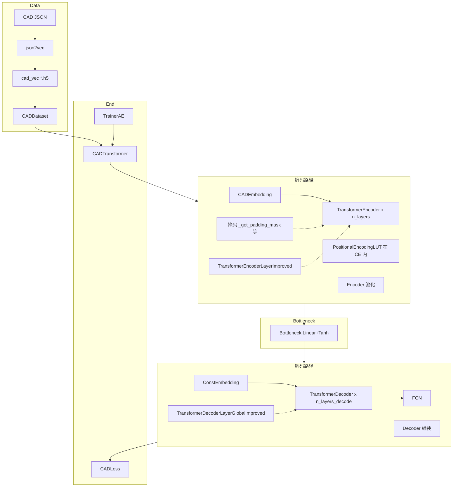

# DeepCAD 原始技术方案（详细版）

本文档在 [`DeepCAD原始技术方案.md`](./DeepCAD原始技术方案.md) 的基础上展开为**细粒度模块说明**：每个类或独立机制单独成节（**不将例如 `CADEmbedding` 与 `Encoder` 合并叙述**），仍遵循「模块作用 / 模块原理 / 代码 / 举例说明」结构。实现依据仓库 `model/`、`dataset/`、`trainer/`、`cadlib/`、`config/`。结构图见 [`deepcad_original_architecture.html`](./deepcad_original_architecture.html)。

---

## 一、方案目标

**DeepCAD** 将 CAD 建模过程表示为**离散命令序列**（草图几何命令与拉伸等特征命令），用 **Transformer 自编码器**学习紧凑潜在向量 \(z\)，并从 \(z\) 解码重建整段序列。

1. **序列重建**：编码—瓶颈—解码后，命令分类与离散参数分类与真值对齐。  
2. **表示学习**：\(z\) 可供同仓库中 Latent GAN、点云条件等模块继续使用。  
3. **与 CAD 数据一致**：`cadlib` 将 Fusion360 风格 JSON 转为与内核一致的整数向量，便于还原几何语义。

---

## 二、整体架构（子模块展开）



| 模块 | 路径/类 | 输入→输出形状（默认配置示意） |
|------|---------|-------------------------------|
| 数据 | `CADDataset` | h5 向量 → `command (S,)`, `args (S, N_ARGS)`，再 batch 为 `(N,S)` |
| 嵌入 | `CADEmbedding` | `(S,N)` + `(S,N,N_ARGS)` → `(S,N,d_model)` |
| 位置 | `PositionalEncodingLUT` | 与上同长序列相加 |
| 掩码 | `model_utils` | 由 `commands` 推导 padding / key_padding / group |
| 编码层 | `TransformerEncoderLayerImproved` | `(S,N,d_model)` → 同形 |
| 编码栈 | `TransformerEncoder` | 重复 `n_layers` 次 |
| 编码器 | `Encoder` | 上述 → 池化 `(1,N,d_model)` |
| 瓶颈 | `Bottleneck` | `(1,N,d_model)` → `(1,N,dim_z)` |
| 常数序列嵌入 | `ConstEmbedding` | `z` → `(S,N,d_model)` |
| 解码层 | `TransformerDecoderLayerGlobalImproved` | 自注意力 + 全局 \(z\) 注入 + FFN |
| 解码栈 | `TransformerDecoder` | `n_layers_decode` 层 |
| 输出头 | `FCN` | `(S,N,d_model)` → 命令 logits + 参数 logits |
| 解码器类 | `Decoder` | 串联 ConstEmbedding、解码栈、FCN |
| 整体 | `CADTransformer` | 训练/编码/外置 \(z\) 解码 |

默认超参见 `config/configAE.py`（如 `d_model=256`，`dim_z=256`，`n_layers=4`，`n_layers_decode=4`，`n_heads=8`，`use_group_emb=True`）。

---

## 三、数据与 CAD 表示

### 3.1 `cadlib/macro.py`：命令类型与参数槽

#### 模块作用

统一**命令枚举**、**每步参数个数**、**损失中有效的参数维度**（`CMD_ARGS_MASK`），供数据集、模型嵌入与 `CADLoss` 共用。

#### 模块原理

- `ALL_COMMANDS`：`Line`, `Arc`, `Circle`, `EOS`, `SOL`, `Ext`。  
- `N_ARGS` 由草图参数槽与拉伸相关参数槽拼接而成；`PAD_VAL=-1` 表示无效参数，嵌入与损失中通过 `+1` 平移到非负索引。  
- `CMD_ARGS_MASK`：逐命令标明哪些参数槽参与参数损失（例如 `Line` 仅前两维）。

#### 代码

```3:9:d:\DeepCAD\DeepCAD\cadlib\macro.py
ALL_COMMANDS = ['Line', 'Arc', 'Circle', 'EOS', 'SOL', 'Ext']
LINE_IDX = ALL_COMMANDS.index('Line')
ARC_IDX = ALL_COMMANDS.index('Arc')
CIRCLE_IDX = ALL_COMMANDS.index('Circle')
EOS_IDX = ALL_COMMANDS.index('EOS')
SOL_IDX = ALL_COMMANDS.index('SOL')
EXT_IDX = ALL_COMMANDS.index('Ext')
```

```27:32:d:\DeepCAD\DeepCAD\cadlib\macro.py
CMD_ARGS_MASK = np.array([[1, 1, 0, 0, 0, *[0]*N_ARGS_EXT],  # line
                          [1, 1, 1, 1, 0, *[0]*N_ARGS_EXT],  # arc
                          [1, 1, 0, 0, 1, *[0]*N_ARGS_EXT],  # circle
                          [0, 0, 0, 0, 0, *[0]*N_ARGS_EXT],  # EOS
                          [0, 0, 0, 0, 0, *[0]*N_ARGS_EXT],  # SOL
                          [*[0]*N_ARGS_SKETCH, *[1]*N_ARGS_EXT]]) # Extrude
```

#### 举例说明

一步为 `Ext` 时，草图五元参数槽在掩码上为 0，平面/平移/拉伸等扩展参数为 1；一步为 `EOS` 时参数不参与参数交叉熵。

---

### 3.2 `dataset/json2vec.py`：JSON → 向量 h5

#### 模块作用

离线将每个样本的 **CAD JSON** 转为固定长度的整数矩阵一行存 **h5**，供训练直接随机读取。

#### 模块原理

对每条 `data_id`：读 JSON → `CADSequence.from_dict` → `normalize` → `numericalize` → `to_vector(...)`；超长或异常样本丢弃；写入 `data/cad_vec/<id>.h5` 的 `vec` 数据集。

#### 代码

```21:30:d:\DeepCAD\DeepCAD\dataset\json2vec.py
def process_one(data_id):
    json_path = os.path.join(RAW_DATA, data_id + ".json")
    with open(json_path, "r") as fp:
        data = json.load(fp)

    try:
        cad_seq = CADSequence.from_dict(data)
        cad_seq.normalize()
        cad_seq.numericalize()
        cad_vec = cad_seq.to_vector(MAX_N_EXT, MAX_N_LOOPS, MAX_N_CURVES, MAX_TOTAL_LEN, pad=False)
```

#### 举例说明

`vec` 每行为 `[command_idx, arg_1, …, arg_{N_ARGS-1}]`，长度不超过 `MAX_TOTAL_LEN` 才写入；具体曲线与拉伸语义由 `cadlib.extrude`、`cadlib.sketch` 等解析（本节不展开类合并，仅标明预处理入口）。

---

### 3.3 `dataset/cad_dataset.py`：`CADDataset`

#### 模块作用

训练/验证/测试阶段从 h5 读取向量，做**可选增强**、**EOS 填充**到 `max_total_len`，返回 PyTorch 张量字典。

#### 模块原理

- 路径：`config.data_root/cad_vec` + `train_val_test_split.json` 中的 id 列表。  
- 增强（`augment` 且 `train`）：按 `Ext` 切分多个 extrude 段，随机用另一模型的段替换若干段再拼接，控制总长不超过 `max_total_len`。  
- 填充：尾部重复 `EOS_VEC` 行至固定长度；拆出 `command` 与 `args` 列。

#### 代码

```74:81:d:\DeepCAD\DeepCAD\dataset\cad_dataset.py
        pad_len = self.max_total_len - cad_vec.shape[0]
        cad_vec = np.concatenate([cad_vec, EOS_VEC[np.newaxis].repeat(pad_len, axis=0)], axis=0)

        command = cad_vec[:, 0]
        args = cad_vec[:, 1:]
        command = torch.tensor(command, dtype=torch.long)
        args = torch.tensor(args, dtype=torch.long)
        return {"command": command, "args": args, "id": data_id}
```

#### 举例说明

真实序列长度 34、最大 60 时，后 26 步均为 `EOS`；编码器用 `EOS` 出现位置界定有效段与注意力屏蔽。

---

## 四、编码路径（逐模块）

### 4.1 `CADEmbedding`

#### 模块作用

将离散 **命令 id** 与 **各参数槽 id** 融合为 `d_model` 维向量序列，是编码器输入的**唯一**可学习输入变换（不含后续 Transformer）。

#### 模块原理

- `command_embed`：`Embedding(n_commands, d_model)`。  
- `arg_embed`：`Embedding(args_dim+1, 64, padding_idx=0)`，其中 `args_dim = cfg.args_dim + 1` 与 `PAD_VAL=-1` 的 `(args+1)` 对齐；所有槽拼接后经 `Linear(64*n_args, d_model)`。  
- 命令与参数分支**相加**融合。  
- 若 `use_group`：再与 `group_embed(groups)` 相加（`groups` 由外部传入，通常为按 `Ext` 累计的组 id）。  
- 最后调用**独立的** `PositionalEncodingLUT`（见下一节）。

#### 代码

```8:39:d:\DeepCAD\DeepCAD\model\autoencoder.py
class CADEmbedding(nn.Module):
    """Embedding: positional embed + command embed + parameter embed + group embed (optional)"""
    def __init__(self, cfg, seq_len, use_group=False, group_len=None):
        super().__init__()

        self.command_embed = nn.Embedding(cfg.n_commands, cfg.d_model)

        args_dim = cfg.args_dim + 1
        self.arg_embed = nn.Embedding(args_dim, 64, padding_idx=0)
        self.embed_fcn = nn.Linear(64 * cfg.n_args, cfg.d_model)

        # use_group: additional embedding for each sketch-extrusion pair
        self.use_group = use_group
        if use_group:
            if group_len is None:
                group_len = cfg.max_num_groups
            self.group_embed = nn.Embedding(group_len + 2, cfg.d_model)

        self.pos_encoding = PositionalEncodingLUT(cfg.d_model, max_len=seq_len+2)

    def forward(self, commands, args, groups=None):
        S, N = commands.shape

        src = self.command_embed(commands.long()) + \
              self.embed_fcn(self.arg_embed((args + 1).long()).view(S, N, -1))  # shift due to -1 PAD_VAL

        if self.use_group:
            src = src + self.group_embed(groups.long())

        src = self.pos_encoding(src)

        return src
```

#### 举例说明

`S=60, N=32, d_model=256` 时输出 `(60, 32, 256)`。`args` 中 -1 经 `+1` 变为 0，与 `padding_idx=0` 对齐，避免把 padding 当真实分类目标。

---

### 4.2 `PositionalEncodingLUT`

#### 模块作用

为序列每个位置加上**可学习**的位置向量，并在前向中加入 dropout，使模型区分「第几步」命令。

#### 模块原理

与 Transformer 原版正弦位置编码不同，此处用 `nn.Embedding(max_len, d_model)` 查表；权重用 `kaiming_normal_` 初始化；`forward` 用当前序列长度截取位置 id。

#### 代码

```24:43:d:\DeepCAD\DeepCAD\model\layers\positional_encoding.py
class PositionalEncodingLUT(nn.Module):

    def __init__(self, d_model, dropout=0.1, max_len=250):
        super(PositionalEncodingLUT, self).__init__()
        self.dropout = nn.Dropout(dropout)

        position = torch.arange(0, max_len, dtype=torch.long).unsqueeze(1)
        self.register_buffer('position', position)

        self.pos_embed = nn.Embedding(max_len, d_model)

        self._init_embeddings()

    def _init_embeddings(self):
        nn.init.kaiming_normal_(self.pos_embed.weight, mode="fan_in")

    def forward(self, x):
        pos = self.position[:x.size(0)]
        x = x + self.pos_embed(pos)
        return self.dropout(x)
```

#### 举例说明

`CADEmbedding` 使用 `max_len=seq_len+2`，`ConstEmbedding` 使用 `max_len=seq_len`，二者实例**相互独立**，参数不共享。

---

### 4.3 `model_utils`：`_get_key_padding_mask` / `_get_padding_mask` / `_get_group_mask`

#### 模块作用

从 `commands` **无梯度**推导：注意力用 **key padding**、池化用 **有效位置权重**、可选 **组 id**（供 `CADEmbedding` 的 group 嵌入）。

#### 模块原理

- `_get_key_padding_mask`：从第一个 `EOS` 起（含）之后位置为 True，转置为 `(N,S)` 供 `MultiheadAttention` 的 `key_padding_mask`。  
- `_get_padding_mask`：`EOS` 累积为 0 的位置为有效；`extended=True` 时在损失里扩展一位以包含终止 `EOS` 相关规则（与 `CADLoss` 一致）。  
- `_get_group_mask`：`Ext` 命令的累计次数作为组索引（实现上为 `(commands == EXT_IDX).cumsum`）。

#### 代码

```23:59:d:\DeepCAD\DeepCAD\model\model_utils.py
def _get_key_padding_mask(commands, seq_dim=0):
    """
    Args:
        commands: Shape [S, ...]
    """
    with torch.no_grad():
        key_padding_mask = (commands == EOS_IDX).cumsum(dim=seq_dim) > 0

        if seq_dim == 0:
            return key_padding_mask.transpose(0, 1)
        return key_padding_mask


def _get_padding_mask(commands, seq_dim=0, extended=False):
    with torch.no_grad():
        padding_mask = (commands == EOS_IDX).cumsum(dim=seq_dim) == 0
        padding_mask = padding_mask.float()

        if extended:
            # padding_mask doesn't include the final EOS, extend by 1 position to include it in the loss
            S = commands.size(seq_dim)
            torch.narrow(padding_mask, seq_dim, 3, S-3).add_(torch.narrow(padding_mask, seq_dim, 0, S-3)).clamp_(max=1)

        if seq_dim == 0:
            return padding_mask.unsqueeze(-1)
        return padding_mask


def _get_group_mask(commands, seq_dim=0):
    """
    Args:
        commands: Shape [S, ...]
    """
    with torch.no_grad():
        # group_mask = (commands == SOS_IDX).cumsum(dim=seq_dim)
        group_mask = (commands == EXT_IDX).cumsum(dim=seq_dim)
        return group_mask
```

#### 举例说明

序列在位置 20 首次出现 `EOS`：位置 0–19 参与池化求和；自注意力中位置 20 及以后对任意 query 不可见（避免抄 padding）。

---

### 4.4 `TransformerEncoderLayerImproved`

#### 模块作用

单层编码：**Pre-LN** 自注意力 + 残差，再接 **Pre-LN** 前馈网络 + 残差；为 DeepCAD 编码栈的基本单元。

#### 模块原理

顺序为 `norm1 → self_attn → dropout 残差`；若传入 `memory2`（本仓库 Encoder **未使用**）可额外线性注入全局向量；再 `norm2 → FFN → 残差`。与 Post-LN 相比，训练往往更稳定。

#### 代码

```16:54:d:\DeepCAD\DeepCAD\model\layers\improved_transformer.py
class TransformerEncoderLayerImproved(Module):
    def __init__(self, d_model, nhead, dim_feedforward=2048, dropout=0.1, activation="relu", d_global2=None):
        super(TransformerEncoderLayerImproved, self).__init__()
        self.self_attn = MultiheadAttention(d_model, nhead, dropout=dropout)

        if d_global2 is not None:
            self.linear_global2 = Linear(d_global2, d_model)

        # Implementation of Feedforward model
        self.linear1 = Linear(d_model, dim_feedforward)
        self.dropout = Dropout(dropout)
        self.linear2 = Linear(dim_feedforward, d_model)

        self.norm1 = LayerNorm(d_model)
        self.norm2 = LayerNorm(d_model)
        self.dropout1 = Dropout(dropout)
        self.dropout2_2 = Dropout(dropout)
        self.dropout2 = Dropout(dropout)

        self.activation = _get_activation_fn(activation)

    def forward(self, src, memory2=None, src_mask=None, src_key_padding_mask=None):
        src1 = self.norm1(src)
        src2 = self.self_attn(src1, src1, src1, attn_mask=src_mask, key_padding_mask=src_key_padding_mask)[0]
        src = src + self.dropout1(src2)

        if memory2 is not None:
            src2_2 = self.linear_global2(memory2)
            src = src + self.dropout2_2(src2_2)

        src1 = self.norm2(src)
        src2 = self.linear2(self.dropout(self.activation(self.linear1(src1))))
        src = src + self.dropout2(src2)
        return src
```

#### 举例说明

`d_model=256, nhead=8` 时，自注意力将 8 个头拼接回 256 维；`dim_feedforward=512` 为 FFN 中间层宽度。

---

### 4.5 `TransformerEncoder`（`model/layers/transformer.py`）

#### 模块作用

将**同一结构**的编码层深拷贝 `num_layers` 份顺序堆叠，末尾可选 `LayerNorm`。

#### 模块原理

`forward` 迭代 `self.layers`，每层调用 `mod(output, memory2=..., src_mask=..., src_key_padding_mask=...)`；DeepCAD 中 `memory2=None`，掩码贯穿各层。

#### 代码

```162:188:d:\DeepCAD\DeepCAD\model\layers\transformer.py
    def __init__(self, encoder_layer, num_layers, norm=None):
        super(TransformerEncoder, self).__init__()
        self.layers = _get_clones(encoder_layer, num_layers)
        self.num_layers = num_layers
        self.norm = norm

    def forward(self, src, memory2=None, mask=None, src_key_padding_mask=None):
        # type: (Tensor, Optional[Tensor], Optional[Tensor], Optional[Tensor]) -> Tensor
        r"""Pass the input through the encoder layers in turn.
        ...
        """
        output = src

        for mod in self.layers:
            output = mod(output, memory2=memory2, src_mask=mask, src_key_padding_mask=src_key_padding_mask)

        if self.norm is not None:
            output = self.norm(output)

        return output
```

#### 举例说明

`n_layers=4` 时参数量约为单层的 4 倍（深拷贝独立参数）；输出与输入同为 `(S, N, d_model)`。

---

### 4.6 `Encoder`

#### 模块作用

**组装** `CADEmbedding`、`TransformerEncoder` 与**序列级池化**：输出每个样本一个向量 `(1, N, d_model)`，供 `Bottleneck` 使用。

#### 模块原理

本类**不包含**嵌入矩阵的定义（由子模块 `CADEmbedding` 完成）；本类职责为：计算掩码 → 调用 `embedding` → 调用 `self.encoder` → 用 `_get_padding_mask` 的和归一化做**掩码均值**（代码注释写 `dim_z` 实为笔误，此处仍为 `d_model`）。

#### 代码

```58:79:d:\DeepCAD\DeepCAD\model\autoencoder.py
class Encoder(nn.Module):
    def __init__(self, cfg):
        super().__init__()

        seq_len = cfg.max_total_len
        self.use_group = cfg.use_group_emb
        self.embedding = CADEmbedding(cfg, seq_len, use_group=self.use_group)

        encoder_layer = TransformerEncoderLayerImproved(cfg.d_model, cfg.n_heads, cfg.dim_feedforward, cfg.dropout)
        encoder_norm = LayerNorm(cfg.d_model)
        self.encoder = TransformerEncoder(encoder_layer, cfg.n_layers, encoder_norm)

    def forward(self, commands, args):
        padding_mask, key_padding_mask = _get_padding_mask(commands, seq_dim=0), _get_key_padding_mask(commands, seq_dim=0)
        group_mask = _get_group_mask(commands, seq_dim=0) if self.use_group else None

        src = self.embedding(commands, args, group_mask)

        memory = self.encoder(src, mask=None, src_key_padding_mask=key_padding_mask)

        z = (memory * padding_mask).sum(dim=0, keepdim=True) / padding_mask.sum(dim=0, keepdim=True) # (1, N, dim_z)
        return z
```

#### 举例说明

有效 token 数为 25 时，池化为 25 个位置 hidden 的算术平均；全 padding 的边界情况在实现上依赖 `padding_mask.sum`（训练数据通常至少含真实内容）。

---

## 五、`Bottleneck`

#### 模块作用

将 `Encoder` 输出的 `d_model` 维全局向量线性映射到 `dim_z`，并用 `Tanh` 有界化。

#### 模块原理

单层 `Linear` + 激活，无额外归一化；`dim_z` 与解码侧 `TransformerDecoderLayerGlobalImproved` 的 `d_global` 一致。

#### 代码

```126:134:d:\DeepCAD\DeepCAD\model\autoencoder.py
class Bottleneck(nn.Module):
    def __init__(self, cfg):
        super(Bottleneck, self).__init__()

        self.bottleneck = nn.Sequential(nn.Linear(cfg.d_model, cfg.dim_z),
                                        nn.Tanh())

    def forward(self, z):
        return self.bottleneck(z)
```

#### 举例说明

默认 `d_model=dim_z=256` 时该层为方阵映射，主要起**可学习线性混合 + 饱和非线性**作用，便于与解码器全局注入维度对齐。

---

## 六、解码路径（逐模块）

### 6.1 `ConstEmbedding`

#### 模块作用

构造**不依赖输入 token** 的长度为 `max_total_len` 的解码器输入序列：全零向量加**仅与位置有关**的 `PositionalEncodingLUT`。

#### 模块原理

`forward(z)` 中仅用 `z` 获取 batch 大小 `N` 与 device；实际内容为 `z.new_zeros(self.seq_len, N, d_model)` 再经 `PE`（与编码端**另一实例**）。

#### 代码

```42:55:d:\DeepCAD\DeepCAD\model\autoencoder.py
class ConstEmbedding(nn.Module):
    """learned constant embedding"""
    def __init__(self, cfg, seq_len):
        super().__init__()

        self.d_model = cfg.d_model
        self.seq_len = seq_len

        self.PE = PositionalEncodingLUT(cfg.d_model, max_len=seq_len)

    def forward(self, z):
        N = z.size(1)
        src = self.PE(z.new_zeros(self.seq_len, N, self.d_model))
        return src
```

#### 举例说明

同一 \(z\) 下，解码第 0 步与第 59 步的初始 hidden 差异**仅来自位置编码**；全局形状信息随后由每层全局注入提供。

---

### 6.2 `TransformerDecoderLayerGlobalImproved`

#### 模块作用

解码单层：**Pre-LN 自注意力** → 将全局向量 `memory`（即 \(z\)）经 `linear_global` **广播加到每个时间步** → **Pre-LN FFN**；**无**对 encoder 序列的 cross-attention（因 memory 已是单一全局向量）。

#### 模块原理

`memory` 形状为 `(1, N, d_global)`，`linear_global` 输出 `(1, N, d_model)`，与 `(S, N, d_model)` 的 `tgt` 广播相加；可选 `memory2` 在本仓库 Decoder 中未用。

#### 代码

```97:141:d:\DeepCAD\DeepCAD\model\layers\improved_transformer.py
class TransformerDecoderLayerGlobalImproved(Module):
    def __init__(self, d_model, d_global, nhead, dim_feedforward=2048, dropout=0.1, activation="relu", d_global2=None):
        super(TransformerDecoderLayerGlobalImproved, self).__init__()
        self.self_attn = MultiheadAttention(d_model, nhead, dropout=dropout)

        self.linear_global = Linear(d_global, d_model)

        if d_global2 is not None:
            self.linear_global2 = Linear(d_global2, d_model)

        # Implementation of Feedforward model
        self.linear1 = Linear(d_model, dim_feedforward)
        self.dropout = Dropout(dropout)
        self.linear2 = Linear(dim_feedforward, d_model)

        self.norm1 = LayerNorm(d_model)
        self.norm2 = LayerNorm(d_model)
        self.dropout1 = Dropout(dropout)
        self.dropout2 = Dropout(dropout)
        self.dropout2_2 = Dropout(dropout)
        self.dropout3 = Dropout(dropout)

        self.activation = _get_activation_fn(activation)

    def forward(self, tgt, memory, memory2=None, tgt_mask=None, tgt_key_padding_mask=None, *args, **kwargs):
        tgt1 = self.norm1(tgt)
        tgt2 = self.self_attn(tgt1, tgt1, tgt1, attn_mask=tgt_mask, key_padding_mask=tgt_key_padding_mask)[0]
        tgt = tgt + self.dropout1(tgt2)

        tgt2 = self.linear_global(memory)
        tgt = tgt + self.dropout2(tgt2)  # implicit broadcast

        if memory2 is not None:
            tgt2_2 = self.linear_global2(memory2)
            tgt = tgt + self.dropout2_2(tgt2_2)

        tgt1 = self.norm2(tgt)
        tgt2 = self.linear2(self.dropout(self.activation(self.linear1(tgt1))))
        tgt = tgt + self.dropout3(tgt2)
        return tgt
```

#### 举例说明

若关闭自注意力（极端假想），每层仍会把同一线性变换后的 \(z\) 偏置加到各步，类似「全局条件仿射」；自注意力则允许各输出步交换信息后再预测。

---

### 6.3 `TransformerDecoder`

#### 模块作用

堆叠 `n_layers_decode` 个 `TransformerDecoderLayerGlobalImproved`，对 `tgt` 与同一 `memory`（\(z\)）重复精炼。

#### 模块原理

与编码栈相同克隆机制；每层 `memory` 均为同一个 \(z\) 张量引用。

#### 代码

```208:242:d:\DeepCAD\DeepCAD\model\layers\transformer.py
    def __init__(self, decoder_layer, num_layers, norm=None):
        super(TransformerDecoder, self).__init__()
        self.layers = _get_clones(decoder_layer, num_layers)
        self.num_layers = num_layers
        self.norm = norm

    def forward(self, tgt, memory, memory2=None, tgt_mask=None,
                memory_mask=None, tgt_key_padding_mask=None,
                memory_key_padding_mask=None):
        ...
        output = tgt

        for mod in self.layers:
            output = mod(output, memory, memory2=memory2, tgt_mask=tgt_mask,
                         memory_mask=memory_mask,
                         tgt_key_padding_mask=tgt_key_padding_mask,
                         memory_key_padding_mask=memory_key_padding_mask)

        if self.norm is not None:
            output = self.norm(output)

        return output
```

#### 举例说明

`n_layers_decode=4` 时 \(z\) 经 4 次「线性投影 + 加性注入」与 4 次自注意力—FFN，逐步细化整段 logits 的上下文。

---

### 6.4 `FCN`

#### 模块作用

将每个时间步的 `d_model` 向量投影为**命令 logits** 与 **各参数槽 logits**（每槽 `args_dim` 类，含 padding 桶）。

#### 模块原理

两个独立 `Linear`：`command_fcn` → `(n_commands)`；`args_fcn` → 展平为 `(n_args, args_dim)`。

#### 代码

```82:100:d:\DeepCAD\DeepCAD\model\autoencoder.py
class FCN(nn.Module):
    def __init__(self, d_model, n_commands, n_args, args_dim=256):
        super().__init__()

        self.n_args = n_args
        self.args_dim = args_dim

        self.command_fcn = nn.Linear(d_model, n_commands)
        self.args_fcn = nn.Linear(d_model, n_args * args_dim)

    def forward(self, out):
        S, N, _ = out.shape

        command_logits = self.command_fcn(out)  # Shape [S, N, n_commands]

        args_logits = self.args_fcn(out)  # Shape [S, N, n_args * args_dim]
        args_logits = args_logits.reshape(S, N, self.n_args, self.args_dim)  # Shape [S, N, n_args, args_dim]

        return command_logits, args_logits
```

#### 举例说明

解码输出在 `CADTransformer` 中被转回 batch 优先后，`args_logits` 形状为 `(N, S, n_args, args_dim+1)`（`args_dim` 在构造时已含 `+1`）。

---

### 6.5 `Decoder`

#### 模块作用

串联 **ConstEmbedding** → **TransformerDecoder**（全局 \(z\)）→ **FCN**，完成从 \(z\) 到 logits 的端到端解码。

#### 模块原理

不包含子层内部实现，仅配置层数与维度；`forward(z)` 中 `z` 同时作为 `ConstEmbedding` 的 batch 信息与 `TransformerDecoder` 的 `memory`。

#### 代码

```103:123:d:\DeepCAD\DeepCAD\model\autoencoder.py
class Decoder(nn.Module):
    def __init__(self, cfg):
        super(Decoder, self).__init__()

        self.embedding = ConstEmbedding(cfg, cfg.max_total_len)

        decoder_layer = TransformerDecoderLayerGlobalImproved(cfg.d_model, cfg.dim_z, cfg.n_heads, cfg.dim_feedforward, cfg.dropout)
        decoder_norm = LayerNorm(cfg.d_model)
        self.decoder = TransformerDecoder(decoder_layer, cfg.n_layers_decode, decoder_norm)

        args_dim = cfg.args_dim + 1
        self.fcn = FCN(cfg.d_model, cfg.n_commands, cfg.n_args, args_dim)

    def forward(self, z):
        src = self.embedding(z)
        out = self.decoder(src, z, tgt_mask=None, tgt_key_padding_mask=None)

        command_logits, args_logits = self.fcn(out)

        out_logits = (command_logits, args_logits)
        return out_logits
```

#### 举例说明

训练时不使用 causal mask（`tgt_mask=None`），所有输出位置可同时计算损失，属于**并行解码训练**；推理若需自回归需另行实现（本仓库 `TrainerAE.logits2vec` 为贪心 argmax 整段生成）。

---

## 七、端到端与训练

### 7.1 `_make_seq_first` 与 `_make_batch_first`

#### 模块作用

在 **batch 优先** `(N, S, …)`（DataLoader、损失常用）与 **序列优先** `(S, N, …)`（Transformer 实现常用）之间转换。

#### 模块原理

对任意维张量 `permute(1, 0, *range(2, dim))`；`None` 保持不变。

#### 代码

```7:20:d:\DeepCAD\DeepCAD\model\model_utils.py
def _make_seq_first(*args):
    # N, S, ... -> S, N, ...
    if len(args) == 1:
        arg, = args
        return arg.permute(1, 0, *range(2, arg.dim())) if arg is not None else None
    return (*(arg.permute(1, 0, *range(2, arg.dim())) if arg is not None else None for arg in args),)


def _make_batch_first(*args):
    # S, N, ... -> N, S, ...
    if len(args) == 1:
        arg, = args
        return arg.permute(1, 0, *range(2, arg.dim())) if arg is not None else None
    return (*(arg.permute(1, 0, *range(2, arg.dim())) if arg is not None else None for arg in args),)
```

#### 举例说明

`commands (N,S)` 进入 `CADTransformer` 后变为 `(S,N)` 再进入 `Encoder`。

---

### 7.2 `CADTransformer`

#### 模块作用

统一三种模式：标准自编码、只编码返回 \(z\)、外置 \(z\) 解码；并负责是否附带 teacher-forcing 目标。

#### 模块原理

见代码分支：`encode_mode` 提前返回 batch 优先的 \(z\)；否则解码并 `return_tgt` 控制是否把输入命令/参数拷入输出字典。

#### 代码

```137:173:d:\DeepCAD\DeepCAD\model\autoencoder.py
class CADTransformer(nn.Module):
    def __init__(self, cfg):
        super(CADTransformer, self).__init__()

        self.args_dim = cfg.args_dim + 1

        self.encoder = Encoder(cfg)

        self.bottleneck = Bottleneck(cfg)

        self.decoder = Decoder(cfg)

    def forward(self, commands_enc, args_enc,
                z=None, return_tgt=True, encode_mode=False):
        commands_enc_, args_enc_ = _make_seq_first(commands_enc, args_enc)  # Possibly None, None

        if z is None:
            z = self.encoder(commands_enc_, args_enc_)
            z = self.bottleneck(z)
        else:
            z = _make_seq_first(z)

        if encode_mode: return _make_batch_first(z)

        out_logits = self.decoder(z)
        out_logits = _make_batch_first(*out_logits)

        res = {
            "command_logits": out_logits[0],
            "args_logits": out_logits[1]
        }

        if return_tgt:
            res["tgt_commands"] = commands_enc
            res["tgt_args"] = args_enc

        return res
```

#### 举例说明

`z` 外置时形状须可与 `(1,N,dim_z)` 兼容；`return_tgt=False` 用于纯生成接口，避免无 `commands_enc` 时访问 target。

---

### 7.3 `CADLoss`

#### 模块作用

对命令与参数分别做 **masked cross_entropy**，并乘 `cfg.loss_weights`。

#### 模块原理

- `visibility_mask`：过滤「几乎全 EOS」等退化样本带来的异常。  
- `padding_mask * visibility`：限定命令损失的有效时间步。  
- `cmd_args_mask[tgt_commands]`：逐位置、逐槽筛选参数损失。  
- 参数 target 使用 `+1` 与嵌入一致。

#### 代码

```8:36:d:\DeepCAD\DeepCAD\trainer\loss.py
class CADLoss(nn.Module):
    def __init__(self, cfg):
        super().__init__()

        self.n_commands = cfg.n_commands
        self.args_dim = cfg.args_dim + 1
        self.weights = cfg.loss_weights

        self.register_buffer("cmd_args_mask", torch.tensor(CMD_ARGS_MASK))

    def forward(self, output):
        # Target & predictions
        tgt_commands, tgt_args = output["tgt_commands"], output["tgt_args"]

        visibility_mask = _get_visibility_mask(tgt_commands, seq_dim=-1)
        padding_mask = _get_padding_mask(tgt_commands, seq_dim=-1, extended=True) * visibility_mask.unsqueeze(-1)

        command_logits, args_logits = output["command_logits"], output["args_logits"]

        mask = self.cmd_args_mask[tgt_commands.long()]

        loss_cmd = F.cross_entropy(command_logits[padding_mask.bool()].reshape(-1, self.n_commands), tgt_commands[padding_mask.bool()].reshape(-1).long())
        loss_args = F.cross_entropy(args_logits[mask.bool()].reshape(-1, self.args_dim), tgt_args[mask.bool()].reshape(-1).long() + 1)  # shift due to -1 PAD_VAL

        loss_cmd = self.weights["loss_cmd_weight"] * loss_cmd
        loss_args = self.weights["loss_args_weight"] * loss_args

        res = {"loss_cmd": loss_cmd, "loss_args": loss_args}
        return res
```

#### 举例说明

默认 `loss_args_weight=2.0` 更强调连续参数分类难度；与 `macro` 中掩码共同保证不会对 `EOS` 的无意义参数槽反传梯度。

---

### 7.4 `TrainerAE`

#### 模块作用

构建 `CADTransformer`、优化器、预热调度与 `CADLoss`；封装 `forward` / `encode` / `decode` / `logits2vec` / 验证集参数准确率统计。

#### 模块原理

- `forward`：取 batch 中 `command`、`args`，前向网络再算损失字典。  
- `logits2vec`：对 softmax 取 argmax，参数减 1 还原 `PAD_VAL`，并按 `CMD_ARGS_MASK` 将无效槽填 `-1`。

#### 代码

```11:30:d:\DeepCAD\DeepCAD\trainer\trainerAE.py
class TrainerAE(BaseTrainer):
    def build_net(self, cfg):
        self.net = CADTransformer(cfg).cuda()

    def set_optimizer(self, cfg):
        """set optimizer and lr scheduler used in training"""
        self.optimizer = optim.Adam(self.net.parameters(), cfg.lr)
        self.scheduler = GradualWarmupScheduler(self.optimizer, 1.0, cfg.warmup_step)

    def set_loss_function(self):
        self.loss_func = CADLoss(self.cfg).cuda()

    def forward(self, data):
        commands = data['command'].cuda() # (N, S)
        args = data['args'].cuda()  # (N, S, N_ARGS)

        outputs = self.net(commands, args)
        loss_dict = self.loss_func(outputs)

        return outputs, loss_dict
```

```47:58:d:\DeepCAD\DeepCAD\trainer\trainerAE.py
    def logits2vec(self, outputs, refill_pad=True, to_numpy=True):
        """network outputs (logits) to final CAD vector"""
        out_command = torch.argmax(torch.softmax(outputs['command_logits'], dim=-1), dim=-1)  # (N, S)
        out_args = torch.argmax(torch.softmax(outputs['args_logits'], dim=-1), dim=-1) - 1  # (N, S, N_ARGS)
        if refill_pad: # fill all unused element to -1
            mask = ~torch.tensor(CMD_ARGS_MASK).bool().cuda()[out_command.long()]
            out_args[mask] = -1

        out_cad_vec = torch.cat([out_command.unsqueeze(-1), out_args], dim=-1)
        if to_numpy:
            out_cad_vec = out_cad_vec.detach().cpu().numpy()
        return out_cad_vec
```

#### 举例说明

验证阶段按 `EXT_IDX` / `LINE_IDX` 等位置切片统计各类参数准确率，写入 TensorBoard（`evaluate` 方法）。

---

### 7.5 `config/configAE.py`（训练相关默认）

#### 模块作用

集中定义模型维度、层数、损失权重、数据上限及命令行参数解析。

#### 模块原理

`set_configuration` 写入 `ConfigAE` 属性；`parse` 提供 `proj_dir`、`data_root`、`batch_size`、`lr`、`warmup_step` 等。

#### 代码

```49:73:d:\DeepCAD\DeepCAD\config\configAE.py
    def set_configuration(self):
        self.args_dim = ARGS_DIM # 256
        self.n_args = N_ARGS
        self.n_commands = len(ALL_COMMANDS)  # line, arc, circle, EOS, SOS

        self.n_layers = 4                # Number of Encoder blocks
        self.n_layers_decode = 4         # Number of Decoder blocks
        self.n_heads = 8                 # Transformer config: number of heads
        self.dim_feedforward = 512       # Transformer config: FF dimensionality
        self.d_model = 256               # Transformer config: model dimensionality
        self.dropout = 0.1                # Dropout rate used in basic layers and Transformers
        self.dim_z = 256                 # Latent vector dimensionality
        self.use_group_emb = True

        self.max_n_ext = MAX_N_EXT
        self.max_n_loops = MAX_N_LOOPS
        self.max_n_curves = MAX_N_CURVES

        self.max_num_groups = 30
        self.max_total_len = MAX_TOTAL_LEN

        self.loss_weights = {
            "loss_cmd_weight": 1.0,
            "loss_args_weight": 2.0
        }
```

#### 举例说明

修改 `n_layers` 与 `n_layers_decode` 可单独加深编码或解码，而无需改 `CADTransformer` 接口。

---

## 八、总结

| 粒度 | 要点 |
|------|------|
| 数据 | `macro` 定义命令与掩码；`json2vec` 离线量化；`CADDataset` 填充与增强。 |
| 嵌入 | `CADEmbedding` 与 `PositionalEncodingLUT` 各司其职；组嵌入依赖 `_get_group_mask`。 |
| 编码 | `TransformerEncoderLayerImproved` → `TransformerEncoder`；`Encoder` 负责组装与池化。 |
| 瓶颈 | `Bottleneck` 映射到 `dim_z`。 |
| 解码 | `ConstEmbedding` 提供可学习位置序列；`TransformerDecoderLayerGlobalImproved` 完成 \(z\) 注入；`FCN` 输出分类 logits；`Decoder` 串联。 |
| 训练 | `CADTransformer` 统一前后向；`CADLoss` 掩码交叉熵；`TrainerAE` 与 `ConfigAE` 完成实验闭环。 |

更紧凑的速览仍见 [`DeepCAD原始技术方案.md`](./DeepCAD原始技术方案.md)。
