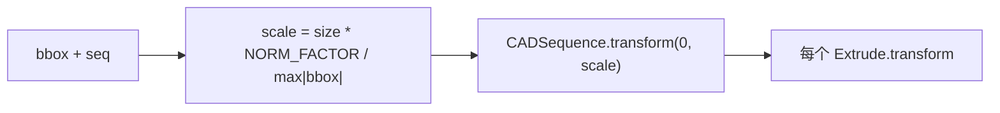

# DeepCAD：`CADSequence.normalize()` 实现原理

本文对应 [`DeepCAD_json2vec_CADSequence实现原理.md`](./DeepCAD_json2vec_CADSequence实现原理.md) 中管线第 2 步，说明 [`cadlib/extrude.py`](../../../../cadlib/extrude.py) 里 `CADSequence.normalize` 如何用 JSON 中的整体包围盒统一缩放整条建模序列，使后续 `numericalize` 所假定的量级成立。

**延伸阅读**：[`CADSequence` 四步总览](./DeepCAD_json2vec_CADSequence实现原理.md)、[`numericalize` 量化细节](./DeepCAD_CADSequence_numericalize实现原理.md)、[`NORM_FACTOR` 与词表](./DeepCAD_macro_命令词表与索引实现说明.md)。

---

## 1. 方案目标

- **输入**：`CADSequence.from_dict` 得到的对象，已含 `self.seq`（`Extrude` 列表）与 **`self.bbox`**（来自 `properties.bounding_box` 的角点坐标）。
- **输出**：**就地**缩放所有参与「全局 3D 尺度」的量，使零件整体落入约 **[-s×s_max, s×s_max]³** 量级，其中 **s** 为 `NORM_FACTOR`（默认 **0.75**），**s_max** 为 `size`（默认 **1.0**），分母为包围盒坐标绝对值的全局最大元。
- **设计意图**：与 [`macro.py`](../../../../cadlib/macro.py) 中 **`NORM_FACTOR = 0.75`** 一致——归一化后仍留出约 **25%** 边距，避免训练时随机增广（如 [`CADSequence.random_transform`](../../../../cadlib/extrude.py)）把量推出 `numericalize` 常用的 **[-1, 1]** 映射区间。

---

## 2. 整体架构

### 2.1 数据前提：`bbox` 从何而来

[`CADSequence.from_dict`](../../../../cadlib/extrude.py) 从 JSON 读取：

- `max_point` / `min_point` 各为三维坐标 **(x, y, z)**；
- `bbox = np.stack([max_point, min_point], axis=0)`，形状 **`(2, 3)`**。

**尺度因子**使用：

```python
np.max(np.abs(self.bbox))
```

即对 **6 个标量**取绝对值后的最大值（等价于包围盒各角点在坐标轴上投影的**最大绝对范围**的一种 L∞ 型度量）。若零件整体很「长」或离原点很远，该值反映的是**与原点相关的包络尺度**（角点坐标本身已含位置信息）。

### 2.2 归一化两步



1. **`CADSequence.normalize(size=1.0)`** 计算 `scale`，再调用 **`self.transform(0.0, scale)`**。  
2. **`CADSequence.transform`** 对 `seq` 中每个 **`Extrude`** 调用 **`Extrude.transform(translation, scale)`**，此处 **`translation=0`**。

### 2.3 与「草图 2D 归一化」的分工

在 **`Extrude.from_dict`** 内，草图已通过 **`Profile.normalize(sketch_dim=256)`**（见 [`SketchBase.normalize`](../../../../cadlib/sketch.py)）落到**局部 2D 画布**上；**`CADSequence.normalize` 不再缩放 `profile`**（见下节）。因此：

- **全局 `normalize`**：主要统一 **3D 世界尺度**（平面原点、拉伸距离、草图锚点与尺寸等）；  
- **局部 `Profile.normalize`**：在每条挤压构造时已把轮廓几何变到固定 sketch 网格语义下。

二者叠加，才是「JSON → 训练用向量」前的完整几何预处理。

---

## 3. 模块架构

### 3.1 `CADSequence.normalize`

**模块作用**：根据零件级包围盒计算单一标量 `scale`，并施加到整条挤压序列。

**模块原理**：

> **scale** = (**size** × **NORM_FACTOR**) ÷ max<sub>i,j</sub> |**bbox**[i, j]|

（与代码一致可写为：`scale = size * NORM_FACTOR / np.max(np.abs(bbox))`。）

默认 `size=1.0`、`NORM_FACTOR=0.75`。随后 **`transform(0.0, scale)`**，无平移。

**代码**（摘录）：

```289:292:d:\DeepCAD\DeepCAD\cadlib\extrude.py
    def normalize(self, size=1.0):
        """(1)normalize the shape into unit cube (-1~1). """
        scale = size * NORM_FACTOR / np.max(np.abs(self.bbox))
        self.transform(0.0, scale)
```

**举例**：若 `max|bbox| = 100`、`NORM_FACTOR=0.75`，则 `scale = 0.0075`。原来模长量级为 100 的 3D 位置量变为约 **0.75**，落在 **[-1, 1]** 内并留有余量。

**参数 `size`**：在默认管线中未传入，即为 **1.0**；若调用方传入其他 `size`，相当于整体再乘一个目标「半宽」系数，仍除以同一 `max|bbox|`。

---

### 3.2 `CADSequence.transform`

**模块作用**：对序列中每个挤压施加相同的仿射缩放（此处平移为 0）。

**代码**（摘录）：

```284:287:d:\DeepCAD\DeepCAD\cadlib\extrude.py
    def transform(self, translation, scale):
        """linear transformation"""
        for item in self.seq:
            item.transform(translation, scale)
```

---

### 3.3 `Extrude.transform`（`normalize` 实际改动的字段）

**模块作用**：将**与全局尺度相关**的标量与向量统一乘以 `scale`；**草图轮廓 `profile` 被显式排除**。

**模块原理**（[`Extrude.transform`](../../../../cadlib/extrude.py)）：

| 字段 | 变换 |
|------|------|
| `sketch_plane` | `CoordSystem.transform`：`origin ← (origin + translation) * scale`；**`theta/phi/gamma` 不变** |
| `extent_one`, `extent_two` | `*= scale`（长度量） |
| `sketch_pos` | `(sketch_pos + translation) * scale`（3D 全局锚点） |
| `sketch_size` | `*= scale`（与 bbox 相关的草图尺度描述） |
| `profile` | **注释掉** `profile.transform`，**不参与**本次缩放 |

**代码**（摘录）：

```175:182:d:\DeepCAD\DeepCAD\cadlib\extrude.py
    def transform(self, translation, scale):
        """linear transformation"""
        # self.profile.transform(np.array([0, 0]), scale)
        self.sketch_plane.transform(translation, scale)
        self.extent_one *= scale
        self.extent_two *= scale
        self.sketch_pos = (self.sketch_pos + translation) * scale
        self.sketch_size *= scale
```

**举例**：`normalize` 时 `translation=0`，故仅 **`origin`、`extent_*`、`sketch_pos`、`sketch_size`** 随 `scale` 变化；**草图平面朝向**（极角参数）保持 JSON 解析后的弧度值不变，**曲线控制点**仍在 `Profile.normalize(256)` 后的 2D 坐标系中。

---

### 3.4 `CoordSystem.transform`

**模块作用**：仅缩放平面坐标系**原点**的 3D 位置；不改变法向与面内轴向的参数化角度。

**代码**（摘录）：

```55:56:d:\DeepCAD\DeepCAD\cadlib\extrude.py
    def transform(self, translation, scale):
        self.origin = (self.origin + translation) * scale
```

**含义**：归一化后，「草图贴在空间的哪里」随零件整体缩放；「草图平面相对世界的朝向」仍由 **θ、φ、γ** 表示，与尺度无关（符合刚体方向与位置分离的常见建模）。

---

## 4. 不变量与下游约束

### 4.1 `numericalize` 的隐含假设

[`Extrude.numericalize`](../../../../cadlib/extrude.py) 对 **`extent_one`、`extent_two`** 断言在 **`[-2, 2]`** 内，并注释要求先 **`CADSequence.normalize`**。在典型数据上，**`0.75` 的 `NORM_FACTOR`** 使距离落在 **[-1, 1]** 附近，从而满足该断言；若 JSON 异常或跳过 `normalize`，可能触发断言失败。

### 4.2 `CoordSystem.origin` 可能越界

[`CoordSystem.numericalize`](../../../../cadlib/extrude.py) 中留有 **TODO**：原点经 `((origin+1)/2*n)` 映射时，**未强制**归一化后一定落在 **[-1, 1]**（例如包围盒与某些局部原点组合极端时）。这与 **`max|bbox|` 仅来自全局 properties**、而 **`sketch_plane.origin` 为草图局部变换**有关。文档化目的：读者知悉 **`normalize` 按零件 bbox 缩放，不保证每个局部原点都落在单位立方体内**。

### 4.3 与 `flip_sketch` / `random_transform` 的关系

- **`flip_sketch`**：翻转后调用 **`profile.normalize()`**，会**重算**局部 2D 归一化，与全局 `CADSequence.normalize` 独立。  
- **`random_transform`**：在**已数值化或整数 profile** 上操作（注释代码路径），属于增广；**`NORM_FACTOR`** 即为给这类扰动留空间的设计之一。

---

## 5. 小结

| 要点 | 内容 |
|------|------|
| 公式 | `scale = size * NORM_FACTOR / max(abs(bbox))`，再 `transform(0, scale)` |
| 改动对象 | 每步 `Extrude` 的 **平面原点、拉伸距离、sketch_pos、sketch_size**；**不**含 **profile 曲线**、**不**含 **θ/φ/γ** |
| `bbox` | JSON `bounding_box` 的 max/min 角点堆成 `(2,3)`，取六元绝对值最大 |
| 目的 | 统一零件量级、留出增广余量，便于后续 **`numericalize`** 的 **[-1, 1]** 类映射 |

---

*文档说明对象：原始 DeepCAD 离线 `json2vec` 管线中的全局归一化步骤；路径相对于仓库根目录 `DeepCAD`。*
