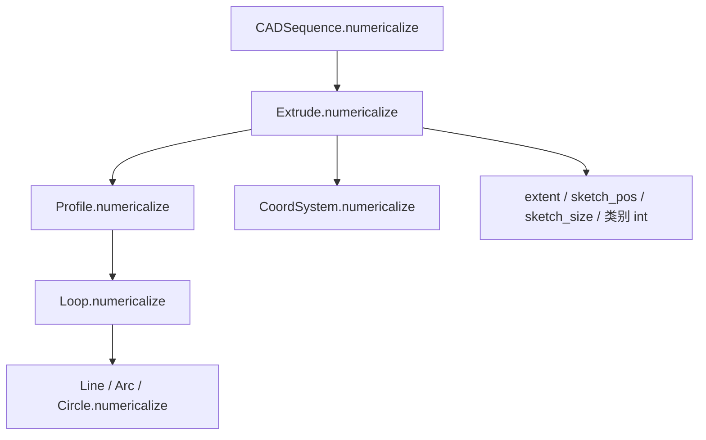

# DeepCAD：`CADSequence.numericalize()` 实现原理

本文对应 [`DeepCAD_json2vec_CADSequence实现原理.md`](./DeepCAD_json2vec_CADSequence实现原理.md) 中管线第 3 步，说明 [`cadlib/extrude.py`](../../../../cadlib/extrude.py) 里 `CADSequence.numericalize` 及其下游如何将浮点几何与姿态量量化为整数，供后续 `to_vector` 写入 HDF5 与序列模型使用。

**延伸阅读**：[`CADSequence` 四步总览](./DeepCAD_json2vec_CADSequence实现原理.md)、[挤压 `Extrude.to_vector`](./DeepCAD_Extrude_to_vector_编码说明.md)、[命令词表与 `N_ARGS`](./DeepCAD_macro_命令词表与索引实现说明.md)。

---

## 1. 方案目标

- **输入**：已完成 [`normalize()`](../../../../cadlib/extrude.py) 的 `CADSequence`，内部每条 `Extrude` 仍持有浮点（或已为类别 `int` 的少量字段）。
- **输出**：同一对象**就地（in-place）**改写为离散表示：连续量落入 `0 … n-1`（默认 **`n=256`**），并置位 `CoordSystem.is_numerical = True`（对草图平面）；类别字段显式转为 `int`。
- **约束**：`Extrude.numericalize` 内对拉伸距离有断言，隐含「归一化后应在合理区间内」；见下文第 4 节。

---

## 2. 整体架构（调用关系）

`numericalize` 是**深度优先、按挤压步递归**的遍历：

1. **`CADSequence.numericalize(n)`**：对 `self.seq` 中每个 `Extrude` 调用 `Extrude.numericalize(n)`。  
2. **`Extrude.numericalize(n)`**：依次处理 **草图 `Profile`**、**草图平面 `CoordSystem`**、**拉伸参数与草图位姿/尺寸**。  
3. **`Profile`（经 `SketchBase`）**：`Profile` 的子节点为多个 **`Loop`**；`Loop` 再继承 `SketchBase.numericalize`，对每个 **`Line` / `Arc` / `Circle`** 调用曲线自身的 `numericalize`。



**与 `normalize()` 的配合**：全局缩放由 `CADSequence.normalize` 通过 `Extrude.transform` 作用在**草图平面原点、拉伸距离、草图全局位置与尺寸**等上；**草图轮廓本身**在 `Extrude.transform` 中**未**随全局 `scale` 变换（`profile.transform` 被注释掉），仍停留在 `Extrude.from_dict` 里 `Profile.normalize(sketch_dim=256)` 后的**局部 2D 画布坐标**。因此 **`numericalize` 对 2D 曲线与对 3D/姿态量采用了两套不同的量化语义**（见第 4 节）。

---

## 3. 模块架构

### 3.1 `CADSequence.numericalize`

**模块作用**：序列级入口，无额外逻辑，仅保证每一步挤压都被离散化。

**模块原理**：遍历 `self.seq`，调用 `item.numericalize(n)`。

**代码**（摘录）：

```294:296:d:\DeepCAD\DeepCAD\cadlib\extrude.py
    def numericalize(self, n=256):
        for item in self.seq:
            item.numericalize(n)
```

**举例**：若 `seq` 含 3 个 `Extrude`，则依次对 3 条挤压执行完整一条分支的量化。

---

### 3.2 `Extrude.numericalize`

**模块作用**：将单步挤压中「草图 + 平面 + 拉伸与元数据」全部转为整数域（或保持为小的类别整数）。

**模块原理**：

1. **断言**：`extent_one`、`extent_two` 须在 `[-2, 2]` 内（注释说明应在 `normalize` 之后调用，且形状落在单位立方体附近）。  
2. **子结构**：`profile.numericalize(n)`、`sketch_plane.numericalize(n)`。  
3. **映射到闭区间 [0, n-1] 的连续量**（**线性映射：[-1, 1] → [0, n-1]**）：  
   > **q(x)** = clip( round((x + 1) / 2 × n), 0, n-1 )  
   与代码一致：`((x + 1.0) / 2 * n).round().clip(min=0, max=n-1)`。  
   用于 `extent_one`、`extent_two`、`sketch_pos`（三维向量逐分量）。  
4. **`sketch_size`**：使用 **`(sketch_size / 2 * n)`** 再 `round`、`clip`，与 `denumericalize` 中 `sketch_size / n * 2` 互逆（见 `Extrude.denumericalize`）。  
5. **`operation`、`extent_type`**：转为 Python `int`（本身已是词表索引）。

**代码**（摘录）：

```184:196:d:\DeepCAD\DeepCAD\cadlib\extrude.py
    def numericalize(self, n=256):
        """quantize the representation.
        NOTE: shall only be called after CADSequence.normalize (the shape lies in unit cube, -1~1)"""
        assert -2.0 <= self.extent_one <= 2.0 and -2.0 <= self.extent_two <= 2.0
        self.profile.numericalize(n)
        self.sketch_plane.numericalize(n)
        self.extent_one = ((self.extent_one + 1.0) / 2 * n).round().clip(min=0, max=n-1).astype(int)
        self.extent_two = ((self.extent_two + 1.0) / 2 * n).round().clip(min=0, max=n-1).astype(int)
        self.operation = int(self.operation)
        self.extent_type = int(self.extent_type)

        self.sketch_pos = ((self.sketch_pos + 1.0) / 2 * n).round().clip(min=0, max=n-1).astype(int)
        self.sketch_size = (self.sketch_size / 2 * n).round().clip(min=0, max=n-1).astype(int)
```

**举例**：若 `n=256`，归一化后 `extent_one = 0.0`，则 (0+1)/2×256 = **128**。若 `sketch_pos` 某分量为 **-1**，则对应 **0**；为 **+1** 则对应 **255**（边界经 `clip` 饱和）。

---

### 3.3 `CoordSystem.numericalize`（草图平面）

**模块作用**：离散化平面**原点**（全局 3D）与极坐标参数 **`theta, phi, gamma`**（与法向、`x_axis` 的 [`polar_parameterization`](../../../../cadlib/math_utils.py) 一致）。

**模块原理**：

- **`origin`**：与 `Extrude` 中 `sketch_pos` 相同，使用 **`((origin + 1) / 2 * n)`** 映射到 `[0, n-1]`（代码中注释提到原点可能越界，未启用 assert）。  
- **角度三元组**：将 **[-π, π]** 或 **[0, π]** 等弧度范围统一按 **先除以 π、再平移到 [0, 1]** 后乘 `n`：  
  > **q_ang(α)** = clip( round((α/π + 1) / 2 × n), 0, n-1 )  
  与代码一致：`((tmp / np.pi + 1.0) / 2 * n).round().clip(...)`。
- 设置 **`self.is_numerical = True`**，供 `from_vector` / `denumericalize` 分支使用。

**代码**（摘录）：

```58:65:d:\DeepCAD\DeepCAD\cadlib\extrude.py
    def numericalize(self, n=256):
        """NOTE: shall only be called after normalization"""
        # assert np.max(self.origin) <= 1.0 and np.min(self.origin) >= -1.0 # TODO: origin can be out-of-bound!
        self.origin = ((self.origin + 1.0) / 2 * n).round().clip(min=0, max=n-1).astype(int)
        tmp = np.array([self._theta, self._phi, self._gamma])
        self._theta, self._phi, self._gamma = ((tmp / np.pi + 1.0) / 2 * n).round().clip(
            min=0, max=n-1).astype(int)
        self.is_numerical = True
```

**举例**：`theta = 0` → (0/π + 1)/2 × n = n/2，即 **128**（当 `n=256`）。`phi = π` → (1 + 1)/2 × n = n，`clip` 后为 **255**。

---

### 3.4 `SketchBase.numericalize` → `Loop` / `Profile`

**模块作用**：对轮廓层级不做单独公式，仅把 `numericalize` 下传到每条曲线。

**模块原理**：`Profile` 与 `Loop` 均继承 `SketchBase`；`children` 在 `Profile` 中为 `Loop` 列表，在 `Loop` 中为曲线列表；逐子节点调用 `child.numericalize(n)`。

**代码**（摘录）：

```79:82:d:\DeepCAD\DeepCAD\cadlib\sketch.py
    def numericalize(self, n=256):
        """quantize curve parameters into integers"""
        for child in self.children:
            child.numericalize(n)
```

---

### 3.5 `Line` / `Arc` / `Circle` 的 `numericalize`（草图 2D）

**模块作用**：将草图曲线上的**像素式 2D 坐标**（及圆弧相关量）量化为 `[0, n-1]` 上的整数。

**模块原理（与 3D 不同）**：此处**不再使用 (x+1)/2×n**，而是 **`round` 后 `clip`**：

- 隐含前提：曲线点已通过 `Profile.normalize` 落在约 **`[0, sketch_dim]`**（默认与 `n` 同为 256 的常见设置）的浮点网格附近；`numericalize` 相当于**格点化**。  
- **`Line`**：`start_point`、`end_point` 两维均 `round().clip(0, n-1)`。  
- **`Arc`**：对 `start_point`、`mid_point`、`end_point`、`center` 同上；对 `start_angle`、`end_angle`（弧度）使用 **`(tmp / (2π) * n).round().clip`**，即将 **一整圈 2π 映射到 `n` 个桶**。  
- **`Circle`**：`center` 同 `round`+`clip`；**`radius`** 为 **`round` 后 `clip(min=1, max=n-1)`**，避免半径为 0。

**代码**（摘录）：

```136:138:d:\DeepCAD\DeepCAD\cadlib\curves.py
    def numericalize(self, n=256):
        self.start_point = self.start_point.round().clip(min=0, max=n-1).astype(int)
        self.end_point = self.end_point.round().clip(min=0, max=n-1).astype(int)
```

```295:302:d:\DeepCAD\DeepCAD\cadlib\curves.py
    def numericalize(self, n=256):
        self.start_point = self.start_point.round().clip(min=0, max=n-1).astype(int)
        self.mid_point = self.mid_point.round().clip(min=0, max=n-1).astype(int)
        self.end_point = self.end_point.round().clip(min=0, max=n-1).astype(int)
        self.center = self.center.round().clip(min=0, max=n-1).astype(int)
        tmp = np.array([self.start_angle, self.end_angle])
        self.start_angle, self.end_angle = (tmp / (2 * np.pi) * n).round().clip(
                                            min=0, max=n-1).astype(int)
```

```404:406:d:\DeepCAD\DeepCAD\cadlib\curves.py
    def numericalize(self, n=256):
        self.center = self.center.round().clip(min=0, max=n-1).astype(int)
        self.radius = np.round(self.radius).clip(min=1, max=n-1).astype(int)
```

**举例**：直线终点浮点为 `(127.4, 200.8)`、`n=256`，量化后为 **(127, 201)**。圆半径量化后最小为 **1**。

**实现注意**：[`Arc.from_vector`](../../../../cadlib/curves.py) 在 `is_numerical=True` 时用 **`vec[3] / 256 * 2 * np.pi`** 还原扫描角，**写死了 256**；若将 `n` 改为非 256，需同步修改该处或其它解码逻辑，否则弧重建与编码尺度不一致。

---

## 4. 两类量化语义对照（小结表）

| 对象 | 典型量 | 归一化阶段 | `numericalize` 公式要点 |
|------|--------|------------|-------------------------|
| 草图曲线 `Line`/`Arc`/`Circle` | 2D 点、圆心、半径、弧角 | `Profile.normalize(sketch_dim)`，**不**随 `CADSequence.normalize` 的 `Extrude.transform` 缩放轮廓 | 坐标：`round` + `clip` 到 `[0,n-1]`；弧角：`/(2π)*n`；圆半径：`clip` 最小 1 |
| `CoordSystem` | `origin`，`theta/phi/gamma` | 原点随全局 `transform`；角度来自 JSON 几何 | 原点：`((x+1)/2*n)`；角度：`((α/π+1)/2*n)` |
| `Extrude` | `extent_*`，`sketch_pos`，`sketch_size` | 均随 `Extrude.transform` 缩放（距离、尺寸同尺度） | `extent_*`、`sketch_pos`：`((x+1)/2*n)`；`sketch_size`：`(size/2*n)` |
| 类别 | `operation`，`extent_type` | 词表索引 | `int(...)` |

---

## 5. 与 `to_vector` 的衔接

`numericalize` 完成后，各字段在 `Extrude.to_vector` 中被直接拼接为整数行向量（命令字 + 参数槽）。平面姿态取自 `sketch_plane.to_vector()`，即 `[origin(3), theta, phi, gamma]`，此时已为整数；草图曲线 `to_vector` 亦输出整数坐标或参数。

**逆过程**：`denumericalize`（`CoordSystem`、`Extrude`）与 `from_vector(..., is_numerical=True)` 使用与上式互逆的线性还原，用于可视化或重建；不在本文展开。

---

## 6. 总结

- **`CADSequence.numericalize(n)`** 是对每条 **`Extrude`** 的浅层循环，核心逻辑在 **`Extrude.numericalize`** 与 **`CoordSystem`、曲线类** 中。  
- **全局/3D 连续量**（原点、姿态角、拉伸距离、草图位姿）采用 **[-1, 1]**（或角度按 **π**、**2π** 归一）到 **0 … n-1** 的线性分箱；**草图 2D** 在局部画布上采用 **`round`+`clip`**，与 **`normalize` 未缩放轮廓** 的设计一致。  
- 默认 **`n=256`** 与词表、HDF5 `int` 存储及下游嵌入维度常见设定一致；修改 `n` 时需检查 **`Arc.from_vector` 等硬编码 256** 的路径。

---

*文档说明对象：原始 DeepCAD 离线 `json2vec` 管线中的量化步骤；路径相对于仓库根目录 `DeepCAD`。*
