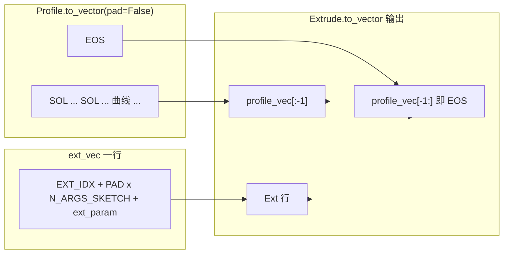

# DeepCAD：`Extrude.to_vector` 编码说明

本文档说明仓库中 **[`cadlib/extrude.py`](../../../../cadlib/extrude.py)** 里 **单次挤压步（Sketch + Extrude）** 如何与 **轮廓向量**、**Ext 命令行** 拼成定长序列；**不替代** [`DeepCAD原始技术方案_详细版.md`](./DeepCAD原始技术方案_详细版.md)。  
草图侧多环与 `SOL`/`EOS` 见 [`DeepCAD_Loop与Profile_to_vector_编码说明.md`](./DeepCAD_Loop与Profile_to_vector_编码说明.md)；单曲线一步见 [`DeepCAD_直线Line_to_vector_编码说明.md`](./DeepCAD_直线Line_to_vector_编码说明.md)。

---

## 一、方案目标

说明 **`Extrude.to_vector`** 如何：

1. 调用 **`Profile.to_vector`** 得到 **仅末尾带一条轮廓 `EOS`** 的草图矩阵（`pad=False`，在 **Extrude 层** 再做总长填充）。  
2. 构造一行 **`Ext`**：首列为 **`EXT_IDX`**，草图参数槽填 **`PAD_VAL`**，**挤压与平面相关参数** 写入尾部 **`N_ARGS_EXT`** 个槽。  
3. 将 **轮廓主体**、**Ext 行**、**轮廓结束 `EOS`** 按固定顺序拼接，使与 **[`CADSequence.to_vector`](../../../../cadlib/extrude.py)** 的 **去尾 `EOS` 再拼接** 流程一致。

---

## 二、整体关系



- **上游**：[`Profile.to_vector(max_n_loops, max_len_loop, pad=False)`](../../../../cadlib/sketch.py)。  
- **本方法**：插入 **Ext** 行，并可选 **`EOS` 填充** 至 `max_n_loops * max_len_loop` 行。  
- **下游**：[`CADSequence.to_vector`](../../../../cadlib/extrude.py) 对每个挤压步取 **`vec[:-1]`**（去掉本步 **末尾 `EOS`**），多步拼接后 **全局再加一个 `EOS`**；[`CADSequence.from_vector`](../../../../cadlib/extrude.py) 按 **`EXT_IDX`** 分段，每段 **以 `EXT` 结尾** 交给 [`Extrude.from_vector`](../../../../cadlib/extrude.py)。

**重要**：**`Extrude.to_vector` 返回的完整向量最后一行是 `EOS`**；**`Extrude.from_vector` 要求输入片段最后一行命令为 `EXT`**（由序列层切片保证）。**不要**把带尾 `EOS` 的整段直接传给 **`Extrude.from_vector`**，否则会与其中 **`assert vec[-1][0] == EXT_IDX`** 不一致。

---

## 三、模块说明（`Extrude.to_vector`）

### 3.1 模块作用

将 **一个 `Extrude` 对象**（归一化后的 [`Profile`](../../../../cadlib/sketch.py) + [`CoordSystem`](../../../../cadlib/extrude.py) 草图平面 + 拉伸参数）编码为形状 **`(T, 1 + N_ARGS)`** 的矩阵，且命令序列语义为：**草图子序列（多 `SOL`、曲线、`EOS` 仅在轮廓末尾出现一次）中间插入一行 `Ext`，再接回该轮廓 `EOS`**（见下文物理解释）。

### 3.2 模块原理

1. **`profile_vec = profile.to_vector(max_n_loops, max_len_loop, pad=False)`**  
   - 超环数、超单环长度时 **`None`**，本方法直接 **`None`**。  
   - 不在 Profile 层做 `max_n_loops * max_len_loop` 填充，避免与后面 **Extrude 层** 填充重复逻辑。

2. **平面朝向**  
   - **`sket_plane_orientation = sketch_plane.to_vector()[3:]`** 即 **`(theta, phi, gamma)`**（与 [`CoordSystem.to_vector`](../../../../cadlib/extrude.py) 中 **原点三维 + 三角度** 对齐；**原点与位置** 下文写入 **`ext_param`**）。

3. **`ext_param` 顺序（共 `N_ARGS_EXT` 个数）**  
   - **`theta, phi, gamma`**（3）  
   - **`sketch_pos`** 三维（3）  
   - **`sketch_size`**（1）  
   - **`extent_one, extent_two, operation, extent_type`**（4）  
   与 [`Extrude.from_vector`](../../../../cadlib/extrude.py) 中 **`ext_vec[-N_ARGS_EXT:]`** 的解析一致。

4. **`ext_vec` 一行布局**  
   - **`[EXT_IDX, PAD_VAL × N_ARGS_SKETCH, …ext_param…]`**  
   - 总长 **`1 + N_ARGS`**：与 [`macro.CMD_ARGS_MASK`](../../../../cadlib/macro.py) 中 **Ext 行**「草图槽全 0、扩展槽全 1」一致——**草图数值不占 Ext 行**，仅占位 **`PAD_VAL`**。

5. **三段子拼接**  
   - **`profile_vec[:-1]`**：去掉 **Profile 末尾那一行 `EOS`**，得到「纯草图内容」（仍含环首 `SOL`、曲线等）。  
   - **`ext_vec[np.newaxis]`**：一行 **Ext**。  
   - **`profile_vec[-1:]`**：把 **轮廓结束 `EOS`** 挪到 **整段挤压向量的最后**（注释 `NOTE: last one is EOS`）。  
   - 故 **时间顺序**为：`… 草图 … | Ext | EOS`。

6. **`pad=True`（默认）**  
   - **`pad_len = max_n_loops * max_len_loop - vec.shape[0]`**  
   - 在末尾再拼 **`pad_len` 行 `EOS_VEC`**，使总行数等于 **单步草图预算槽位**（与 [`macro.MAX_N_LOOPS`](../../../../cadlib/macro.py)、[`MAX_N_CURVES`](../../../../cadlib/macro.py) 在数据管线中的用法一致：`max_len_loop` 常对应 **每环最大曲线相关长度**）。

### 3.3 代码

```213:226:d:\DeepCAD\DeepCAD\cadlib\extrude.py
    def to_vector(self, max_n_loops=6, max_len_loop=15, pad=True):
        """vector representation: commands [SOL, ..., SOL, ..., EXT]"""
        profile_vec = self.profile.to_vector(max_n_loops, max_len_loop, pad=False)
        if profile_vec is None:
            return None
        sket_plane_orientation = self.sketch_plane.to_vector()[3:]
        ext_param = list(sket_plane_orientation) + list(self.sketch_pos) + [self.sketch_size] + \
                    [self.extent_one, self.extent_two, self.operation, self.extent_type]
        ext_vec = np.array([EXT_IDX, *[PAD_VAL] * N_ARGS_SKETCH, *ext_param])
        vec = np.concatenate([profile_vec[:-1], ext_vec[np.newaxis], profile_vec[-1:]], axis=0) # NOTE: last one is EOS
        if pad:
            pad_len = max_n_loops * max_len_loop - vec.shape[0]
            vec = np.concatenate([vec, EOS_VEC[np.newaxis].repeat(pad_len, axis=0)], axis=0)
        return vec
```

相关常量见 [`macro.py`](../../../../cadlib/macro.py)（`EXT_IDX`、`N_ARGS_SKETCH`、`N_ARGS_EXT`、`EOS_VEC` 等）。

### 3.4 举例说明

**记号**：只写 **每行首列命令**；真实每行宽度为 **`1 + N_ARGS`**。

| 场景 | `Profile.to_vector` 结果（概念） | `Extrude.to_vector` 拼接后（`pad=False`） |
|------|-------------------------------------|------------------------------------------|
| 单环、极简 | `SOL, Line, EOS` | `SOL, Line` → 插入 `Ext` → `EOS`，即 **`SOL, Line, Ext, EOS`** |
| 两环 | `SOL, L1, SOL, L2, EOS` | **`SOL, L1, SOL, L2, Ext, EOS`** |
| `pad=True` 且预算 `max_n_loops*max_len_loop=15`、当前 6 行 | — | 在末尾再补 **9 行 `EOS`**，总行数 **15** |

**与整条 CAD 序列**：两步挤压时，[`CADSequence.to_vector`](../../../../cadlib/extrude.py) 大致得到  
`[步1…, Ext] + [步2…, Ext] + EOS`（每步内部的 **尾 `EOS`** 在拼接前被 `vec[:-1]` 去掉），全局 **仅一个** 结尾 **`EOS`**。

---

## 四、总结

- **Extrude 一步** = **`Profile` 草图（去掉末尾 `EOS`）** + **一行 `Ext`（草图槽 `-1`，后接 `N_ARGS_EXT` 个几何/操作参数）** + **轮廓 `EOS`** + 可选 **`EOS` 定长填充**。  
- **`ext_param` 顺序**：**`θ,φ,γ` → `sketch_pos` → `sketch_size` → `extent_one/two, operation, extent_type`**，与 **`from_vector`** 互逆。  
- **解码切片**：由 **`CADSequence`** 按 **`EXT_IDX`** 切出 **以 `Ext` 结尾** 的子序列再调 **`Extrude.from_vector`**；单独使用 **`Extrude.to_vector` 的返回值** 时须理解 **最后一行是 `EOS` 而非 `Ext`**。
