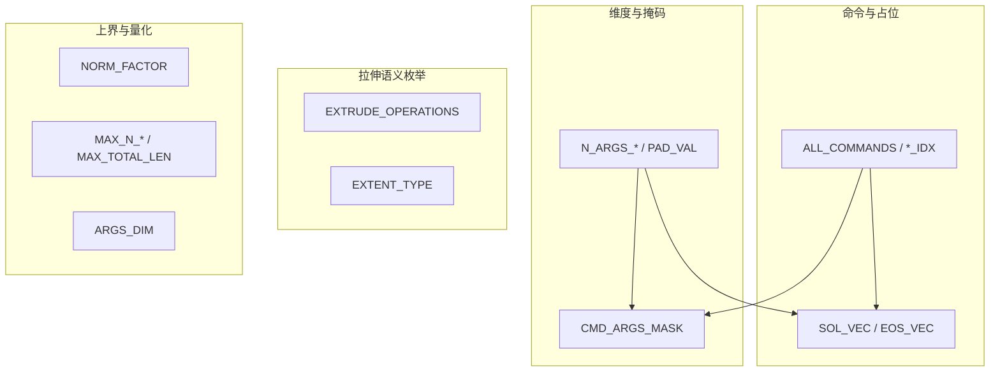

# DeepCAD `macro.py` 命令词表与索引实现说明

本文档说明 `cadlib/macro.py` 中的**全部常量与派生定义**（命令词表、拉伸枚举、参数维度、占位向量、掩码、归一化与序列上界等），并与源码保持一致。

## 1. 方案目标

- 为 CAD 序列表示提供**统一的命令类型枚举**：json2vec、训练、解码等对「直线 / 圆弧 / 圆 / 序列结束 / 新环 / 拉伸」使用同一套整数 ID。
- 通过**单一有序列表** `ALL_COMMANDS` 维护命令顺序，避免手写下标与词表不一致。
- 集中定义**草图与拉伸参数的维度**（`N_ARGS_*`）、**填充值**、**参数有效位掩码**、**拉伸操作与_extent 类型**的可选字符串，以及数据管线常用的**长度与量化上界**。

## 2. 整体架构

在 DeepCAD 中，一条 CAD 程序被离散成**符号序列**；每个时间步通常包含：

1. **命令类型**（离散类别，对应 `LINE_IDX` 等）；
2. **连续参数**（维度由 `N_ARGS` 及 `N_ARGS_SKETCH` / `N_ARGS_EXT` 划分）。

`macro.py` 处于**全局约定层**：数据集构建、模型张量形状、损失掩码、Fusion 360 JSON 语义映射均依赖这些符号。



## 3. 完整源码引用

以下为 `macro.py` 全文，下文各节按符号分组释义（若与源码不一致，以仓库内文件为准）。

```1:41:cadlib/macro.py
import numpy as np

ALL_COMMANDS = ['Line', 'Arc', 'Circle', 'EOS', 'SOL', 'Ext']
LINE_IDX = ALL_COMMANDS.index('Line')
ARC_IDX = ALL_COMMANDS.index('Arc')
CIRCLE_IDX = ALL_COMMANDS.index('Circle')
EOS_IDX = ALL_COMMANDS.index('EOS')
SOL_IDX = ALL_COMMANDS.index('SOL')
EXT_IDX = ALL_COMMANDS.index('Ext')

EXTRUDE_OPERATIONS = ["NewBodyFeatureOperation", "JoinFeatureOperation",
                      "CutFeatureOperation", "IntersectFeatureOperation"]
EXTENT_TYPE = ["OneSideFeatureExtentType", "SymmetricFeatureExtentType",
               "TwoSidesFeatureExtentType"]

PAD_VAL = -1
N_ARGS_SKETCH = 5 # sketch parameters: x, y, alpha, f, r
N_ARGS_PLANE = 3 # sketch plane orientation: theta, phi, gamma
N_ARGS_TRANS = 4 # sketch plane origin + sketch bbox size: p_x, p_y, p_z, s
N_ARGS_EXT_PARAM = 4 # extrusion parameters: e1, e2, b, u
N_ARGS_EXT = N_ARGS_PLANE + N_ARGS_TRANS + N_ARGS_EXT_PARAM
N_ARGS = N_ARGS_SKETCH + N_ARGS_EXT

SOL_VEC = np.array([SOL_IDX, *([PAD_VAL] * N_ARGS)])
EOS_VEC = np.array([EOS_IDX, *([PAD_VAL] * N_ARGS)])

CMD_ARGS_MASK = np.array([[1, 1, 0, 0, 0, *[0]*N_ARGS_EXT],  # line
                          [1, 1, 1, 1, 0, *[0]*N_ARGS_EXT],  # arc
                          [1, 1, 0, 0, 1, *[0]*N_ARGS_EXT],  # circle
                          [0, 0, 0, 0, 0, *[0]*N_ARGS_EXT],  # EOS
                          [0, 0, 0, 0, 0, *[0]*N_ARGS_EXT],  # SOL
                          [*[0]*N_ARGS_SKETCH, *[1]*N_ARGS_EXT]]) # Extrude

NORM_FACTOR = 0.75 # scale factor for normalization to prevent overflow during augmentation

MAX_N_EXT = 10 # maximum number of extrusion
MAX_N_LOOPS = 6 # maximum number of loops per sketch
MAX_N_CURVES = 15 # maximum number of curves per loop
MAX_TOTAL_LEN = 60 # maximum cad sequence length
ARGS_DIM = 256
```

## 4. 符号一览表（速查）

| 符号 | 类型 / 取值要点 | 含义摘要 |
|------|-----------------|----------|
| `ALL_COMMANDS` | `list[str]`，长度 6 | 命令词表顺序 |
| `LINE_IDX` … `EXT_IDX` | `int`，0～5 | 各命令在词表中的下标 |
| `EXTRUDE_OPERATIONS` | 4 个 Fusion 360 风格操作名 | 新建体 / 合并 / 切割 / 相交 |
| `EXTENT_TYPE` | 3 个 extent 类型名 | 单向 / 对称 / 双侧拉伸 |
| `PAD_VAL` | `-1` | 无效或未使用的参数槽填充值 |
| `N_ARGS_SKETCH` | `5` | 单步草图参数个数：x, y, alpha, f, r |
| `N_ARGS_PLANE` | `3` | 草图平面朝向：theta, phi, gamma |
| `N_ARGS_TRANS` | `4` | 平面原点与包围盒尺度：p_x, p_y, p_z, s |
| `N_ARGS_EXT_PARAM` | `4` | 拉伸标量：e1, e2, b, u |
| `N_ARGS_EXT` | `3+4+4 = 11` | 单步拉伸块参数总维 |
| `N_ARGS` | `5 + 11 = 16` | 命令后连续参数总维（1 个命令位另计时需与模型输入约定一致） |
| `SOL_VEC` | `shape (1+N_ARGS,)` | 首元 `SOL_IDX`，其余 `PAD_VAL` |
| `EOS_VEC` | `shape (1+N_ARGS,)` | 首元 `EOS_IDX`，其余 `PAD_VAL` |
| `CMD_ARGS_MASK` | `(6, N_ARGS)` | 按命令屏蔽无效回归维 |
| `NORM_FACTOR` | `0.75` | 归一化缩放，缓解增强时数值溢出 |
| `MAX_N_EXT` | `10` | 最大 extrusion 次数上界 |
| `MAX_N_LOOPS` | `6` | 每个 sketch 最大 loop 数 |
| `MAX_N_CURVES` | `15` | 每个 loop 最大曲线数 |
| `MAX_TOTAL_LEN` | `60` | CAD 序列最大长度上界 |
| `ARGS_DIM` | `256` | 连续参数离散化 / vocab 宽度（与模型 ARGS_DIM 一致） |

## 5. 模块说明：`ALL_COMMANDS` 与 `*_IDX`

### 5.1 模块作用

- `ALL_COMMANDS`：命令名称的有序列表，定义**词表顺序**。
- `LINE_IDX`、`ARC_IDX` 等：通过 `ALL_COMMANDS.index('...')` 得到的**固定整数下标**。

### 5.2 模块原理

将「名称 → 下标」绑定为模块级常量后，分类头、embedding、掩码行序均可直接引用 `*_IDX`；若调整 `ALL_COMMANDS` 顺序，须同步检查 `CMD_ARGS_MASK` 各行含义是否与命令一致。

### 5.3 命令与索引对照表

| 常量 | 取值 | 含义 |
|------|------|------|
| `LINE_IDX` | 0 | 直线段 |
| `ARC_IDX` | 1 | 圆弧 |
| `CIRCLE_IDX` | 2 | 圆 |
| `EOS_IDX` | 3 | End of Sequence，整条序列结束 |
| `SOL_IDX` | 4 | Start of Loop，新的一圈轮廓开始 |
| `EXT_IDX` | 5 | Extrude（平面 + 变换 + 拉伸参数） |

### 5.4 举例说明

一条序列若每行第一维为命令 ID：草图段多为 `LINE_IDX`/`ARC_IDX`/`CIRCLE_IDX`；换环时插入 `SOL_IDX`；草图后的拉伸为 `EXT_IDX`；全序列结束为 `EOS_IDX`。

## 6. 模块说明：`EXTRUDE_OPERATIONS` 与 `EXTENT_TYPE`

### 6.1 模块作用

与 Fusion 360 / DeepCAD 数据中的**拉伸特征语义**对齐，供 JSON 解析或离散类别映射使用。

### 6.2 模块原理

- `EXTRUDE_OPERATIONS`：拉伸与已有体的布尔关系（新建、并、差、交）。
- `EXTENT_TYPE`：沿法向的延伸方式（单侧、对称、双侧）。

### 6.3 列表内容（与源码一致）

**EXTRUDE_OPERATIONS（索引 0～3）**

| 索引 | 字符串 |
|------|--------|
| 0 | `NewBodyFeatureOperation` |
| 1 | `JoinFeatureOperation` |
| 2 | `CutFeatureOperation` |
| 3 | `IntersectFeatureOperation` |

**EXTENT_TYPE（索引 0～2）**

| 索引 | 字符串 |
|------|--------|
| 0 | `OneSideFeatureExtentType` |
| 1 | `SymmetricFeatureExtentType` |
| 2 | `TwoSidesFeatureExtentType` |

## 7. 模块说明：填充值与参数维度 `N_ARGS_*`

### 7.1 模块作用

规定**每个时间步上连续参数向量**如何划分为草图子块与拉伸子块，以及无效位置的填充值。

### 7.2 模块原理

- `PAD_VAL = -1`：EOS/SOL 等步中不参与回归的槽位、或对齐填充时常用该值（具体是否参与 loss 由 `CMD_ARGS_MASK` 与数据管线决定）。
- `N_ARGS_SKETCH = 5`：与 Line/Arc/Circle 在 sketch 段的编码一致（x, y, alpha, f, r）。
- `N_ARGS_EXT`：平面 3 + 变换 4 + 拉伸标量 4 = 11；`N_ARGS = 5 + 11 = 16` 为「仅统计连续参数维」时的总长（实现中向量常把命令与参数拼在同一行时，总列数为 `1 + N_ARGS` 或由模型单独处理命令 logits，需结合 `cad_sequence` 与模型定义阅读）。

### 7.3 举例说明

若某步为 `Ext`，则 `CMD_ARGS_MASK` 在该命令下为前 5 维草图全 0、后 `N_ARGS_EXT` 维全 1，表示只对拉伸相关维度做回归监督。

## 8. 模块说明：`SOL_VEC`、`EOS_VEC` 与 `CMD_ARGS_MASK`

### 8.1 模块作用

- `SOL_VEC` / `EOS_VEC`：预构造的**特殊行向量**，便于插入序列或 batch 对齐。
- `CMD_ARGS_MASK`：形状 `(len(ALL_COMMANDS), N_ARGS)`，与六种命令一一对应，标出哪些参数维**有效（1）**。

### 8.2 模块原理

- `SOL_VEC`：命令位为 `SOL_IDX`，后续 `N_ARGS` 个位置均为 `PAD_VAL`。
- `EOS_VEC`：命令位为 `EOS_IDX`，后续均为 `PAD_VAL`。
- 掩码矩阵第 0～2 行分别约束 Line/Arc/Circle 在 sketch 五元组上的有效模式；EOS/SOL 全 0；Ext 行为「草图五元组全 0 + 拉伸块全 1」。

### 8.3 举例说明

计算参数 L1/L2 损失时，可用 `CMD_ARGS_MASK[cmd]` 与预测向量逐元素相乘，避免对无定义的 alpha、f、r 等维求梯度。

## 9. 模块说明：`NORM_FACTOR` 与序列上界、`ARGS_DIM`

### 9.1 模块作用

- `NORM_FACTOR`：对几何或参数做缩放时的**经验系数**，降低数据增强后数值过大风险。
- `MAX_N_EXT`、`MAX_N_LOOPS`、`MAX_N_CURVES`、`MAX_TOTAL_LEN`：数据集截断、模型最大序列长度、循环展开上界等处的**硬上限**（与具体 `json2vec` / `CADSequence` 实现一致使用）。
- `ARGS_DIM`：连续参数离散到 `0 … ARGS_DIM-1`（或等价 bucket）时的**分辨率 / 词表大小**，与网络中 args 分支的类别数一致。

### 9.2 数值汇总

| 符号 | 值 |
|------|-----|
| `NORM_FACTOR` | 0.75 |
| `MAX_N_EXT` | 10 |
| `MAX_N_LOOPS` | 6 |
| `MAX_N_CURVES` | 15 |
| `MAX_TOTAL_LEN` | 60 |
| `ARGS_DIM` | 256 |

## 10. 总结

`macro.py` 将 DeepCAD 的**命令 ID**、**拉伸语义枚举**、**参数向量布局与填充**、**按命令的参数掩码**以及**归一化与序列/量化上界**集中在一处。扩展词表或维度时，应同时更新 `ALL_COMMANDS`、`CMD_ARGS_MASK` 行序与形状，并核对模型输入维度和数据集编解码是否一致。
