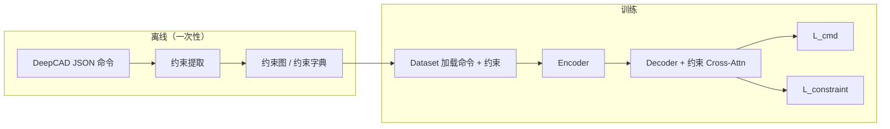

# Constraint-Aware DeepCAD 技术方案

在原生 DeepCAD 命令序列生成框架上，通过**自动几何约束挖掘**、**约束感知 Transformer** 与**约束一致性损失**，在不新增数据集与人工标注的前提下，提升生成结果的约束满足率与工程可落地性。本文档按技术方案规范组织：**方案目标**、**整体架构**、**分模块架构**（每模块含作用、原理、代码、举例）、**总结**。

---

## 一、方案目标

1. **数据与标注**：完全复用 DeepCAD 官方 JSON 命令数据；约束由几何自动推导，**不引入新标注、不另建数据集**。
2. **表示与模型**：保持 DeepCAD 命令 token 表示不变；在 Encoder–Decoder 路径上**最小侵入**地接入约束信息（嵌入 + 交叉注意力 + 可选预测头）。
3. **优化目标**：总损失为命令预测损失与约束相关损失的加权和，使生成分布在统计意义上更贴近训练集中由几何导出的约束结构。
4. **评估与落地**：可计算水平/竖直/平行/垂直/共线等满足率，并结合 Chamfer/Hausdorff、拓扑合法性等指标，与原版流程对齐。

**约束范围（2D 草图、计算简单）**：

| 中文 | 英文 |
| --- | --- |
| 水平 | Horizontal |
| 竖直 | Vertical |
| 平行 | Parallel |
| 垂直 | Perpendicular |
| 共线 | Collinear |

---

## 二、整体架构

### 2.1 数据与训练管线



### 2.2 模型侧信息流（概念）

- **输入**：与原版相同的 CAD 命令序列（及位置编码等原有输入）。
- **并行支路**：离线得到的约束经 **Constraint Embedding** 变为约束 token 序列 `C`。
- **解码**：Decoder 隐状态作为 **Q**，对编码器 memory（及 latent `z`）的交互**保留**；**新增**对 `C` 的多头交叉注意力（或与 `z` 融合后再注意力，见模块三）。
- **输出**：命令序列 logits（主任务）+ 可选约束预测头（辅助监督）。
- **损失**：`L_total = L_cmd + α * L_constraint`（`α` 典型 0.1～0.5）。

### 2.3 张量形状约定（便于实现对照）

| 符号 | 含义 | 典型形状 |
| --- | --- | --- |
| `B` | batch 大小 | 标量 |
| `T` | 命令序列长度（含 pad） | `[B, T]` |
| `T_c` | 单样本约束条数（pad 到 batch 最大） | `[B, T_c, d_model]` |
| `d_model` | Transformer 隐藏维 | 与 DeepCAD 一致 |

---

## 三、模块架构

以下每个模块均包含：**模块作用**、**模块原理**、**代码**、**举例说明**。

---

### 模块 1：离线约束提取（Constraint Extraction）

#### 模块作用

从 DeepCAD **JSON 命令序列**解析几何实体（线段等），用统一数值阈值自动判定水平、竖直、平行、垂直、共线，输出**结构化约束字典**，供 Dataset 与训练对齐使用。全程**无需人工标注**。

#### 模块原理

1. **输入**：单条样本的 DeepCAD 命令 JSON（与官方格式一致）。
2. **中间**：执行命令语义等价的几何构造，得到带 id 的线段及端点、方向向量。
3. **判定**（统一阈值，与论文常用设置一致）：
   - **水平**：方向向量 `z` 分量近似为 0。
   - **竖直**：`x、y` 分量近似为 0（视具体坐标约定与 DeepCAD 线向定义一致微调）。
   - **平行 / 垂直**：用两线方向向量夹角，与 0° 或 90° 比较。
   - **共线**：先满足近似平行，再判一点到另一直线的距离小于阈值。
4. **输出**：五类约束的列表或线对列表，便于后续 token 化。

#### 代码

**约束字典结构（输出示例 schema）：**

```json
{
  "horizontal": [线ID列表],
  "vertical": [线ID列表],
  "parallel": [[线A, 线B], ...],
  "perpendicular": [[线A, 线B], ...],
  "collinear": [[线A, 线B], ...]
}
```

**阈值与线段表示（提取器内部）：**

```python
# 阈值（论文常用量级）
ANGLE_THRESH = 2.0       # 角度误差 < 2°
DIST_THRESH = 1e-3       # 距离误差 < 0.001
EPS = 1e-5

# 线段表示（示例）
line = {
    "id": int,
    "start": (x, y, z),
    "end": (x, y, z),
    "vec": (dx, dy, dz),
}
```

**判定要点（伪代码级）：**

```python
import math

def angle_deg(u, v):
    # 返回 [0, 90] 内等价角，用于平行/垂直
    cos_t = abs(dot(u, v)) / (norm(u) * norm(v) + 1e-12)
    cos_t = min(1.0, max(-1.0, cos_t))
    return math.degrees(math.acos(cos_t))

# 水平：abs(line.vec.z) < EPS
# 竖直：abs(line.vec.x) < EPS and abs(line.vec.y) < EPS
# 平行：angle_deg(v1, v2) < ANGLE_THRESH
# 垂直：abs(angle_deg(v1, v2) - 90.0) < ANGLE_THRESH
# 共线：平行 + 点 p3 到直线 (p1,p2) 距离 < DIST_THRESH
# 距离：|(p2-p1) × (p3-p1)| / |p2-p1|
```

#### 举例说明

假设解析后有三条线：`L0` 沿 x 轴，`L1` 沿 y 轴，`L2` 与 `L0` 同向且落在同一直线上。则可能得到：

- `horizontal: [0, 2]`，`vertical: [1]`
- `perpendicular: [[0, 1], [1, 2]]`（视具体角度阈值与采样误差而定）
- `collinear: [[0, 2]]`

该字典原样进入 Dataset，再经模块 2 变为 `C`。

---

### 模块 2：约束嵌入与约束 Token 序列（Constraint Embedding）

#### 模块作用

将**非序列**的约束字典转为固定维度的 **约束 token 序列** `C`，使标准 `MultiheadAttention` 能以 `K/V` 形式消费；同时处理 **batch 内变长** 与 **padding mask**。

#### 模块原理

1. **序列化策略（推荐）**：**一条约束实例 = 一个 token**（实现简单，与约束图一一对应）。可选三元组 `(head, rel, tail)` 方式，序列更长，本任务五类约束通常不必。
2. **单 token 构成**：
   - **类型嵌入**：`HORIZONTAL, VERTICAL, PARALLEL, PERPENDICULAR, COLLINEAR`，pad 用 `NONE`。
   - **实体嵌入**：单线约束用线 id 查表；线对约束用两 id 经 `concat + MLP` 或简单和/均值再线性投影。
3. **合成**：`h_c = LayerNorm(Linear([e_type ; f(e_lines)]))`（具体融合形式与实现一致即可）。
4. **Batch**：堆叠为 `C ∈ R^{B × T_c × d_model}`，`key_padding_mask` 屏蔽 pad。

#### 代码

```python
import torch
import torch.nn as nn

class ConstraintEmbedding(nn.Module):
    def __init__(self, n_types, n_line_ids, d_model, d_ent=64):
        super().__init__()
        self.type_emb = nn.Embedding(n_types, d_model)
        self.line_emb = nn.Embedding(n_line_ids, d_ent)
        self.pair_mlp = nn.Sequential(
            nn.Linear(2 * d_ent, d_model),
            nn.ReLU(),
            nn.Linear(d_model, d_model),
        )
        self.single_proj = nn.Linear(d_ent, d_model)
        self.out = nn.LayerNorm(d_model)

    def forward(self, type_ids, line_a, line_b, pair_mask):
        # type_ids: [B, T_c], line_a/line_b: [B, T_c]（非 pair 时 line_b 可置 0）
        et = self.type_emb(type_ids)
        ea, eb = self.line_emb(line_a), self.line_emb(line_b)
        ep = self.pair_mlp(torch.cat([ea, eb], dim=-1))
        es = self.single_proj(ea)
        fused = torch.where(pair_mask.unsqueeze(-1), ep, es)
        return self.out(et + fused)  # 或 concat 后再 Linear，视维度约定
```

> 说明：`pair_mask` 与类型 id 的构造应由 `constraint_extractor` 与 `collate` 约定一致；上表为结构示意，与 DeepCAD 实际 `d_model`、线 id 上界对齐即可。

#### 举例说明

某样本约束 token 顺序为：`[VERT(L3), HORIZ(L1), PARALLEL(L1,L4)]`，则 `T_c=3`。Batch 内另一样本仅有 1 条约束，则 pad 到 `T_c^{max}`，padding 位置在 `key_padding_mask` 中为 `True`（PyTorch MHA 约定）。

---

### 模块 3：约束感知交叉注意力（Constraint-Aware Cross-Attention）

#### 模块作用

在生成命令序列时，让解码器各步隐状态能**显式聚合**与当前草图相关的约束信息，与仅依赖命令自注意力及 latent `z` 相比，更利于满足几何关系。

#### 模块原理

标准交叉注意力：**Q** 为待更新表示，**K/V** 为外部 memory。此处令解码器隐状态 `H` 为 **Q**，约束序列 `C` 为 **K、V**：

`H' = MultiheadAttention(Q=H, K=C, V=C, key_padding_mask=constraint_pad)`，再残差 `H ← H + Dropout(H')`。

与 DeepCAD 解码器衔接（**最小侵入**）：

1. **双路交叉注意力（优先）**：每层顺序示例：`Self-Attn → Cross-Attn(z) → Cross-Attn(C) → FFN`。
2. **或**将 `z` 与 `C` 在序列维拼接后线性压回 `d_model` 作为单一 memory（参数更多）。
3. **仅在后 k 层**加入对 `C` 的交叉注意力，训练初期更稳。
4. **C 的来源**：训练用 **GT 约束** token；推理可无约束时 `T_c=0` 或仅占位；高阶方案可用预测头逐步预测约束再喂回（扩展）。

可选增强：将**命令位置**与线 id 对齐的编码并入线嵌入；稀疏 attention 仅连相关约束（实现成本高，初期可用全连接 + pad mask）。

#### 代码

```python
import torch.nn as nn

class ConstraintCrossAttentionBlock(nn.Module):
    def __init__(self, d_model, nhead, dropout=0.1):
        super().__init__()
        self.norm = nn.LayerNorm(d_model)
        self.mha = nn.MultiheadAttention(d_model, nhead, dropout=dropout, batch_first=True)
        self.drop = nn.Dropout(dropout)

    def forward(self, h, c, constraint_key_padding_mask):
        # h: [B, T, d_model], c: [B, T_c, d_model]
        q = self.norm(h)
        k = self.norm(c)
        attn_out, _ = self.mha(q, k, k, key_padding_mask=constraint_key_padding_mask)
        return h + self.drop(attn_out)
```

#### 举例说明

在某解码层，当前步正在预测与 **线 L4** 相关的命令；若 `C` 中含 `PARALLEL(L1, L4)`，则该约束 token 通过注意力权重将信息汇入对应时间步隐状态，后续 FFN 与输出层更易产生与 L1 平行的几何。

---

### 模块 4：约束预测头（Constraint Prediction Head，辅助）

#### 模块作用

对当前生成位置或实体提供**辅助分类/回归目标**（例如预测涉及的约束类型或线对），与交叉注意力的**隐式**融合互补，由 `L_constraint` 显式监督。

#### 模块原理

在 Decoder 某层输出或输出投影上接 **线性层 / 小型 MLP**，头数与标签设计一致：

- 简单做法：对「当前命令关联的约束类型」做多标签或多类分类。
- 与线 id 相关时需处理词汇表大小与 mask（与 DeepCAD 命令 arg 空间一致时尤需注意）。

具体标签构造应与离线约束及命令对齐规则一致（例如按线出现顺序、按命令索引对齐）。

#### 代码

```python
class ConstraintPredHead(nn.Module):
    def __init__(self, d_model, n_constraint_types):
        super().__init__()
        self.proj = nn.Linear(d_model, n_constraint_types)

    def forward(self, h_step):
        # h_step: [B, d_model] 或 [B, T, d_model]
        return self.proj(h_step)
```

#### 举例说明

若当前步对应「创建第二条水平线」的命令位置，监督标签可为 `HORIZONTAL` 为主类；线对约束可在「第二条线完成」时触发 `PARALLEL` 等多标签。实现时以数据管线为准，文档层只需保证 **标签与 `L_constraint` 可微、可批处理**。

---

### 模块 5：损失函数与训练流程

#### 模块作用

在**不改动** DeepCAD 主任务定义的前提下，用加权约束损失引导模型学习满足几何关系；训练脚本、优化器、学习率策略可与原版尽量一致，仅增加约束 batch 字段与额外 backward 项。

#### 模块原理

```text
L_total = L_cmd + α * L_constraint

L_cmd：DeepCAD 原有命令（及参数）交叉熵或复合损失
L_constraint：约束分类 BCE/CE 或结构化损失（与预测头设计一致）
α ∈ [0.1, 0.5] 常用区间，需验证集调参
```

#### 代码

```python
def total_loss(logits_cmd, targets_cmd, logits_cstr, targets_cstr, alpha=0.2):
    loss_cmd = cross_entropy_cmd(logits_cmd, targets_cmd)  # 与原版相同
    loss_c = constraint_loss(logits_cstr, targets_cstr)   # BCE/CE/...
    return loss_cmd + alpha * loss_c
```

#### 举例说明

若 `α` 过小，约束满足率提升不明显；若过大，命令困惑度上升、草图不完整。建议在验证集上同时监控 **命令 token 准确率** 与 **约束满足率**，选取帕累托较优点。

---

### 模块 6：评估指标与工程校验

#### 模块作用

量化**约束达成情况**与**几何/拓扑质量**，便于与原生 DeepCAD 对比与消融（去约束分支、去损失、去 cross-attn 等）。

#### 模块原理

- **约束满足率**（相对 GT 由提取器得到的约束）：水平/竖直可按线段计数；平行/垂直/共线可按线对集合 precision/recall 或「满足数 / GT 总数」。
- **几何**：Chamfer / Hausdorff（若将草图栅格化或采样为点集）。
- **拓扑**：闭合性、自交、非法环等规则检测（依产品定义实现）。

#### 代码

```python
def horizontal_rate(lines):
    """示例：水平线段占比。"""
    n_h = sum(1 for L in lines if abs(L["vec"][2]) < 1e-5)
    return n_h / max(len(lines), 1)

def pair_satisfaction(pairs_pred, pairs_gt, judge_fn):
    """示例：线对约束满足数 / GT 对数。"""
    ok = sum(1 for p in pairs_gt if judge_fn(p, pairs_pred))
    return ok / max(len(pairs_gt), 1)
```

#### 举例说明

GT 有 10 对平行约束；生成几何解析后，其中 7 对同时满足角度阈值，则**平行满足率**可为 0.7（定义需与论文表述一致，可改为 F1）。

---

## 四、代码目录结构（建议）

```text
constraint_deepcad/
├── data/
│   ├── constraint_extractor.py   # 约束自动提取
│   └── deepcad_dataset.py        # 继承原数据集，加载约束
├── model/
│   ├── constraint_embedding.py
│   ├── constraint_transformer.py
│   └── constraint_loss.py
├── evaluate/
│   └── metric_calculator.py      # 约束满足率等
├── train.py
└── config.py
```

---

## 五、最简实现路线

1. 加载 DeepCAD 官方 JSON，跑通 `ConstraintExtractor`，落盘或缓存约束字典。
2. Dataset `collate` 产出 `C` 与 `key_padding_mask`。
3. 在 Decoder 中按模块 3 接入 `Cross-Attn(C)`（优先双路：`z` 与 `C` 分列）。
4. 实现模块 4 与 `L_constraint`，总损失按模块 5。
5. 复用原版训练循环，增加评估脚本（模块 6）。

---

## 六、范围边界（避免偏离）

- 不采用 Pointer、扩散、点云替代表示等新路线（本方案聚焦 DeepCAD 命令 + 约束融合）。
- 不新增人工标注、不更换官方数据集划分与格式。
- 不改变 DeepCAD 命令 token 化格式。
- 仅覆盖**草图级**五类约束，不展开复杂 3D 特征约束。

---

## 七、总结

Constraint-Aware DeepCAD 在**零额外标注**前提下，用几何推导将 DeepCAD 数据扩展为「命令 + 约束」监督信号；通过**约束嵌入**、**解码器对约束序列的交叉注意力**与**约束辅助损失**，在整体架构上保持与原生 DeepCAD 一致的数据流与主损失，仅增加约束支路与加权项。实现上应优先保证**提取器阈值与命令几何语义一致**、**约束 token 与 pad mask 正确**，再调节 `α` 与交叉注意力放置层数，在命令质量与约束满足率之间取得平衡。可选地，可按 `.cursor/rules/modelArchitectureTemplate.mdc` 另附 HTML 架构图（含 KEY PARAMS 与 DATA SHAPES），与本文张量约定对照。
