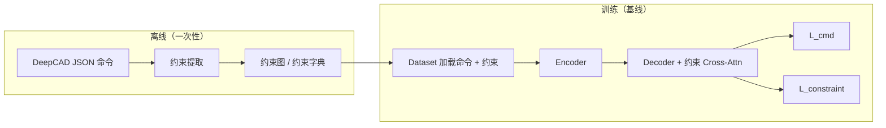

# Constraint-Fused DeepCAD 技术方案

本文档遵循项目 `.cursor/rules/TechnicalProposal.mdc`：包含**方案目标**、**整体架构**、**各模块架构**（每模块含作用、原理、代码、举例）与**总结**。若需带 KEY PARAMS、DATA SHAPES 的 HTML 结构图，样式对齐 `.cursor/rules/model_architecture_template.html`。

**与 Constraint-Aware DeepCAD 的关系**：基线方案在原生 DeepCAD 上通过**自动几何约束挖掘**、**约束感知 Transformer**（解码器对约束序列的 Cross-Attention）与**约束一致性损失**，在**不新增数据集与人工标注**的前提下提升约束满足率。本方案（Constraint-Fused）**完整继承**其约束定义、离线提取逻辑、评估口径与「命令 token 表示不变」等约定；**演进点**在于将约束信息在**编码器侧与命令联合建模**，使瓶颈 \(z\) 显式携带约束语义，从而与 Latent GAN 及「推理不强制依赖外部 \(C\)」一致。下文**第 3 章前半**对齐基线的数据与提取模块，**第 3 章后半**为 Fused 特有设计。

---

## 1. 方案目标

### 1.1 要解决什么问题

在「DeepCAD + Constraint-Aware」一类方案中，约束编码 \(C\) 往往**仅在解码器**通过 Cross-Attention 注入：编码器输出的隐向量 \(z\) 只压缩命令几何，**不携带约束语义**。由此带来：

1. **Latent GAN / 采样生成失效**：GAN 只拟合 \(z\) 的分布，而 \(z\) 不含约束 → 采样得到的草图无法由外部 \(C\) 约束（推理时常无 \(C\)）。
2. **编解码目标不一致**：编码器从未见约束，解码器却被要求服从约束，监督信号传递低效。
3. **训练–推理路径分裂**：训练依赖 \(C\)，推理依赖 \(z\)，存在明显 gap。

### 1.2 方案目标（可验收）

| 目标 | 说明 |
| --- | --- |
| **约束感知隐空间** | \(z\) 显式编码草图约束语义，使「仅 \(z\) → 解码器」仍可约束感知生成。 |
| **训练–推理一致** | 推理阶段（含 Latent GAN）不依赖外部约束序列 \(C\) 作为必需输入。 |
| **兼容 DeepCAD** | 不改变命令/token 格式；数据侧沿用离线约束字典，不新增人工标注。 |
| **可渐进落地** | 支持分阶段实现：先标记嵌入，再 token 增广与重建损失，最后可选解码器增强。 |

### 1.3 核心设计原则

**约束信息必须在编码器侧与命令联合建模，使 \(z\) 成为约束感知的瓶颈表示。**

### 1.4 约束类型范围（2D 草图，与基线一致）

与 Constraint-Aware 文档一致，优先覆盖计算简单、易自动判定的五类关系（用于提取器、tag 与 token 类型 id）：

| 中文 | 英文 |
| --- | --- |
| 水平 | Horizontal |
| 竖直 | Vertical |
| 平行 | Parallel |
| 垂直 | Perpendicular |
| 共线 | Collinear |

### 1.5 继承自 Constraint-Aware 的基线目标（仍适用于本方案数据与评估）

以下四条在 Fused 方案中**仍然成立**，仅「约束主注入位置」由解码器扩展为「编码器 + 可选解码器」：

1. **数据与标注**：完全复用 DeepCAD 官方 JSON 命令数据；约束由几何自动推导，**不引入新标注、不另建数据集**。
2. **表示与模型（命令侧）**：保持 DeepCAD 命令 token 表示不变；在基线中约束经嵌入 + 解码器交叉注意力 + 可选预测头**最小侵入**接入；本方案在此基础上增加编码器侧融合与 \(z\) 侧重建。
3. **优化目标**：总损失在命令预测损失基础上叠加约束相关项（基线为 `L_cmd + α·L_constraint`；本方案见 3.7 节扩展形式），使生成分布在统计意义上更贴近训练集中由几何导出的约束结构。
4. **评估与落地**：可计算水平/竖直/平行/垂直/共线等满足率，并结合 Chamfer/Hausdorff、拓扑合法性等指标，与原版流程对齐（见 3.8 节）。

---

## 2. 整体架构

### 2.1 信息流概览

```text
                    ┌──────────────────────────────────────┐
                    │            Encoder（约束融合）           │
  CAD cmds/args ──► │ CADEmbedding + constraint_tags         │
  constraint dict ─►│ + ConstraintTokenEncoder + SegmentEmb  │
                    │        Self-Attn ×L（联合序列）         │
                    │        Constraint-Aware Pooling        │
                    │              Bottleneck                │
                    └─────────────────┬────────────────────┘
                                      z（约束感知）
                                      │
                    ┌─────────────────▼────────────────────┐
                    │  Decoder（与 DeepCAD 同构或可增强）      │
                    │  Self-Attn → Global-Inject(z) → FFN    │
                    │  （可选）Cross-Attn(C)，推理时可关闭       │
                    └─────────────────┬────────────────────┘
                                      │
              Cmd/Arg Head +（可选）Constraint Pred Head
```

与原「仅解码器注入约束」方案的**关键差异**：约束在**嵌入层与编码器序列**即参与计算；\(z\) 聚合命令与约束 token；解码器侧 Cross-Attn 降为**可选增强**而非唯一约束来源。

### 2.2 与张量形状相关的约定（DATA SHAPES）

| 符号 | 含义 | 典型形状 |
| --- | --- | --- |
| \(S\) | 命令序列长度 | `(S, N)` |
| \(N\) | batch size | — |
| \(T\) / \(B\) | 基线文档中的命令长度 / batch（与 \(S\) / \(N\) 同义） | `[B, T]` 等 |
| \(T_c\) | 约束 token 条数（padding 到固定上限） | `(T_c, N)` |
| `d_model` | 模型宽度 | 如 256 |
| \(z\) | 瓶颈隐向量（经 Bottleneck 后供解码器 Global-Inject） | `(1, N, d_model)` |

### 2.3 与原方案对比（摘要）

| 维度 | 原 Constraint-Aware 思路 | 本方案 |
| --- | --- | --- |
| 约束主注入位置 | 解码器 Cross-Attn | 编码器 Embedding + 联合 Self-Attn |
| \(z\) 是否含约束 | 否 | 是 |
| Latent GAN 推理 | 难依赖外部 \(C\) | 仅需 \(z\) |
| 解码器 | 常需 Cross-Attn | 可保持原版；Cross-Attn 可选 |

### 2.4 基线 Constraint-Aware：数据与训练管线（Mermaid）

下列流程描述**原版 Constraint-Aware** 的离线约束与训练数据流，本方案**复用**「JSON → 提取 → 约束字典 / 约束 token」前半段；差异在于 Encoder 内增加融合与 \(z\) 重建，Decoder 对 \(C\) 的依赖降为可选。



**基线模型侧信息流（概念，便于与 2.1 对照）**：

- **输入**：与原版相同的 CAD 命令序列（及位置编码等原有输入）。
- **并行支路**：离线得到的约束经 **Constraint Embedding** 变为约束 token 序列 \(C\)。
- **解码**：Decoder 隐状态为 **Q**，对编码器 memory（及 latent \(z\)）的交互**保留**；**新增**对 \(C\) 的多头交叉注意力（或与 \(z\) 融合后再注意力）。
- **输出**：命令序列 logits（主任务）+ 可选约束预测头（辅助监督）。
- **损失（基线）**：`L_total = L_cmd + α * L_constraint`（\(\alpha\) 典型 0.1～0.5）。

**张量符号对照**：基线文档常用 batch 维 `B`、命令长度 `T`；本文 DeepCAD 实现约定多为序列长度 `S`、batch `N`。含义对应关系为 \(T \leftrightarrow S\)、\(B \leftrightarrow N\)。

---

## 3. 模块架构

以下各节统一包含：**模块作用**、**模块原理**、**代码**、**举例说明**。

**章节结构**：**3.0** 与 **3.8** 与 Constraint-Aware 基线**共用**（离线提取、评估）；**3.1–3.7** 在基线之上给出 Constraint-Fused 的编码器融合、重建与可选解码器增强。

---

### 3.0 模块：离线约束提取（Constraint Extraction，与基线一致）

#### 模块作用

从 DeepCAD **JSON 命令序列**解析几何实体（线段等），用统一数值阈值自动判定水平、竖直、平行、垂直、共线，输出**结构化约束字典**，供 Dataset、`constraint_tags`、约束 token 及重建标签对齐使用。全程**无需人工标注**。

#### 模块原理

1. **输入**：单条样本的 DeepCAD 命令 JSON（与官方格式一致）。
2. **中间**：执行命令语义等价的几何构造，得到带 id 的线段及端点、方向向量。
3. **判定**（统一阈值，与论文常用设置一致）：
   - **水平**：方向向量 \(z\) 分量近似为 0。
   - **竖直**：\(x、y\) 分量近似为 0（视具体坐标约定与 DeepCAD 线向定义一致微调）。
   - **平行 / 垂直**：用两线方向向量夹角，与 \(0^\circ\) 或 \(90^\circ\) 比较。
   - **共线**：先满足近似平行，再判一点到另一直线的距离小于阈值。
4. **输出**：五类约束的列表或线对列表，便于后续 token 化与 tag 构造。

#### 代码

**约束字典结构（输出示例 schema）：**

```json
{
  "horizontal": [线ID列表],
  "vertical": [线ID列表],
  "parallel": [[线A, 线B], ...],
  "perpendicular": [[线A, 线B], ...],
  "collinear": [[线A, 线B], ...]
}
```

**阈值与线段表示（提取器内部）：**

```python
# 阈值（论文常用量级）
ANGLE_THRESH = 2.0       # 角度误差 < 2°
DIST_THRESH = 1e-3       # 距离误差 < 0.001
EPS = 1e-5

# 线段表示（示例）
line = {
    "id": int,
    "start": (x, y, z),
    "end": (x, y, z),
    "vec": (dx, dy, dz),
}
```

**判定要点（伪代码级）：**

```python
import math

def angle_deg(u, v):
    # 返回 [0, 90] 内等价角，用于平行/垂直
    cos_t = abs(dot(u, v)) / (norm(u) * norm(v) + 1e-12)
    cos_t = min(1.0, max(-1.0, cos_t))
    return math.degrees(math.acos(cos_t))

# 水平：abs(line.vec.z) < EPS
# 竖直：abs(line.vec.x) < EPS and abs(line.vec.y) < EPS
# 平行：angle_deg(v1, v2) < ANGLE_THRESH
# 垂直：abs(angle_deg(v1, v2) - 90.0) < ANGLE_THRESH
# 共线：平行 + 点 p3 到直线 (p1,p2) 距离 < DIST_THRESH
# 距离：|(p2-p1) × (p3-p1)| / |p2-p1|
```

#### 举例说明

假设解析后有三条线：`L0` 沿 x 轴，`L1` 沿 y 轴，`L2` 与 `L0` 同向且落在同一直线上。则可能得到：

- `horizontal: [0, 2]`，`vertical: [1]`
- `perpendicular: [[0, 1], [1, 2]]`（视具体角度阈值与采样误差而定）
- `collinear: [[0, 2]]`

该字典经 `constraint_tokenizer` / `collate` 转为本方案中的 `constraint_tags`、`c_types/c_line_a/c_line_b` 及重建 GT。

---

### 3.1 模块：命令级约束标记嵌入

#### 模块作用

在 **token 嵌入阶段**告诉模型：「第 \(i\) 条命令对应的线段参与了哪些约束类型（水平/竖直/平行/垂直/共线）」，使后续 Self-Attention 能在命令之间建立与约束一致的关联，而无需等到解码器才见约束。

#### 模块原理

1. 对每条命令构造 **约束参与向量** \(p_i \in \{0,1\}^5\)（非画线命令可全零）。
2. 用小型 MLP（`ConstraintTagEmbedding`）将 \(p_i\) 映射到 \(\mathbb{R}^{d_\text{model}}\)，与 `command_embed + arg_embed` 结果**逐元素相加**，再叠加位置编码。

**约束参与向量各维含义：**

| 维 | 含义 |
| --- | --- |
| 0 | 该命令对应线段是否为水平线 |
| 1 | 是否为竖直线 |
| 2 | 是否参与平行约束 |
| 3 | 是否参与垂直约束 |
| 4 | 是否参与共线约束 |

#### 代码

```python
class ConstraintTagEmbedding(nn.Module):
    def __init__(self, n_constraint_types=5, d_model=256):
        super().__init__()
        self.tag_proj = nn.Sequential(
            nn.Linear(n_constraint_types, d_model),
            nn.GELU(),
            nn.Linear(d_model, d_model),
        )

    def forward(self, constraint_tags):
        """
        constraint_tags: (S, N, 5) float，约束参与向量
        return: (S, N, d_model)
        """
        return self.tag_proj(constraint_tags)
```

融合到 `CADEmbedding` 的逻辑（在 `pos_encoding` 之前）：

```text
src = command_embed(commands) + embed_fcn(arg_embed(args))
src = src + group_embed(groups)              # 若启用
src = src + constraint_tag_embed(c_tags)     # 新增
src = pos_encoding(src)
```

#### 举例说明

假设第 3 条命令是一条水平线段，且与第 7 条线有平行约束：可设 \(p_3 = [1,0,1,0,0]\)。嵌入相加后，在多层 Self-Attn 中，第 3 条与第 7 条命令的表示更容易形成稳定的几何–约束一致模式；**extrude** 等非线段命令则令 \(p_i = \mathbf{0}\)，避免引入虚假约束信号。

---

### 3.2 模块：约束 Token 编码与序列拼接

#### 模块作用

命令级标记只回答「每条线参与什么类型的约束」，**不直接表达关系结构**（例如「线 A 与线 B 平行」）。将约束图离散为 **约束 token 序列**，与命令序列拼接，使同一套编码器 Self-Attn 在**联合序列**上建模「命令–约束–命令」的细粒度依赖。

#### 模块原理

1. **ConstraintTokenEncoder**：每条约束实例由 `(type, line_a, line_b)` 编码为 \(h_c \in \mathbb{R}^{d_\text{model}}\)（类型嵌入 + 线对嵌入融合）。
2. **SegmentEmbedding**：用 `seg_id ∈ {0,1}` 区分命令段与约束段，避免模型混淆两类 token 的语义角色。
3. 沿序列维拼接：`E_joint = cat([E_cmd, E_con], dim=0)`，并扩展 `key_padding_mask`。

编码器层结构可与原版一致（如 `TransformerEncoderLayerImproved`），**不增加新层类型**，仅输入序列变长为 \(S + T_c\)。

**与基线 Constraint Embedding 的对应关系（Constraint-Aware 模块 2）**：基线将**非序列**约束字典转为 \(C \in \mathbb{R}^{B \times T_c \times d_\text{model}}\)，**一条约束实例 = 一个 token**；单 token 由**类型嵌入** + **实体嵌入**（单线或线对经 MLP 融合）合成，并用 `key_padding_mask` 屏蔽 pad。本方案的 `ConstraintTokenEncoder` 与基线在语义上等价，差别在于 token 随后**拼入编码器联合序列**而非仅供解码器 K/V。若需与旧实现对齐，可采用下列基线风格的 `ConstraintEmbedding`（与 `pair_mask` 区分单线/线对）：

```python
import torch
import torch.nn as nn

class ConstraintEmbedding(nn.Module):
    def __init__(self, n_types, n_line_ids, d_model, d_ent=64):
        super().__init__()
        self.type_emb = nn.Embedding(n_types, d_model)
        self.line_emb = nn.Embedding(n_line_ids, d_ent)
        self.pair_mlp = nn.Sequential(
            nn.Linear(2 * d_ent, d_model),
            nn.ReLU(),
            nn.Linear(d_model, d_model),
        )
        self.single_proj = nn.Linear(d_ent, d_model)
        self.out = nn.LayerNorm(d_model)

    def forward(self, type_ids, line_a, line_b, pair_mask):
        # type_ids: [B, T_c], line_a/line_b: [B, T_c]（非 pair 时 line_b 可置 0）
        et = self.type_emb(type_ids)
        ea, eb = self.line_emb(line_a), self.line_emb(line_b)
        ep = self.pair_mlp(torch.cat([ea, eb], dim=-1))
        es = self.single_proj(ea)
        fused = torch.where(pair_mask.unsqueeze(-1), ep, es)
        return self.out(et + fused)
```

> `pair_mask` 与类型 id 的构造应由 `constraint_extractor` 与 `collate` 约定一致；维数与 DeepCAD 实际 `d_model`、线 id 上界对齐即可。

#### 代码

```python
class ConstraintTokenEncoder(nn.Module):
    def __init__(self, n_types=6, max_lines=64, d_model=256):
        super().__init__()
        self.type_embed = nn.Embedding(n_types, d_model)
        # HORIZONTAL=0, VERTICAL=1, PARALLEL=2, PERPENDICULAR=3, COLLINEAR=4, NONE=5
        self.line_embed = nn.Embedding(max_lines, d_model // 2)
        self.pair_fuse = nn.Sequential(nn.Linear(d_model, d_model), nn.GELU())
        self.out_proj = nn.Linear(d_model, d_model)
        self.norm = nn.LayerNorm(d_model)

    def forward(self, c_types, c_line_a, c_line_b):
        e_type = self.type_embed(c_types)
        e_a = self.line_embed(c_line_a)
        e_b = self.line_embed(c_line_b)
        e_lines = self.pair_fuse(torch.cat([e_a, e_b], dim=-1))
        return self.norm(self.out_proj(e_type + e_lines))


class SegmentEmbedding(nn.Module):
    def __init__(self, d_model=256):
        super().__init__()
        self.embed = nn.Embedding(2, d_model)  # 0: command, 1: constraint

    def forward(self, seg_ids):
        return self.embed(seg_ids)
```

拼接与 mask：

```text
E_joint = cat([E_cmd, E_con], dim=0) + SegmentEmbedding(cat([seg_cmd, seg_con]))
mask_joint = cat([cmd_padding_mask, constraint_padding_mask], dim=1)
memory = Encoder(E_joint, src_key_padding_mask=mask_joint)
```

#### 举例说明

草图有两条约束：`PARALLEL(线1, 线5)`、`PERPENDICULAR(线2, 线5)`。则 \(T_c=2\)（若 batch 内 padding 到 32，则多余位置 mask 掉）。约束 token 在 Self-Attn 中可同时 attend 到线 1、2、5 对应的命令 token，从而把「共享线 5」的几何上下文与两类关系一并编码进 `memory`，最终影响池化后的 \(z\)。

**基线-only 举例（解码器消费 \(C\)）**：某样本约束 token 顺序为 `[VERT(L3), HORIZ(L1), PARALLEL(L1,L4)]`，则 \(T_c=3\)。Batch 内另一样本仅有 1 条约束，则 pad 到 batch 内 \(T_c^{\max}\)，padding 在 `key_padding_mask` 中为 `True`（PyTorch MHA 约定）。本方案训练时同样使用该类 mask；Fused 下 \(C\) 还进入 Encoder 联合序列。

---

### 3.3 模块：约束感知池化与 Bottleneck

#### 模块作用

将长度 \(S+T_c\) 的编码器输出压缩为固定长度的全局表示，再经 Bottleneck 得到供解码器使用的 \(z\)。需在**拼接约束 token 后**仍稳定地把约束信息保留进 \(z\)。

#### 模块原理

- **策略 A（推荐起步）**：对联合序列所有非 padding 位置做 masked mean pooling，再 `Bottleneck`。实现简单，约束 token 自然参与 \(z\)。
- **策略 B（可选）**：分别对命令位置与约束位置池化，经可学习门控融合，显式调节「几何–约束」比例。

#### 代码（策略 B：双流门控）

```python
class DualStreamPooling(nn.Module):
    def __init__(self, d_model):
        super().__init__()
        self.gate = nn.Sequential(nn.Linear(d_model * 2, d_model), nn.Sigmoid())

    def forward(self, memory, cmd_mask, con_mask):
        z_cmd = (memory * cmd_mask).sum(0) / cmd_mask.sum(0).clamp(min=1)
        z_con = (memory * con_mask).sum(0) / con_mask.sum(0).clamp(min=1)
        g = self.gate(torch.cat([z_cmd, z_con], dim=-1))
        z = g * z_cmd + (1 - g) * z_con
        return z.unsqueeze(0)
```

策略 A 可用：`z_pooled = sum(memory * valid) / count(valid)`，再接 `nn.Linear` 等 Bottleneck（与原版 DeepCAD 一致即可）。

#### 举例说明

若某样本命令很少但约束很密（\(S\) 小、\(T_c\) 大），策略 A 仍让约束 token 占池化有效长度的可观比例，避免 \(z\) 几乎只反映少数命令而忽略约束；若实验中发现约束过强压制几何细节，可切换到策略 B 用门控削弱约束支路权重。

---

### 3.4 模块：约束重建头与辅助损失

#### 模块作用

仅靠架构融合不一定保证 \(z\) **可逆地**保留约束信息。通过从 \(z\) **重建约束图**（ unary + pair ）的辅助任务，显式施加监督，迫使瓶颈层编码约束。

#### 模块原理

- **Unary**：对每条线预测是否水平/竖直。
- **Pair**：对每条线对预测平行/垂直/共线三类是否存在（可展平为 `max_lines × max_lines × 3`）。
- 损失一般为加权 BCE；约束稀疏时可用 `pos_weight` 或 focal 思想缓解类不平衡。

#### 代码

```python
class ConstraintReconHead(nn.Module):
    def __init__(self, dim_z=256, max_lines=64):
        super().__init__()
        self.max_lines = max_lines
        self.unary_head = nn.Sequential(
            nn.Linear(dim_z, 256), nn.GELU(),
            nn.Linear(256, max_lines * 2),
        )
        self.pair_head = nn.Sequential(
            nn.Linear(dim_z, 512), nn.GELU(),
            nn.Linear(512, max_lines * max_lines * 3),
        )

    def forward(self, z):
        N = z.size(0)
        u = self.unary_head(z).view(N, self.max_lines, 2)
        p = self.pair_head(z).view(N, self.max_lines, self.max_lines, 3)
        return torch.sigmoid(u), torch.sigmoid(p)


def weighted_bce(pred, target, pos_weight=5.0):
    w = torch.where(target > 0.5, pos_weight, 1.0)
    return F.binary_cross_entropy(pred, target, weight=w)
```

#### 举例说明

GT 中仅 `(线3, 线8)` 存在平行关系：则 `pair_gt[3,8,0]=1`（假设第 0 维为 parallel），其余线对为 0。若 \(z\) 未编码该关系，`pair_pred` 在 `(3,8)` 上梯度会持续偏大，从而把监督回传到 Encoder/Bottleneck；这与主任务 `L_cmd` 共同优化，避免「解码正确但约束丢失」的退化解。

---

### 3.5 模块：解码器与可选约束 Cross-Attention

#### 模块作用

在 \(z\) 已约束感知的前提下，解码器可**完全沿用 DeepCAD**（Self-Attn → Global-Inject(\(z\)) → FFN），保证与 Latent GAN 一致。若仍需更强训练期监督，可**可选**加入对 \(C\) 的 Cross-Attn，但推理时必须不依赖 \(C\)（权重置零或模块跳过）。

#### 模块原理

- **基础路径**：`linear_global(z)` 将约束语义注入每层解码器，推理只需 \(z\)。
- **增强路径**：训练时以一定概率使用 Cross-Attn 访问约束 memory；配合 dropout schedule，逐步提高「仅用 \(z\)」的比例，减轻 train–infer 差异。

**基线 Constraint-Aware Cross-Attention（Constraint-Aware 模块 3，供对照与消融）**：标准交叉注意力中解码器隐状态 \(H\) 为 **Q**，约束序列 \(C\) 为 **K、V**：\(H' = \mathrm{MHA}(Q{=}H, K{=}C, V{=}C, \texttt{key\_padding\_mask})\)，再残差 \(H \leftarrow H + \mathrm{Dropout}(H')\)。与 DeepCAD 解码器**最小侵入**衔接的常见做法包括：

1. **双路交叉注意力（基线优先）**：每层顺序示例：`Self-Attn → Cross-Attn(z) → Cross-Attn(C) → FFN`。
2. **或**将 \(z\) 与 \(C\) 在序列维拼接后线性压回 `d_model` 作为单一 memory（参数更多）。
3. **仅在后 \(k\) 层**加入对 \(C\) 的交叉注意力，训练初期更稳。
4. **\(C\) 的来源**：训练用 **GT 约束** token；推理可无约束时 \(T_c{=}0\) 或仅占位；高阶方案可用预测头逐步预测约束再喂回（扩展）。

可选增强：将**命令位置**与线 id 对齐的编码并入线嵌入；稀疏 attention 仅连相关约束（实现成本高，初期可用全连接 + pad mask）。

**基线 Cross-Attn 块参考实现：**

```python
import torch.nn as nn

class ConstraintCrossAttentionBlock(nn.Module):
    def __init__(self, d_model, nhead, dropout=0.1):
        super().__init__()
        self.norm = nn.LayerNorm(d_model)
        self.mha = nn.MultiheadAttention(d_model, nhead, dropout=dropout, batch_first=True)
        self.drop = nn.Dropout(dropout)

    def forward(self, h, c, constraint_key_padding_mask):
        # h: [B, T, d_model], c: [B, T_c, d_model]
        q = self.norm(h)
        k = self.norm(c)
        attn_out, _ = self.mha(q, k, k, key_padding_mask=constraint_key_padding_mask)
        return h + self.drop(attn_out)
```

**举例（基线直觉）**：在某解码层，当前步正在预测与 **线 L4** 相关的命令；若 \(C\) 中含 `PARALLEL(L1, L4)`，则该约束 token 通过注意力权重将信息汇入对应时间步隐状态，后续 FFN 与输出层更易产生与 L1 平行的几何。本方案在 \(z\) 已编码约束后，该通路变为**可选**以增强训练。

#### 子模块：约束预测头（Constraint Prediction Head，与基线模块 4 一致）

##### 模块作用

对当前生成位置或实体提供**辅助分类/回归目标**（例如预测涉及的约束类型或线对），与交叉注意力的**隐式**融合互补，由 `L_constraint_pred`（或基线中的 `L_constraint`）显式监督。

##### 模块原理

在 Decoder 某层输出或输出投影上接 **线性层 / 小型 MLP**，头数与标签设计一致：可对「当前命令关联的约束类型」做多标签或多类分类；与线 id 相关时需处理词汇表大小与 mask（与 DeepCAD 命令 arg 空间一致时尤需注意）。标签构造应与离线约束及命令对齐规则一致（例如按线出现顺序、按命令索引对齐）。

##### 代码

```python
class ConstraintPredHead(nn.Module):
    def __init__(self, d_model, n_constraint_types):
        super().__init__()
        self.proj = nn.Linear(d_model, n_constraint_types)

    def forward(self, h_step):
        # h_step: [B, d_model] 或 [B, T, d_model]
        return self.proj(h_step)
```

##### 举例说明

若当前步对应「创建第二条水平线」的命令位置，监督标签可为 `HORIZONTAL` 为主类；线对约束可在「第二条线完成」时触发 `PARALLEL` 等多标签。实现时以数据管线为准，保证 **标签与损失可微、可批处理**。

#### 代码（本方案：可选 Cross-Attn + 训练期随机跳过）

```python
class OptionalConstraintCrossAttn(nn.Module):
    def __init__(self, d_model, nhead, training_dropout=0.5):
        super().__init__()
        self.cross_attn = nn.MultiheadAttention(d_model, nhead)
        self.norm = nn.LayerNorm(d_model)
        self.dropout = nn.Dropout(training_dropout)
        self.training_dropout = training_dropout

    def forward(self, tgt, constraint_memory, constraint_mask=None):
        if not self.training:
            return tgt
        if torch.rand(1).item() < self.training_dropout:
            return tgt
        t2, _ = self.cross_attn(
            self.norm(tgt), constraint_memory, constraint_memory,
            key_padding_mask=constraint_mask,
        )
        return tgt + self.dropout(t2)
```

#### 举例说明

**阶段 1**：`training_dropout=0`，模型强烈依赖 \(C\) 与 \(z\) 双路信息，约束满足率上升快。**阶段 2**：线性增大 `training_dropout` 至接近 1，推理时关闭 Cross-Attn，发现生成质量与约束指标仍稳定 → 说明 \(z\) 已吸收原需 Cross-Attn 传递的约束信息。

---

### 3.6 模块：融合编码器整合（EncoderFused）

#### 模块作用

将 3.1–3.3 串联为单一 `forward`：命令嵌入（含 tag）→ 约束 token → 段嵌入 → Transformer → 池化 →（外部）Bottleneck，便于训练脚本与配置对齐原版 Encoder。

#### 模块原理

与 2.2 节形状约定一致；池化默认采用策略 A。

#### 代码

```python
class CADEmbeddingFused(nn.Module):
    def __init__(self, cfg):
        super().__init__()
        self.command_embed = nn.Embedding(cfg.n_commands, cfg.d_model)
        self.arg_embed = nn.Embedding(cfg.args_dim + 1, 64, padding_idx=0)
        self.embed_fcn = nn.Linear(64 * cfg.n_args, cfg.d_model)
        self.pos_encoding = PositionalEncodingLUT(cfg.d_model, max_len=cfg.max_len)
        self.use_group = cfg.use_group_emb
        if self.use_group:
            self.group_embed = nn.Embedding(cfg.group_len + 2, cfg.d_model)
        self.constraint_tag = ConstraintTagEmbedding(5, cfg.d_model)

    def forward(self, commands, args, groups=None, constraint_tags=None):
        src = self.command_embed(commands.long()) + self.embed_fcn(
            self.arg_embed((args + 1).long()).view(commands.shape[0], commands.shape[1], -1)
        )
        if self.use_group and groups is not None:
            src = src + self.group_embed(groups.long())
        if constraint_tags is not None:
            src = src + self.constraint_tag(constraint_tags)
        return self.pos_encoding(src)


class EncoderFused(nn.Module):
    def __init__(self, cfg):
        super().__init__()
        self.embedding = CADEmbeddingFused(cfg)
        self.constraint_token_enc = ConstraintTokenEncoder(6, cfg.max_lines, cfg.d_model)
        self.segment_embed = SegmentEmbedding(cfg.d_model)
        enc_layer = TransformerEncoderLayerImproved(
            cfg.d_model, cfg.n_heads, cfg.dim_feedforward, cfg.dropout
        )
        self.encoder = TransformerEncoder(
            enc_layer, cfg.n_layers, nn.LayerNorm(cfg.d_model)
        )

    def forward(
        self, commands, args, constraint_tags,
        c_types, c_line_a, c_line_b,
        cmd_padding_mask, constraint_padding_mask, groups=None,
    ):
        E_cmd = self.embedding(commands, args, groups, constraint_tags)
        S, N, D = E_cmd.shape
        E_con = self.constraint_token_enc(c_types, c_line_a, c_line_b)
        T_c = E_con.size(0)
        seg = torch.cat([
            torch.zeros(S, N, dtype=torch.long, device=E_cmd.device),
            torch.ones(T_c, N, dtype=torch.long, device=E_cmd.device),
        ], dim=0)
        E_joint = torch.cat([E_cmd, E_con], dim=0) + self.segment_embed(seg)
        mask_joint = torch.cat([cmd_padding_mask, constraint_padding_mask], dim=1)
        memory = self.encoder(E_joint, src_key_padding_mask=mask_joint)
        valid = (~mask_joint).unsqueeze(-1).transpose(0, 1).float()
        z = (memory * valid).sum(dim=0, keepdim=True) / valid.sum(dim=0, keepdim=True).clamp(min=1e-6)
        return z
```

#### 举例说明

Batch 内两个样本：样本 A 的 \(S=40, T_c=10\)，样本 B 的 \(S=25, T_c=32\)（约束截断上限）。`mask_joint` 分别屏蔽各自 padding，池化只对真实命令与真实约束 token 求平均，避免把 padding 当零约束「稀释」\(z\)。

---

### 3.7 模块：总损失、训练与推理流程

#### 模块作用

统一主任务（CAD 序列）与辅助任务（约束预测、约束重建）的优化目标；明确训练与 Latent GAN 推理的数据依赖，保证「推理不强制需要 \(C\)」。

#### 模块原理

```text
L_total = L_cmd + α · L_constraint_pred + β · L_constraint_recon
```

| 项 | 含义 |
| --- | --- |
| `L_cmd` | 原版 DeepCAD 命令/参数交叉熵 |
| `L_constraint_pred` | 解码器侧约束预测头（若保留）与 GT 的监督 |
| `L_constraint_recon` | 从 \(z\) 重建约束图的加权 BCE |

权重可 schedule：例如前期较大 \(\beta\) 迫使 \(z\) 学约束，后期衰减以偏重生成质量。

#### 代码（流程伪代码）

```text
# 训练
z_pre = EncoderFused(...)
z = Bottleneck(z_pre)
logits = Decoder(z)
L_cmd = CADLoss(logits, targets)
L_pred = ConstraintPredLoss(pred_head_out, constraint_gt)   # 若启用
u, p = ConstraintReconHead(z.squeeze(0))
L_recon = weighted_bce(u, unary_gt) + weighted_bce(p, pair_gt)
loss = L_cmd + alpha * L_pred + beta * L_recon
loss.backward()

# 推理（GAN）
z ~ GAN;  Decoder(z)  → 序列   # 无需外部 C
```

#### 举例说明

固定 \(\alpha=0.1, \beta=0.5\)：若 `L_recon` 长期不下降，说明 \(z\) 容量或池化策略不足以保存约束图，可增大 \(\beta\) 或引入策略 B 池化；若 `L_cmd` 明显变差，则减小 \(\beta\) 或推迟启用约束 token 增广（分阶段见总结）。

**与基线 Constraint-Aware 损失的关系**：基线形式为

```text
L_total = L_cmd + α * L_constraint
```

其中 `L_cmd` 为 DeepCAD 原有命令（及参数）交叉熵或复合损失，`L_constraint` 为约束分类 BCE/CE 或结构化损失（与预测头设计一致），\(\alpha \in [0.1, 0.5]\) 常用，需验证集调参。本方案在保留 `L_cmd` 与（可选）`L_constraint_pred` 的前提下增加 `L_constraint_recon`，等价于把一部分「约束可学性」从**仅解码器**压到**瓶颈 \(z\)**。

**基线 `total_loss` 伪代码（对照）**：

```python
def total_loss_baseline(logits_cmd, targets_cmd, logits_cstr, targets_cstr, alpha=0.2):
    loss_cmd = cross_entropy_cmd(logits_cmd, targets_cmd)  # 与原版相同
    loss_c = constraint_loss(logits_cstr, targets_cstr)   # BCE/CE/...
    return loss_cmd + alpha * loss_c
```

若 \(\alpha\) 过小，约束满足率提升不明显；若过大，命令困惑度上升、草图不完整。建议在验证集上同时监控 **命令 token 准确率** 与 **约束满足率**，选取帕累托较优点（与 3.8 节指标一致）。

---

### 3.8 模块：评估指标与工程校验（与基线模块 6 一致）

#### 模块作用

量化**约束达成情况**与**几何/拓扑质量**，便于与原生 DeepCAD 及 Constraint-Aware 基线对比与消融（去约束分支、去损失、去 cross-attn、去编码器融合等）。

#### 模块原理

- **约束满足率**（相对 GT：由 3.0 节提取器得到的约束）：水平/竖直可按线段计数；平行/垂直/共线可按线对集合 precision/recall 或「满足数 / GT 总数」。
- **几何**：Chamfer / Hausdorff（若将草图栅格化或采样为点集）。
- **拓扑**：闭合性、自交、非法环等规则检测（依产品定义实现）。

#### 代码

```python
def horizontal_rate(lines):
    """示例：水平线段占比。"""
    n_h = sum(1 for L in lines if abs(L["vec"][2]) < 1e-5)
    return n_h / max(len(lines), 1)

def pair_satisfaction(pairs_pred, pairs_gt, judge_fn):
    """示例：线对约束满足数 / GT 对数。"""
    ok = sum(1 for p in pairs_gt if judge_fn(p, pairs_pred))
    return ok / max(len(pairs_gt), 1)
```

#### 举例说明

GT 有 10 对平行约束；生成几何解析后，其中 7 对同时满足角度阈值，则**平行满足率**可为 0.7（定义需与论文表述一致，可改为 F1）。

---

## 4. 总结

### 4.1 方案小结

**Constraint-Aware DeepCAD（基线）**在**零额外标注**前提下，用几何推导将 DeepCAD 数据扩展为「命令 + 约束」监督信号；通过**约束嵌入**、**解码器对约束序列的交叉注意力**与**约束辅助损失**，在整体架构上保持与原生 DeepCAD 一致的数据流与主损失，仅增加约束支路与加权项。实现上应优先保证**提取器阈值与命令几何语义一致**、**约束 token 与 pad mask 正确**，再调节 \(\alpha\) 与交叉注意力放置层数，在命令质量与约束满足率之间取得平衡。

**Constraint-Fused DeepCAD（本文）**在完整保留上述**数据与提取、评估口径**的前提下，通过 **Constraint-Fused Encoding**：在嵌入层叠加命令级约束标记、在编码器输入增广约束 token 并做联合 Self-Attention，再配合 **约束重建损失**，使隐向量 \(z\) 成为可支撑 Latent GAN 与自编码重建的**约束感知瓶颈**。解码器默认与 DeepCAD 一致；可选 Cross-Attn 仅作训练增强，且推理可不依赖外部 \(C\)。可选地，可按 `.cursor/rules/modelArchitectureTemplate.mdc` 另附 HTML 架构图（含 KEY PARAMS 与 DATA SHAPES），与第 2 章张量约定对照。

### 4.2 基线 Constraint-Aware 最简实现路线（五步）

独立复现或消融**仅解码器注入**的 Constraint-Aware 时，可按下列顺序：

1. 加载 DeepCAD 官方 JSON，跑通 `ConstraintExtractor`，落盘或缓存约束字典。
2. Dataset `collate` 产出 \(C\) 与 `key_padding_mask`。
3. 在 Decoder 中接入 `Cross-Attn(C)`（优先双路：`z` 与 \(C\) 分列）。
4. 实现约束预测头与 `L_constraint`，总损失为 `L_cmd + α * L_constraint`。
5. 复用原版训练循环，增加评估脚本（3.8 节指标）。

在此基础上接入本方案时，将步骤 2 的产出同时用于 `constraint_tags`、联合序列与重建 GT，并按 4.3 节分阶段启用编码器融合与 `L_recon`。

### 4.3 分阶段实现路线（Constraint-Fused）

| 阶段 | 内容 | 目的 |
| --- | --- | --- |
| Phase 1 | 仅 `ConstraintTagEmbedding` + `CADEmbedding` 改造 | 最小改动验证 \(z\) 是否更可重建约束 |
| Phase 2 | 约束 token + 段嵌入 + 池化 + `L_recon` | 完整编码器侧融合 |
| Phase 3 | 可选解码器 Cross-Attn + dropout schedule | 进一步约束满足率，同时保证推理仅用 \(z\) |

### 4.4 建议超参数（KEY PARAMS）

| 参数 | 建议 | 说明 |
| --- | --- | --- |
| `max_constraints` (\(T_c\) 上限) | 32 | 单样本最大约束条数，超出截断 |
| `max_lines` | 64 | 线段索引嵌入上限 |
| \(\alpha\) | 0.1 | 约束预测损失权重 |
| \(\beta\) | 0.5（可调） | 约束重建权重；可 schedule |
| `pos_weight` | 5.0 | 稀疏约束 BCE 正样本权重 |
| `d_model` / 层数 | 与原版一致 | 如 256，编码器/解码器各 4 层 |

### 4.5 代码目录建议

```text
constraint_deepcad/
├── data/
│   ├── constraint_extractor.py
│   ├── constraint_tokenizer.py    # 约束字典 → tags + constraint tokens + masks + recon GT
│   └── deepcad_dataset.py
├── model/
│   ├── constraint_tag_embedding.py
│   ├── constraint_token_encoder.py
│   ├── encoder_fused.py
│   ├── constraint_recon_head.py
│   ├── constraint_pred_head.py
│   ├── constraint_transformer.py
│   └── constraint_loss.py
├── evaluate/metric_calculator.py
├── train.py
└── config.py
```

与 Constraint-Aware 基线建议目录的对照：基线可仅包含 `constraint_embedding.py`、`constraint_transformer.py`、`constraint_loss.py` 等解码器侧文件；本方案在 `data/` 侧增加 `constraint_tokenizer.py`，在 `model/` 侧增加 `encoder_fused.py`、`constraint_recon_head.py` 等，**提取器与评估模块命名与职责一致**时可复用同一 `constraint_extractor.py`、`metric_calculator.py`。

### 4.6 明确不做的范围

- 不改变 DeepCAD 命令表示与数据集格式；不新增人工标注；不更换官方数据集划分与格式（与基线一致）。
- 不引入 Pointer、扩散、点云等替代生成范式（本方案聚焦 DeepCAD 命令 + 约束融合）。
- 草图级五类约束为主，不扩展到复杂 3D 特征约束。
- **推理不将外部约束 \(C\) 作为必需输入**（与本方案 Constraint-Fused 目标一致；基线 Constraint-Aware 若需无 \(C\) 推理则需额外设计，本文通过 \(z\) 融合解决）。

### 4.7 论文式表述（可选直接使用）

> 现有 CAD 序列生成模型常在解码器侧引入约束注意力，导致瓶颈隐变量不含约束语义，在隐空间采样生成时约束无法延续。本文提出 Constraint-Fused Encoding：在编码器嵌入与序列层面融合命令级约束标记与约束 token，经联合自注意力建模，并以约束重建任务约束隐空间；解码器可由全局 \(z\) 注入获得约束感知生成，推理无需外部约束序列，训练与推理路径一致，并兼容 DeepCAD 与 Latent GAN 流程。

---

*文档版本：按 `.cursor/rules/TechnicalProposal.mdc` 重组；技术要点合并自《DeepCAD + Constraint-Aware》基线文档与「Constraint-Fused DeepCAD」草案，保证单文档可独立覆盖数据、模型、损失、评估与实现路线。*
