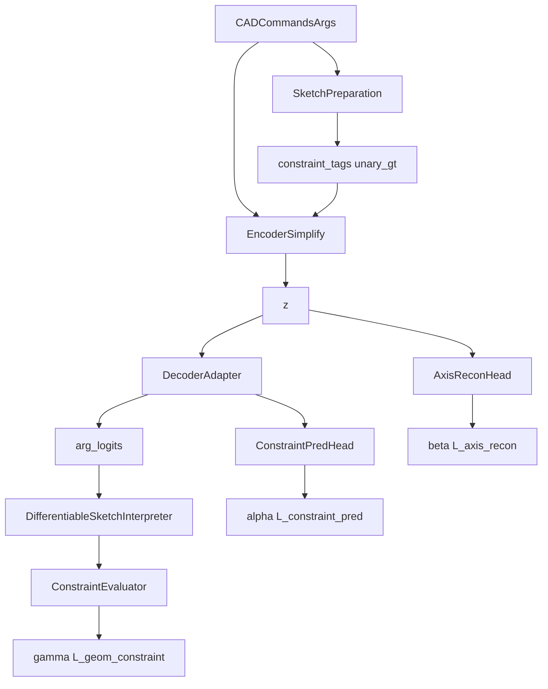

# Constraint-Fused DeepCAD Simplify Modify1 DDD技术方案

本文档面向 `constraint_fused_deepcad_simplify` 的 **Modify1 增强版**。它不是回退到完整 `constraint_fused_deepcad`，也不是继续维持“只做 encoder 侧 tag + latent unary recon”的最小简化，而是在**仍只考虑水平（Horizontal）/竖直（Vertical）约束**的前提下，补回两条此前缺失的有效监督路径：

1. **解码侧显式约束预测路径**：`ConstraintPredHead`
2. **输出参数侧几何约束闭环**：`DifferentiableSketchInterpreter + ConstraintEvaluator`

因此，Modify1 的核心目标不是扩大约束种类，而是回答一个更聚焦的问题：

> 当简化版保留 encoder 侧 H/V 融合的同时，再增加“decoder 隐状态约束监督”和“输出几何可微约束监督”，是否能比原始 simplify 更有效地提升 H/V 约束指标。

本文档遵循项目 `.cursor/rules/TechnicalProposal.mdc`：包含**方案目标**、**整体架构**、**每个模块架构**（模块作用、模块原理、代码、举例说明）与**总结**。文档定位为 `constraint_fused_deepcad_simplify_modify1` 的唯一设计基线。

<!-- markdownlint-disable MD024 -->

---

## 1. 方案目标

### 1.1 业务目标

现有 `constraint_fused_deepcad_simplify` 已验证出一个重要现象：

1. 只靠 `AxisTagEmbedding` 把 H/V 标签注入 encoder。
2. 只靠 latent 上的 `AxisReconHead` 做一元重建。

这条路径对于约束指标提升**不够有效**。其原因不是“约束想法错误”，而是监督链路过短，模型仍然可能出现以下情况：

1. encoder 输入看到了 H/V tag，但 decoder 隐状态并未稳定保留约束语义。
2. latent 上能够预测 H/V，并不等于最终输出的参数几何真的接近水平/竖直。
3. 训练目标更多约束“记忆约束标签”，而较少直接约束“画出正确几何”。

因此 Modify1 的业务目标是：

> 在不引入新约束类型、不恢复完整 Fused 高复杂度模块的前提下，为简化版增加更直接、更连续的 H/V 监督，使其成为一个更可信的快速验证方案。

### 1.2 技术目标

| 目标 | 说明 | 验收方式 |
| --- | --- | --- |
| 保持 H/V 范围冻结 | 仍只处理 `Horizontal`、`Vertical` | 文档、张量、loss、评估全部只出现 2 类 |
| 增加 decoder 侧约束监督 | 在 decoder 隐状态上增加 `ConstraintPredHead` | 训练链路包含 `α · L_constraint_pred` |
| 增加几何闭环监督 | 对输出参数做 soft 几何解释与 H/V 残差计算 | 训练链路包含 `γ · L_geom_constraint` |
| 保留原 simplify 优势 | 不恢复 token 双流、不引入 pair、不引入 decoder cross-attn | 目录结构与模块边界仍保持轻量 |
| 形成独立方案版本 | 与原 simplify 文档并存，便于对照实验 | 生成新的 markdown 和 HTML 文件 |

### 1.3 非目标

以下内容明确**不在 Modify1 范围**：

1. 不处理 `Parallel`、`Perpendicular`、`Collinear`。
2. 不引入 `pair_gt`、`pair_pred`、pair recon loss。
3. 不引入 `ConstraintTokenEncoder`、联合序列 `E_joint`、`SegmentEmbedding`。
4. 不引入 decoder `Cross-Attn(C)`。
5. 不引入 Latent GAN 改造。
6. 不改变 DeepCAD 原始命令表示，不新增人工标注。

### 1.4 核心设计原则

1. **范围冻结优先于结构扩张**。
2. **补监督链路，不补完整复杂度**。
3. **一切新增模块都只服务于 H/V 问题**。
4. **保持现有 simplify 的目录边界和命名风格**。
5. **先保证设计可解释，再讨论训练收益**。

---

## 2. 整体架构

### 2.1 Modify1 方案概览

Modify1 仍然采用 4 个限界上下文，但其职责相比原 simplify 有明确扩展：

| 限界上下文 | 原 simplify | Modify1 |
| --- | --- | --- |
| `Sketch Preparation Context` | 提取 H/V、构造 `constraint_tags` 与 `unary_gt` | 保持不变 |
| `Encoding Context` | `AxisTagEmbedding + EncoderSimplify + Bottleneck` | 保持不变 |
| `Generation Context` | Decoder + `AxisReconHead` | 新增 `ConstraintPredHead` |
| `Training & Evaluation Context` | `L_cmd + β·L_axis_recon` | 新增 `α·L_constraint_pred + γ·L_geom_constraint` |

### 2.2 核心信息流



### 2.3 核心信息流说明

```text
DeepCAD JSON / cad_vec
        │
        ▼
[Sketch Preparation]
提取 Line → 判定 Horizontal / Vertical
        │
        ├──► constraint_tags  (S, 2)
        └──► unary_gt         (L, 2)
        │
        ▼
[Encoding]
CADEmbedding + AxisTagEmbedding
        │
        ▼
Transformer Encoder
        │
        ▼
Pooling + Bottleneck
        │
        ├──► z → DecoderAdapter → command_logits / args_logits / hidden_states
        └──► z → AxisReconHead → unary_pred
                       │
                       ├──► hidden_states → ConstraintPredHead → constraint_pred_logits
                       └──► args_logits → DifferentiableSketchInterpreter
                                              │
                                              ▼
                                       ConstraintEvaluator
                                              │
                                              ▼
                                   L_geom_constraint
        ▼
[Training & Evaluation]
L_total = L_cmd + α·L_constraint_pred + β·L_axis_recon + γ·L_geom_constraint
评估：R_h / R_v / axis_recall_mean
```

### 2.4 与原 simplify 的差异

| 维度 | 原 simplify | Modify1 |
| --- | --- | --- |
| decoder 侧约束监督 | 无 | 增加 `ConstraintPredHead` |
| 几何可微约束监督 | 无 | 增加 `DifferentiableSketchInterpreter + ConstraintEvaluator` |
| loss | `L_cmd + β·L_axis_recon` | `L_cmd + α·L_constraint_pred + β·L_axis_recon + γ·L_geom_constraint` |
| 约束类型 | H/V | H/V |
| pair 关系 | 无 | 仍然无 |
| token 双流编码 | 无 | 仍然无 |

### 2.5 目标目录结构

Modify1 仍然建议落在 `constraint_fused_deepcad_simplify/` 中，以最小增量扩展现有结构：

```text
constraint_fused_deepcad_simplify/
├─ __init__.py
├─ domain/
│  ├─ entities.py
│  └─ services.py
├─ sketch_preparation/
│  ├─ constraint_extractor_simplify.py
│  └─ batch_assembler_simplify.py
├─ encoding/
│  ├─ embeddings.py
│  ├─ encoder_simplify.py
│  └─ pooling.py
├─ generation/
│  ├─ decoder_adapter.py
│  ├─ constraint_pred_head.py        # NEW（也可并入 decoder_adapter.py）
│  └─ axis_recon_head.py
├─ application/
│  ├─ train_use_case.py
│  ├─ loss_composer.py
│  ├─ evaluate_axis_constraints.py
│  ├─ differentiable_sketch_interpreter.py   # NEW
│  └─ geometry_constraint.py                 # NEW
├─ infrastructure/
│  ├─ dataset_simplify.py
│  └─ repository.py
└─ config/
   └─ config_constraint_fused_simplify.py
```

---

## 3. 领域模型设计

### 3.1 聚合根：`SketchSequenceAggregateSimplify`

#### 模块作用

继续作为 Modify1 的核心聚合根，统一持有：

1. 命令序列
2. H/V 约束关系
3. 命令级 `constraint_tags`
4. 线级 `unary_gt`
5. line 数量与 mask 信息

它的职责不因 Modify1 改变，因为新增能力都建立在这份领域视图之上。

#### 模块原理

Modify1 不新增 pair 约束，因此聚合根依然保持以下不变量：

1. 只允许 `HORIZONTAL` 与 `VERTICAL`。
2. `constraint_tags` 只能是 2 维。
3. `unary_gt` 只能是 `(L, 2)`。
4. 所有新增 loss 都必须以这套 H/V 领域定义为监督源。

#### 代码

```python
@dataclass
class SketchSequenceAggregateSimplify:
    commands: List[CadCommand]
    constraints: List[ConstraintRelationSimplify]
    constraint_tags: torch.Tensor   # (S, 2)
    unary_gt: torch.Tensor          # (L, 2)
    cmd_padding_mask: torch.Tensor
    line_count: int
```

#### 举例说明

若一个草图只有 3 条线，其中第 0 条水平、第 2 条竖直，则：

1. `constraint_tags` 只在对应 `LINE` 命令位置上置位。
2. `unary_gt[0] = [1, 0]`
3. `unary_gt[2] = [0, 1]`

这些监督会同时被 encoder、`ConstraintPredHead` 和 `ConstraintEvaluator` 消费。

---

### 3.2 值对象：`AxisConstraintTarget`

#### 模块作用

显式表达“某个监督位置的目标是 H/V 二分类”，避免 decoder 侧预测目标与 latent 侧重建目标被误解为两类不同语义。

#### 模块原理

在 Modify1 中，虽然出现两条监督路径：

1. `ConstraintPredHead` 的 `constraint_pred_logits`
2. `AxisReconHead` 的 `unary_pred`

但两者本质都在回答同一个 H/V 语义问题，只是监督位置不同：

1. 前者作用于 decoder 隐状态。
2. 后者作用于 latent `z`。

#### 代码

```python
@dataclass(frozen=True)
class AxisConstraintTarget:
    horizontal: int
    vertical: int
```

#### 举例说明

若某条线真实为水平，则：

```python
AxisConstraintTarget(horizontal=1, vertical=0)
```

该值对象既可对应 `constraint_pred` 的目标，也可对应 `unary_gt` 的语义。

---

## 4. 模块架构设计

### 4.1 模块：`sketch_preparation/constraint_extractor_simplify.py`

#### 模块作用

继续负责从 DeepCAD 几何中提取 H/V 约束，为 Modify1 提供全部监督源。

#### 模块原理

它与原 simplify 一致：

1. 恢复所有 `Line`
2. 计算二维方向向量
3. 与 x / y 轴比较无向夹角
4. 输出 `horizontal` / `vertical`

Modify1 不改变提取规则，因为新增模块只改变监督链路，不改变标签定义。

#### 代码

```python
def extract_axis_constraints(lines, angle_thresh):
    horizontal = []
    vertical = []
    ex = np.array([1.0, 0.0], dtype=np.float64)
    ey = np.array([0.0, 1.0], dtype=np.float64)

    for i, line in enumerate(lines):
        di = line_direction_xy(line)
        if undirected_angle_deg(di, ex) < angle_thresh:
            horizontal.append(i)
        if undirected_angle_deg(di, ey) < angle_thresh:
            vertical.append(i)
    return horizontal, vertical
```

#### 举例说明

如果第 1 条线近似水平，第 3 条线近似竖直，则输出：

```json
{
  "horizontal": [1],
  "vertical": [3]
}
```

---

### 4.2 模块：`sketch_preparation/batch_assembler_simplify.py`

#### 模块作用

把提取得到的 H/V 约束组装成训练可直接消费的 batch 结构。

#### 模块原理

Modify1 中它仍然只产出最小字段：

1. `constraint_tags`
2. `unary_gt`
3. `line_count`
4. `cmd_padding_mask`

但需要强调：这些字段现在会同时被三条监督路径复用：

1. encoder 输入
2. latent recon
3. decoder pred / geometry constraint 的辅助对齐

#### 代码

```python
def build_constraint_tags(seq_len, commands_np, relations):
    tags = torch.zeros(seq_len, 2, dtype=torch.float32)
    line_to_pos = {}
    line_id = 0
    for t in range(seq_len):
        if int(commands_np[t]) == LINE_IDX:
            line_to_pos[line_id] = t
            line_id += 1

    for rel in relations:
        pos = line_to_pos.get(rel.line_idx)
        if pos is None:
            continue
        tags[pos, rel.type_id] = 1.0
    return tags
```

#### 举例说明

若第 8 个命令对应第 2 条线，而第 2 条线被标记为竖直，则：

```text
constraint_tags[8] = [0, 1]
```

这个标签之后既能进入 encoder，也能用于 `ConstraintPredHead` 的目标构造。

---

### 4.3 模块：`encoding/embeddings.py`

#### 模块作用

在命令 embedding 层继续注入 H/V tag，使 encoder 在输入侧感知轴向约束。

#### 模块原理

Modify1 不改变该模块，因为这里已经是原 simplify 中最关键的“约束进入 encoder”的路径：

```text
E_cmd = command_emb + arg_emb + group_emb(optional) + axis_tag_emb
```

新增 decoder 和 geometry loss 的前提，正是先保留这条编码侧路径。

#### 代码

```python
class AxisTagEmbedding(nn.Module):
    def __init__(self, d_model: int):
        super().__init__()
        self.proj = nn.Sequential(
            nn.Linear(2, d_model),
            nn.GELU(),
            nn.Linear(d_model, d_model),
        )

    def forward(self, tags):
        return self.proj(tags.float())
```

#### 举例说明

同一条 `LINE` 命令：

1. tag 为 `[1, 0]` 时，encoder 能提早感知“这是一条水平线”。
2. tag 为 `[0, 0]` 时，模型只依赖原始命令和参数语义。

---

### 4.4 模块：`encoding/encoder_simplify.py`

#### 模块作用

保持原 simplify 的轻量编码器路径，把带 H/V tag 的命令序列压缩为约束感知 latent `z`。

#### 模块原理

Modify1 明确**不恢复**：

1. `ConstraintTokenEncoder`
2. 联合序列 `E_joint`
3. constraint token 自注意力

因此 encoder 仍然是“单流命令序列 + AxisTagEmbedding”的轻量 fused。

#### 代码

```python
class EncoderSimplify(nn.Module):
    def __init__(self, cfg):
        super().__init__()
        self.embedding = CADEmbeddingWithAxisTags(cfg, cfg.max_total_len)
        self.encoder = TransformerEncoder(...)
        self.pooling = MaskedMeanPooling()
        self.bottleneck = Bottleneck(...)

    def forward(self, commands, args, constraint_tags, cmd_padding_mask, groups=None):
        e_cmd = self.embedding(commands, args, groups, constraint_tags)
        memory = self.encoder(e_cmd, src_key_padding_mask=cmd_padding_mask)
        z_pre = self.pooling(memory, cmd_padding_mask)
        return self.bottleneck(z_pre)
```

#### 举例说明

若两个样本几何相近，但一个包含更多竖直线，则这种差异会先经过 `constraint_tags` 进入 encoder，再被压缩到 `z` 中。

---

### 4.5 模块：`generation/axis_recon_head.py`

#### 模块作用

继续从 latent `z` 预测线级 H/V 属性，用于回答“瓶颈表示中是否保留了轴约束语义”。

#### 模块原理

Modify1 仍然保留它，因为它对应的是 **latent 侧监督**，与新增模块的作用并不重复：

1. `AxisReconHead` 监督的是 `z`
2. `ConstraintPredHead` 监督的是 decoder hidden states
3. `ConstraintEvaluator` 监督的是输出参数几何

三者分别对应不同深度的语义位置。

#### 代码

```python
class AxisReconHead(nn.Module):
    def __init__(self, d_model: int, max_lines: int):
        super().__init__()
        self.max_lines = max_lines
        self.out = nn.Sequential(
            nn.Linear(d_model, d_model),
            nn.GELU(),
            nn.Linear(d_model, max_lines * 2),
        )

    def forward(self, z):
        logits = self.out(z.squeeze(0))
        return logits.view(z.shape[1], self.max_lines, 2)
```

#### 举例说明

若某条线真实为竖直，则训练时会推动：

```text
unary_pred[n, line_idx, 1] -> 1
```

---

### 4.6 模块：`generation/constraint_pred_head.py`

#### 模块作用

从 decoder 隐状态预测 H/V 约束标签，形成一条新的**解码侧显式监督路径**。

#### 模块原理

完整版 `ConstraintPredHead` 预测 5 类约束；Modify1 只保留 2 类：

1. `horizontal`
2. `vertical`

它的核心意义是：

1. 让 decoder 隐状态明确承担 H/V 语义预测任务。
2. 避免“encoder 看到了约束，但 decoder 隐状态没有真正学会约束”。
3. 与 `AxisReconHead` 形成互补，一个看 `z`，一个看 `decoder hidden`。

#### 代码

```python
class ConstraintPredHead(nn.Module):
    def __init__(self, d_model: int):
        super().__init__()
        self.proj = nn.Linear(d_model, 2)

    def forward(self, hidden_states):
        return self.proj(hidden_states)
```

#### 举例说明

若 decoder 某个位置对应一条水平 `LINE` 命令，则训练会推动：

```text
constraint_pred_logits[t, n] -> [1, 0]
```

这说明即使不回看 encoder 输入，该解码隐状态本身也应显式编码 H/V 语义。

---

### 4.7 模块：`generation/decoder_adapter.py`

#### 模块作用

包装 DeepCAD decoder，额外暴露：

1. `command_logits`
2. `args_logits`
3. `hidden_states`
4. `constraint_pred_logits`

从而把 `ConstraintPredHead` 接入现有 simplify 训练链路。

#### 模块原理

Modify1 明确不做 decoder `Cross-Attn(C)`，所以 adapter 只承担两件事：

1. 调用原 decoder 完成序列生成
2. 对 decoder hidden states 接 `ConstraintPredHead`

这是一种“只加监督，不加结构依赖”的轻量增强。

#### 代码

```python
class DecoderAdapterModify1(nn.Module):
    def __init__(self, decoder, constraint_pred_head):
        super().__init__()
        self.decoder = decoder
        self.constraint_pred_head = constraint_pred_head

    def forward(self, z):
        hidden_states = self.decoder.embedding(z)
        hidden_states = self.decoder.decoder(hidden_states, z, tgt_mask=None, tgt_key_padding_mask=None)
        command_logits, args_logits = self.decoder.fcn(hidden_states)
        constraint_pred_logits = self.constraint_pred_head(hidden_states)
        return {
            "hidden_states": hidden_states,
            "command_logits": command_logits,
            "args_logits": args_logits,
            "constraint_pred_logits": constraint_pred_logits,
        }
```

#### 举例说明

原 simplify 中，decoder 只输出 CAD 相关 logits；Modify1 中，decoder 还会额外输出：

```text
constraint_pred_logits: (S, N, 2)
```

供 `α · L_constraint_pred` 使用。

---

### 4.8 模块：`application/differentiable_sketch_interpreter.py`

#### 模块作用

把 decoder 的参数分布可微地恢复为连续线段几何，为 H/V 几何约束损失提供输入。

#### 模块原理

这是 Modify1 最关键的新模块之一。它不做 `argmax`，而是：

1. 对 `args_logits` 做 softmax
2. 计算 bin 的期望位置
3. 把离散参数分布恢复为连续坐标
4. 构造线段的 `start`、`end`、`dir`、`unit`

第一阶段只解释 `LINE`：

1. 非 `LINE` 命令不参与几何残差
2. 可先使用 teacher-forced 的 GT command 识别 line 位置
3. 只追求 H/V 约束闭环，不追求完整 CAD 可微解释器

#### 代码

```python
class DifferentiableSketchInterpreter(nn.Module):
    def __init__(self, n_bins, coord_range=(-1.0, 1.0), eps=1e-6):
        super().__init__()
        self.n_bins = n_bins
        self.coord_range = coord_range
        self.eps = eps

    def soft_dequantize(self, arg_logits):
        probs = torch.softmax(arg_logits, dim=-1)
        bins = torch.arange(self.n_bins, device=arg_logits.device, dtype=arg_logits.dtype)
        soft_idx = (probs * bins).sum(dim=-1)
        lo, hi = self.coord_range
        return lo + (hi - lo) * soft_idx / max(self.n_bins - 1, 1)

    def forward(self, arg_logits, line_cmd_mask):
        arg_cont = self.soft_dequantize(arg_logits)
        p1 = arg_cont[..., 0:2]
        p2 = arg_cont[..., 2:4]
        d = p2 - p1
        norm = torch.norm(d, dim=-1, keepdim=True).clamp_min(self.eps)
        unit = d / norm
        return {
            "start": p1,
            "end": p2,
            "dir": d,
            "unit": unit,
            "valid": line_cmd_mask.float(),
        }
```

#### 举例说明

如果一条线的预测参数分布还不稳定，直接 `argmax` 会切断梯度；soft dequantization 则允许下面的几何残差持续反传到 `args_logits`。

---

### 4.9 模块：`application/geometry_constraint.py`

#### 模块作用

对可微线段几何计算 H/V 残差，形成 `L_geom_constraint`。

#### 模块原理

Modify1 中 `ConstraintEvaluator` 只计算两种连续残差：

1. **水平残差**：`r_horizontal = u_y^2`
2. **竖直残差**：`r_vertical = u_x^2`

其中 `u` 是线段单位方向向量。

这意味着：

1. 水平线越接近 x 轴，`u_y` 越接近 0，残差越小。
2. 竖直线越接近 y 轴，`u_x` 越接近 0，残差越小。

与离线 `ConstraintExtractor` 不同，这里不做硬阈值判定，而是输出连续误差。

#### 代码

```python
class ConstraintEvaluator(nn.Module):
    def horizontal_residual(self, unit):
        return unit[..., 1].pow(2)

    def vertical_residual(self, unit):
        return unit[..., 0].pow(2)

    def forward(self, soft_lines, unary_gt):
        unit = soft_lines["unit"]
        valid = soft_lines["valid"]
        r_h = self.horizontal_residual(unit) * unary_gt[..., 0] * valid
        r_v = self.vertical_residual(unit) * unary_gt[..., 1] * valid
        denom = (unary_gt.sum(dim=-1) * valid).sum().clamp_min(1.0)
        return (r_h.sum() + r_v.sum()) / denom
```

#### 举例说明

若某条线真实标签为 `horizontal=[1,0]`，但其单位方向向量为 `u=(0.98, 0.20)`，则：

```text
r_horizontal = 0.20^2 = 0.04
```

该残差会直接推动输出参数继续靠近水平。

---

### 4.10 模块：`application/loss_composer.py`

#### 模块作用

把 Modify1 的四条监督路径组合为统一总损失。

#### 模块原理

Modify1 的总损失定义为：

```text
L_total = L_cmd + α · L_constraint_pred + β · L_axis_recon + γ · L_geom_constraint
```

其中：

| 项 | 含义 |
| --- | --- |
| `L_cmd` | DeepCAD 命令/参数重建损失 |
| `L_constraint_pred` | decoder 隐状态 H/V 预测损失 |
| `L_axis_recon` | latent `z` 的 H/V 一元重建损失 |
| `L_geom_constraint` | 输出线段几何的 H/V 连续残差 |

三项辅助损失的职责边界如下：

1. `L_constraint_pred` 约束 **decoder 是否显式理解 H/V**
2. `L_axis_recon` 约束 **latent 是否保留 H/V**
3. `L_geom_constraint` 约束 **输出几何是否真正满足 H/V**

#### 代码

```python
def compose_loss_modify1(
    cmd_loss,
    constraint_pred_loss,
    unary_pred,
    unary_gt,
    line_mask,
    geom_loss,
    alpha,
    beta,
    gamma,
    pos_weight=1.0,
):
    pos_weight_tensor = torch.full((2,), float(pos_weight), device=unary_pred.device, dtype=unary_pred.dtype)
    bce = F.binary_cross_entropy_with_logits(
        unary_pred,
        unary_gt,
        reduction="none",
        pos_weight=pos_weight_tensor,
    )
    masked = bce * line_mask.unsqueeze(-1).float()
    axis_loss = masked.sum() / line_mask.sum().clamp(min=1).float()
    total = cmd_loss + alpha * constraint_pred_loss + beta * axis_loss + gamma * geom_loss
    return total, axis_loss
```

#### 举例说明

若：

1. `L_cmd` 已较低
2. `L_axis_recon` 也较低
3. 但 `L_geom_constraint` 仍较高

则说明模型“知道哪条线该水平/竖直”，但还没有把这种语义真正落实到输出参数几何上。

---

### 4.11 模块：`application/train_use_case.py`

#### 模块作用

封装 Modify1 的完整单 batch 训练编排逻辑。

#### 模块原理

相较原 simplify，Modify1 训练流程扩展为：

1. `EncoderSimplify` 输出 `z`
2. `DecoderAdapterModify1` 输出 `command_logits`、`args_logits`、`hidden_states`、`constraint_pred_logits`
3. `AxisReconHead(z)` 输出 `unary_pred`
4. `ConstraintPredHead(hidden_states)` 提供 `constraint_pred_loss`
5. `DifferentiableSketchInterpreter(args_logits)` 输出 `soft_lines`
6. `ConstraintEvaluator(soft_lines, unary_gt)` 输出 `geom_loss`
7. `LossComposer` 组合总损失

#### 代码

```python
class TrainConstraintFusedSimplifyModify1BatchUseCase:
    def execute(self, batch):
        z = self.encoder(
            commands=batch["command"].transpose(0, 1),
            args=batch["args"].transpose(0, 1),
            constraint_tags=batch["constraint_tags"].transpose(0, 1),
            cmd_padding_mask=batch["cmd_padding_mask"],
            groups=batch.get("groups").transpose(0, 1),
        )

        decoder_output = self.decoder(z)
        cmd_loss = self.cad_loss(...)
        unary_pred = self.axis_recon_head(z)
        pred_loss = self.constraint_pred_loss(
            decoder_output["constraint_pred_logits"],
            batch["constraint_tags"].transpose(0, 1),
            batch["cmd_padding_mask"],
        )
        soft_lines = self.interpreter(
            decoder_output["args_logits"],
            line_cmd_mask=batch["line_cmd_mask"].transpose(0, 1),
        )
        geom_loss = self.constraint_evaluator(soft_lines, batch["unary_gt"])
        total, axis_loss = self.loss_composer(...)
        return {"loss": total, "axis_loss": axis_loss, "pred_loss": pred_loss, "geom_loss": geom_loss}
```

#### 举例说明

训练脚本不需要知道 H/V 提取细节，也不需要知道 soft geometry 的内部过程，只调用用例对象即可完成一轮编排。

---

### 4.12 模块：`application/evaluate_axis_constraints.py`

#### 模块作用

继续沿用现有评估口径，对生成结果重新提取 H/V 统计，输出 `R_h`、`R_v` 等指标。

#### 模块原理

Modify1 的关键点在于：

1. 训练中增加了几何连续监督。
2. 评估中仍然使用与原 simplify 一致的离线 H/V 统计口径。

这样可以保证指标可横向对比：

1. 原 DeepCAD
2. simplify
3. simplify modify1

#### 代码

```python
def aggregate_axis_metrics(sum_pred_h, sum_gt_h, sum_pred_v, sum_gt_v):
    return {
        "R_h": None if sum_gt_h == 0 else sum_pred_h / sum_gt_h,
        "R_v": None if sum_gt_v == 0 else sum_pred_v / sum_gt_v,
    }
```

#### 举例说明

若测试集中 GT 总共有 100 条竖直线，Modify1 预测中成功提取出 91 条竖直线，则：

```text
R_v = 91 / 100 = 0.91
```

---

## 5. 应用服务与限界上下文映射

### 5.1 Sketch Preparation Context

负责：

1. 解析 DeepCAD 数据
2. 提取 H/V 约束
3. 构造 `constraint_tags`
4. 构造 `unary_gt`

典型模块：

- `constraint_extractor_simplify.py`
- `batch_assembler_simplify.py`

### 5.2 Encoding Context

负责：

1. 命令 embedding
2. H/V tag 融合
3. encoder 编码
4. pooling + bottleneck

典型模块：

- `encoding/embeddings.py`
- `encoding/encoder_simplify.py`

### 5.3 Generation Context

负责：

1. 基于 `z` 重建 CAD 命令
2. 基于 `z` 重建 H/V 线级属性
3. 基于 decoder hidden 预测 H/V 标签

典型模块：

- `generation/decoder_adapter.py`
- `generation/constraint_pred_head.py`
- `generation/axis_recon_head.py`

### 5.4 Training & Evaluation Context

负责：

1. 训练单 batch 编排
2. 总损失组合
3. 可微几何解释
4. H/V 几何残差计算
5. 指标评估

典型模块：

- `application/train_use_case.py`
- `application/loss_composer.py`
- `application/differentiable_sketch_interpreter.py`
- `application/geometry_constraint.py`
- `application/evaluate_axis_constraints.py`

---

## 6. 关键张量约定

| 名称 | 含义 | 典型形状 |
| --- | --- | --- |
| `commands` | 命令序列 | `(S, N)` |
| `args` | 参数序列 | `(S, N, n_args)` |
| `constraint_tags` | 命令级 H/V 标签 | `(S, N, 2)` |
| `cmd_padding_mask` | 命令 padding mask | `(N, S)` |
| `z` | 约束感知 latent | `(1, N, d_model)` |
| `unary_gt` | 线级 H/V 真值 | `(N, max_lines, 2)` |
| `unary_pred` | latent 侧 H/V 预测 | `(N, max_lines, 2)` |
| `constraint_pred_logits` | decoder 侧 H/V 预测 | `(S, N, 2)` |
| `args_logits` | 参数分布 | `(S, N, n_args, n_bins)` |
| `soft_lines["unit"]` | 可微线段单位方向 | `(S, N, 2)` 或等价线段视图 |

---

## 7. 分阶段落地建议

### 7.1 Phase 1：保持原 simplify 主链路

先完整保留原有：

1. `AxisTagEmbedding`
2. `EncoderSimplify`
3. `AxisReconHead`
4. `L_cmd + β·L_axis_recon`

这样可以保证 Modify1 是在原 baseline 上增量演进，而不是重新设计。

### 7.2 Phase 2：加入 decoder 侧监督

新增：

1. `ConstraintPredHead`
2. decoder 输出 `hidden_states`
3. `α·L_constraint_pred`

目标是验证：仅增加 decoder 侧显式语义监督，是否就能改善 H/V 约束指标。

### 7.3 Phase 3：加入几何闭环

新增：

1. `DifferentiableSketchInterpreter`
2. `ConstraintEvaluator`
3. `γ·L_geom_constraint`

目标是验证：直接把 H/V 误差回拉到参数几何，是否能进一步提升约束满足率。

---

## 8. 风险与取舍

### 8.1 优势

1. 保持 H/V 范围冻结，复杂度仍可控。
2. 比原 simplify 多了两条真正有效的监督链路。
3. 仍不需要恢复 token 双流与 pair 建模。
4. 能更直接地区分“latent 学没学到”“decoder 学没学到”“几何画没画出来”。

### 8.2 风险

1. `ConstraintPredHead` 与 `AxisReconHead` 语义相近，可能带来收益重叠。
2. `DifferentiableSketchInterpreter` 若与真实 DeepCAD 参数语义错位，会导致 `L_geom_constraint` 失真。
3. `γ` 若过早过大，可能破坏 `L_cmd` 的收敛稳定性。
4. 若 `line_cmd_mask` 与 `unary_gt` 对齐错误，几何损失会把梯度施加到错误位置。

### 8.3 取舍结论

Modify1 的设计取舍很明确：

1. **增加监督深度**
2. **不增加约束种类**
3. **不增加 pair 结构复杂度**
4. **不恢复完整版联合编码路径**

这意味着它仍然是一个快速验证版，但已经比原 simplify 更接近“有效验证版”。

---

## 9. 总结

`Constraint-Fused DeepCAD Simplify Modify1` 的定位可以概括为：

> 在原 simplify 的 encoder 侧 H/V 融合基础上，补回 decoder 侧约束预测和输出几何侧可微约束闭环，形成一个只面向 Horizontal / Vertical 的增强型快速验证方案。

它的核心特点如下：

1. 仍然只处理 **水平 / 竖直** 两类约束。
2. 仍然保留 **轻量 encoder 融合**，不恢复 token 双流。
3. 保留 `AxisReconHead`，继续约束 latent `z`。
4. 新增 `ConstraintPredHead`，显式监督 decoder hidden 的 H/V 语义。
5. 新增 `DifferentiableSketchInterpreter + ConstraintEvaluator`，把 H/V 约束直接回拉到输出参数几何。
6. 总损失扩展为：

```text
L_total = L_cmd + α·L_constraint_pred + β·L_axis_recon + γ·L_geom_constraint
```

如果原 simplify 的问题在于“监督太浅、模型被简化过度”，那么 Modify1 的价值就在于：

1. 它没有回到完整 Fused 的高复杂度。
2. 但它把 H/V 约束的监督从 **encoder 输入** 一直补到了 **latent、decoder hidden、输出参数几何** 三个层次。

因此，若后续继续推进实现与实验，建议把本文件作为 `constraint_fused_deepcad_simplify_modify1` 的设计基线；原 simplify 文档继续保留，用于与 Modify1 的实验结果做并行对照。
