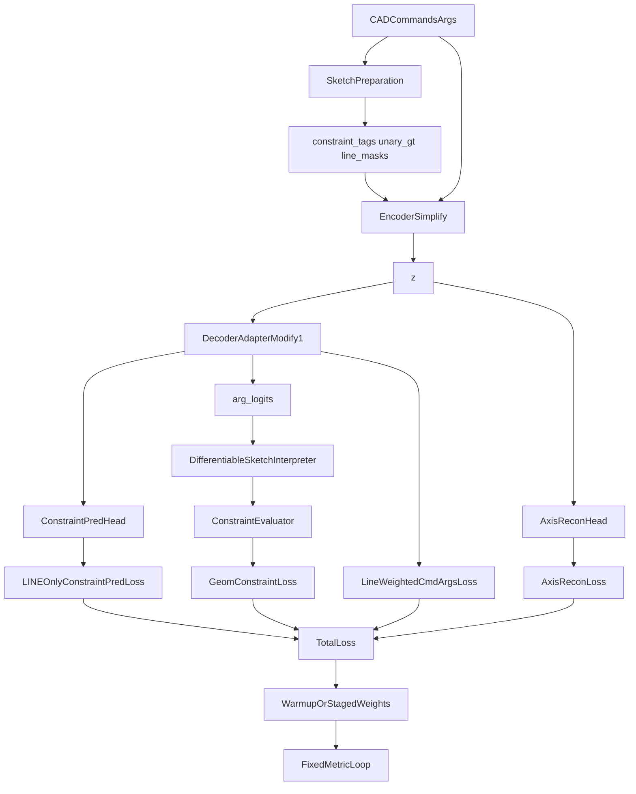

# Constraint-Fused DeepCAD Simplify Modify1 Low Risk DDD技术方案

本文档面向 `constraint_fused_deepcad_simplify_modify1` 的 **Low Risk 增量优化版**。它不是重新设计一套新的约束模型，也不是立即引入 pair-level 约束、结构对齐损失或推理期硬约束，而是在 **保留 Modify1 整体架构不变** 的前提下，优先修复训练监督与最终评估指标之间的错位问题。

Low Risk 方案回答的核心问题是：

> 当 `modify1` 已经拥有 `ConstraintPredHead`、`AxisReconHead` 与 `DifferentiableSketchInterpreter + ConstraintEvaluator` 三条辅助监督链路后，能否通过更准确的 mask、更加聚焦的 line 重建权重，以及更稳妥的训练调度，让这些监督真正转化为 `R_h`、`R_v` 的改进？

本文档遵循项目 `.cursor/rules/TechnicalProposal.mdc`：包含 **方案目标**、**整体架构**、**每个模块架构**（模块作用、模块原理、代码、举例说明）与 **总结**。文档定位为 `4_constraint_fused_deepcad_simplify_modify1_low_risk` 的唯一设计基线。

<!-- markdownlint-disable MD024 -->

---

## 1. 方案目标

### 1.1 业务目标

基于当前实验结果，可以观察到 `modify1` 相比原始 DeepCAD 在 H/V 指标上仅有小幅提升，而相比 `constraint_fused_deepcad_simplify` 的增益更加有限。问题并不完全在于“约束模块不工作”，而在于：

1. 新增监督大多是训练态的软正则，推理时并不会直接参与 `out_vec` 的生成。
2. `R_h`、`R_v` 统计的是离散重建后的最终几何，而辅助损失更多作用于 GT 槽位和 soft 几何。
3. 多任务损失同时存在时，若权重和 mask 不精确，辅助监督可能无法有效作用到真正决定 H/V 指标的 `LINE` 命令与 line 参数。

因此，Low Risk 方案的业务目标是：

> 在不改变 `modify1` 整体模块边界的前提下，优先增强现有监督对最终 H/V 指标的针对性，使这条路线成为一个低风险、易验证、可快速迭代的工程方案。

### 1.2 技术目标

| 目标 | 说明 | 验收方式 |
| --- | --- | --- |
| 保持架构稳定 | 不新增新的大模块，不改整体 encoder/decoder 主干 | 目录结构与主要类名保持稳定 |
| 约束预测只聚焦 `LINE` | `constraint_pred_loss` 只在真实 `LINE` token 上计算 | `loss_composer.py` 与 `train_use_case.py` 对齐 |
| 强化 line 相关主任务 | 对 `LINE` 命令与 line 参数给予更高 CE 权重 | 重建 loss 对 H/V 更敏感 |
| 引入稳妥训练调度 | 避免 `pred_loss` / `geom_loss` 在训练早期压制 `cmd_loss` | 配置与训练流程支持 warmup / staged ramp |
| 固定评估闭环 | 每次实验都用统一口径观察 `R_h`、`R_v`、aligned recall | 评估脚本和实验记录固定化 |

### 1.3 非目标

以下内容明确 **不在 Low Risk 范围**：

1. 不引入 `Parallel`、`Perpendicular` pair-level 训练损失。
2. 不修改 `constraint_fused_deepcad_simplify_modify1` 的整体数据契约。
3. 不新增推理期 snapping / 投影式硬后处理。
4. 不恢复完整 `constraint_fused_deepcad` 的联合 token 编码或 decoder 约束记忆。
5. 不改变现有评估口径。

### 1.4 核心设计原则

1. **先修正监督对齐，再增加模型复杂度**。
2. **优先增强真正影响 `R_h` / `R_v` 的 line 位置与 line 参数**。
3. **辅助损失只做“加分项”，不能反客为主破坏重建主任务**。
4. **保持低风险、可灰度验证、可快速回退**。
5. **所有收益都要通过统一评估口径验证，而不是只看训练 loss**。

---

## 2. 整体架构

### 2.1 方案概览

Low Risk 方案延续 `modify1` 当前四个限界上下文，但只对其中的训练与损失编排做增量优化：

| 限界上下文 | 当前 Modify1 | Low Risk 方案 |
| --- | --- | --- |
| `Sketch Preparation Context` | 输出 `constraint_tags`、`unary_gt`、`line_cmd_mask`、`line_index_map` | 保持不变 |
| `Encoding Context` | `AxisTagEmbedding + EncoderSimplify + Bottleneck` | 保持不变 |
| `Generation Context` | `DecoderAdapter + ConstraintPredHead + AxisReconHead` | 保持不变 |
| `Training Orchestration Context` | `cmd_loss + alpha*pred_loss + beta*axis_loss + gamma*geom_loss` | 只改 mask、权重和训练调度，不加新主干 |

### 2.2 核心信息流



### 2.3 信息流说明

```text
DeepCAD cad_vec / JSON
        │
        ▼
[Sketch Preparation]
提取 H/V + LINE mask + line index map
        │
        ├──► constraint_tags  (S, 2)
        ├──► unary_gt         (L, 2)
        └──► line_cmd_mask    (S,)
        │
        ▼
[Encoding]
CADEmbedding + AxisTagEmbedding + EncoderSimplify + Bottleneck
        │
        ▼
latent z
        │
        ├──► DecoderAdapterModify1 → command_logits / args_logits / hidden_states
        ├──► AxisReconHead(z) → unary_pred
        └──► hidden_states → ConstraintPredHead → constraint_pred_logits
                               args_logits → DifferentiableSketchInterpreter → ConstraintEvaluator
        │
        ▼
[Low Risk 训练编排]
1. constraint_pred_loss 只在 LINE 位置计算
2. cmd_loss / args_loss 对 LINE 位置加权
3. alpha / gamma 采用 warmup 或 staged ramp
4. 每轮固定评估 R_h / R_v / aligned recall
```

### 2.4 与当前 Modify1 的差异

| 维度 | 当前 Modify1 | Low Risk |
| --- | --- | --- |
| `ConstraintPredHead` | 已存在 | 保持不变 |
| `DifferentiableSketchInterpreter` | 已存在 | 保持不变 |
| `ConstraintEvaluator` | 已存在 | 保持不变 |
| `constraint_pred_loss` mask | 非 padding 位置 | 仅 `LINE` 位置 |
| `cmd_loss` / `args_loss` | 默认统一权重 | `LINE` 位置增强 |
| loss 调度 | 固定 `alpha/beta/gamma` | 支持 warmup / staged ramp |
| 实验闭环 | 手动评估为主 | 固定指标回路与记录模板 |

### 2.5 目标目录结构

Low Risk 方案不新建训练包，只在现有 `constraint_fused_deepcad_simplify_modify1` 中做轻量增强：

```text
constraint_fused_deepcad_simplify_modify1/
├─ application/
│  ├─ train_use_case.py                 # 调整 CommandCadLoss 与总损失输入
│  ├─ loss_composer.py                  # 调整 constraint_pred_loss 有效 mask
│  ├─ evaluate_axis_constraints.py      # 作为固定评估口径基线
│  ├─ differentiable_sketch_interpreter.py
│  └─ geometry_constraint.py
├─ generation/
│  ├─ decoder_adapter.py
│  ├─ constraint_pred_head.py
│  └─ axis_recon_head.py
├─ config/
│  └─ config_constraint_fused_simplify_modify1.py
└─ train.py                             # 引入更稳妥的训练调度与日志口径
```

---

## 3. 模块架构

### 3.1 模块：`application/loss_composer.py` 的 LINE-only `constraint_pred_loss`

#### 模块作用

让 decoder 侧约束预测只在真正对应 `LINE` 命令的位置上学习，减少非线命令位置的大量零标签对监督信号的稀释。

#### 模块原理

当前 `constraint_pred_loss` 的有效位置主要由 `cmd_padding_mask` 决定，这意味着：

1. 所有非 padding token 都会参与 BCE。
2. 其中大量 `EXT`、`EOS`、其他命令的位置目标都是 `[0, 0]`。
3. 模型容易学成“多数位置预测零即可”，而不是重点学会哪条线该水平 / 竖直。

Low Risk 方案将 mask 扩展为：

```text
valid_mask = (~cmd_padding_mask) AND line_cmd_mask
```

从而让 `constraint_pred_loss` 只在真实 `LINE` 位置计算。

#### 代码

```python
def constraint_pred_loss(
    logits,
    targets,
    cmd_padding_mask,
    line_cmd_mask,
):
    valid = ((~cmd_padding_mask) & line_cmd_mask).unsqueeze(-1).float()
    logits = logits * valid
    targets = targets * valid
    return bce_with_logits(logits, targets) / (valid.sum() * logits.size(-1) + 1e-6)
```

#### 举例说明

假设一条序列长度为 8，其中只有位置 1 和位置 4 是 `LINE`，其余位置为 `EXT`、`EOS`。

1. 当前做法会在 8 个位置上都算 BCE。
2. Low Risk 做法只会在位置 1 和位置 4 上算 BCE。
3. 这样 decoder 隐状态的监督就真正集中到“哪条线该 H / V”，而不是被大量零标签平摊。

---

### 3.2 模块：`application/train_use_case.py` 中的 LINE 加权 `CommandCadLoss`

#### 模块作用

强化真正决定 `R_h`、`R_v` 的 line 相关重建项，使主任务本身更加关注 line 命令与 line 参数。

#### 模块原理

`R_h`、`R_v` 的最终统计来自离散重建后的几何解析，因此最直接的影响因素是：

1. 线是否被正确解码为 `LINE` 命令。
2. 线的四个关键坐标参数是否接近真实值。

相比之下，某些非线命令即使有误差，对 H/V 指标影响也更间接。  
因此 Low Risk 方案在 `CommandCadLoss` 中增加 line-aware weighting，例如：

1. `LINE` 命令位置的 `loss_cmd` 乘以更高权重。
2. line 参数对应的 `loss_args` 乘以更高权重。
3. 非线命令仍保留监督，但不再与 line 位置完全同权。

#### 代码

```python
line_mask = (tgt_commands == LINE_IDX)
cmd_weight = torch.where(line_mask, line_cmd_weight, 1.0)
args_weight = torch.where(arg_line_mask, line_args_weight, 1.0)

loss_cmd = weighted_cross_entropy(command_logits, tgt_commands, cmd_weight)
loss_args = weighted_cross_entropy(args_logits, tgt_args, args_weight)
```

#### 举例说明

若某个样本中 `LINE` 的 4 个坐标 bin 预测偏移，即便 `AxisReconHead` 和 `ConstraintPredHead` 判断“这条线应该水平”，最终解析后的方向仍可能不是水平。  
因此，把更多主任务梯度压在 line 参数上，通常比继续增加 latent 辅助头更直接。

---

### 3.3 模块：`config/config_constraint_fused_simplify_modify1.py` 与 `train.py` 的损失调度

#### 模块作用

避免 `pred_loss` 与 `geom_loss` 在训练早期过早干扰主重建任务，让模型先学会“把 CAD 基本画对”，再逐步增强 H/V 监督。

#### 模块原理

当前总损失为：

```text
L_total = L_cmd + alpha * L_constraint_pred + beta * L_axis_recon + gamma * L_geom_constraint
```

固定权重的潜在问题是：

1. 训练前期 decoder 还不稳定时，`geom_loss` 的 soft 几何残差可能噪声较大。
2. `pred_loss` 也可能在隐状态尚未形成稳定语义时过早施压。
3. 结果是辅助损失抢走优化资源，却未必转化成更好的最终重建。

Low Risk 方案建议：

1. 前期主要优化 `cmd_loss` 与 `axis_loss`。
2. 中后期再逐步抬升 `alpha` 与 `gamma`。
3. 支持 warmup / staged ramp，而不是一次性彻底改总损失结构。

#### 代码

```python
if global_step < warmup_steps:
    alpha_eff = 0.0
    gamma_eff = 0.0
else:
    alpha_eff = alpha
    gamma_eff = gamma
```

或：

```python
alpha_eff = alpha * min(global_step / alpha_warmup_steps, 1.0)
gamma_eff = gamma * min(global_step / gamma_warmup_steps, 1.0)
```

#### 举例说明

如果训练前 10% step 只强调重建主链路，模型会先学会“线要画出来、位置大致正确”；之后再逐步加强 H/V 约束监督，通常比一开始就强压几何辅助项更稳定。

---

### 3.4 模块：统一评估闭环与实验记录

#### 模块作用

确保 Low Risk 方案的好坏由统一口径的 `R_h`、`R_v` 和 aligned recall 判断，而不是只看训练时的 `loss` 曲线。

#### 模块原理

当前 `evaluate_axis_constraints.py` 已经提供了统一评估入口，因此 Low Risk 方案不改评估逻辑，而是固定评估流程：

1. 固定 `angle_thresh=0.1` 为主对比口径。
2. 固定使用同一测试集与同一路径下的 `reconstruction/*_vec.h5`。
3. 每轮实验至少记录：
   - `R_h`
   - `R_v`
   - `parallel_recall_index_aligned`
   - `perpendicular_recall_index_aligned`
   - `n_parse_fail_pred`
4. 与当前 `modify1` 基线进行一对一对比。

#### 代码

```python
python -m constraint_fused_deepcad_simplify_modify1.reconstruct ...
python -m constraint_fused_deepcad_simplify_modify1.evaluate \
  --skip_reconstruct \
  --reconstruction_dir "constraint_fused_deepcad_simplify_modify1/reconstruction" \
  --angle_thresh 0.1
```

#### 举例说明

若某次改动让：

1. `axis_loss` 下降
2. `pred_loss` 下降
3. 但 `R_h`、`R_v` 没变

则说明这次改动只提升了辅助头一致性，没有提升最终几何指标，应该尽早终止该方向，而不是继续堆更多辅助模块。

---

## 4. 实施顺序

### 4.1 Phase 0：范围冻结

1. 保持 `modify1` 的主干模块不变。
2. 只允许修改 loss、mask、权重、调度和实验记录流程。
3. 不引入新的 pair-level 监督与推理后处理。

### 4.2 Phase 1：监督对齐

1. 先实现 `LINE-only constraint_pred_loss`。
2. 确保 `train_use_case.py` 正确传递 `line_cmd_mask`。
3. 补充单元测试，验证 mask 只在 `LINE` 位置生效。

### 4.3 Phase 2：主任务加权

1. 在 `CommandCadLoss` 中对 `LINE` 命令和 line 参数加权。
2. 增加可配置超参，例如 `line_cmd_weight`、`line_args_weight`。
3. 保持默认值可回退到当前行为。

### 4.4 Phase 3：调度与日志

1. 为 `alpha`、`gamma` 增加 warmup 或 staged ramp。
2. 在训练日志中显式记录有效权重与评估结果。
3. 固化每轮实验的指标模板。

### 4.5 Phase 4：统一对比评估

1. 固定 `angle_thresh=0.1` 做主对比。
2. 用同一 checkpoint 命名规则记录结果。
3. 若 `R_h`、`R_v` 增益仍然很小，再进入下一阶段的中风险方案。

---

## 5. 风险、权衡与验收标准

### 5.1 风险

1. 若 `LINE` 加权过大，可能牺牲非线命令质量，影响整体重建结构。
2. 若 `alpha/gamma` warmup 设计不当，后期仍可能出现多任务竞争。
3. 若实验记录不规范，难以判断收益来自 mask、权重还是训练随机性。

### 5.2 权衡

| 方案 | 优点 | 代价 |
| --- | --- | --- |
| 只做 Low Risk 增量 | 改动小、易验证、易回退 | 提升幅度可能有限 |
| 直接做中风险方案 | 理论上可能更强 | 实现复杂、变量更多 |

### 5.3 验收标准

1. 单元测试通过，且新逻辑不破坏现有 `modify1` 训练闭环。
2. 至少完成 1 组统一口径对比实验。
3. 相比当前 `modify1` 基线，`R_h` 与 `R_v` 至少有一项稳定提升。
4. 若增益不显著，必须给出“进入中风险方案”或“停止该路线”的明确结论。

---

## 6. 总结

Low Risk 方案的核心不是新增更多模块，而是让现有 `modify1` 的三条辅助监督链路更准确地作用到真正决定 H/V 指标的 line 位置与 line 参数上。

这条路线的价值在于：

1. 低风险
2. 可快速实施
3. 可快速回退
4. 可以明确判断“现有架构是否还有增量空间”

如果 Low Risk 方案实施后，`R_h`、`R_v` 仍然没有明显改善，那么结论也会更清晰：

> 问题不在于 mask、权重与调度，而在于当前 `modify1` 的监督形式本身仍然过于软，需要进入下一阶段的中风险结构改造，例如 pair-level 几何约束和更强的结构对齐损失。
