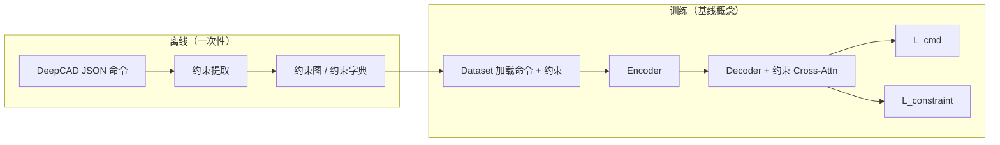

# Constraint-Fused DeepCAD Simplify Modify2 详细设计（DDD 版）

本文档以《[Constraint-Fused DeepCAD 技术方案](./Constraint-Fused%20DeepCAD%20技术方案.md)》与 `论文尝试/约束感知生成/2_constraint_fused_deepcad/Constraint-Fused DeepCAD DDD技术方案.md` 为唯一技术事实来源，在同一目标、同一限界上下文、同一模块边界下，按领域驱动设计（DDD, Domain-Driven Design）重组为可落地的详细设计：限界上下文、领域模型、应用服务、基础设施与训练/推理用例。撰写口径对齐项目 `.cursor/rules/TechnicalProposal.mdc`（方案目标、整体架构、模块含作用/原理/代码/举例、总结）。

**与原始 Constraint-Fused DeepCAD 的关系**：本方案完整继承原始 Fused 方案的编码器侧约束融合、约束感知 latent、可选 decoder 侧 Cross-Attn、latent-only 推理、约束重建辅助监督、可微几何闭环与评估口径。唯一业务差异为：**将 2D 草图约束范围从五类收敛为四类，系统移除 `Collinear`，仅保留 `Horizontal`、`Vertical`、`Parallel`、`Perpendicular`。**

<!-- markdownlint-disable MD024 -->

---

## 1. 方案目标

### 1.1 业务问题与技术问题

当前 DeepCAD 及其常见 Constraint-Aware 变体存在一个根本问题：**约束主要在解码阶段注入，而不在编码阶段进入瓶颈表示**。这导致系统表面上“知道约束”，但真正可复用的 latent code 并不稳定地携带约束语义。

其直接后果如下：

1. **隐空间生成不可控**：Latent GAN 只学习 \(z\) 的分布，若 \(z\) 中缺少约束信息，则采样生成无法继承几何关系。
2. **训练与推理路径割裂**：训练依赖外部约束 \(C\)，推理却常常只依赖 \(z\)，二者的信息路径不一致。
3. **监督难以闭环**：解码器被要求“服从约束”，但编码器未被要求“理解约束”，监督无法有效压回瓶颈层。
4. **系统难以扩展**：约束相关逻辑常散落在数据脚本、embedding、decoder 和 loss 中，缺少统一领域抽象，工程维护成本高。

在原始 Fused 方案中，草图约束定义包含五类关系：水平、竖直、平行、垂直、共线。经过约束提取与训练信号分析后，本方案认为 `Collinear` 相比其他四类关系更容易受到阈值与位置扰动影响，既会放大提取噪声，也会提高 pair 监督的歧义度。因此在不改变 Fused 主干的前提下，需形成一版**仅在约束贡献范围上收敛**的新设计。

### 1.2 设计目标

| 目标 | 说明 | 验收标准 |
| --- | --- | --- |
| 约束感知隐空间 | 使 \(z\) 同时压缩命令几何与约束关系 | 仅输入 \(z\) 时仍具备较稳定约束满足率 |
| 训练推理一致性 | 推理不以外部约束序列 \(C\) 为必需输入 | Latent GAN 路径不调用 constraint encoder |
| DDD 分层清晰 | 领域逻辑、编排逻辑、基础设施隔离 | 代码目录与接口职责明确，不跨层耦合 |
| 兼容现有 DeepCAD | 保持命令格式、数据格式与主训练框架可渐进迁移 | 原训练脚本可分阶段接入 |
| 可观测可验证 | 对约束提取、融合、重建、解码全过程可单测与评估 | 每个关键模块均有输入/输出契约与指标 |

### 1.3 核心设计原则

1. **约束进入编码器，而不是只进入解码器**。
2. **领域模型先行，神经网络模块是领域对象的实现细节**。
3. **训练编排与模型领域逻辑解耦**，避免把业务流程硬编码进 `forward()`。
4. **保持 DeepCAD 命令语义稳定**，约束融合以增强为主，不推翻原格式。
5. **推理路径以 latent-only 为主路径**，任何外部约束访问都只能是可选增强。
6. **仅在约束范围上做减法**：删除 `Collinear`，其余架构、信息流、职责边界与原始 Fused 方案一致。

### 1.4 约束类型范围（2D 草图，与基线一致）

本方案沿用原始 Fused 方案的 2D 草图约束建模方式，但将真实约束类型从五类收敛为四类（用于提取器、tag 与 token 类型 id）：

| 中文 | 英文 |
| --- | --- |
| 水平 | Horizontal |
| 竖直 | Vertical |
| 平行 | Parallel |
| 垂直 | Perpendicular |

说明：

1. `Collinear` 不再属于真实约束类型。
2. token 级词表仍保留一个 `NONE/PAD`，仅用于 padding / 占位。
3. unary 约束为 `Horizontal`、`Vertical`。
4. pair 约束为 `Parallel`、`Perpendicular`。

### 1.5 继承自 Constraint-Aware 的基线目标（仍适用于本方案数据与评估）

以下四条在 Fused 方案中**仍然成立**，仅约束范围由“五类”收敛为“四类”：

1. **数据与标注**：完全复用 DeepCAD 官方 JSON 命令数据；约束由几何自动推导，**不引入新标注、不另建数据集**。
2. **表示与模型（命令侧）**：保持 DeepCAD 命令 token 表示不变；在基线中约束经嵌入 + 解码器交叉注意力 + 可选预测头最小侵入接入；本方案在此基础上增加编码器侧融合与 \(z\) 侧重建。
3. **优化目标**：总损失在命令预测损失基础上叠加约束相关项，使生成分布在统计意义上更贴近训练集中由几何导出的约束结构。
4. **评估与落地**：可计算水平、竖直、平行、垂直等满足率，并结合 Chamfer/Hausdorff、拓扑合法性等指标，与原版流程对齐。

---

## 2. DDD 视角下的整体架构

### 2.1 限界上下文划分

本方案将系统拆分为 4 个核心限界上下文（Bounded Context）：

| 限界上下文 | 职责 | 典型模块 |
| --- | --- | --- |
| `Sketch Preparation Context` | 从 CAD 序列和约束字典中提取领域对象 | `constraint_extractor.py`, `constraint_tokenizer.py` |
| `Constraint-Fused Encoding Context` | 将命令与约束联合编码为约束感知 latent | `constraint_tag_embedding.py`, `constraint_token_encoder.py`, `encoder_fused.py` |
| `Generation Context` | 基于 \(z\) 重建或生成 CAD 命令序列 | `decoder`, `bottleneck`, `latent generator` |
| `Training Orchestration Context` | 组织训练、评估、日志、配置与实验生命周期 | `train.py`, `trainer/`, `evaluate/` |

这样划分的原因是：**数据准备、领域建模、生成推理、训练编排**在概念与变化频率上不同，强行混写会导致模型演进时频繁牵连整个系统。

### 2.2 上下文映射（Context Map）

```text
Sketch Preparation Context
        │ 输出：SketchSequenceAggregate / ConstraintGraph / TrainingBatch
        ▼
Constraint-Fused Encoding Context
        │ 输出：ConstraintAwareLatent
        ▼
Generation Context
        │ 输出：DecodedCadSequence / ConstraintPrediction
        ▼
Training Orchestration Context
        │ 负责 loss 组合、反向传播、评估、日志、checkpoint
        └───────────────────────────────────────────────┐
                                                        │
                     评估反馈、实验配置、指标回写 ────────┘
```

上下文协作规则如下：

1. `Sketch Preparation Context` 不关心模型结构，只负责构造干净、可消费的领域数据。
2. `Constraint-Fused Encoding Context` 不直接负责训练步骤，只负责“如何把命令与约束转成 \(z\)”。
3. `Generation Context` 只消费 `ConstraintAwareLatent`，不依赖约束字典原始格式。
4. `Training Orchestration Context` 只编排，不承担具体的领域计算细节。

### 2.3 分层架构

每个上下文内部统一采用 DDD 常见四层：

| 层级 | 责任 | 在本方案中的体现 |
| --- | --- | --- |
| `Domain Layer` | 领域对象、领域服务、领域规则 | 约束图、命令序列、融合规则、约束重建规则 |
| `Application Layer` | 用例编排、事务边界、流程控制 | 训练一个 batch、推理一个 latent、评估一个样本 |
| `Infrastructure Layer` | 数据加载、配置、日志、模型持久化 | dataset、repo、checkpoint、tensorboard |
| `Interface Layer` | 对外输入输出、脚本入口 | `train.py`, `evaluate/*.py`, 配置文件 |

### 2.4 核心信息流

```text
CAD cmds/args + constraint dict
        │
        ▼
[Preparation Context]
ConstraintExtractor
ConstraintTokenizer
TrainingBatchAssembler
        │
        ▼
[Encoding Context]
CADEmbeddingFused
ConstraintTokenEncoder
JointTransformerEncoder
ConstraintAwarePooling
Bottleneck（与 DeepCAD 对齐，建议与 Encoder 解耦调用）
        │
        ▼
ConstraintAwareLatent z
        │
        ├──────────────► [Generation Context] Decoder → CAD Sequence
        │
        └──────────────► [Constraint Reconstruction] unary/pair heads
        │
        ▼
[Training Orchestration Context]
LossComposer + Trainer + Evaluator
```

### 2.4.1 与主技术方案一致的信息流（编码器约束融合）

下列框图与《Constraint-Fused DeepCAD 技术方案》对齐，强调 **约束在嵌入层与编码器联合序列即参与计算**，\(z\) 聚合命令与约束 token；解码器侧 Cross-Attn 为**可选增强**。

```text
                    ┌──────────────────────────────────────┐
                    │            Encoder（约束融合）           │
  CAD cmds/args ──► │ CADEmbedding + constraint_tags         │
  constraint dict ─►│ + ConstraintTokenEncoder + SegmentEmb  │
                    │        Self-Attn ×L（联合序列）         │
                    │        Constraint-Aware Pooling        │
                    │              Bottleneck                │
                    └─────────────────┬────────────────────┘
                                      z（约束感知）
                                      │
                    ┌─────────────────▼────────────────────┐
                    │  Decoder（与 DeepCAD 同构或可增强）      │
                    │  Self-Attn → Global-Inject(z) → FFN    │
                    │  （可选）Cross-Attn(C)，推理时可关闭       │
                    └─────────────────┬────────────────────┘
                                      │
              Cmd/Arg Head +（可选）Constraint Pred Head
```

### 2.4.2 基线 Constraint-Aware：数据与训练管线（复用前半段）

本方案**复用**「JSON → 提取 → 约束字典 / 约束 token」；差异在于 Encoder 内融合与 \(z\) 重建，Decoder 对 \(C\) 的依赖降为可选。同时，本方案在约束集合上只保留四类关系。



### 2.5 DATA SHAPES

| 符号 | 含义 | 典型形状 |
| --- | --- | --- |
| \(S\) | 命令序列长度 | `(S, N)` |
| \(N\) | batch size | `scalar` |
| \(T_c\) | 约束 token 数 | `(T_c, N)` |
| `d_model` | 模型通道数 | `256` |
| `constraint_tags` | 命令级约束标记 | `(S, N, 4)` |
| `E_cmd` | 命令 embedding | `(S, N, d_model)` |
| `E_con` | 约束 token embedding | `(T_c, N, d_model)` |
| `E_joint` | 联合序列 embedding | `(S + T_c, N, d_model)` |
| `mask_joint` | 联合 padding mask | `(N, S + T_c)` |
| `memory` | 编码器输出 | `(S + T_c, N, d_model)` |
| \(z\) | 约束感知 latent | `(1, N, d_model)` |
| `unary_gt` | 一元约束真值 | `(N, max_lines, 2)` |
| `pair_gt` | 二元约束真值 | `(N, max_lines, max_lines, 2)` |

### 2.6 与原方案差异

| 维度 | 原始 Constraint-Fused DeepCAD | 本方案 |
| --- | --- | --- |
| 真实约束类型数 | 5 | 4 |
| `constraint_tags` 维度 | 5 | 4 |
| token 真实类型数 | 5 | 4 |
| token 词表总数 | 6（含 `NONE/PAD`） | 5（含 `NONE/PAD`） |
| `pair_gt / pair_pred` 维度 | 3（平行/垂直/共线） | 2（平行/垂直） |
| 几何残差类型 | 含共线 | 不含共线 |
| 评估约束满足率 | H / V / 平行 / 垂直 / 共线 | H / V / 平行 / 垂直 |

### 2.7 与原 Constraint-Aware 思路对比（摘要）

| 维度 | 原 Constraint-Aware 思路 | Constraint-Fused（本文） |
| --- | --- | --- |
| 约束主注入位置 | 解码器 Cross-Attn | 编码器 Embedding + 联合 Self-Attn |
| \(z\) 是否含约束 | 否 | 是 |
| Latent GAN 推理 | 难依赖外部 \(C\) | 仅需 \(z\) |
| 解码器 | 常需 Cross-Attn | 可保持原版；Cross-Attn **可选** |

---

## 3. 领域模型设计

### 3.1 聚合根：`SketchSequenceAggregate`

#### 模块作用

作为核心聚合根，统一管理一个样本中的命令序列、约束关系、命令级标记、约束 token、重建标签以及掩码信息，确保训练和推理看到的是**同一个领域对象**的不同视图。

#### 模块原理

聚合根封装以下不变量：

1. 命令序列与线段索引映射必须一致。
2. 每个 `ConstraintRelation` 引用的线段索引必须落在 `max_lines` 范围内。
3. `constraint_tags` 必须可由 `ConstraintGraph` 推导得到，而不是自由构造。
4. `constraint_tokens`、`unary_gt`、`pair_gt` 必须与同一约束图保持一致。
5. `pair_gt` 的最后一维固定为 2，只表示 `Parallel / Perpendicular`。

#### 代码

```python
from dataclasses import dataclass
from typing import List, Optional


@dataclass
class CadCommand:
    command_id: int
    args: List[int]
    group_id: Optional[int]
    line_ref: Optional[int] = None


@dataclass
class ConstraintRelation:
    type_id: int
    line_a: int
    line_b: int


@dataclass
class SketchSequenceAggregate:
    commands: List[CadCommand]
    constraints: List[ConstraintRelation]
    constraint_tags: "Tensor"
    constraint_tokens: "Tensor"
    unary_gt: "Tensor"
    pair_gt: "Tensor"

    def validate(self, max_lines: int) -> None:
        assert self.constraint_tags.shape[-1] == 4
        assert self.unary_gt.shape[-1] == 2
        assert self.pair_gt.shape[-1] == 2
        for rel in self.constraints:
            assert 0 <= rel.line_a < max_lines
            assert 0 <= rel.line_b < max_lines
```

#### 举例说明

一个样本包含 40 条命令，其中第 2、5、7 条命令各对应一条线段；约束字典中存在 `PARALLEL(0, 2)`。则该约束既会体现在 `constraints` 中，也会被投影为命令级 `constraint_tags`，并进一步衍生出 `constraint_tokens` 与 `pair_gt`。训练时不应分别从多个脚本“重复推导”这些结果，而应由聚合统一持有。

### 3.2 实体：`CadCommand`

#### 模块作用

表达一条 CAD 命令及其参数，是整个系统最基础的领域实体，也是与原 DeepCAD 格式兼容的核心载体。

#### 模块原理

`CadCommand` 不是普通 token，它携带三个层面的信息：

1. **语法语义**：命令类型与参数。
2. **几何语义**：是否对应草图线段或轮廓元素。
3. **约束锚点语义**：是否可被约束关系引用。

#### 代码

```python
@dataclass
class CadCommand:
    command_id: int
    args: List[int]
    group_id: Optional[int] = None
    line_ref: Optional[int] = None

    @property
    def is_line_command(self) -> bool:
        return self.line_ref is not None
```

#### 举例说明

`LINE(start_x, start_y, end_x, end_y)` 可映射为 `line_ref=3`，表示它在该样本的线段索引空间中编号为 3。后续 `PARALLEL(3, 8)`、`VERTICAL(3)` 等约束都通过这个锚点与命令实体关联。

### 3.3 实体：`ConstraintRelation`

#### 模块作用

统一表达一元与二元约束，是约束图中的基本边或节点属性，用于驱动 tag 构造、token 编码和重建监督。

#### 模块原理

约束关系可分为两类：

1. **Unary 约束**：如水平、竖直，可视为线段节点属性。
2. **Pair 约束**：如平行、垂直，可视为线段节点之间的边。

当前详细设计中，真实约束类型共 4 类：`HORIZONTAL`、`VERTICAL`、`PARALLEL`、`PERPENDICULAR`。此外保留一个 `NONE` 类型，仅用于约束 token 的 padding / 占位，不参与命令级 `ConstraintTagVector` 的四维定义。

#### 代码

```python
class ConstraintType:
    HORIZONTAL = 0
    VERTICAL = 1
    PARALLEL = 2
    PERPENDICULAR = 3
    NONE = 4


@dataclass
class ConstraintRelation:
    type_id: int
    line_a: int
    line_b: int = 0

    def is_unary(self) -> bool:
        return self.type_id in {ConstraintType.HORIZONTAL, ConstraintType.VERTICAL}
```

#### 举例说明

`VERTICAL(线3)` 在实现上可表示为 `ConstraintRelation(type_id=1, line_a=3, line_b=3)`，这样 token 编码、padding 与 pair/unary 映射逻辑能够统一处理，而不需要为 unary 和 pair 维护两套完全不同的数据通道。

### 3.4 值对象：`ConstraintTagVector`、`ConstraintAwareLatent`

#### 模块作用

值对象不强调身份，强调语义稳定性。这里用它们表达“命令是否参与某类约束”和“已经携带约束语义的 latent code”。

#### 模块原理

1. `ConstraintTagVector` 是命令级弱约束表示，重点是告诉 embedding 该命令处于什么约束语境中。
2. `ConstraintAwareLatent` 是聚合后的强约束表示，重点是为解码与采样提供统一输入。

其中 `ConstraintTagVector` 固定为 **4 维真实约束语义**；token 级约束词表则为 **4 类真实约束 + 1 类 `NONE/PAD`**，二者职责不同，不混用。

#### 代码

```python
@dataclass(frozen=True)
class ConstraintTagVector:
    horizontal: int
    vertical: int
    parallel: int
    perpendicular: int


@dataclass(frozen=True)
class ConstraintAwareLatent:
    tensor: "Tensor"  # (1, N, d_model)
```

#### 举例说明

命令 3 若同时参与水平与平行关系，则其 tag 可表达为 `[1, 0, 1, 0]`。经过联合编码与池化后，该局部信息会演化为全局 latent 中的一部分，成为 `ConstraintAwareLatent`。

### 3.5 领域服务：`ConstraintFusionDomainService`

#### 模块作用

定义“命令流 + 约束流如何融合”的核心业务规则，是本方案最重要的领域服务之一。

#### 模块原理

该服务不关心训练循环，只关心一件事：如何把 **DataLoader 产出的张量 batch**（或与 `SketchSequenceAggregate` 等价的 collate 视图）转成约束感知表示。其步骤包括：

1. 构造命令 embedding。
2. 构造命令级约束 tag embedding。
3. 构造约束 token embedding。
4. 拼接联合序列并加 segment embedding。
5. 通过 joint transformer 编码。
6. 先以 `ConstraintAwarePooling` 聚合得到 `z_pre`。
7. 再经 `BottleneckAdapter` 得到与 decoder 兼容的 `ConstraintAwareLatent`。

#### 代码

```python
class ConstraintFusionDomainService:
    def __init__(self, encoder_fused, bottleneck):
        self.encoder_fused = encoder_fused
        self.bottleneck = bottleneck

    def fuse(self, batch_tensors):
        z_pre = self.encoder_fused(**batch_tensors)
        z = self.bottleneck(z_pre)
        return ConstraintAwareLatent(z)
```

#### 举例说明

对同一个样本，如果不启用 `ConstraintFusionDomainService`，则命令与约束仅在 decoder 中相遇；启用后，它们在 encoder 阶段就被统一放入同一个注意力空间，最终约束语义被吸收进 \(z\)。

### 3.6 领域服务：`ConstraintReconstructionDomainService`

#### 模块作用

负责从 \(z\) 重建约束图，并输出约束重建监督结果，用于保证瓶颈层确实保存了约束语义。

#### 模块原理

它将“约束是否被编码成功”从隐含假设变成显式任务。只要重建失败，梯度就会持续施压 encoder 与 bottleneck。

#### 代码

```python
class ConstraintReconstructionDomainService:
    def __init__(self, recon_head):
        self.recon_head = recon_head

    def reconstruct(self, latent):
        unary_pred, pair_pred = self.recon_head(latent.tensor.squeeze(0))
        return unary_pred, pair_pred
```

#### 举例说明

若样本中存在 `PERPENDICULAR(线2, 线5)`，但 `pair_pred[2,5,1]` 长期无法接近 1，则说明当前 \(z\) 没有稳定保存该关系，系统会通过 `L_constraint_recon` 强化编码器对该约束的表达。

### 3.7 仓储接口：`SketchRepository` 与 `ModelCheckpointRepository`

#### 模块作用

仓储用于屏蔽底层数据存取细节，使应用层不直接依赖文件结构、pickle、npz、checkpoint 命名规则等基础设施细节。

#### 模块原理

1. `SketchRepository` 输出 `SketchSequenceAggregate`。
2. `ModelCheckpointRepository` 管理权重版本、最优模型与恢复训练。

#### 代码

```python
class SketchRepository:
    def load(self, sample_id: str) -> SketchSequenceAggregate:
        raise NotImplementedError


class ModelCheckpointRepository:
    def save(self, epoch: int, state: dict) -> None:
        raise NotImplementedError

    def load_latest(self) -> dict:
        raise NotImplementedError
```

#### 举例说明

如果后续把数据来源从本地离线文件切换为 LMDB 或 parquet，应用层与领域层都不需要修改，只替换 `SketchRepository` 的基础设施实现即可。

---

## 4. 模块架构

以下模块均按“模块作用、模块原理、代码、举例说明”展开，并映射到 DDD 分层。

### 4.1 模块：离线约束提取与标准化（与主方案 §3.0 对齐）

#### 模块作用

位于 `Sketch Preparation Context`，从 DeepCAD **JSON 命令序列**解析几何实体（线段等），用统一数值阈值自动判定四类关系，输出**结构化约束字典**；再经 tokenizer / collate 转为 `ConstraintRelation`、`constraint_tags`、约束 token、`unary_gt` / `pair_gt` 及 mask。全程**无需人工标注**。本模块是相对 JSON 格式的**防腐层（Anti-Corruption Layer）**。

#### 模块原理

1. **输入**：单条样本的 DeepCAD 命令 JSON（与官方格式一致）。
2. **中间**：执行命令语义等价的几何构造，得到带 id 的线段及端点、方向向量。
3. **判定**：
   - **水平**：方向向量 \(z\) 分量近似为 0。
   - **竖直**：\(x、y\) 分量近似为 0。
   - **平行 / 垂直**：两线方向向量夹角与 \(0^\circ\) 或 \(90^\circ\) 比较。
4. **输出**：四类约束的列表或线对列表 → 映射为领域对象与张量标签。

翻译规则（collate 侧）：

1. 约束字典映射为 `ConstraintRelation` 列表。
2. 按 `line_ref` 将关系投影为命令级 `constraint_tags`（四维参与向量）。
3. 关系离散为约束 token 序列，供 Encoder 联合 Self-Attn。
4. 派生 `unary_gt` / `pair_gt` 供 `L_constraint_recon`。

#### 代码

```json
{
  "horizontal": [线ID列表],
  "vertical": [线ID列表],
  "parallel": [[线A, 线B], ...],
  "perpendicular": [[线A, 线B], ...]
}
```

```python
ANGLE_THRESH = 2.0
EPS = 1e-5


def angle_deg(u, v):
    cos_t = abs(dot(u, v)) / (norm(u) * norm(v) + 1e-12)
    cos_t = min(1.0, max(-1.0, cos_t))
    return math.degrees(math.acos(cos_t))


class ConstraintExtractor:
    def build_relations(self, raw_constraint_dict):
        relations = []
        for item in raw_constraint_dict:
            relations.append(
                ConstraintRelation(
                    type_id=item["type_id"],
                    line_a=item["line_a"],
                    line_b=item.get("line_b", item["line_a"]),
                )
            )
        return relations


class ConstraintBatchAssembler:
    def assemble(self, commands, relations, max_lines, max_constraints):
        constraint_tags = build_constraint_tags(commands, relations)
        constraint_tokens = build_constraint_tokens(relations, max_constraints)
        unary_gt, pair_gt = build_recon_targets(relations, max_lines)
        return SketchSequenceAggregate(
            commands=commands,
            constraints=relations,
            constraint_tags=constraint_tags,
            constraint_tokens=constraint_tokens,
            unary_gt=unary_gt,
            pair_gt=pair_gt,
        )
```

#### 举例说明

假设解析后有三条线：`L0` 沿 x 轴，`L1` 沿 y 轴，`L2` 与 `L0` 平行。则可能得到：`horizontal: [0, 2]`，`vertical: [1]`，`perpendicular: [[0, 1], [1, 2]]`，`parallel: [[0, 2]]`。该字典经 `constraint_tokenizer` / `collate` 转为 `constraint_tags`、`c_types/c_line_a/c_line_b` 及重建 GT。

### 4.2 模块：命令级约束标记嵌入

#### 模块作用

在命令 embedding 阶段注入局部约束先验，使模型从一开始就知道某条命令所处的约束语境。

#### 模块原理

每条命令对应一个四维参与向量 \(p_i \in \{0,1\}^4\)，通过 MLP 投影到 `d_model` 后，与原始命令 embedding 相加。

#### 代码

```python
class ConstraintTagEmbedding(nn.Module):
    def __init__(self, n_constraint_types=4, d_model=256):
        super().__init__()
        self.tag_proj = nn.Sequential(
            nn.Linear(n_constraint_types, d_model),
            nn.GELU(),
            nn.Linear(d_model, d_model),
        )

    def forward(self, constraint_tags):
        return self.tag_proj(constraint_tags)


class CADEmbeddingFused(nn.Module):
    def __init__(self, cfg):
        super().__init__()
        self.command_embed = nn.Embedding(cfg.n_commands, cfg.d_model)
        self.arg_embed = nn.Embedding(cfg.args_dim + 1, 64, padding_idx=0)
        self.embed_fcn = nn.Linear(64 * cfg.n_args, cfg.d_model)
        self.pos_encoding = PositionalEncodingLUT(cfg.d_model, max_len=cfg.max_len)
        self.use_group = cfg.use_group_emb
        if self.use_group:
            self.group_embed = nn.Embedding(cfg.group_len + 2, cfg.d_model)
        self.constraint_tag = ConstraintTagEmbedding(4, cfg.d_model)
```

#### 举例说明

如果命令 3 对应一条水平线，且它与命令 7 对应线段满足平行关系，那么命令 3 的 tag 可设为 `[1, 0, 1, 0]`。非线段命令则令 \(p_i = \mathbf{0}\)，避免引入虚假约束信号。

### 4.3 模块：约束 Token 编码与联合序列构造

#### 模块作用

把“约束是什么关系”显式编码为 token，使模型不仅知道一条线“有约束”，还知道“它和谁构成了何种关系”。

#### 模块原理

1. `type_embed` 编码约束类型。
2. `line_embed` 编码参与关系的线段索引。
3. `pair_fuse` 融合线对语义。
4. `segment_embed` 区分命令段与约束段。
5. 命令序列与约束序列在 encoder 入口拼接；`key_padding_mask` 覆盖命令 pad 与约束 pad。

`ConstraintTokenEncoder` 的 `n_types=5`：`HORIZONTAL=0, VERTICAL=1, PARALLEL=2, PERPENDICULAR=3, NONE=4`。`NONE/PAD` 仅用于定长 batch，不作为真实监督统计。

#### 代码

```python
class ConstraintTokenEncoder(nn.Module):
    def __init__(self, n_types=5, max_lines=64, d_model=256):
        super().__init__()
        self.type_embed = nn.Embedding(n_types, d_model)
        self.line_embed = nn.Embedding(max_lines, d_model // 2)
        self.pair_fuse = nn.Sequential(nn.Linear(d_model, d_model), nn.GELU())
        self.out_proj = nn.Linear(d_model, d_model)
        self.norm = nn.LayerNorm(d_model)

    def forward(self, c_types, c_line_a, c_line_b):
        e_type = self.type_embed(c_types)
        e_a = self.line_embed(c_line_a)
        e_b = self.line_embed(c_line_b)
        e_lines = self.pair_fuse(torch.cat([e_a, e_b], dim=-1))
        return self.norm(self.out_proj(e_type + e_lines))
```

#### 举例说明

样本中若同时存在 `PARALLEL(1,5)` 与 `PERPENDICULAR(2,5)`，则两个 constraint token 会在同一注意力空间中连接到命令 1、2、5；模型能够学习“线 5 是多个关系的共享节点”这一结构信息。

### 4.4 模块：融合编码器 `EncoderFused`

#### 模块作用

把命令 embedding（含 tag）、约束 token、segment embedding、联合 Self-Attention 与**池化**串联为单一编码路径，输出 `z_pre`（池化后、Bottleneck 前）。

#### 模块原理

`EncoderFused` 只承担 **Encoder 侧融合编码**，不承担 Bottleneck、Decoder 与损失。

#### 代码

```python
class EncoderFused(nn.Module):
    def __init__(self, cfg):
        super().__init__()
        self.embedding = CADEmbeddingFused(cfg)
        self.constraint_token_enc = ConstraintTokenEncoder(5, cfg.max_lines, cfg.d_model)
        self.segment_embed = SegmentEmbedding(cfg.d_model)
        self.encoder = TransformerEncoder(...)
```

#### 举例说明

样本 A 的 \(S=40, T_c=10\)，样本 B 的 \(S=25, T_c=32\)。`mask_joint` 分别屏蔽各自 padding，池化只对真实命令与真实约束 token 求平均，避免把 padding 当零约束“稀释”\(z\)。

### 4.5 模块：约束感知池化与 Bottleneck

#### 模块作用

将联合序列输出压缩为固定长度的全局表示，再经 Bottleneck 得到供解码器 Global-Inject 使用的 \(z\)。

#### 模块原理

推荐分两级：

1. **池化**：从 `memory` 与 `mask_joint` 得到 `z_pre`。
2. **BottleneckAdapter**：与现有 DeepCAD `Bottleneck` 一致，将 `z_pre` 映射为 decoder 期望的 `ConstraintAwareLatent`。

#### 代码

```python
class MaskedMeanPooling(nn.Module):
    def forward(self, memory, mask_joint):
        valid = (~mask_joint).transpose(0, 1).unsqueeze(-1).float()
        return (memory * valid).sum(dim=0, keepdim=True) / valid.sum(dim=0, keepdim=True).clamp(min=1e-6)


class BottleneckAdapter(nn.Module):
    def __init__(self, d_model):
        super().__init__()
        self.proj = nn.Sequential(
            nn.Linear(d_model, d_model),
            nn.Tanh(),
        )

    def forward(self, z):
        return self.proj(z)
```

#### 举例说明

当前主实现先采用 masked mean pooling，优先保证编码路径简单、稳定且与原始 DeepCAD 接口对齐；若实验发现约束 token 占比过高导致几何细节被抹平，再切换到双流门控策略做消融。

### 4.6 模块：约束重建头与辅助损失

#### 模块作用

从 \(z\) 反向恢复约束图，用辅助损失迫使瓶颈层真正编码约束，而不是只让 decoder 在局部路径上临时利用约束。

#### 模块原理

重建任务拆分为：

1. `UnaryReconHead`：预测每条线是否水平/竖直。
2. `PairReconHead`：预测线对之间是否平行/垂直。
3. `WeightedBCELoss`：解决稀疏标签不平衡问题。

#### 代码

```python
class ConstraintReconHead(nn.Module):
    def __init__(self, dim_z=256, max_lines=64):
        super().__init__()
        self.max_lines = max_lines
        self.unary_head = nn.Sequential(
            nn.Linear(dim_z, 256),
            nn.GELU(),
            nn.Linear(256, max_lines * 2),
        )
        self.pair_head = nn.Sequential(
            nn.Linear(dim_z, 512),
            nn.GELU(),
            nn.Linear(512, max_lines * max_lines * 2),
        )

    def forward(self, z):
        n = z.size(0)
        unary = self.unary_head(z).view(n, self.max_lines, 2)
        pair = self.pair_head(z).view(n, self.max_lines, self.max_lines, 2)
        return torch.sigmoid(unary), torch.sigmoid(pair)
```

#### 举例说明

若 `pair_gt[3,8,0]=1` 表示线 3 与线 8 平行，但模型始终无法在 `pair_pred[3,8,0]` 上给出高响应，那么训练将持续把这部分误差传回 encoder，使瓶颈不得不保留相关约束语义。

### 4.7 模块：解码器、可选约束 Cross-Attention 与约束预测头

#### 模块作用

在 \(z\) 已约束感知的前提下，解码器可**完全沿用 DeepCAD**；若需更强训练期监督，可**可选**加入对约束 memory \(C\) 的 Cross-Attn，**推理时必须不依赖 \(C\)**。同时可用约束预测头提供 `L_constraint_pred`。

#### 模块原理

1. **基础路径**：`linear_global(z)` 将约束语义注入每层解码器，推理只需 \(z\)。
2. **可选增强路径**：训练时以一定概率对约束序列做 Cross-Attn。
3. **辅助监督**：`ConstraintPredHead` 对 decoder 隐状态预测约束相关标签，与交叉注意力的隐式融合互补。

#### 代码（适配器：默认 latent-only，可选挂接 Cross-Attn）

```python
class ConstraintPredHead(nn.Module):
    def __init__(self, d_model, n_constraint_types=4):
        super().__init__()
        self.proj = nn.Linear(d_model, n_constraint_types)

    def forward(self, h_step):
        return self.proj(h_step)


class ConstraintAwareDecoderAdapter(nn.Module):
    def __init__(self, decoder, constraint_pred_head, optional_cross_attn=None):
        super().__init__()
        self.decoder = decoder
        self.constraint_pred_head = constraint_pred_head
        self.optional_cross_attn = optional_cross_attn
```

#### 举例说明

在**仅 latent-only** 配置下，decoder 不访问外部 constraint memory，训练与推理路径一致；`ConstraintPredHead` 仍可从隐状态提供 `L_constraint_pred`，与 `L_constraint_recon` 共同约束约束可学性。

### 4.8 模块：可微几何约束评估器与几何一致性损失

#### 模块作用

将 decoder 预测的**命令参数分布**可微地恢复为线段几何，并直接对 GT 约束计算几何残差，使平行 / 垂直等关系不再只停留在离散标签层，而是**真实回拉到输出参数值**。

#### 模块原理

训练期增加一条几何闭环路径：

```text
cmd/arg logits
    -> soft dequantization
    -> DifferentiableSketchInterpreter
    -> SoftLine(start, end, dir, unit, valid)
    -> DifferentiableConstraintEvaluator
    -> L_geom_constraint
```

几何残差定义为：

- **水平**：`r_horizontal = u_y^2`
- **竖直**：`r_vertical = u_x^2`
- **平行**：`r_parallel = 1 - (u · v)^2`
- **垂直**：`r_perpendicular = (u · v)^2`

#### 代码

```python
class DifferentiableConstraintEvaluator(nn.Module):
    def horizontal_residual(self, u):
        return u[..., 1].pow(2)

    def vertical_residual(self, u):
        return u[..., 0].pow(2)

    def parallel_residual(self, u, v):
        return 1.0 - (u * v).sum(dim=-1).pow(2)

    def perpendicular_residual(self, u, v):
        return (u * v).sum(dim=-1).pow(2)
```

#### 举例说明

假设 GT 中存在 `PARALLEL(线3, 线8)`。若 decoder 预测出的两条线方向夹角仍有偏差，则 `r_parallel > 0`；该误差会通过 `unit -> end/start -> soft_dequantize -> arg_logits` 反传，使参数头直接修正线段方向。

### 4.9 模块：总损失与训练规则模块

#### 模块作用

统一定义训练优化目标，避免损失函数散落在脚本中难以维护。

#### 模块原理

总损失定义为：

```text
L_total = L_cmd + α · L_constraint_pred + β · L_constraint_recon + γ · L_geom_constraint
```

其中：

| 项 | 含义 |
| --- | --- |
| `L_cmd` | 原 DeepCAD 命令/参数交叉熵 |
| `L_constraint_pred` | 解码器侧约束预测损失（可选） |
| `L_constraint_recon` | 从 \(z\) 重建约束图的辅助损失 |
| `L_geom_constraint` | 对预测线段几何直接计算的可微约束残差 |

#### 代码

```python
class LossComposer:
    def __init__(self, alpha=0.1, beta=0.5, gamma=0.2, pos_weight=5.0):
        self.alpha = alpha
        self.beta = beta
        self.gamma = gamma
        self.pos_weight = pos_weight

    def compose(self, cmd_loss, pred_loss, unary_pred, pair_pred, unary_gt, pair_gt, geom_loss):
        recon_loss = weighted_bce(unary_pred, unary_gt, self.pos_weight)
        recon_loss = recon_loss + weighted_bce(pair_pred, pair_gt, self.pos_weight)
        return cmd_loss + self.alpha * pred_loss + self.beta * recon_loss + self.gamma * geom_loss
```

#### 举例说明

若实验中发现 `L_recon` 一直高而 `L_cmd` 很低，说明模型更会“背答案”而不会“记约束”，此时可上调 `beta`。若 `L_geom_constraint` 长期不下降，优先检查可微解释器与 `line_ref` 对齐是否正确，再考虑提高 `gamma`。

### 4.10 模块：评估指标与工程校验（与主方案 §3.8 对齐）

#### 模块作用

量化**约束达成情况**与**几何/拓扑质量**，便于与原生 DeepCAD 及 Constraint-Aware 基线对比与消融。

#### 模块原理

- **约束满足率**：相对 GT；水平/竖直可按线段计数；平行/垂直可按线对集合 precision/recall 或“满足数 / GT 总数”。
- **几何**：Chamfer / Hausdorff。
- **拓扑**：闭合性、自交、非法环等规则检测。

#### 代码

```python
def horizontal_rate(lines):
    n_h = sum(1 for L in lines if abs(L["vec"][2]) < 1e-5)
    return n_h / max(len(lines), 1)


def pair_satisfaction(pairs_gt, judge_fn, pairs_pred_geometry):
    ok = sum(1 for p in pairs_gt if judge_fn(p, pairs_pred_geometry))
    return ok / max(len(pairs_gt), 1)
```

#### 举例说明

GT 有 10 对平行约束；生成几何解析后，其中 7 对同时满足角度阈值，则**平行满足率**可为 0.7。

---

## 5. 应用服务设计

### 5.1 用例：训练一个 Batch

#### 模块作用

这是 `Training Orchestration Context` 的核心应用服务，负责组织一次前向、损失计算、反向传播与指标记录。

#### 模块原理

应用服务只编排，不直接实现领域规则。它依赖：

1. `SketchRepository`
2. `ConstraintFusionDomainService`
3. `DecoderAdapter`
4. `ConstraintReconstructionDomainService`
5. `DifferentiableConstraintEvaluator`
6. `LossComposer`

#### 代码

```python
class TrainConstraintFusedBatchUseCase:
    def __init__(self, encoder_service, decoder_adapter, recon_service, geom_evaluator, loss_composer):
        self.encoder_service = encoder_service
        self.decoder_adapter = decoder_adapter
        self.recon_service = recon_service
        self.geom_evaluator = geom_evaluator
        self.loss_composer = loss_composer
```

#### 举例说明

训练脚本只需构造 `batch`，调用 `execute()`；默认不向 decoder 传入 `constraint_memory`，即 latent-only 主路径。

### 5.2 用例：仅基于 Latent 生成 CAD 序列

#### 模块作用

提供论文和实际演示最关键的推理用例：**不依赖外部约束输入，仅用 \(z\) 生成序列**。

#### 模块原理

该用例有两种来源：

1. 自编码路径：`z = EncoderFused(x, C)`。
2. 采样路径：`z ~ LatentGAN`。

#### 代码

```python
class GenerateFromLatentUseCase:
    def __init__(self, decoder):
        self.decoder = decoder

    def execute(self, latent):
        return self.decoder.decode(latent.tensor)
```

#### 举例说明

当使用 Latent GAN 采样到一个新 \(z\) 时，该用例直接调用 decoder 得到 CAD 序列，而不会要求再提供约束字典。

### 5.3 用例：评估约束满足率

#### 模块作用

把模型输出重新映射到约束空间，评估“生成了什么”以及“是否满足预期约束结构”。

#### 模块原理

评估分三步：

1. 从输出 CAD 序列恢复线段与拓扑。
2. 重新抽取预测约束。
3. 与 GT 或参考统计分布比较。

#### 代码

```python
class EvaluateConstraintSatisfactionUseCase:
    def __init__(self, extractor, metrics):
        self.extractor = extractor
        self.metrics = metrics

    def execute(self, decoded_sequence, reference_constraints):
        pred_constraints = self.extractor.build_relations(decoded_sequence)
        return self.metrics.compare(pred_constraints, reference_constraints)
```

#### 举例说明

如果目标样本要求存在线 1 与线 4 平行、线 2 与线 4 垂直，则评估时会检查模型输出重构出的几何是否满足这些关系，而不是只看 token 级交叉熵是否下降。

---

## 6. 基础设施设计

### 6.1 目录建议

与主技术方案可一一映射：本节采用 DDD 分层目录；若仓库保持单包结构，可将 `domain/`、`application/` 等折叠为同级模块文件，但**限界上下文边界与 import 方向**仍建议遵守下文原则。

```text
constraint_fused_deepcad/
├── application/
│   ├── use_cases/
│   │   ├── train_constraint_fused_batch.py
│   │   ├── generate_from_latent.py
│   │   └── evaluate_constraint_satisfaction.py
│   └── services/
│       └── loss_composer.py
├── domain/
│   ├── aggregates/
│   │   └── sketch_sequence_aggregate.py
│   ├── entities/
│   │   ├── cad_command.py
│   │   └── constraint_relation.py
│   ├── value_objects/
│   │   ├── constraint_tag_vector.py
│   │   └── constraint_aware_latent.py
│   ├── services/
│   │   ├── constraint_fusion_service.py
│   │   └── constraint_reconstruction_service.py
│   └── repositories/
│       ├── sketch_repository.py
│       └── checkpoint_repository.py
├── infrastructure/
│   ├── data/
│   │   ├── constraint_extractor.py
│   │   ├── constraint_tokenizer.py
│   │   └── deepcad_dataset_repository.py
│   ├── model/
│   │   ├── constraint_tag_embedding.py
│   │   ├── constraint_token_encoder.py
│   │   ├── encoder_fused.py
│   │   ├── pooling.py
│   │   ├── bottleneck.py
│   │   ├── recon_head.py
│   │   ├── constraint_pred_head.py
│   │   ├── optional_constraint_cross_attn.py
│   │   └── decoder_adapter.py
│   ├── persistence/
│   │   └── checkpoint_repository_fs.py
│   └── monitoring/
│       ├── tensorboard_logger.py
│       └── experiment_tracker.py
├── artifacts/
│   ├── experiments/
│   └── paper_exports/
├── interfaces/
│   ├── train.py
│   ├── infer.py
│   └── evaluate.py
└── config/
    └── constraint_fused_config.py
```

### 6.2 基础设施实现原则

1. `infrastructure/data` 只负责把外部数据映射为领域对象。
2. `infrastructure/model` 只放神经网络具体实现，不直接写训练流程。
3. `interfaces/*.py` 只作为入口，不实现核心业务规则。
4. 配置应统一收敛到 `config/`，避免超参数散落。

### 6.3 配置项（KEY PARAMS）

| 参数 | 建议值 | 说明 |
| --- | --- | --- |
| `d_model` | 256 | 模型宽度，建议先与原版一致 |
| `n_layers` | 4 | 编码器层数 |
| `n_heads` | 8 | 多头注意力头数 |
| `n_constraint_types` | 5 | 4 类真实约束 + 1 类 `NONE/PAD` |
| `max_constraints` | 32 | 约束 token 最大条数 |
| `max_lines` | 64 | 线段索引最大值 |
| `alpha` | 0.1 | 约束预测损失权重 |
| `beta` | 0.5 | 约束重建损失权重 |
| `gamma` | 0.2 | 几何一致性损失权重，建议 warmup 启用 |
| `pos_weight` | 5.0 | 稀疏约束正样本权重 |

### 6.4 日志与监控

建议记录以下指标：

1. `L_cmd`
2. `L_constraint_recon_unary`
3. `L_constraint_recon_pair`
4. `L_geom_constraint`
5. `constraint_satisfaction_rate`
6. `latent_recon_consistency`
7. `decoder_only_infer_score`

### 6.5 实验数据记录与论文证据链

#### 模块作用

把一次实验从“跑过了”提升到“可复现、可对比、可写论文”的证据单元。

#### 模块原理

建议通过 `manifest.json`、`train_metrics.csv`、`eval_metrics.json`、`qualitative_cases.json` 把实验身份、过程与证据串起来。

#### 代码

```python
@dataclass
class ExperimentManifest:
    exp_id: str
    stage: str
    hypothesis: str
    dataset_name: str
    dataset_split: dict
    model_config: dict
    loss_config: dict
    seed: int
```

#### 举例说明

例如，做“是否引入约束重建头”的消融实验时，可定义 `cfdeepcad_baseline_seed1` 与 `cfdeepcad_recon_head_seed1` 两组实验，并分别记录配置、指标与定性案例。

---

## 7. 时序流程设计

### 7.1 训练时序

```text
Train Script
   │
   ├── SketchRepository.load(batch_ids)
   ├── TrainConstraintFusedBatchUseCase.execute(batch)
   │        ├── ConstraintFusionDomainService.fuse(...)
   │        ├── DecoderAdapter(latent[, optional C])
   │        ├── ConstraintReconstructionDomainService.reconstruct(latent)
   │        ├── LossComposer.compose(...)
   │        └── 返回 total_loss
   ├── backward()
   ├── optimizer.step()
   └── logger / checkpoint
```

### 7.2 推理时序

```text
LatentGAN / (EncoderFused → Bottleneck)
        │
        ▼
ConstraintAwareLatent
        │
        ▼
GenerateFromLatentUseCase
        │
        ▼
Decoder
        │
        ▼
CAD Sequence
```

### 7.3 评估时序

```text
Decoded Sequence
    │
    ▼
ConstraintExtractor
    │
    ▼
Pred Constraint Graph
    │
    ▼
MetricCalculator.compare()
    │
    ▼
Constraint Satisfaction / Reconstruction Metrics
```

---

## 8. 测试与验收设计

### 8.1 单元测试

应优先覆盖以下领域规则：

1. `ConstraintExtractor` 能正确把原始字典转换为 `ConstraintRelation`。
2. `build_constraint_tags()` 对 unary/pair 约束映射正确。
3. `ConstraintTokenEncoder` 输出 shape 正确，padding 行为正确。
4. `EncoderFused` 在不同 `S`、`T_c` 下输出稳定 shape。
5. `ConstraintReconHead` 的 unary/pair 输出维度正确。

### 8.2 集成测试

建议覆盖以下用例：

1. 单 batch 训练可正常前后向。
2. 在 latent-only decoder 路径下推理可正常运行。
3. 使用随机 latent 可输出合法命令序列。
4. `SketchRepository -> Aggregate -> Encoder -> Decoder` 全链路不丢字段。

### 8.3 验收指标

| 指标 | 目标 |
| --- | --- |
| 重建任务收敛稳定性 | `L_cmd`、`L_constraint_recon` 与 `L_geom_constraint` 可协同下降 |
| 约束满足率 | 相比原 DeepCAD 或 decoder-only 注入方案提升 |
| latent-only 推理可用性 | 不依赖外部 \(C\) 仍可生成有效 CAD 序列 |
| 工程可维护性 | 新增约束类型时修改范围局部可控 |

### 8.4 风险点与缓解策略

| 风险 | 说明 | 缓解策略 |
| --- | --- | --- |
| 约束标签噪声 | 原始 constraint dict 不完整或映射不准 | 先做 extractor 可视化抽检与小样本回放 |
| 约束稀疏导致训练不稳 | pair_gt 极度稀疏 | 使用 `pos_weight`、采样平衡或分阶段启用 |
| 联合序列过长 | \(S + T_c\) 拉高 encoder 开销 | 控制 `max_constraints`，先做截断实验 |
| 辅助监督压制主任务 | `L_constraint_pred`、`L_constraint_recon` 或 `L_geom_constraint` 过强会拖慢主重建 | 通过 `alpha`、`beta`、`gamma` 调权与 schedule，并优先保证 `L_cmd` 稳定 |
| 可选 Cross-Attn 致 train–infer 差 | 训练依赖 \(C\) 而推理关闭 | 使用 `training_dropout` 渐进关闭，并以 latent-only 为验收主路径 |
| latent 容量不足 | \(z\) 无法同时容纳几何与约束 | 先提升 bottleneck 宽度或引入双流池化 |

---

## 9. 总结

### 9.1 方案小结

本详细设计与原始 `Constraint-Fused DeepCAD DDD技术方案` 的**目标、模块边界、分阶段路线、评估口径与“推理不强制 \(C\)”约束**保持一致，并在此基础上仅做一项业务收敛：将五类约束缩减为四类，系统移除 `Collinear`。

最终能力：

1. **模型上**：\(z\) 为约束感知瓶颈。
2. **训练上**：约束通过编码器联合序列、重建头与几何闭环共同学习。
3. **推理上**：latent-only 主路径保持不变。
4. **工程上**：仍可与基线 Constraint-Aware 五步路线对照消融，并分阶段落地。

### 9.2 分阶段落地路线（与主方案 §4.3 对齐）

| 阶段 | 内容 | 目的 |
| --- | --- | --- |
| Phase 1 | 仅 `ConstraintTagEmbedding` + `CADEmbedding` 改造 | 最小改动验证 \(z\) 是否更可重建约束 |
| Phase 2 | 约束 token + 段嵌入 + 池化 + `L_recon` | 完整编码器侧融合 |
| Phase 3 | 可选解码器 Cross-Attn + dropout schedule | 进一步约束满足率，同时保证推理仅用 \(z\) |
| 工程递进 | 应用服务化、仓储抽象、实验证据链 | 可维护性与论文可复现性 |

### 9.3 明确不做的范围（与主方案 §4.6 对齐）

1. 不改变 DeepCAD 命令表示与数据集格式。
2. 不引入 Pointer、扩散、点云等替代生成范式。
3. 不扩展到复杂 3D 特征约束。
4. 推理不将外部约束 \(C\) 作为必需输入。

### 9.4 论文式表述（可选直接使用，与主方案 §4.7 一致）

> 现有 CAD 序列生成模型常在解码器侧引入约束注意力，导致瓶颈隐变量不含约束语义，在隐空间采样生成时约束无法延续。本文提出 Constraint-Fused Encoding：在编码器嵌入与序列层面融合命令级约束标记与约束 token，经联合自注意力建模，并以约束重建任务约束隐空间；解码器可由全局 \(z\) 注入获得约束感知生成，推理无需外部约束序列，训练与推理路径一致，并兼容 DeepCAD 与 Latent GAN 流程。相较于原始五类约束版本，本文仅将草图约束范围收敛为四类，删除 `Collinear`，以降低提取噪声与 pair 监督歧义。

### 9.5 基线 Constraint-Aware 最简复现路线（主方案 §4.2，消融对照）

独立复现或消融**仅解码器注入**的 Constraint-Aware 时：

1. 加载 DeepCAD 官方 JSON，跑通 `ConstraintExtractor`，落盘或缓存约束字典。
2. Dataset `collate` 产出 \(C\) 与 `key_padding_mask`。
3. 在 Decoder 中接入 `Cross-Attn(C)`。
4. 实现约束预测头与 `L_constraint`，总损失为 `L_cmd + α * L_constraint`。
5. 复用原版训练循环，增加评估脚本。

在此基础上接入 Fused 时，将步骤 2 的产出同时用于 `constraint_tags`、联合序列与重建 GT，并按 9.2 节分阶段启用编码器融合、`L_recon` 与 `L_geom_constraint`。

---

*文档版本：DDD 详细设计版；结构与原始 Constraint-Fused DeepCAD DDD 文档对齐，仅将约束贡献从五类收敛为四类。*
