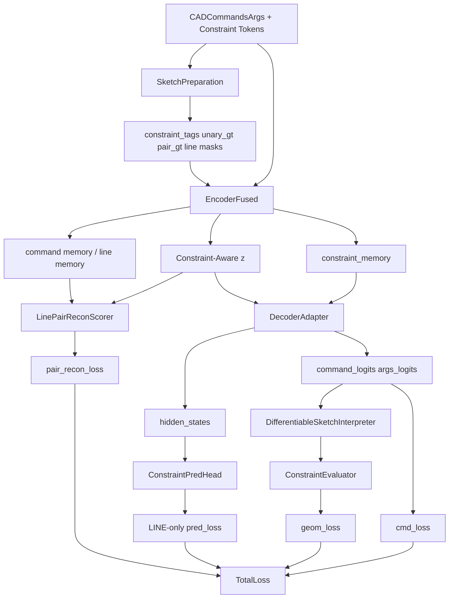

# Constraint-Fused DeepCAD Simplify Modify2 Low Risk DDD技术方案

本文档面向 `constraint_fused_deepcad_simplify_modify2` 的 **Low Risk 增量优化版**。它不重写 `modify2` 的整体约束融合思想，也不推翻当前四类约束（`Horizontal`、`Vertical`、`Parallel`、`Perpendicular`）的数据契约，而是在 **保留现有包结构、训练入口、评估口径与主要模型主干不变** 的前提下，优先修复“约束信息进入了模型，但没有稳定转化为最终约束指标”的问题。

Low Risk 方案聚焦回答三个已经在实验中暴露出来的核心问题：

1. 为什么 `modify2` 已经加入 `Parallel` / `Perpendicular` 监督，但 `parallel_recall_index_aligned`、`perpendicular_recall_index_aligned` 提升有限。
2. 为什么训练后期 `pred_loss` 与 `recon_loss` 进入平台，尤其 `pair_recon_loss` 基本不动。
3. 在不引入高风险结构重写的前提下，应该优先改哪几处，才能让约束监督更直接地作用于最终解码结果。

本文档遵循项目 `.cursor/rules/TechnicalProposal.mdc`：包含 **方案目标**、**整体架构**、**每个模块架构**（模块作用、模块原理、代码、举例说明）与 **总结**。文档定位为 `5_constraint_fused_deepcad_simplify_modify2_low_risk` 的唯一设计基线。

<!-- markdownlint-disable MD024 -->

---

## 1. 方案目标

### 1.1 业务目标

基于当前实验与评估结果，可以观察到以下事实：

1. `modify2` 相比原始 DeepCAD 在 `ratio_h`、`ratio_v`、`parallel_recall_index_aligned`、`perpendicular_recall_index_aligned` 上有提升，但并未显著超过 `constraint_fused_deepcad_simplify`。
2. 训练后期 `pred_loss` 仍维持在约 `2.2 ~ 2.6` 的区间，`recon_loss` 维持在约 `1.29 ~ 1.32` 的区间，下降不再明显。
3. `unary_recon_loss` 仍有一定学习效果，但 `pair_recon_loss` 更容易进入平台。
4. 当前 decoder 默认走 latent-only 路径，约束信息主要经 encoder 融入后压缩到单个 `z`，对 pair-level 关系过于间接。

因此，Low Risk 方案的业务目标是：

> 在不推翻 `modify2` 整体 DDD 边界和训练闭环的前提下，优先增强约束信息从 encoder 到 decoder、从 latent 到 line pair、从辅助头到最终几何输出的有效传递，使 `parallel / perpendicular` 相关指标与 `pred_loss / recon_loss` 的可优化性得到实质改善。

### 1.2 技术目标

| 目标 | 说明 | 验收方式 |
| --- | --- | --- |
| 约束信息直达 decoder | 让 decoder 在训练中真实消费 constraint memory，而不是只依赖 pooled `z` | 打开并稳定训练 `decoder cross-attn` 后不破坏主重建 |
| pair 重建结构化 | 不再只由全局 `z` 直接回归整张 pair 矩阵，而是引入 line-level feature pair scorer | `pair_recon_loss` 相比当前平台值可继续下降 |
| pred 监督聚焦到 `LINE` | `constraint_pred_loss` 只在线命令位置计算，减少监督稀释 | `pred_loss` 更敏感且与最终约束指标更一致 |
| 保持低风险可回退 | 不改数据格式，不改评估脚本，不改训练入口语义 | 主要改动集中在 `generation/`、`encoding/`、`application/` |
| 固定评估闭环 | 所有实验使用统一 `reconstruction` 和统一口径的 `summary.json` | 能与当前 `modify2` 基线一对一对比 |

### 1.3 非目标

以下内容明确 **不在 Low Risk 范围**：

1. 不改四类约束的定义、提取方式和数据契约。
2. 不引入推理期硬约束投影、后处理 snapping 或 rule-based 修正。
3. 不重写整个 encoder / decoder 主干。
4. 不改变 `reconstruction/*_vec.h5` 与当前评估脚本口径。
5. 不引入全新的数据集或人工标注。

### 1.4 核心设计原则

1. **先增强信息通路，再增加损失权重**。
2. **pair-level 问题优先用结构化表示解决，而不是继续堆全局 MLP 输出维度**。
3. **约束监督应尽量只作用在真正与约束相关的位置与对象上**。
4. **所有新增模块必须可以灰度开关、快速回退**。
5. **最终以统一评估口径的约束指标为准，而不是只看训练 loss 是否下降**。

---

## 2. 整体架构

### 2.1 方案概览

Low Risk 方案保留 `modify2` 当前四个限界上下文，但对其中 3 个上下文做轻量增强：

| 限界上下文 | 当前 Modify2 | Low Risk 方案 |
| --- | --- | --- |
| `Sketch Preparation Context` | 输出 `constraint_tags`、`constraint_tokens`、`unary_gt`、`pair_gt`、`line_cmd_mask`、`line_index_map` | 保持不变 |
| `Constraint-Fused Encoding Context` | encoder 联合编码命令流与 constraint token，输出 pooled `z` 与 `constraint_memory` | 保持主干不变，但为 decoder / pair scorer 提供更可用的 line-level memory |
| `Generation Context` | decoder 默认只用 `z`，可选 cross-attn 默认关闭；recon head 从 `z` 直接回归 unary/pair | 开启受控 cross-attn；pair recon 改为 line-level pair scorer |
| `Training Orchestration Context` | `cmd_loss + alpha*pred_loss + beta*recon_loss + gamma*geom_loss` | `pred_loss` 改为 LINE-only，训练权重和日志保持兼容 |

### 2.2 核心信息流



### 2.3 信息流说明

```text
CAD vec / GT constraints
        │
        ▼
[Sketch Preparation Context]
输出：
1. constraint_tags        (S, 4)
2. constraint_tokens      (T, 3)
3. unary_gt              (L, 2)
4. pair_gt               (L, L, 2)
5. line_cmd_mask         (S,)
6. line_index_map        (S,)
        │
        ▼
[Constraint-Fused Encoding Context]
EncoderFused:
1. 命令流 embedding
2. constraint token embedding
3. joint self-attention
4. 输出 pooled z + constraint_memory + command memory
        │
        ├──► Decoder Cross-Attn（训练期默认启用，推理期可关）
        ├──► ConstraintPredHead（只在线位置上监督）
        └──► LinePairReconScorer（用 line-level feature 预测 pair）
        │
        ▼
[Training Orchestration Context]
1. cmd_loss 负责主重建
2. pred_loss 负责命令级 tag 对齐
3. recon_loss 负责 unary/pair 约束重建
4. geom_loss 负责最终 soft 几何闭环
```

### 2.4 与当前 Modify2 的差异

| 维度 | 当前 Modify2 | Low Risk |
| --- | --- | --- |
| decoder 对 constraint memory 的使用 | 默认关闭 | 训练期默认开启，推理期可配置关闭 |
| pair recon 输入 | 只使用 `z` | 使用 `z + line-level memory` |
| `pred_loss` 有效位置 | 所有非 padding token | 仅真实 `LINE` token |
| pair 结构表达 | `Linear(z) -> L*L*2` | `line feature -> pair scorer` |
| 实验闭环 | 已有评估脚本 | 继续复用，不改口径 |

### 2.5 目标目录结构

Low Risk 方案不新建独立训练包，主要在现有 `constraint_fused_deepcad_simplify_modify2` 中做增量增强：

```text
constraint_fused_deepcad_simplify_modify2/
├─ application/
│  ├─ train_use_case.py
│  ├─ loss_composer.py
│  ├─ evaluate_constraints.py
│  ├─ differentiable_sketch_interpreter.py
│  └─ geometry_constraint.py
├─ encoding/
│  ├─ encoder_fused.py
│  ├─ recon_head.py
│  └─ pooling.py
├─ generation/
│  ├─ decoder_adapter.py
│  └─ constraint_pred_head.py
├─ config/
│  └─ config_constraint_fused_simplify_modify2.py
└─ train.py
```

---

## 3. 模块架构

### 3.1 模块：`generation/decoder_adapter.py` 的受控 Constraint Cross-Attn

#### 模块作用

让 decoder 在训练阶段真实读取 encoder 产生的 `constraint_memory`，缩短“约束信息 -> 最终命令几何”的路径，而不是完全依赖 pooled `z` 自己记住全部 pair 关系。

#### 模块原理

当前 `modify2` 虽然在 encoder 内联合编码了命令与约束 token，但 decoder 默认仍是：

```text
z -> decoder -> command_logits / args_logits
```

这会导致 pair-level 关系必须被压缩进单个 `z`，对 `parallel / perpendicular` 这类关系不够友好。  
Low Risk 方案保持当前 `OptionalConstraintCrossAttn` 结构，但改变默认训练策略：

1. 训练期默认启用 `constraint_memory -> decoder hidden_states` 的 cross-attn。
2. 推理期继续允许关闭，保持 latent-only 路径兼容。
3. 将当前 `training_dropout` 从“随机大比例跳过整条路径”改成更温和的 regularization，避免训练期约束记忆几乎用不上。

其核心思想是：

```text
Encoder joint memory
    ├─ pooled -> z
    └─ constraint_memory -> decoder cross-attn
```

这样 decoder 至少在训练时会显式看到约束记忆，从而更容易把 pair 关系落到最终离散输出上。

#### 代码

```python
class ConstraintAwareDecoderAdapter(nn.Module):
    def __init__(self, cfg):
        super().__init__()
        self.decoder = Decoder(cfg)
        self.constraint_pred_head = ConstraintPredHead(cfg.d_model, cfg.constraint_pred_dim)
        self.optional_cross_attn = OptionalConstraintCrossAttn(
            cfg.d_model,
            cfg.n_heads,
            dropout=cfg.dropout,
            training_dropout=cfg.constraint_cross_attn_dropout,
        ) if cfg.enable_decoder_cross_attn else None

    def forward(self, z, constraint_memory=None, constraint_mask=None):
        hidden_states = self.decoder.decoder(self.decoder.embedding(z), z, ...)
        if self.optional_cross_attn is not None:
            hidden_states = self.optional_cross_attn(
                hidden_states,
                constraint_memory,
                constraint_mask,
            )
        command_logits, args_logits = self.decoder.fcn(hidden_states)
        return {...}
```

#### 举例说明

假设 GT 中有两条线应保持平行：

1. encoder 已经通过 constraint token 知道这两条线是 `Parallel`。
2. 如果 decoder 只看 `z`，那么这条 pair 信息必须被压缩进全局向量，再靠 decoder 自己恢复。
3. 若 decoder 还能读取 `constraint_memory`，则这条 pair 关系在训练时能更直接影响 hidden states。
4. 最终更容易让输出的两条线在几何上仍保持平行，而不是只在 latent 辅助头里“记得”这件事。

---

### 3.2 模块：`encoding/recon_head.py` 的 LinePairReconScorer

#### 模块作用

把 `pair_recon_loss` 从“全局 `z` 直接回归整张 pair 矩阵”的方式，升级为“基于 line-level feature 的结构化 pair 打分”，提升 `Parallel / Perpendicular` 关系的可学习性。

#### 模块原理

当前 `pair_head` 的形式是：

```text
z -> MLP -> (max_lines * max_lines * 2)
```

问题在于：

1. `z` 是单个全局向量，表达整张 pair 图过于拥挤。
2. `pair_gt` 的监督语义本质是“第 i 条线与第 j 条线之间的关系”，天然是 pair-level 结构，而不是单向量分类。
3. 这会导致 `pair_recon_loss` 在训练后期容易进入平台。

Low Risk 方案改为：

1. 从 encoder command memory 中抽取 line-level feature。
2. 根据 `line_cmd_mask` / `line_index_map` 聚合每条线的表示。
3. 使用 pair scorer 对 `(line_i, line_j)` 进行关系打分。

建议结构：

```text
line_feat_i, line_feat_j, z_global
        │
        ├─ concat / biaffine / bilinear
        ▼
pair_logits[i, j, 2]
```

这样 pair 重建头的输入对象就从“全局 latent”变成了“成对线特征”，更符合任务本质。

#### 代码

```python
class LinePairReconScorer(nn.Module):
    def __init__(self, d_model, dim_z, max_lines):
        super().__init__()
        self.line_proj = nn.Linear(d_model, d_model)
        self.global_proj = nn.Linear(dim_z, d_model)
        self.out = nn.Sequential(
            nn.Linear(d_model * 3, d_model),
            nn.GELU(),
            nn.Linear(d_model, 2),
        )

    def forward(self, line_feats, z_global):
        B, L, D = line_feats.shape
        zi = self.global_proj(z_global).unsqueeze(1).unsqueeze(2).expand(B, L, L, D)
        li = line_feats.unsqueeze(2).expand(B, L, L, D)
        lj = line_feats.unsqueeze(1).expand(B, L, L, D)
        pair_in = torch.cat([li, lj, zi], dim=-1)
        return self.out(pair_in)
```

#### 举例说明

若一个样本中有 6 条线：

1. 当前方法让 `z` 一次性输出 `6 x 6 x 2` 个 pair logit。
2. 结构化方法则对每一对 `(i, j)` 看它们各自的线特征与全局上下文。
3. 这样模型不再需要“背整张 pair 图”，而是学习“给定第 i 条线和第 j 条线，它们更像平行还是垂直”。
4. 对 `parallel/perpendicular recall` 更直接、更可解释。

---

### 3.3 模块：`application/loss_composer.py` 的 LINE-only `constraint_pred_loss`

#### 模块作用

让 `ConstraintPredHead` 的监督只集中在真正对应几何线段的 token 上，避免非线命令位置的大量零标签稀释 `pred_loss` 的有效梯度。

#### 模块原理

当前 `constraint_pred_loss` 基于 `cmd_padding_mask` 做有效位置筛选，这意味着：

1. 所有非 padding token 都参与 BCE。
2. 包括 `EXT`、`SOL`、`EOS` 等非线命令位置。
3. 这些位置绝大多数 target 都是零，会让模型更容易学成“多数位置预测零”，而不是精确识别哪条线是水平、竖直、平行、垂直参与者。

Low Risk 方案将有效位置改为：

```text
valid_mask = (~cmd_padding_mask) AND line_cmd_mask
```

也就是只在真实 `LINE` 命令槽位上计算 `constraint_pred_loss`。

#### 代码

```python
def constraint_pred_loss(
    logits,
    targets,
    cmd_padding_mask,
    line_cmd_mask,
):
    valid = ((~cmd_padding_mask) & line_cmd_mask).unsqueeze(-1).float()
    logits = logits * valid
    targets = targets * valid
    return F.binary_cross_entropy_with_logits(
        logits,
        targets,
        reduction="sum",
    ) / (valid.sum() * logits.size(-1) + 1e-6)
```

在 `train_use_case.py` 中同步传入：

```python
pred_loss = constraint_pred_loss(
    decoder_output["constraint_pred_logits"],
    constraint_tags,
    cmd_padding_mask,
    line_cmd_mask,
)
```

#### 举例说明

假设一条命令序列长度为 12，其中只有 4 个位置是真实 `LINE`：

1. 当前做法会在 12 个位置上都算 BCE。
2. 其中 8 个非线位置的监督几乎全是零标签。
3. 修改后只在 4 个 line 位置算 BCE。
4. `pred_loss` 将更直接度量“线级约束 tag 是否预测对”，而不是“模型会不会在大部分位置输出零”。

---

### 3.4 模块：`application/train_use_case.py` 的 line-level 特征抽取与损失编排

#### 模块作用

把前面两个模块真正接入现有训练闭环，使 encoder 输出、decoder cross-attn、pair scorer 与 loss 组合形成一条一致的训练路径。

#### 模块原理

Low Risk 方案不改变 `TrainConstraintFusedSimplifyModify2BatchUseCase.execute()` 的主流程，只在其中增加两件事：

1. 从 encoder command memory / decoder hidden states 中抽取每条线的 line feature。
2. 用 line feature 计算新的 `pair_logits`，再与 `pair_gt` 做 BCE。

同时保留：

1. `cmd_loss`：主重建任务
2. `pred_loss`：命令级 tag 监督
3. `geom_loss`：soft 几何闭环
4. `unary_recon_loss`：轴向约束重建

这样可以保持训练入口与日志结构稳定，仅增强 pair 监督的有效性。

#### 代码

```python
latent, encoder_outputs = self.fusion_service.fuse(...)
decoder_output = self.decoder(
    z,
    constraint_memory=encoder_outputs["constraint_memory"],
    constraint_mask=encoder_outputs["constraint_mask"],
)

line_features = gather_line_features(
    encoder_outputs["memory"],
    line_cmd_mask=line_cmd_mask,
    line_index_map=line_index_map,
    max_lines=max_lines,
)

unary_logits = self.recon_head.unary_from_z(z_sq)
pair_logits = self.recon_head.pair_from_lines(line_features, z_sq)
```

#### 举例说明

当前训练中：

1. decoder 可以把命令序列画出来。
2. recon head 可以从 `z` 猜测 unary / pair 约束。
3. 但 pair 约束是否真的保留到最终离散几何里，这两条链路之间联系很弱。

接入 line-level feature 后：

1. pair recon 直接从“线表示”预测 pair 关系。
2. decoder 训练时也显式读取 constraint memory。
3. 这样 `pair_recon_loss` 与最终几何结果之间的耦合更强。

---

### 3.5 模块：统一评估闭环与实验记录

#### 模块作用

确保 Low Risk 方案的效果由统一口径的测试集重建结果判断，而不是只看 `pred_loss`、`recon_loss` 是否下降。

#### 模块原理

本方案不改现有评估脚本口径，继续固定使用：

1. `reconstruction/*_vec.h5`
2. `ratio_h`
3. `ratio_v`
4. `parallel_recall_index_aligned`
5. `perpendicular_recall_index_aligned`
6. `n_parse_fail_pred`
7. `n_samples_extrude_count_mismatch`

每次实验都要与当前 `modify2` 基线一对一对比，避免出现：

1. 训练 loss 好看
2. 但 pair 指标没涨
3. 甚至最终 `reconstruction` 结构更差

#### 代码

```python
python -m constraint_fused_deepcad_simplify_modify2.reconstruct \
  --model_path ".../ckpt_epochXX.pth" \
  --eval_split test

python -m constraint_fused_deepcad_simplify_modify2.evaluate \
  --skip_reconstruct \
  --reconstruction_dir "constraint_fused_deepcad_simplify_modify2/reconstruction" \
  --outputs "constraint_fused_deepcad_simplify_modify2"
```

#### 举例说明

如果某次改动使：

1. `pred_loss` 下降
2. `pair_recon_loss` 下降
3. 但 `parallel_recall_index_aligned` 没涨

则说明优化更多停留在辅助头或连续空间里，没有真正转化为最终几何约束保留率。这种情况下应优先检查 decoder cross-attn 和 line pair scorer 是否真正影响了离散输出。

---

## 4. 实施顺序

### 4.1 Phase 0：范围冻结

1. 保持四类约束数据契约不变。
2. 保持 `train.py`、`reconstruct.py`、`evaluate.py` 的 CLI 语义不变。
3. 评估口径固定为当前 `summary.json` 方案。

### 4.2 Phase 1：最小监督对齐

1. 先实现 `LINE-only constraint_pred_loss`。
2. 在 `train_use_case.py` 中传递 `line_cmd_mask`。
3. 用短程 smoke training 检查 `pred_loss` 是否更敏感。

### 4.3 Phase 2：decoder 约束记忆接入

1. 默认打开 `enable_decoder_cross_attn`。
2. 降低当前过强的训练期随机跳过概率。
3. 验证不会明显恶化 `cmd_loss` 与重建质量。

### 4.4 Phase 3：pair scorer 结构升级

1. 为 `recon_head` 增加基于 line-level feature 的 pair scorer。
2. 保留 unary 分支原有低风险实现。
3. 观察 `pair_recon_loss` 是否脱离当前平台。

### 4.5 Phase 4：统一评估回归

1. 固定测试集重建。
2. 重新生成 `per_sample_counts.csv` 与 `summary.json`。
3. 与当前 `modify2`、`constraint_fused_deepcad_simplify`、原始 DeepCAD 做并排对比。

---

## 5. 风险、权衡与验收标准

### 5.1 风险

1. 若 decoder 过度依赖 constraint memory，可能训练好看但推理期关闭 cross-attn 后退化。
2. 若 pair scorer 设计不当，可能提升了 `pair_recon_loss`，却没有改善最终离散几何。
3. 若 `LINE-only pred_loss` 权重过强，可能让 decoder 过分关注 line token，影响非线命令质量。

### 5.2 权衡

| 方案 | 优点 | 代价 |
| --- | --- | --- |
| Low Risk 增量 | 改动集中、可灰度验证、可快速回退 | 提升幅度未必足够大 |
| 直接中风险重构 | 更有机会根治 pair 建模问题 | 实现复杂、变量更多、调参成本高 |

### 5.3 验收标准

1. 新逻辑不破坏现有训练、重建、评估闭环。
2. `pred_loss` 相比当前更可下降，且不再明显受非线位置零标签稀释。
3. `pair_recon_loss` 能脱离当前约 `0.67 ~ 0.68` 的平台。
4. 测试集上至少一项 pair 指标稳定提升：
   - `parallel_recall_index_aligned`
   - `perpendicular_recall_index_aligned`
5. 不允许明显恶化：
   - `ratio_h`
   - `ratio_v`
   - `n_parse_fail_pred`

---

## 6. 总结

`modify2` 当前的问题，不是“没有加约束”，而是“约束进入模型后的主传递路径仍然太弱”。  
Low Risk 方案因此不再继续盲目增加损失项，而是优先修复三条最关键的链路：

1. **decoder 真实消费 constraint memory**
2. **pair 重建从全局 latent 改为 line-level 结构建模**
3. **pred_loss 只监督真正相关的 `LINE` 位置**

这条路线的价值在于：

1. 改动小于中风险重构
2. 与当前 `modify2` 包结构兼容
3. 能直击 `pred_loss` / `recon_loss` 平台与 pair 指标提升有限的问题
4. 若收益仍然有限，也能更明确地证明：瓶颈不再是监督对齐，而是需要进入下一阶段的中风险结构重写

若本方案实施后，`parallel_recall_index_aligned` 与 `perpendicular_recall_index_aligned` 仍无明显改善，则下一步应考虑进入更高风险方案，例如：

1. 更强的 decoder 约束记忆常开路径
2. 训练 / 推理一致的 constraint-conditioned decoding
3. 更严格的 line order / extrude structure 对齐机制

