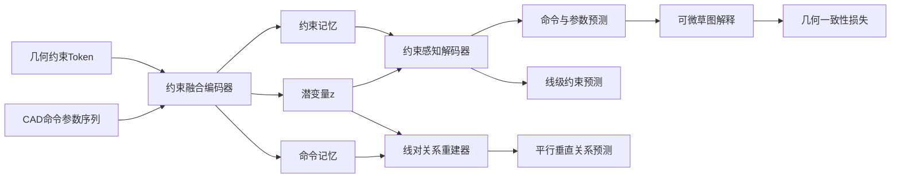

# 面向参数化 CAD 草图几何关系保持的约束融合自编码网络

## A Constraint-Fused Autoencoding Network for Geometric Relation Preservation in Parametric CAD Sketches

## 摘要

参数化 CAD 模型不仅包含命令与数值参数，还包含水平、竖直、平行、垂直等体现设计意图的草图几何关系。以 DeepCAD 为代表的序列化 CAD 生成方法能够取得较高的命令和参数重建精度，但其训练目标主要监督离散序列本身，约束关系未显式进入主训练闭环，因而可能在工程可编辑性更关键的几何关系保持上退化。

为此，本文提出约束融合 CAD 自编码网络（Constraint-Fused DeepCAD, CF-DeepCAD）。该方法在 DeepCAD 序列自编码框架上，引入四类草图约束的结构化表示：将水平/竖直建模为线级标签，将平行/垂直建模为线对关系 token；在编码器中联合建模 CAD token 与约束 token，在解码器中通过约束记忆注意将关系信息注入主生成路径，并以线级成对关系重建和可微几何一致性损失强化监督。

在 DeepCAD 官方测试划分的 8052 个样本上，本文方法相较官网下载的原始 DeepCAD 预训练模型在命令与参数重建精度上均取得提升，其中命令准确率由 0.9936 提升至 0.9975，参数准确率由 0.9759 提升至 0.9886。更重要的是，在相同约束评估口径下，平行关系 index-aligned 召回率由 0.8617 提升至 0.9970，垂直关系 index-aligned 召回率由 0.9279 提升至 0.9992；水平与竖直关系保持率也分别由 0.9510、0.9574 提升至 0.9977、0.9988。实验表明，本文方法不仅提升了序列级重建质量，也显著改善了参数化草图中几何关系的保持能力。

**关键词**：计算机辅助设计；参数化建模；草图几何约束；Transformer；自编码器；CAD 序列生成

## 1. 引言

CAD 模型是工业产品设计、机械制造和数字孪生系统中的核心数据形态。与普通三维网格或点云不同，工程 CAD 模型不仅包含最终几何外形，还包含能够表达设计意图的参数化构造历史。典型建模过程往往由二维草图和三维特征操作组成：设计者首先在草图平面上绘制点、线、圆弧等几何元素，并通过水平、竖直、平行、垂直、重合、相切等约束限定其相对关系；随后通过拉伸、旋转、切除等操作形成三维实体。因此，对 CAD 模型进行生成、压缩或重建时，仅恢复命令序列和数值参数并不足够，模型还应尽可能保持原始设计中的几何关系与参数化结构。

DeepCAD [1] 首次系统地将 CAD 建模历史表示为可学习的命令—参数序列，并利用 Transformer 自编码器构建 CAD 潜在空间。该工作证明了深度网络可以在大规模 CAD 数据上学习构造序列的分布，并在自编码和随机生成任务中获得较好效果。然而，DeepCAD 的主要优化目标是命令分类和参数离散值预测。对于草图中实际存在的结构性关系，网络只能通过坐标参数间接学习。例如，两条线段是否平行，在序列参数层面对应多个坐标之间的耦合关系；如果训练目标只逐项监督坐标离散值，模型可以得到较高的参数准确率，却仍可能破坏平行或垂直关系。对工程设计而言，这类关系破坏会削弱模型的可编辑性和可复用性。

本文关注一个具体问题：**在不推翻 DeepCAD 序列自编码框架的条件下，如何将草图几何约束有效注入网络，使重建结果同时保持序列精度和几何关系一致性？** 该问题包含三个挑战。第一，约束是线级或线对级对象，而 DeepCAD 的标准输入是顺序命令 token，二者粒度不一致。第二，平行和垂直属于 pair-level 关系，若全部压缩进单个全局潜变量，容易造成关系信息损失。第三，辅助约束监督若施加在所有命令位置，会被大量非线段 token 的零标签稀释，导致监督信号与实际几何对象不匹配。

针对上述挑战，本文提出 CF-DeepCAD。该方法以 DeepCAD 的命令—参数序列为基础，新增四类几何约束的结构化表示，并通过联合编码器、约束感知解码器、线级关系重建模块和多任务损失实现端到端训练。本文的主要贡献如下：

1. **提出草图约束融合的 CAD 自编码框架。** 在原始命令序列之外显式建模水平、竖直、平行和垂直关系，将约束 token 与 CAD token 置于统一 Transformer 表示空间，使潜变量包含几何关系信息。
2. **提出解码器侧约束记忆注意机制。** 与仅依赖全局潜变量的 DeepCAD 解码方式不同，本文允许解码器在生成命令与参数时直接访问编码器保留的约束记忆，从而增强约束信息对最终离散输出的影响。
3. **提出线级成对关系重建模块。** 对每条线段聚合局部表征，并对任意线对进行平行/垂直关系打分，使 pair-level 监督作用在与其语义一致的线对空间上，而非完全依赖全局向量回归。
4. **构建面向约束保持的多任务训练目标与评估协议。** 本文综合命令参数重建、线级约束预测、约束重建和可微几何一致性损失，并在统一测试集上与 DeepCAD 进行序列级和约束级对比。

## 2. 相关工作

### 2.1 CAD 表示学习与生成

CAD 深度生成研究试图从传统的几何文件或边界表示中学习设计对象的结构分布。早期三维生成方法多以体素、点云或网格为对象 [6-8]，这些表示适合描述形状外观，但难以保留 CAD 构造历史和参数化可编辑性。CSGNet [9] 将形状表示为构造实体几何程序，为神经网络生成可解释的几何程序提供了思路。ShapeAssembly [10] 进一步通过结构化程序描述三维形状装配关系。相比之下，DeepCAD [1] 直接面向 CAD 建模序列，能够表达草图曲线、拉伸特征及其参数，是参数化 CAD 生成方向的重要基线。

近年来，CAD 数据集也逐渐从几何形状扩展到设计过程和草图关系。ABC 数据集 [2] 为三维 CAD 曲面和边界表示研究提供了大规模基础。Fusion 360 Gallery [3] 关注真实设计过程中的建模序列。SketchGraphs [4] 则将草图约束作为图结构建模，为草图关系学习提供了大规模数据视角。这些工作共同表明，CAD 模型不仅是几何外形，更是包含拓扑关系、特征树和设计意图的结构化对象。

### 2.2 序列模型与矢量图形生成

Transformer [5] 已成为处理离散序列和结构化 token 的基础架构，在自然语言、图像 patch 序列、矢量图形和程序生成中均表现突出。SketchRNN [11] 将手绘草图表示为笔画序列，DeepSVG [12] 使用层级 Transformer 生成可缩放矢量图形。CAD 命令序列与 SVG、草图笔画类似，都具有“命令类型 + 参数”的组合结构，但 CAD 还额外包含严格的几何约束和工程语义。本文借鉴序列模型的表示能力，同时针对 CAD 草图关系设计显式约束融合机制。

### 2.3 几何约束与可编辑设计意图

传统 CAD 系统中的几何约束通常由专用求解器维护，用户可通过水平、竖直、平行、垂直、同心等约束表达设计意图。神经网络若忽略这些关系，生成结果虽然视觉相似，却可能难以在工程环境中继续编辑。SketchGraphs [4] 将草图约束构造成图学习问题，说明约束关系可以作为监督信号进入学习系统。本文与图式约束预测不同，目标不是单独恢复约束图，而是将约束关系嵌入 CAD 自编码器，使生成的命令参数本身更好地满足几何关系。

### 2.4 多任务学习与结构监督

多任务学习通过共享表示同时优化多个相关目标，常用于在主任务之外注入结构先验 [13]。在形状重建中，辅助几何损失可改善潜空间的可解释性和最终几何质量 [6, 8]。本文将 CAD 重建视作主任务，将线级约束预测、线对关系重建和可微几何一致性作为辅助任务。不同于简单叠加损失，本文强调监督粒度与对象语义的一致性：线级监督作用在线段 token 上，线对监督作用在线对表示上，几何监督作用在解码后的软线段上。

## 3. 问题定义

给定一个 CAD 构造序列 `S = {(c_t, a_t)}_{t=1}^T`，其中 `c_t` 表示第 `t` 个命令类型，`a_t` 表示该命令对应的离散参数。对于草图中的线段集合 `L = {l_i}_{i=1}^N`，本文考虑四类几何约束：

```text
C = C^h ∪ C^v ∪ C^p ∪ C^o
```

其中 `C^h` 表示水平线约束，`C^v` 表示竖直线约束，`C^p` 表示平行线对约束，`C^o` 表示垂直线对约束。水平和竖直约束是 unary 约束，其对象为单条线段；平行和垂直约束是 pair 约束，其对象为线段对。

本文目标是在学习编码器 `E_θ` 和解码器 `D_φ` 的同时，使重建序列 `Ŝ = D_φ(E_θ(S, C))` 满足两个要求：

1. **序列重建一致性**：命令类别与参数值尽可能接近原始序列。
2. **几何关系保持性**：重建草图中的线段应尽可能保持原始草图中的水平、竖直、平行和垂直关系。

与仅优化 `P(S | z)` 的原始 DeepCAD 不同，本文显式建模条件 `P(S, C | z)`，并通过结构化辅助损失约束潜在表示和解码输出。

## 4. 方法

### 4.1 方法概览

CF-DeepCAD 的核心思想是将几何约束作为结构信号注入编码、解码和损失监督全过程。模型包括约束表示、约束融合编码器、约束感知解码器、线级成对关系重建器和多粒度损失五部分，整体流程如下。



### 4.2 约束表示：从坐标关系到结构监督

DeepCAD 原始序列中的线段由命令及端点参数隐式定义。本文将其中的方向和线对关系显式化，避免模型仅从离散坐标中间接学习复杂耦合。

对于第 `i` 条线段，定义 unary 标签：

```text
u_i = [y_i^h, y_i^v] ∈ {0, 1}²
```

其中 `y_i^h = 1` 表示该线段为水平线，`y_i^v = 1` 表示该线段为竖直线。对于线段对 `(i, j)`，定义 pair 标签：

```text
p_ij = [y_ij^p, y_ij^o] ∈ {0, 1}²
```

其中 `y_ij^p = 1` 表示 `l_i` 与 `l_j` 平行，`y_ij^o = 1` 表示二者垂直。由于平行和垂直关系是无向关系，理论上有 `p_ij = p_ji`。

同时构造约束 token：

```text
τ_k = (r_k, i_k, j_k)
```

其中 `r_k` 为约束类型，`i_k`、`j_k` 为涉及的线段索引。该表示既作为编码器输入，也作为辅助监督目标；水平/竖直对应单线标签，平行/垂直对应线对矩阵，使监督粒度与几何语义一致。

### 4.3 约束融合编码器

设 CAD 命令参数 token 嵌入为 `e_t^cad`，约束 token 嵌入为 `e_k^con`。本文将二者拼接为联合序列：

```text
X = [e_1^cad, ..., e_T^cad, e_1^con, ..., e_M^con]
```

为区分命令 token 与约束 token，加入 segment embedding：

```text
x̃_n = x_n + s_g(n)
```

其中 `g(n)` 表示 token 所属分段。随后使用 Transformer 编码器得到联合记忆：

```text
H = TransformerEncoder(X̃)
```

编码器输出被拆分为两部分：

```text
H^cad = H_1:T
H^con = H_(T+1):(T+M)
```

其中 `H^cad` 作为命令记忆，保留每个命令位置的局部上下文；`H^con` 作为约束记忆，保留每个约束 token 的结构信息。全局潜变量 `z` 由联合记忆池化并经瓶颈层获得：

```text
z = B(Pool(H))
```

该编码器使注意力机制同时学习命令序列依赖、约束关系结构以及命令与约束之间的对齐关系。

### 4.4 约束感知解码器

原始 DeepCAD 解码器主要以全局潜变量 `z` 为条件生成命令和参数。该设计对于整体序列重建有效，但对细粒度 pair 关系存在瓶颈：所有线对关系必须在编码阶段被压缩进单个向量 `z`，再由解码器间接恢复。当一个草图包含较多线段时，潜变量需要同时承载拓扑、几何、命令顺序和多个 pair 约束，信息竞争明显。

本文在解码隐状态与约束记忆之间引入 cross-attention。设解码器基于 `z` 得到初始隐状态 `G ∈ R^(T×d)`，约束记忆为 `H^con ∈ R^(M×d)`。约束注意力计算为：

```text
Attn(G, H^con) =
softmax(((G W_Q)(H^con W_K)^T) / sqrt(d)) H^con W_V
```

随后采用残差更新：

```text
G̃ = G + Dropout(Attn(LN(G), LN(H^con)))
```

该模块为约束信息提供不经过全局潜变量瓶颈的通路，使关系记忆直接影响命令和参数预测，而不是仅停留在辅助头中。训练期可对该通路进行随机丢弃，以避免模型完全依赖显式约束并提升鲁棒性。

### 4.5 线级成对关系重建器

平行和垂直约束的基本对象是线段对 `(l_i, l_j)`。若使用一个多层感知机直接从 `z` 输出完整的 `N × N × 2` 关系矩阵，则模型需要在全局向量中同时存储所有线对关系，监督信号也难以区分每条线的局部几何角色。本文采用线级成对打分机制。

首先，从命令记忆 `H^cad` 中根据线命令位置聚合每条线段的表示：

```text
q_i = Gather(H^cad, i)
```

然后对每对线段构造成对特征：

```text
m_ij = [W_l q_i; W_l q_j; W_z z]
```

其中 `W_l` 和 `W_z` 为线性投影，`[;]` 表示拼接。平行/垂直 logits 由前馈网络预测：

```text
s_ij = f_ψ(m_ij) ∈ R²
```

由于关系是无向的，最终输出进行对称化：

```text
p̂_ij = 1/2 · (s_ij + s_ji)
```

这样每个 pair 预测都显式依赖两条线的局部表征和全局上下文，比直接从 `z` 回归完整关系矩阵更符合平行/垂直关系的对象结构。

### 4.6 线级约束预测与监督聚焦

本文还在解码隐状态上增加线级约束预测头，用于预测每个命令位置是否参与水平、竖直、平行或垂直关系。关键改进在于，损失只在真实线段命令位置计算。设 `m_t^line ∈ {0, 1}` 表示第 `t` 个命令是否为线段命令，`ŷ_t` 为预测标签，`y_t` 为目标标签，则：

```text
L_pred =
Σ_t m_t^line · BCE(ŷ_t, y_t)
--------------------------------
Σ_t m_t^line + ε
```

非线段命令不直接承载草图线段约束。若将所有位置纳入 BCE，大量零标签会稀释线段位置的监督；LINE-only 策略使辅助头聚焦于约束实际发生的对象。

### 4.7 可微几何一致性损失

仅预测约束标签或关系矩阵仍不能保证最终离散参数在几何上满足约束。为缩小辅助监督与最终几何输出之间的差距，本文引入可微草图解释过程，将参数 logits 转换为软线段坐标，并计算几何一致性损失。

对于线段 `l_i`，设其软端点为 `a_i, b_i ∈ R²`，方向向量为：

```text
d_i = (b_i - a_i) / (||b_i - a_i||₂ + ε)
```

水平与竖直损失可分别写为：

```text
L_h = Σ_{i: y_i^h = 1} |d_i,y|
L_v = Σ_{i: y_i^v = 1} |d_i,x|
```

对于平行关系，使用方向叉积的绝对值衡量偏离：

```text
L_p = Σ_{(i,j): y_ij^p = 1} |d_i × d_j|
```

对于垂直关系，使用点积绝对值衡量偏离：

```text
L_o = Σ_{(i,j): y_ij^o = 1} |d_i · d_j|
```

几何损失为：

```text
L_geom = L_h + L_v + L_p + L_o
```

该损失不替代命令参数监督，而是在几何层面对线段方向关系提供软约束。

### 4.8 总体训练目标

模型总损失由四部分组成：

```text
L = L_cmd + alpha · L_pred + beta · L_rec + gamma · L_geom
```

其中 `L_cmd` 为命令类别和参数离散值的交叉熵损失；`L_pred` 为线级约束预测损失；`L_rec` 为 unary 与 pair 约束重建损失：

```text
L_rec = BCE_w(U_pred, U) + BCE_w(P_pred, P)
```

`BCE_w` 表示带正样本权重的二元交叉熵，用于缓解约束标签稀疏造成的类别不平衡。实验中采用 `alpha = 3`、`beta = 1`、`gamma = 3`。该权重配置体现了本文的训练原则：命令参数重建仍是主任务，约束预测、关系重建和几何一致性作为结构先验协同约束潜空间与解码输出。

## 5. 实验设计

### 5.1 数据集与任务

本文使用 DeepCAD 公开数据划分中的测试集，共 8052 个 CAD 样本。每个样本以向量化命令序列形式表示，包括草图曲线命令和三维拉伸命令。本文评估自编码重建任务：模型输入原始 CAD 序列，输出重建序列，并与真实序列及其几何关系进行比较。

### 5.2 对比方法

本文主要与官网下载的原始 DeepCAD 自编码预训练模型进行比较。DeepCAD 作为强基线，已经能够较好地重建命令与参数序列。本文方法在相同训练数据划分上训练 100 个 epoch，表 1 和表 2 中报告的 CF-DeepCAD 结果均来自该训练后的模型。本文还报告若干中间变体和消融结果，用于分析约束融合不同组成部分的作用。

消融实验围绕四个变量展开：约束是否进入编码器、监督是否作用在正确对象上、pair 关系是否以线对结构建模、约束信息是否进入解码主路径。对应模型包括约束融合基础模型、关系重建增强模型、去除解码器约束注意的本文模型，以及完整 CF-DeepCAD。

为避免评估口径差异，所有约束指标均基于同一测试样本集合与同一几何解析规则统计。对于命令和参数准确率，沿用 DeepCAD 仓库中自编码评估脚本的定义：命令准确率统计命令类别是否一致；参数准确率仅在命令预测正确时统计有效参数是否落入给定容差内，本文采用的离散参数容差为 3 个量化单位。

### 5.3 评估指标

本文使用两类指标。

**序列级重建指标。** 命令准确率 `ACC_cmd` 与参数准确率 `ACC_param` 用于衡量模型对原始 CAD 序列的重建能力。

**约束保持指标。** 对水平和竖直约束，统计 index-aligned 保持率；对平行和垂直约束，统计 index-aligned 召回率。四类方向关系均采用 `0.1°` 角度容差判断，并仅在线段数一致的拉伸草图局部范围内统计线对关系。本文同时报告预测解析失败样本数和拉伸数量不匹配样本数，以反映结构稳定性。

## 6. 实验结果与分析

### 6.1 序列重建性能

表 1 给出了 DeepCAD 与本文方法在测试集上的命令与参数重建准确率。可以看到，本文方法不仅没有因引入约束监督而损害原始自编码任务，反而进一步提升了命令与参数重建精度。

表 1 序列级自编码重建精度

|方法|`ACC_cmd`|`ACC_param`|
|---|---|---|
|DeepCAD（官方预训练）|0.9936|0.9759|
|CF-DeepCAD（本文）|**0.9975**|**0.9886**|

该结果说明，显式约束监督并非只提升几何关系指标，也能改善序列重建。原因在于草图约束为线段方向和相对关系提供了额外结构先验，有助于模型在参数预测时减少不合理解。

### 6.2 几何关系保持性能

表 2 给出了四类几何关系保持指标。与 DeepCAD 官方预训练模型相比，本文方法在全部约束保持指标上均显著提升。尤其对于 pair-level 的平行和垂直关系，DeepCAD 的召回率分别为 0.8617 和 0.9279，而本文方法达到 0.9970 和 0.9992。这说明线对关系重建与解码器约束注意能够有效缓解全局潜变量对 pair 关系表达不足的问题。

表 2 草图几何约束保持性能

|方法|水平保持率|竖直保持率|平行召回率|垂直召回率|解析失败数|拉伸数不匹配|
|---|---|---|---|---|---|---|
|DeepCAD（官方预训练）|0.9510|0.9574|0.8617|0.9279|**29**|64|
|CF-DeepCAD（本文）|**0.9977**|**0.9988**|**0.9970**|**0.9992**|41|**22**|

从结果看，本文方法对 pair-level 指标的提升幅度最大。这与方法设计一致：平行/垂直关系不是单个线段的属性，而是两条线之间的二元关系。若模型只依赖命令参数交叉熵，坐标误差即便很小，也可能造成角度关系破坏。本文通过线对打分器和几何损失对关系进行显式建模，使模型更倾向于输出满足方向约束的参数组合。

此外，拉伸数量不匹配样本数由 64 降至 22，说明约束信息改善了序列结构稳定性。需要注意的是，本文模型的预测解析失败数为 41，高于 DeepCAD 官方预训练模型的 29；这表明当前方法在少量样本的严格语法可解析性上仍有改进空间，但其在可解析和线段数一致的评估范围内显著提升了几何关系保持能力。直观上，草图约束为模型提供了额外的结构锚点，有助于维持草图局部元素数量和相对组织关系。

### 6.3 消融分析

表 3 给出约束融合相关模块的消融结果。所有结果均在同一测试集和几何解析规则下统计，重点观察 pair-level 的平行和垂直召回率。

表 3 约束融合模块消融结果

|方法|实验目的|主要做法|平行召回率|垂直召回率|结果解释|
|---|---|---|---|---|---|
|约束融合基础模型|验证“加入约束监督是否足够”|加入四类约束标签与辅助监督，decoder 仍主要依赖 `z`|0.8676|0.9219|约束可改善潜变量，但对最终 pair 几何输出传递不足|
|关系重建增强模型|验证“加入 pair 重建是否足够”|增加平行/垂直关系矩阵重建目标，pair 监督仍偏辅助分支|0.8634|0.9146|pair 监督能学习关系存在性，但未稳定改变解码参数|
|本文模型去除解码器约束注意|验证 cross-attention 的必要性|保留线对重建、LINE-only 监督与几何损失，关闭 decoder 约束记忆注意|0.6872|0.8380|约束信息不能直达解码隐状态时，pair 关系保持显著退化|
|CF-DeepCAD（本文）|验证完整融合链路|约束联合编码 + decoder 约束注意 + 线对重建 + 几何损失|**0.9970**|**0.9992**|约束记忆、线对监督与几何闭环共同作用，pair 关系几乎完整保持|

消融结果表明，仅在编码器中加入约束或额外预测关系矩阵，并不足以稳定改善最终几何输出。前两类模型的 pair 指标仍接近原始 DeepCAD，说明辅助监督若不能影响 decoder 主路径，模型可能“知道”关系却无法把关系落实到坐标参数中。

最关键的对比是去除解码器约束注意的模型。该模型保留线对重建、LINE-only 监督和几何损失，但平行召回率降至 0.6872，垂直召回率降至 0.8380，说明 `constraint_memory -> hidden states` 的 cross-attention 是将 pair 关系转化为最终输出的重要通路。完整 CF-DeepCAD 同时具备联合编码、约束记忆注意、线对监督和几何闭环，因此在平行和垂直关系上取得最优结果。

### 6.4 结果讨论

本文方法的提升来自三个互补机制：约束 token 的联合编码使潜变量直接接触关系结构；解码器约束注意减少全局瓶颈的信息损失；线级成对关系重建使监督粒度与平行/垂直这类二元关系匹配。

需要指出的是，本文当前实验主要报告序列准确率与约束保持指标。Chamfer 距离和三维点云误差依赖 CAD 实体构造与点云采样环境。由于当前实验环境缺少 OpenCASCADE 依赖及预生成点云资产，本文未将不完整的 Chamfer 结果纳入主表。后续在完整几何评估环境中，可进一步补充三维几何误差指标。

### 6.5 未来应用前景

本文方法可进一步用于约束保持型 CAD 自动补全、约束感知 CAD 生成、低质量 CAD 序列修复和智能设计检查。由于模型显式预测线级与线对级关系，后续若结合更多约束类型和传统 CAD 约束求解器，有望支持设计意图识别、草图约束推荐和参数化建模质量评估。

## 7. 局限性

尽管本文方法显著提升了四类基础草图约束的保持能力，仍存在以下局限。

首先，本文仅考虑水平、竖直、平行和垂直四类常见关系，尚未覆盖重合、相等长度、相切、同心、对称等更复杂约束。真实 CAD 草图中的约束系统通常更加丰富，未来可扩展为多类型约束图建模。

其次，本文采用软几何损失和神经网络预测来增强约束保持，并未在推理阶段调用传统几何约束求解器。因此模型输出仍可能在极少数样本上偏离严格约束。若面向工业级参数化编辑，可考虑将神经生成与约束求解器结合，形成“学习生成 + 硬约束投影”的混合框架。

再次，本文主要研究自编码重建任务。对于随机生成或条件生成任务，约束 token 的来源、约束可控性以及约束与潜空间采样的耦合仍需进一步研究。

最后，本文对三维实体级几何误差尚未给出完整评估。虽然序列准确率和草图约束保持指标已经显示出明显改进，但后续仍应补充 Chamfer 距离、无效实体比例、B-Rep 可用性等三维层面指标。

## 8. 结论

本文针对 DeepCAD 在草图几何关系保持方面的不足，提出了一种约束融合 CAD 自编码网络 CF-DeepCAD。该方法通过约束 token 联合编码、解码器约束记忆注意、线级成对关系重建和多粒度几何监督，将草图中的水平、竖直、平行和垂直关系显式纳入训练闭环。在 8052 个测试样本上的实验表明，本文方法相较 DeepCAD 同时提升了命令参数重建精度和几何约束保持能力，尤其在平行和垂直关系召回上取得接近完美的重建表现。本文结果说明，面向 CAD 这类结构化工程数据，显式建模设计关系不仅有助于提高几何一致性，也有助于改善序列生成的可靠性。

未来工作将从三个方向展开：一是扩展更多约束类型并建立统一约束图编码器；二是将神经生成结果与传统约束求解器结合，实现严格可编辑的参数化输出；三是在随机生成和条件生成任务中引入可控约束输入，提升 CAD 生成模型的工程可用性。

## 参考文献

[1] Wu R, Xiao C, Zheng C. DeepCAD: A Deep Generative Network for Computer-Aided Design Models. *Proceedings of the IEEE/CVF International Conference on Computer Vision*, 2021: 6772-6782.

[2] Koch S, Matveev A, Jiang Z, et al. ABC: A Big CAD Model Dataset for Geometric Deep Learning. *Proceedings of the IEEE/CVF Conference on Computer Vision and Pattern Recognition*, 2019: 9601-9611.

[3] Willis K D D, Pu Y, Luo J, et al. Fusion 360 Gallery: A Dataset and Environment for Programmatic CAD Construction from Human Design Sequences. *ACM Transactions on Graphics*, 2021, 40(4): 1-24.

[4] Seff A, Ovadia Y, Zhou W, Adams R P. SketchGraphs: A Large-Scale Dataset for Modeling Relational Geometry in Computer-Aided Design. *arXiv preprint arXiv:2007.08506*, 2020.

[5] Vaswani A, Shazeer N, Parmar N, et al. Attention Is All You Need. *Advances in Neural Information Processing Systems*, 2017, 30.

[6] Fan H, Su H, Guibas L J. A Point Set Generation Network for 3D Object Reconstruction from a Single Image. *Proceedings of the IEEE Conference on Computer Vision and Pattern Recognition*, 2017: 605-613.

[7] Achlioptas P, Diamanti O, Mitliagkas I, Guibas L. Learning Representations and Generative Models for 3D Point Clouds. *Proceedings of the International Conference on Machine Learning*, 2018: 40-49.

[8] Yang G, Huang X, Hao Z, Liu M Y, Belongie S, Hariharan B. PointFlow: 3D Point Cloud Generation with Continuous Normalizing Flows. *Proceedings of the IEEE/CVF International Conference on Computer Vision*, 2019: 4541-4550.

[9] Sharma G, Goyal R, Liu D, Kalogerakis E, Maji S. CSGNet: Neural Shape Parser for Constructive Solid Geometry. *Proceedings of the IEEE Conference on Computer Vision and Pattern Recognition*, 2018: 5515-5523.

[10] Jones R K, Barton T, Xu X, et al. ShapeAssembly: Learning to Generate Programs for 3D Shape Structure Synthesis. *ACM Transactions on Graphics*, 2020, 39(6): 1-20.

[11] Ha D, Eck D. A Neural Representation of Sketch Drawings. *International Conference on Learning Representations*, 2018.

[12] Carlier A, Danelljan M, Alahi A, Timofte R. DeepSVG: A Hierarchical Generative Network for Vector Graphics Animation. *Advances in Neural Information Processing Systems*, 2020, 33: 16351-16361.

[13] Caruana R. Multitask Learning. *Machine Learning*, 1997, 28(1): 41-75.
