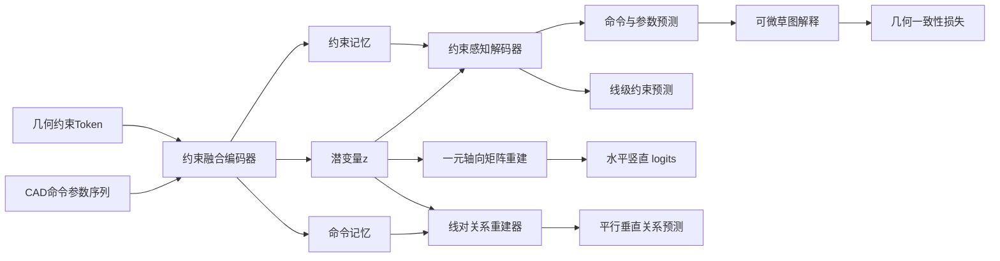

# 面向参数化 CAD 草图几何关系保持的约束融合自编码网络

## A Constraint-Fused Autoencoding Network for Geometric Relation Preservation in Parametric CAD Sketches

## 1. 引言

CAD 模型是工业产品设计、机械制造和数字孪生系统中的核心数据形态。与普通三维网格或点云不同，工程 CAD 模型不仅包含最终几何外形，还包含能够表达设计意图的参数化构造历史。典型建模过程往往由二维草图和三维特征操作组成：设计者首先在草图平面上绘制点、线、圆弧等几何元素，并通过水平、竖直、平行、垂直、重合、相切等约束限定其相对关系；随后通过拉伸、旋转、切除等操作形成三维实体。因此，对 CAD 模型进行生成、压缩或重建时，仅恢复命令序列和数值参数并不足够，模型还应尽可能保持原始设计中的几何关系与参数化结构。

DeepCAD [1] 首次系统地将 CAD 建模历史表示为可学习的命令—参数序列，并利用 Transformer 自编码器构建 CAD 潜在空间。该工作证明了深度网络可以在大规模 CAD 数据上学习构造序列的分布，并在自编码和随机生成任务中获得较好效果。然而，DeepCAD 的主要优化目标是命令分类和参数离散值预测。对于草图中实际存在的结构性关系，网络只能通过坐标参数间接学习。例如，两条线段是否平行，在序列参数层面对应多个坐标之间的耦合关系；如果训练目标只逐项监督坐标离散值，模型可以得到较高的参数准确率，却仍可能破坏平行或垂直关系。对工程设计而言，这类关系破坏会削弱模型的可编辑性和可复用性。

本文关注一个具体问题：**在不推翻 DeepCAD 序列自编码框架的条件下，如何将草图几何约束有效注入网络，使重建结果同时保持序列精度和几何关系一致性？** 该问题包含三个挑战。第一，约束是线级或线对级对象，而 DeepCAD 的标准输入是顺序命令 token，二者粒度不一致。第二，平行和垂直属于 pair-level 关系，若全部压缩进单个全局潜变量，容易造成关系信息损失。第三，辅助约束监督若施加在所有命令位置，会被大量非线段 token 的零标签稀释，导致监督信号与实际几何对象不匹配。

针对上述挑战，本文提出 CF-DeepCAD。该方法以 DeepCAD 的命令—参数序列为基础，新增四类几何约束的结构化表示，并通过联合编码器、约束感知解码器、线级关系重建模块和多任务损失实现端到端训练。本文的主要贡献如下：

1. **提出草图约束融合的 CAD 自编码框架。** 在原始命令序列之外显式建模水平、竖直、平行和垂直关系，将约束 token 与 CAD token 置于统一 Transformer 表示空间，使潜变量包含几何关系信息。
2. **提出解码器侧约束记忆注意机制。** 与仅依赖全局潜变量的 DeepCAD 解码方式不同，本文允许解码器在生成命令与参数时直接访问编码器保留的约束记忆，从而增强约束信息对最终离散输出的影响。
3. **提出约束关系重建模块。** 由潜变量回归线级一元（水平/竖直）矩阵，并由线段表征与潜变量联合对平行/垂直进行线对打分，使 unary 与 pair 两类监督分别作用在与其语义一致的空间上。
4. **构建面向约束保持的多任务训练目标与评估协议。** 本文综合命令参数重建、线级约束预测、约束重建和可微几何一致性损失，并在统一测试集上与 DeepCAD 进行序列级和约束级对比。

## 2. 相关工作

### 2.1 CAD 表示学习与生成

CAD 深度生成研究试图从传统的几何文件或边界表示中学习设计对象的结构分布。早期三维生成方法多以体素、点云或网格为对象 [6-8]，这些表示适合描述形状外观，但难以保留 CAD 构造历史和参数化可编辑性。CSGNet [9] 将形状表示为构造实体几何程序，为神经网络生成可解释的几何程序提供了思路。ShapeAssembly [10] 进一步通过结构化程序描述三维形状装配关系。相比之下，DeepCAD [1] 直接面向 CAD 建模序列，能够表达草图曲线、拉伸特征及其参数，是参数化 CAD 生成方向的重要基线。

近年来，CAD 数据集也逐渐从几何形状扩展到设计过程和草图关系。ABC 数据集 [2] 为三维 CAD 曲面和边界表示研究提供了大规模基础。Fusion 360 Gallery [3] 关注真实设计过程中的建模序列。SketchGraphs [4] 则将草图约束作为图结构建模，为草图关系学习提供了大规模数据视角。这些工作共同表明，CAD 模型不仅是几何外形，更是包含拓扑关系、特征树和设计意图的结构化对象。

### 2.2 序列模型与矢量图形生成

Transformer [5] 已成为处理离散序列和结构化 token 的基础架构，在自然语言、图像 patch 序列、矢量图形和程序生成中均表现突出。SketchRNN [11] 将手绘草图表示为笔画序列，DeepSVG [12] 使用层级 Transformer 生成可缩放矢量图形。CAD 命令序列与 SVG、草图笔画类似，都具有“命令类型 + 参数”的组合结构，但 CAD 还额外包含严格的几何约束和工程语义。本文借鉴序列模型的表示能力，同时针对 CAD 草图关系设计显式约束融合机制。

### 2.3 几何约束与可编辑设计意图

传统 CAD 系统中的几何约束通常由专用求解器维护，用户可通过水平、竖直、平行、垂直、同心等约束表达设计意图。神经网络若忽略这些关系，生成结果虽然视觉相似，却可能难以在工程环境中继续编辑。SketchGraphs [4] 将草图约束构造成图学习问题，说明约束关系可以作为监督信号进入学习系统。本文与图式约束预测不同，目标不是单独恢复约束图，而是将约束关系嵌入 CAD 自编码器，使生成的命令参数本身更好地满足几何关系。

### 2.4 多任务学习与结构监督

多任务学习通过共享表示同时优化多个相关目标，常用于在主任务之外注入结构先验 [13]。在形状重建中，辅助几何损失可改善潜空间的可解释性和最终几何质量 [6, 8]。本文将 CAD 重建视作主任务，将线级约束预测、线对关系重建和可微几何一致性作为辅助任务。不同于简单叠加损失，本文强调监督粒度与对象语义的一致性：线级监督作用在线段 token 上，线对监督作用在线对表示上，几何监督作用在解码后的软线段上。

## 3. 问题定义

给定一个 CAD 构造序列 `S = {(c_t, a_t)}_{t=1}^T`，其中 `c_t` 表示第 `t` 个命令类型，`a_t` 表示该命令对应的离散参数。对于草图中的线段集合 `L = {l_i}_{i=1}^N`，本文考虑四类几何约束：

```text
C = C^h ∪ C^v ∪ C^p ∪ C^o
```

其中 `C^h` 表示水平线约束，`C^v` 表示竖直线约束，`C^p` 表示平行线对约束，`C^o` 表示垂直线对约束。水平和竖直约束是 unary 约束，其对象为单条线段；平行和垂直约束是 pair 约束，其对象为线段对。

本文目标是在学习编码器 `E_θ` 和解码器 `D_φ` 的同时，使重建序列 `Ŝ = D_φ(E_θ(S, C))` 满足两个要求：

1. **序列重建一致性**：命令类别与参数值尽可能接近原始序列。
2. **几何关系保持性**：重建草图中的线段应尽可能保持原始草图中的水平、竖直、平行和垂直关系。

与仅优化 `P(S | z)` 的原始 DeepCAD 不同，本文显式建模条件 `P(S, C | z)`，并通过结构化辅助损失约束潜在表示和解码输出。

## 4. 方法

### 4.1 方法概览

CF-DeepCAD 的总体思想是：**将几何约束作为与 CAD 命令同等重要的结构信号进入编码器，并在解码和损失层面保持其可见性。** 具体而言，模型包含五个关键组成部分：

1. **约束表示层**：将水平/竖直等 unary 约束表示为线级多标签，将平行/垂直等 pair 约束表示为关系 token 和线对矩阵。
2. **约束融合编码器**：在**与 DeepCAD 相同的命令—参数嵌入主干**之上，对每个序列位置叠加由线级 `constraint_tags` 经可学习映射得到的 `d` 维校正项；再将 CAD token 与约束 token 拼接后输入 Transformer，以学习命令、参数与约束之间的上下文关联。
3. **约束感知解码器**：在解码隐状态上引入对约束记忆的 cross-attention，使约束信息直接影响命令和参数预测。
4. **约束关系重建模块**：由全局潜变量回归线级一元（水平/竖直）矩阵，并由命令记忆与潜变量联合进行线对（平行/垂直）打分重建。
5. **多粒度损失函数**：联合优化命令参数重建、线级约束预测、约束矩阵重建和可微几何一致性。

整体流程如下。




### 4.1.1 符号与算子约定

为使后文记法简洁一致，除另行说明外，本文对下列算子采用统一约定：

- `**Concat(u, v)**`：将 `u` 与 `v` 在**最后一个特征维**上首尾相接，得到维数为二者特征维之和的向量；记号 `[u; v]` 与 `Concat(u, v)` 同义。
- `**Attention(Q, K, V)`**：缩放点积注意力，即 `softmax(Q K^T / sqrt(d_k)) V`，其中 `d_k` 为查询/键投影后的特征维；其多头形式见 4.4 节，经典定义可参见文献 [5]。
- `**MultiHead(·)`**：在多个注意力头并行计算后，将各头输出在特征维上拼接并经输出投影得到最终表示，见 4.4 节。
- `**Dropout(·)**`：训练阶段对输入按给定保留概率作 Bernoulli 采样并随机置零的正则化算子；推理阶段按惯例关闭或采用确定性缩放。
- `**LN(·)**`：层归一化（Layer Normalization），在特征维上对激活作均值方差归一化后再施加可学习仿射变换。
- `**ζ(·)**`（§4.3）：将线级四维约束标签向量 `η_t ∈ R^4` 映射至 `R^d` 的浅层可学习投影，用于 CAD 命令 token 主体的加性校正。

### 4.2 约束表示：从坐标关系到结构监督

DeepCAD 原始序列中的线段由命令及其端点参数隐式定义。若直接从坐标参数学习平行或垂直关系，模型需要在高维离散参数空间中自行发现复杂耦合。本文将这类隐式关系显式化。

对于第 `i` 条线段，定义 unary 标签：

```text
u_i = [y_i^h, y_i^v] ∈ {0, 1}²
```

其中 `y_i^h = 1` 表示该线段为水平线，`y_i^v = 1` 表示该线段为竖直线。对于线段对 `(i, j)`，定义 pair 标签：

```text
p_ij = [y_ij^p, y_ij^o] ∈ {0, 1}²
```

其中 `y_ij^p = 1` 表示 `l_i` 与 `l_j` 平行，`y_ij^o = 1` 表示二者垂直。由于平行和垂直关系是无向关系，理论上有 `p_ij = p_ji`。

同时，本文构造约束 token：

```text
τ_k = (r_k, i_k, j_k)
```

其中 `r_k` 为离散约束类型，`i_k`、`j_k` 为约束所涉线段在局部线索引中的编号。为在序列接口上保持 unary 约束与 pair 约束的表示一致，本文在数据预处理阶段对一元轴向约束令 `j_k = i_k`。每个 `τ_k` 既作为结构化约束 token 进入编码器输入序列，又与 unary / pair 标签矩阵共同构成训练中的辅助监督项，并在总目标中以相应损失项形式出现。

受序列长度与计算资源限制，约束 token 序列在实际实现中截断或填充至固定长度上界 `M_max = 128`：当提取到的约束数超过 `M_max` 时，仅保留前 `M_max` 项；不足时以空约束类型填充，并在编码器与解码器的注意力计算中借助填充掩码屏蔽无效位置。下文记号 `M` 表示有效约束项数目，张量维数则统一由 `M_max` 对齐。

上述分解旨在使监督对象与几何语义一致：轴向关系作用于单条线段，故采用线级 unary 标签；平行与垂直刻画线对关系，故采用 pair 标签。相较将全体约束压缩为单一全局标签，该表示更贴近 CAD 草图的结构化组织。

约束 token 的连续表示定义如下。离散三元组 `τ_k` 经可学习嵌入映射为 `e_k^con ∈ R^d`。记 `φ(·)` 为类型嵌入算子，将离散约束类型映射至 `R^d`；记 `λ(·)` 为线索引嵌入算子，将离散线段下标映射至 `R^{d_l}`。`Concat(·,·)` 的含义见 §4.1.1；`F: R^{2d_l} → R^d` 为由仿射变换与非线性激活构成的前馈融合映射。对第 `k` 个约束，定义

```text
e_k^con = LN( W × ( φ(r_k) + F( Concat(λ(i_k), λ(j_k)) ) ) + b ),
```

其中 `W ∈ R^{d×d}`、`b ∈ R^d` 为可学习参数，`LN(·)` 的定义见 §4.1.1。当约束为一元轴向关系时，有 `i_k = j_k`，此时 `Concat(λ(i_k), λ(j_k))` 退化为同一线段嵌入的复制拼接，仍由同一 `F` 映射至 `R^d`，从而无需在模型结构中引入分支。经上述映射，`e_k^con` 同时编码约束类型与作用线（对）信息，作为约束 token 支路输入供后续 Transformer 聚合。该支路与 CAD 命令侧的线级约束注入相独立；二者在 §4.3 联合编码序列中的角色将在下文分别给出。

### 4.3 约束融合编码器

**与 DeepCAD 输入表示之差异。** 原始 DeepCAD 在每个序列位置 `t` 上以命令类型嵌入与参数嵌入（及可选的分组嵌入）之和作为 token 主体，再施加可学习位置编码。本文**保留**上述命令—参数嵌入主干 `Ψ_cmd(c_t)`、`Ψ_arg(a_t)`（及与 DeepCAD 一致的可选 `Ψ_grp(g_t)`），但在进入位置编码之前，**对每个位置额外叠加线级约束标签的投影项** `ζ(η_t)`。具体地，记 `η_t ∈ R^4` 为第 `t` 个命令位置上的线级约束指示向量，其四维分量依次对应水平、竖直、平行、垂直四类几何关系在该位置的参与情况：若该位置对应某条草图线段，且该线段（或以其为端点的约束关系）命中相应类别，则对应分量取 1，否则取 0；对非线段命令位置，`η_t` 为零向量。`ζ: R^4 → R^d` 为由仿射变换与非线性激活构成的可学习映射，将低维标签投影至与 token 嵌入一致的 `R^d`。据此，CAD 命令在进入联合 Transformer 之前的嵌入可写为

```text
e_t^pre = Ψ_cmd(c_t) + Ψ_arg(a_t) + Ψ_grp(g_t) + ζ(η_t),
e_t^cad = PE(e_t^pre).
```

其中 `c_t`、`a_t`、`g_t` 分别为命令类型、离散参数与分组索引；当不使用分组嵌入时，省略 `Ψ_grp(g_t)` 项；`PE(·)` 表示与 DeepCAD 相同的位置编码算子。与基线相比，**差异项为 `ζ(η_t)`**：其将线级结构先验显式写入命令 token 的初值表示，使编码器在自注意力计算开始即感知各命令位置与四类约束的关联，而不必完全依赖后续约束 token 序列的跨位置传播。

设经上式得到的 CAD 命令参数 token 嵌入序列为 `e_t^cad`，约束 token 嵌入为 §4.2 所定义之 `e_k^con`。本文将二者拼接为联合序列：

```text
X = [e_1^cad, ..., e_T^cad, e_1^con, ..., e_M^con]
```

为区分命令 token 与约束 token，加入 segment embedding：

```text
x̃_n = x_n + s_g(n)
```

其中 `g(n) ∈ {cad, con}` 为第 `n` 个 token 的分段指示函数，`cad` 表示 CAD 命令与参数 token 所属分段，`con` 表示几何约束 token 所属分段；`s_g(n) ∈ R^d` 为与该分段对应的可学习 segment embedding，维度与 token 嵌入 `x_n` 保持一致。通过引入该分段嵌入，编码器能够在统一序列建模过程中显式区分几何命令信息与约束结构信息。随后使用 Transformer 编码器得到联合记忆：

```text
H = TransformerEncoder(X̃)
```

编码器输出被拆分为两部分：

```text
H^cad = H_1:T
H^con = H_(T+1):(T+M)
```

其中 `H^cad` 作为命令记忆，保留每个命令位置的局部上下文；`H^con` 作为约束记忆，保留每个约束 token 的结构信息。全局潜变量 `z` 由联合记忆池化并经瓶颈层获得：

```text
z = B(Pool(H))
```

其中 `H ∈ R^{(T+M)×d}` 表示 Transformer 编码器输出的联合记忆序列，包含 CAD 命令 token 与约束 token 的上下文表示；`Pool(·)` 表示序列级聚合算子，用于将变长联合记忆压缩为固定维度的全局表示；`B(·)` 表示瓶颈映射层，将聚合后的全局表示投影到潜变量空间；`z` 为最终得到的全局潜变量，用作后续解码过程的条件表示。

与 DeepCAD 相比，该编码器的新增作用不仅在于追加约束 token 序列，还在于**在 CAD 侧嵌入中显式注入线级 `constraint_tags`**，使注意力机制在编码阶段同时利用（i）命令与命令之间的序列依赖、（ii）约束与约束之间的关系结构、（iii）命令与约束之间的跨域对齐，以及（iv）由 `ζ(η_t)` 提供的命令位置—约束类别先验。例如，两条线段若出现在平行约束 token 中，则其对应的命令位置可以通过联合注意力共享关系信息。

### 4.4 约束感知解码器

原始 DeepCAD 解码器主要以全局潜变量 `z` 为条件生成命令和参数。该设计对于整体序列重建有效，但对细粒度 pair 关系存在瓶颈：所有线对关系必须在编码阶段被压缩进单个向量 `z`，再由解码器间接恢复。当一个草图包含较多线段时，潜变量需要同时承载拓扑、几何、命令顺序和多个 pair 约束，信息竞争明显。

本文在解码隐状态与约束记忆之间引入 cross-attention。设解码器基于 `z` 得到初始隐状态 `G ∈ R^(T×d)`，约束记忆为 `H^con ∈ R^(M×d)`。该模块采用标准多头注意力机制，其中解码隐状态作为查询，约束记忆同时作为键和值；实验配置中取注意力头数 `h = 8`（与约束融合编码器及主干 Transformer 一致）：

```text
Q = G, K = H^con, V = H^con

MultiHead(Q, K, V) = Concat(head_1, ..., head_8) × W^O

head_i = Attention(Q × W_i^Q, K × W_i^K, V × W_i^V),   i = 1, ..., 8
```

其中 `W_i^Q`、`W_i^K`、`W_i^V` 与 `W^O` 为可学习投影矩阵；`Attention(·)` 的定义见 §4.1.1。本文将该多头注意力输出记为 `Attn(G, H^con)`。在实现中，约束 padding mask 用于屏蔽无效约束 token。随后采用残差更新：

```text
G̃ = G + Dropout(Attn(G, H^con))
```

其中 `Dropout(·)` 的含义见 §4.1.1。

该模块的作用可以从三个层面理解。

第一，它提供了一条不经过全局瓶颈的约束信息通路。即使某些约束未能完全编码进 `z`，解码器仍可在输出命令和参数时查询约束 token 的上下文表示。

第二，它使约束影响发生在解码隐状态层，而非仅停留在辅助损失层。若约束只用于额外预测头，模型可能学会在辅助头中恢复关系，却不一定改变最终命令参数；cross-attention 将约束记忆注入主解码路径，更有利于约束落到最终几何输出上。

第三，训练期随机丢弃该通路可以起到正则作用，避免模型完全依赖显式约束而削弱 `z` 的表达能力。这样在保持主重建稳定性的同时，提高约束路径的鲁棒性。

### 4.5 约束关系重建模块

`L_rec` 同时对一元轴向约束矩阵 `U` 与线对关系矩阵 `P` 施加带权二元交叉熵监督（见 §4.8）。二者在对象粒度上不同：水平与竖直刻画**单条线段**相对于草图坐标轴的方向属性；平行与垂直刻画**两条线段**之间的相对方向。因此重建头在结构上采用“一元自潜变量回归 + 线对显式打分”的组合，使监督语义与 §3 节中 `C^h`、`C^v` 与 `C^p`、`C^o` 的划分一致。

#### 4.5.1 线级一元轴向关系重建（水平与竖直）

对第 `i` 条线段，记真实一元标签为 `u_i = [y_i^h, y_i^v]`（见 §4.2）。与平行/垂直不同，水平与竖直不依赖另一条线的上下文即可判定：在固定草图平面坐标系下，只需检查该线段方向向量与 x 轴或 y 轴的对齐程度。因此，**一元关系重建不必构造成对特征**，否则会在无关节点 `(i, j)` 上引入冗余自由度并稀释正样本。

本文将水平/竖直重建建模为：由全局潜变量 `z` 经前馈映射 `g_φ(·)` 直接产生每条候选线段的二通道 logits，再与固定上界 `N_max` 对齐的张量槽位相绑定。具体地，记 `U ∈ {0,1}^{N_max×2}` 为数据预处理阶段填充得到的 unary 监督矩阵（超出实际线段数的行在损失中由线有效性掩码屏蔽），则

```text
Û = reshape( g_φ(z), N_max, 2 )
```

其中 `Û_{i,:} ∈ R²` 的两个分量依次对应第 `i` 条线段槽位的水平与竖直 logit，`g_φ` 为两层仿射变换与非线性激活构成的 MLP。该路径与线对分支共享同一瓶颈表示 `z`，但输出形状为 `N_max × 2` 而非 `N_max × N_max × 2`，计算与存储开销随线段数**线性**增长，与 unary 约束的归纳偏置相匹配。

训练时，仅在真实存在的线段索引集合上对 `Û` 与 `U` 计算带正样本权重的二元交叉熵（见 §4.8 中 `BCE_w`），使模型在正例稀疏条件下仍关注少数被标注为水平或竖直的线段。推理阶段，该分支不替代解码器输出的离散坐标，而是作为**辅助结构监督**：迫使 `z` 显式编码“哪些线索引上存在轴向约束”这一全局摘要，从而与 §4.3 中 `ζ(η_t)` 注入的线级标签、§4.6 中解码器侧的逐位置约束预测形成互补——前者从瓶颈向量恢复槽位对齐的 unary 关系表，后者在生成路径上对每个线命令位置输出四维参与向量。

**与“数值约束”之区分。** 工程 CAD 中所谓数值/尺寸约束（长度、半径、距离等）在 DeepCAD 式序列表示中主要由各命令的**离散参数量化槽位**承载，其重建由主损失 `L_cmd` 在命令—参数交叉熵意义下完成；本文未将尺寸类约束单独参数化为几何关系矩阵。因此，全文中的“关系重建”特指方向类水平、竖直、平行与垂直四类；其中水平与竖直由本节 unary 头与 §4.7 中轴向残差共同约束，数值精度仍以序列重建为主管信号。

#### 4.5.2 线级成对关系重建（平行与垂直）

平行和垂直约束的基本对象是线段对 `(l_i, l_j)`。若使用一个多层感知机直接从 `z` 输出完整的 `N × N × 2` 关系矩阵，则模型需要在全局向量中同时存储所有线对关系，监督信号也难以区分每条线的局部几何角色。本文对线对分支采用线级成对打分机制，而对水平/竖直则采用 §4.5.1 所述一元头，两分支在 `L_rec` 中相加，实现不同语义粒度上的分工。

首先，从命令记忆 `H^cad` 中抽取线段级表示。设草图中最多包含 `N` 条线段，并记 `π(i)` 为第 `i` 条线段在命令序列中对应的线命令位置，则第 `i` 条线段的表示定义为：

```text
q_i = Gather(H^cad, i) = H^cad_{π(i)}
```

其中 `q_i ∈ R^d` 为第 `i` 条线段的上下文表示，`H^cad_{π(i)}` 表示命令记忆中与该线段对应的线命令隐状态。该定义反映本文实验中的数据组织方式：每条线段由其对应的线命令位置提供表征，因此 `Gather(·)` 表示基于线段索引的选择操作。

在获得线段表示后，对任意线段对 `(l_i, l_j)` 构造成对关系特征：

```text
m_ij = [W_l × q_i; W_l × q_j; W_z × z]
```

其中 `m_ij` 为线段对 `(l_i, l_j)` 的关系表示，`W_l` 为线段特征投影矩阵，`W_z` 为全局潜变量投影矩阵，`[;]` 表示特征拼接。该构造体现了对成对几何关系的结构化建模：平行和垂直并非单条线段的独立属性，而是由两条线段的相对方向与空间配置共同决定，因此关系预测应同时依赖 `q_i` 与 `q_j`。与此同时，全局潜变量 `z` 提供草图级上下文，用于补充整体拓扑、命令序列状态以及其他约束对当前线段对的间接影响。由此，模型不再从单一全局向量中隐式恢复完整关系矩阵，而是针对每个候选线段对显式构造关系表示，使监督目标与输入对象保持一致。

随后使用前馈网络 `f_ψ(·)` 预测该线段对的平行与垂直关系 logits：

```text
s_ij = f_ψ(m_ij) ∈ R²
```

其中 `s_ij` 的两个通道分别对应平行关系和垂直关系。由于平行与垂直均为无向关系，即 `(l_i, l_j)` 与 `(l_j, l_i)` 应具有一致的关系判断，最终 pair logits 通过对称化得到：

```text
p̂_ij = (1/2) × (s_ij + s_ji)
```

该设计将局部线段表征、成对关系建模与全局草图语义结合起来。相比直接由 `z` 回归 `N × N × 2` 关系矩阵，该方法为每个线段对建立显式预测路径，能够更清晰地表达“哪两条线段产生何种关系”，从而更符合平行/垂直约束的 pair-wise 归纳偏置。综合 §4.5.1 与 §4.5.2，`L_rec` 中的 unary 项鼓励 `z` 保留轴向关系在**线索引槽位**上的全局一致摘要，pair 项则鼓励 `z` 与 `H^cad` 共同保留**线对级**相对方向信息；二者与 §4.7 的可微方向残差共同构成从“关系标签”到“软几何”的闭环。

### 4.6 线级约束预测与监督聚焦

本文还在解码隐状态上增加线级约束预测头，用于预测每个命令位置是否参与水平、竖直、平行或垂直关系。关键改进在于，损失只在真实线段命令位置计算。设 `m_t^line ∈ {0, 1}` 表示第 `t` 个命令是否为线段命令，`ŷ_t ∈ [0, 1]^C` 为预测概率，`y_t ∈ {0, 1}^C` 为目标标签，`C = 4` 表示水平、竖直、平行、垂直四个约束通道。令有效线段命令数量为：

```text
N_line = Σ_t m_t^line
```

其中 `Σ_t` 表示对命令序列中的所有位置 `t` 求和。线级约束预测损失定义为有效线段位置及其约束通道上的平均二元交叉熵：

```text
L_pred = 1 / (N_line · C + ε) · Σ_t m_t^line · Σ_{c=1}^C BCE(ŷ_{t,c}, y_{t,c})
```

其中 `BCE(·)` 表示二元交叉熵（Binary Cross Entropy）损失：

```text
BCE(ŷ, y) = - y · log(ŷ) - (1 - y) · log(1 - ŷ)
```

这样做的动机是：非线段命令，如拉伸、起始和结束标记，并不直接承载草图线段约束。如果将这些位置全部纳入 BCE，大量零标签会使模型倾向于学习“多数位置无约束”的平凡解，从而稀释真正线段位置上的监督。LINE-only 策略使辅助头更专注于约束实际发生的几何对象。

### 4.7 可微几何一致性损失

仅依赖约束标签预测或关系矩阵重建，仍难以保证解码得到的离散参数在几何空间中满足相应约束。为进一步缩小辅助监督与最终几何输出之间的差距，本文在训练阶段引入可微草图解释器，将参数 logits 映射为连续的软线段端点，并在该连续几何空间中构造一致性约束。

设第 `i` 条线段的软起点和软终点分别为 `a_i, b_i ∈ R²`。其归一化方向向量定义为：

```text
d_i = (b_i - a_i) / max(||b_i - a_i||₂, ε)
```

其中，`ε` 为数值稳定项。该归一化操作将几何约束的优化对象从线段长度中解耦出来，使损失主要刻画方向关系。记 `d_i` 在平面直角坐标系下的 **x**、**y** 分量分别为 `d_{ix}` 与 `d_{iy}`，即 `d_i = (d_{ix}, d_{iy})`。对于单线段轴向约束，水平线段应满足 `d_{iy} = 0`，竖直线段应满足 `d_{ix} = 0`，因此本文定义如下残差项：

```text
r_h(i) = d_{iy}²,    r_v(i) = d_{ix}².
```

对于线段对约束，本文采用归一化方向向量的内积刻画两条线段的相对方向。由于 CAD 草图中的线段方向不区分正反，平行关系对应 `|d_i · d_j| → 1`，垂直关系对应 `|d_i · d_j| → 0`。由此得到平行与垂直残差：

```text
r_p(i, j) = 1 - |d_i · d_j|,    r_o(i, j) = |d_i · d_j|.
```

进一步地，几何一致性损失仅在真实约束成立且对应几何对象有效的索引处计算。令 `m_i ∈ {0,1}` 为线段 `i` 的有效性指示变量，`u_i^h`、`u_i^v` 分别为水平与竖直的一元约束标签，`p_{ij}`、`o_{ij}` 分别为平行与垂直的二元关系标签。参与归一化平均的约束项数目由以下四个非负整数刻画：

（1）`N_h` 为满足 `m_i = 1` 且 `u_i^h = 1` 的线段索引 `i` 的个数；

（2）`N_v` 为满足 `m_i = 1` 且 `u_i^v = 1` 的线段索引 `i` 的个数；

（3）`N_p` 为满足 `m_i m_j p_{ij} = 1` 的有序线段对 `(i, j)` 的个数；

（4）`N_o` 为满足 `m_i m_j o_{ij} = 1` 的有序线段对 `(i, j)` 的个数。

由于 `m_i`、`m_j`、`p_{ij}`、`o_{ij}` 均取值于 `{0,1}`，乘积 `m_i m_j p_{ij}` 与 `m_i m_j o_{ij}` 仍为二值变量，且成立如下等价关系：

```text
m_i m_j p_{ij} = 1  ⟺  m_i = 1 且 m_j = 1 且 p_{ij} = 1,
m_i m_j o_{ij} = 1  ⟺  m_i = 1 且 m_j = 1 且 o_{ij} = 1.
```

亦即：平行（垂直）项的计数与求和仅作用于“两端线段均有效且真实标签分别指示平行（垂直）”的有序线段对；乘积记号与逻辑合取 `(m_i = 1) 且 (m_j = 1) 且 (p_{ij} = 1)`（垂直情形下将 `p_{ij}` 换为 `o_{ij}`）在语义上等价。

记 `N_geom = N_h + N_v + N_p + N_o`。可微几何一致性损失定义为各约束残差在上述索引集合上的算术平均，归一化分母取为 `max(N_geom, 1)`：当 `N_geom > 0` 时，分母等于有效约束项总数 `N_geom`；当 `N_geom = 0` 时，分母退化为 1，以避免无定义除法。具体形式如下：

```text
L_geom =
1 / max(N_geom, 1) · (
  Σ_{i: m_i u_i^h = 1} r_h(i)
  + Σ_{i: m_i u_i^v = 1} r_v(i)
  + Σ_{(i,j): m_i m_j p_{ij} = 1} r_p(i, j)
  + Σ_{(i,j): m_i m_j o_{ij} = 1} r_o(i, j)
).
```

式中，求和下标 `i : m_i × u_i^h = 1`（或 `m_i × u_i^v = 1`）表示对满足相应条件的线段索引集合求和；`(i,j) : m_i × m_j × p_{ij} = 1`（或 `m_i × m_j × o_{ij} = 1`）表示对满足上文 (3)、(4) 所述计数条件的全体有序线段对求和，与二值乘积条件的约定一致。具体而言，`Σ_{i: m_i × u_i^h = 1} r_h(i)` 表示对所有同时满足 `m_i = 1` 与 `u_i^h = 1` 的线段索引 `i`，将水平残差 `r_h(i)` 逐项累加；`Σ_{i: m_i × u_i^v = 1} r_v(i)` 表示在有效且标注为竖直的线段集合上对 `r_v(i)` 作同样累加。`Σ_{(i,j): m_i × m_j × p_{ij} = 1} r_p(i, j)` 与 `Σ_{(i,j): m_i × m_j × o_{ij} = 1} r_o(i, j)` 则分别对满足平行、垂直计数条件的有序线段对累加 `r_p(i, j)` 与 `r_o(i, j)`。上述四个求和式仅给出分子部分的残差总和，归一化平均由外层的 `(1 / max(N_geom, 1))` 在四项之和上统一完成。该损失项作为定义于连续几何空间上的结构正则，与命令及参数的离散重建损失联合优化，但不取代后者对序列语义及离散取值的监督。

### 4.8 总体训练目标

模型总损失由四部分组成：

```text
L = L_cmd + alpha · L_pred + beta · L_rec + gamma · L_geom
```

其中 `L_cmd` 为命令类别和参数离散值的交叉熵损失；`L_pred` 为线级约束预测损失；`L_rec` 为 unary 与 pair 约束重建损失：

```text
L_rec = BCE_w(U_pred, U) + BCE_w(P_pred, P)
```

`BCE_w` 表示带正样本权重的二元交叉熵，用于缓解约束标签稀疏造成的类别不平衡。实验中采用 `alpha = 3`、`beta = 1`、`gamma = 3`。该权重配置体现了本文的训练原则：命令参数重建仍是主任务，约束预测、关系重建和几何一致性作为结构先验协同约束潜空间与解码输出。

## 5. 实验设计

### 5.1 数据集与任务

本文使用 DeepCAD 公开数据划分中的测试集，共 8052 个 CAD 样本。每个样本以向量化命令序列形式表示，包括草图曲线命令和三维拉伸命令。本文评估自编码重建任务：模型输入原始 CAD 序列，输出重建序列，并与真实序列及其几何关系进行比较。

### 5.2 对比方法

本文主要与官网下载的原始 DeepCAD 自编码预训练模型进行比较。DeepCAD 作为强基线，已经能够较好地重建命令与参数序列。本文方法在相同训练数据划分上训练 100 个 epoch，表 1 和表 2 中报告的 CF-DeepCAD 结果均来自该训练后的模型。本文还报告若干中间变体和消融结果，用于分析约束融合不同组成部分的作用。

为便于理解后续消融实验，本文将“约束融合”拆成四个逐步增强的实验变量。第一类是**约束输入是否进入编码器**：即是否把水平、竖直、平行、垂直关系转成线级标签和关系 token，与 CAD 命令 token 一起编码。第二类是**约束监督是否只作用在正确对象上**：水平/竖直监督应作用在线段位置，平行/垂直监督应作用在线对，而不是均匀施加到所有命令 token。第三类是**pair 关系是否采用线对结构建模**：平行和垂直不是单条线的属性，因此本文比较了全局 `z` 直接回归关系矩阵与基于 line feature 的线对打分。第四类是**约束信息是否进入解码主路径**：若约束只影响辅助头，最终命令参数未必改变；若 decoder 通过 cross-attention 读取 `constraint_memory`，约束才更可能转化为最终几何输出。

基于上述变量，消融实验中的各模型含义如下。

1. **约束融合基础模型**：在 DeepCAD 主干上加入四类约束标签和辅助监督，使编码器与潜变量能够接触约束信息；但解码器仍主要依赖全局潜变量 `z`，pair 关系对最终参数输出的影响较间接。该实验用于回答“只把约束作为额外监督加入模型，是否足够改善几何关系保持”。
2. **关系重建增强模型**：在基础模型上进一步加入平行/垂直关系重建目标，使模型不仅预测线级约束，也学习恢复线对关系矩阵；但该阶段的 pair 监督主要停留在辅助重建分支，尚未充分改变 decoder 的主生成路径。该实验用于回答“增加 pair-level 监督本身是否足以让最终重建草图保持平行/垂直”。
3. **去除解码器约束注意的本文模型**：保留本文的线级监督、线对重建和几何损失，但关闭 decoder 侧 `constraint_memory -> hidden states` 的 cross-attention。该实验与完整模型只差一条约束记忆进入解码器的通路，用于验证 cross-attention 是否是关键增益来源。
4. **CF-DeepCAD（本文）**：同时使用约束联合编码、解码器约束记忆注意、线级成对关系重建、LINE-only 约束预测损失和可微几何一致性损失。该模型对应本文最终方案。

为避免评估口径差异，所有约束指标均基于同一测试样本集合与同一几何解析规则统计。对于命令和参数准确率，沿用 DeepCAD 仓库中自编码评估脚本的定义：命令准确率统计命令类别是否一致；参数准确率仅在命令预测正确时统计有效参数是否落入给定容差内，本文采用的离散参数容差为 3 个量化单位。

### 5.3 评估指标

本文使用两类指标。

**序列级重建指标。** 命令准确率 `ACC_cmd` 与参数准确率 `ACC_param` 用于衡量模型对原始 CAD 序列的重建能力。

**约束保持指标。** 对水平和竖直约束，本文统计 index-aligned 保持率，即在原始草图中被判定为水平或竖直的线段位置，重建草图中相同索引线段是否仍满足对应方向关系。对平行和垂直约束，本文统计 index-aligned 召回率，即原始草图中满足平行或垂直的线对，在重建草图中相同索引线对是否仍满足关系。四类方向关系的判断均采用角度容差 `0.1°`：线段方向与 x 轴的无向夹角小于 `0.1°` 判定为水平，与 y 轴的无向夹角小于 `0.1°` 判定为竖直；两线段无向夹角小于 `0.1°` 判定为平行，与 `90°` 的偏差小于 `0.1°` 判定为垂直。评估程序中同时记录距离阈值 `1e-3`，用于几何解析器的统一配置；本文表 2 所报告的水平、竖直、平行和垂直四类指标主要由上述角度阈值决定。为保证比较可靠，仅在线段数一致的拉伸草图局部范围内统计线对关系。本文还报告预测解析失败样本数和拉伸数量不匹配样本数，用以反映结构稳定性。

## 6. 实验结果与分析

### 6.1 序列重建性能

表 1 给出了 DeepCAD 与本文方法在测试集上的命令与参数重建准确率。可以看到，本文方法不仅没有因引入约束监督而损害原始自编码任务，反而进一步提升了命令与参数重建精度。

表 1 序列级自编码重建精度


| 方法             | `ACC_cmd`  | `ACC_param` |
| -------------- | ---------- | ----------- |
| DeepCAD（官方预训练） | 0.9936     | 0.9759      |
| CF-DeepCAD（本文） | **0.9975** | **0.9886**  |


该结果说明，显式约束监督并非只提升几何关系指标，也能改善序列重建。原因在于草图约束为线段方向和相对关系提供了额外结构先验，有助于模型在参数预测时减少不合理解。

### 6.2 几何关系保持性能

表 2 给出了四类几何关系保持指标。与 DeepCAD 官方预训练模型相比，本文方法在全部约束保持指标上均显著提升。尤其对于 pair-level 的平行和垂直关系，DeepCAD 的召回率分别为 0.8617 和 0.9279，而本文方法达到 0.9970 和 0.9992。这说明线对关系重建与解码器约束注意能够有效缓解全局潜变量对 pair 关系表达不足的问题。

表 2 草图几何约束保持性能


| 方法             | 水平保持率      | 竖直保持率      | 平行召回率      | 垂直召回率      | 解析失败数  | 拉伸数不匹配 |
| -------------- | ---------- | ---------- | ---------- | ---------- | ------ | ------ |
| DeepCAD（官方预训练） | 0.9510     | 0.9574     | 0.8617     | 0.9279     | **29** | 64     |
| CF-DeepCAD（本文） | **0.9977** | **0.9988** | **0.9970** | **0.9992** | 41     | **22** |


从结果看，本文方法对 pair-level 指标的提升幅度最大。这与方法设计一致：平行/垂直关系不是单个线段的属性，而是两条线之间的二元关系。若模型只依赖命令参数交叉熵，坐标误差即便很小，也可能造成角度关系破坏。本文通过线对打分器和几何损失对关系进行显式建模，使模型更倾向于输出满足方向约束的参数组合。

此外，拉伸数量不匹配样本数由 64 降至 22，说明约束信息改善了序列结构稳定性。需要注意的是，本文模型的预测解析失败数为 41，高于 DeepCAD 官方预训练模型的 29；这表明当前方法在少量样本的严格语法可解析性上仍有改进空间，但其在可解析和线段数一致的评估范围内显著提升了几何关系保持能力。直观上，草图约束为模型提供了额外的结构锚点，有助于维持草图局部元素数量和相对组织关系。

### 6.3 消融分析

表 3 给出约束融合相关模块的消融结果。该表不是比较不同数据集或不同评估脚本，而是在同一测试集、同一几何解析规则下，逐步观察“约束如何进入模型、如何被监督、如何影响最终输出”。重点分析对象是平行和垂直召回率，因为二者是 pair-level 关系，比水平/竖直这类单线方向关系更能反映融合机制是否真正生效。

表 3 约束融合模块消融结果


| 方法             | 实验目的                    | 主要做法                                       | 平行召回率      | 垂直召回率      | 结果解释                             |
| -------------- | ----------------------- | ------------------------------------------ | ---------- | ---------- | -------------------------------- |
| 约束融合基础模型       | 验证“加入约束监督是否足够”          | 加入四类约束标签与辅助监督，decoder 仍主要依赖 `z`            | 0.8676     | 0.9219     | 约束可改善潜变量，但对最终 pair 几何输出传递不足      |
| 关系重建增强模型       | 验证“加入 pair 重建是否足够”      | 增加平行/垂直关系矩阵重建目标，pair 监督仍偏辅助分支              | 0.8634     | 0.9146     | pair 监督能学习关系存在性，但未稳定改变解码参数       |
| 本文模型去除解码器约束注意  | 验证 cross-attention 的必要性 | 保留线对重建、LINE-only 监督与几何损失，关闭 decoder 约束记忆注意 | 0.6872     | 0.8380     | 约束信息不能直达解码隐状态时，pair 关系保持显著退化     |
| CF-DeepCAD（本文） | 验证完整融合链路                | 约束联合编码 + decoder 约束注意 + 线对重建 + 几何损失        | **0.9970** | **0.9992** | 约束记忆、线对监督与几何闭环共同作用，pair 关系几乎完整保持 |


从第一行可以看出，仅把约束信息加入训练并不能自动保证最终几何正确。约束融合基础模型已经知道哪些线应当水平、竖直、平行或垂直，但这些信息主要通过全局潜变量 `z` 间接影响 decoder。当草图中存在多个线对关系时，`z` 需要同时表达命令顺序、草图拓扑、拉伸参数和几何关系，pair 信息容易在压缩过程中被削弱。因此该模型相较原始 DeepCAD 并没有形成决定性提升。

第二行对应的“关系重建增强模型”可以理解为在基础模型旁边额外接了一个关系预测分支。具体做法如下：首先，输入 CAD 序列和约束标签经过编码器后得到全局潜变量 `z`；其次，模型新增一个 pair 关系重建头，用 `z` 预测一张 `L × L × 2` 的关系矩阵，其中 `L` 表示草图中的最大线段数，最后一维的两个通道分别表示“平行”和“垂直”；然后，将这张预测矩阵与从原始草图解析得到的真实 pair 矩阵 `pair_gt` 做二元交叉熵损失。也就是说，对每个线对 `(i, j)`，模型都会被监督回答两个问题：第 `i` 条线和第 `j` 条线是否平行，以及它们是否垂直。

这个实验的关键点是：新增的 pair 关系重建头主要用于训练期辅助监督，它和最终生成 CAD 序列的 decoder 是两条并行分支。decoder 仍然按照 DeepCAD 的方式从 `z` 生成命令类别和离散参数，并不会在每一步生成线段坐标时直接查询“第 `i` 条线和第 `j` 条线应该平行/垂直”这张矩阵。因此，模型可能在辅助分支中学会预测 pair 关系，但 decoder 输出的具体坐标仍可能没有严格满足这些关系。换句话说，这个实验验证的是“只让模型额外预测关系矩阵是否足够”，结果表明还不够，必须进一步让约束信息进入 decoder 的主生成路径。

第三行是最关键的结构消融。该模型保留了本文大部分训练信号，只关闭解码器侧约束注意。如果完整模型的提升主要来自额外损失或训练轮数，那么关闭 cross-attention 后指标不应大幅下降；但实验中平行召回率降至 0.6872，垂直召回率降至 0.8380。这表明 pair 约束不能只停留在 encoder 或辅助头中，必须通过 `constraint_memory` 直接影响 decoder hidden states，才能稳定改变最终生成的命令参数。

完整 CF-DeepCAD 的作用链路可以概括为三步：首先，约束 token 在编码器中与 CAD token 共同建模，使模型知道哪些线和线对存在几何关系；其次，decoder cross-attention 让解码过程直接查询约束记忆，使关系信息进入命令和参数预测主路径；最后，线对重建与可微几何损失分别从关系语义和几何方向两个层面对输出进行约束。该链路解释了为什么完整模型在平行和垂直关系上明显优于各个中间变体。

该消融结果支持本文的核心判断：对于 CAD 草图中的二元几何关系，仅在编码器中融合约束或仅添加辅助预测头并不足够；必须让约束信息进入解码主路径，并以线对为单位提供关系监督，才能把“模型知道的约束”转化为“重建草图实际满足的约束”。

### 6.4 结果讨论

本文方法的提升来自三个互补机制。

第一，约束 token 的联合编码提升了潜变量的信息含量。模型不再只从坐标中隐式推断几何关系，而是在编码阶段直接接触关系结构。

第二，解码器约束注意减少了全局瓶颈的信息损失。对于多个线对关系同时存在的草图，约束记忆提供了可查询的外部结构上下文。

第三，线级成对关系重建使监督粒度与任务语义匹配。平行和垂直关系以线对为对象，因此线对打分比全局矩阵回归具有更好的归纳偏置。

需要指出的是，本文当前实验主要报告序列准确率与约束保持指标。Chamfer 距离和三维点云误差依赖 CAD 实体构造与点云采样环境。由于当前实验环境缺少 OpenCASCADE 依赖及预生成点云资产，本文未将不完整的 Chamfer 结果纳入主表。后续在完整几何评估环境中，可进一步补充三维几何误差指标。

### 6.5 未来应用前景

本文实验验证的是自编码重建任务，即在输入完整 CAD 序列和相应约束信息的条件下，重建与输入一致的命令参数序列，并考察重建结果是否保持原有几何关系。因此，本节讨论的应用均属于基于当前方法的潜在扩展方向，而非本文已经完成验证的任务。其共同前提是：在后续工作中需要重新定义相应任务输入、训练目标和评估协议。

首先，该方法可扩展到**约束保持型 CAD 重建与自动补全**。当前论文已验证的是完整输入条件下的约束保持重建；若要进一步实现自动补全，需要在训练阶段构造缺失条件重建任务，例如随机遮蔽部分命令、参数或草图元素，并要求模型在可见命令和已有约束条件下恢复完整序列。在这种设定中，约束 token 可作为补全条件之一，用于减少补全结果对水平、竖直、平行和垂直关系的破坏。该方向仍需额外设计 mask 策略、缺失区域评价指标和补全合法性评估。

其次，该方法有望扩展到**约束感知的 CAD 生成与方案探索**。本文当前模型主要在自编码路径上评估，并未系统验证随机生成或条件生成能力。未来若将约束 token 设计为可控条件，并结合潜空间采样或条件解码机制，模型可尝试生成满足指定基础关系的候选 CAD 序列，例如具有平行边界、垂直安装面或规则轮廓的零件草图。该方向需要进一步评估生成多样性、命令合法性、约束满足率和三维实体可构造性。

再次，该方法可作为**CAD 模型修复与格式迁移**的候选技术基础。在文件转换、压缩或历史模型恢复过程中，草图参数可能发生扰动，导致原本应当平行或垂直的线段出现轻微偏移。约束融合自编码器具有在重建过程中保持基础几何关系的能力，因此未来可探索将其用于低质量 CAD 序列清理或跨平台数据迁移后的关系恢复。不过，这一应用需要引入带噪声或跨格式转换数据，并与传统几何修复、约束求解器和规则化后处理方法进行对比。

最后，该方法可为**智能设计辅助与工程知识检查**提供表示基础。本文模型在训练中显式建模线级和线对级关系，因此其约束预测分支可作为设计关系识别的初步信号。未来若扩展更多约束类型，并结合传统 CAD 约束求解器或人工交互机制，有可能进一步支持设计意图识别、草图约束推荐和参数化建模质量检查。但这些功能需要额外的人机交互场景、约束推荐准确率和设计修改效率等指标验证。

## 7. 局限性

尽管本文方法显著提升了四类基础草图约束的保持能力，仍存在以下局限。

首先，本文仅考虑水平、竖直、平行和垂直四类常见关系，尚未覆盖重合、相等长度、相切、同心、对称等更复杂约束。真实 CAD 草图中的约束系统通常更加丰富，未来可扩展为多类型约束图建模。

其次，本文采用软几何损失和神经网络预测来增强约束保持，并未在推理阶段调用传统几何约束求解器。因此模型输出仍可能在极少数样本上偏离严格约束。若面向工业级参数化编辑，可考虑将神经生成与约束求解器结合，形成“学习生成 + 硬约束投影”的混合框架。

再次，本文主要研究自编码重建任务。对于随机生成或条件生成任务，约束 token 的来源、约束可控性以及约束与潜空间采样的耦合仍需进一步研究。

最后，本文对三维实体级几何误差尚未给出完整评估。虽然序列准确率和草图约束保持指标已经显示出明显改进，但后续仍应补充 Chamfer 距离、无效实体比例、B-Rep 可用性等三维层面指标。

## 8. 结论

本文针对 DeepCAD 在草图几何关系保持方面的不足，提出了一种约束融合 CAD 自编码网络 CF-DeepCAD。该方法通过约束 token 联合编码、解码器约束记忆注意、线级成对关系重建和多粒度几何监督，将草图中的水平、竖直、平行和垂直关系显式纳入训练闭环。在 8052 个测试样本上的实验表明，本文方法相较 DeepCAD 同时提升了命令参数重建精度和几何约束保持能力，尤其在平行和垂直关系召回上取得接近完美的重建表现。本文结果说明，面向 CAD 这类结构化工程数据，显式建模设计关系不仅有助于提高几何一致性，也有助于改善序列生成的可靠性。

未来工作将从三个方向展开：一是扩展更多约束类型并建立统一约束图编码器；二是将神经生成结果与传统约束求解器结合，实现严格可编辑的参数化输出；三是在随机生成和条件生成任务中引入可控约束输入，提升 CAD 生成模型的工程可用性。

## 参考文献

[1] Wu R, Xiao C, Zheng C. DeepCAD: A Deep Generative Network for Computer-Aided Design Models. *Proceedings of the IEEE/CVF International Conference on Computer Vision*, 2021: 6772-6782.

[2] Koch S, Matveev A, Jiang Z, et al. ABC: A Big CAD Model Dataset for Geometric Deep Learning. *Proceedings of the IEEE/CVF Conference on Computer Vision and Pattern Recognition*, 2019: 9601-9611.

[3] Willis K D D, Pu Y, Luo J, et al. Fusion 360 Gallery: A Dataset and Environment for Programmatic CAD Construction from Human Design Sequences. *ACM Transactions on Graphics*, 2021, 40(4): 1-24.

[4] Seff A, Ovadia Y, Zhou W, Adams R P. SketchGraphs: A Large-Scale Dataset for Modeling Relational Geometry in Computer-Aided Design. *arXiv preprint arXiv:2007.08506*, 2020.

[5] Vaswani A, Shazeer N, Parmar N, et al. Attention Is All You Need. *Advances in Neural Information Processing Systems*, 2017, 30.

[6] Fan H, Su H, Guibas L J. A Point Set Generation Network for 3D Object Reconstruction from a Single Image. *Proceedings of the IEEE Conference on Computer Vision and Pattern Recognition*, 2017: 605-613.

[7] Achlioptas P, Diamanti O, Mitliagkas I, Guibas L. Learning Representations and Generative Models for 3D Point Clouds. *Proceedings of the International Conference on Machine Learning*, 2018: 40-49.

[8] Yang G, Huang X, Hao Z, Liu M Y, Belongie S, Hariharan B. PointFlow: 3D Point Cloud Generation with Continuous Normalizing Flows. *Proceedings of the IEEE/CVF International Conference on Computer Vision*, 2019: 4541-4550.

[9] Sharma G, Goyal R, Liu D, Kalogerakis E, Maji S. CSGNet: Neural Shape Parser for Constructive Solid Geometry. *Proceedings of the IEEE Conference on Computer Vision and Pattern Recognition*, 2018: 5515-5523.

[10] Jones R K, Barton T, Xu X, et al. ShapeAssembly: Learning to Generate Programs for 3D Shape Structure Synthesis. *ACM Transactions on Graphics*, 2020, 39(6): 1-20.

[11] Ha D, Eck D. A Neural Representation of Sketch Drawings. *International Conference on Learning Representations*, 2018.

[12] Carlier A, Danelljan M, Alahi A, Timofte R. DeepSVG: A Hierarchical Generative Network for Vector Graphics Animation. *Advances in Neural Information Processing Systems*, 2020, 33: 16351-16361.

[13] Caruana R. Multitask Learning. *Machine Learning*, 1997, 28(1): 41-75.

[14] Kingma D P, Welling M. Auto-Encoding Variational Bayes. *International Conference on Learning Representations*, 2014.

[15] Goodfellow I, Pouget-Abadie J, Mirza M, et al. Generative Adversarial Nets. *Advances in Neural Information Processing Systems*, 2014, 27.

[16] Rezende D J, Mohamed S. Variational Inference with Normalizing Flows. *Proceedings of the International Conference on Machine Learning*, 2015: 1530-1538.

[17] Kipf T N, Welling M. Semi-Supervised Classification with Graph Convolutional Networks. *International Conference on Learning Representations*, 2017.

[18] Battaglia P W, Hamrick J B, Bapst V, et al. Relational Inductive Biases, Deep Learning, and Graph Networks. *arXiv preprint arXiv:1806.01261*, 2018.

[19] Loshchilov I, Hutter F. Decoupled Weight Decay Regularization. *International Conference on Learning Representations*, 2019.

[20] Paszke A, Gross S, Massa F, et al. PyTorch: An Imperative Style, High-Performance Deep Learning Library. *Advances in Neural Information Processing Systems*, 2019, 32.

## 附录 A：实验复现说明

本文主实验均在相同测试划分上进行，测试样本数为 8052。为保证论文表达专业性，正文不列出工程目录和内部文件名；完整模型权重、重建结果、约束评估 JSON 与准确率统计文件已随项目实验记录保存。若重新训练或更换权重，应重新运行自编码重建、命令参数准确率评估和约束保持评估，并用同一评估口径更新表 1 至表 3。

Chamfer 距离评估需要 OpenCASCADE 几何内核和测试集点云。若本地环境具备相关依赖，可按 DeepCAD 原始评估流程生成测试点云，并在相同重建结果上统计平均 Chamfer 距离、截尾均值、中位数和无效实体比例。

## 附录 B：符号表


| 符号       | 含义                |
| -------- | ----------------- |
| `S`      | CAD 命令参数序列        |
| `c_t`    | 第 `t` 个命令类型       |
| `a_t`    | 第 `t` 个命令对应的参数向量  |
| `L`      | 草图线段集合            |
| `C^h`    | 水平约束集合            |
| `C^v`    | 竖直约束集合            |
| `C^p`    | 平行约束集合            |
| `C^o`    | 垂直约束集合            |
| `z`      | CAD 序列潜变量         |
| `H^cad`  | 命令记忆              |
| `H^con`  | 约束记忆              |
| `L_cmd`  | 命令与参数重建损失         |
| `L_pred` | 线级约束预测损失          |
| `L_rec`  | unary/pair 约束重建损失 |
| `L_geom` | 可微几何一致性损失         |


