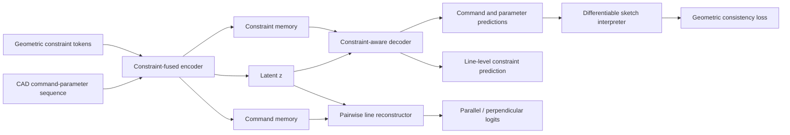

# CF-DeepCAD — Section 4: Method (English manuscript draft)

This file provides an **English Methods** draft aligned with the implementation described in the Chinese manuscript (`论文初稿_Constraint_Fused_DeepCAD_LowRisk.md`). Notation follows common CV/CAD papers (explicit summation domains; display equations use plain text blocks and can be migrated to LaTeX as `\mathbf{e}_k^{\mathrm{con}}`, `\operatorname{LN}`, etc.).

---

## 4. Method

### 4.1 Overview

The key idea of CF-DeepCAD is to treat **geometric constraints as first-class structural signals** alongside CAD commands: they enter a **joint encoder**, remain **visible in decoding** (via constraint memory), and are reinforced by **multi-granularity losses**. The model comprises five components:

1. **Constraint representation.** Unary sketch relations (horizontal / vertical) are encoded as line-wise multi-labels; pair relations (parallel / perpendicular) are encoded as relational tokens and pairwise matrices.
2. **Constraint-fused encoder.** On top of the **same command–parameter embedding backbone as DeepCAD**, we add an **additive line-wise correction** from `constraint_tags` projected to `R^d` before positional encoding; CAD tokens are then concatenated with constraint tokens and processed by a Transformer encoder.
3. **Constraint-aware decoder.** Cross-attention from decoder states to **constraint memory** lets constraint information influence command and parameter predictions directly.
4. **Line-level pairwise relation reconstructor.** Line segment representations are aggregated from command memory, and parallel/perpendicular logits are produced for line pairs.
5. **Multi-task objective.** Command/parameter reconstruction is trained jointly with line-level constraint prediction, constraint-matrix reconstruction, and a differentiable geometric consistency term.

The overall data flow is illustrated below.



### 4.1.1 Operator notation

Unless stated otherwise, we use the following conventions:

- **`Concat(u, v)`** stacks `u` and `v` along the **last feature dimension**, yielding a vector of dimension `dim(u)+dim(v)`; bracket notation `[u; v]` is synonymous with `Concat(u, v)`.
- **`Attention(Q, K, V)`** denotes **scaled dot-product attention**, `softmax(Q K^T / sqrt(d_k)) V`, with `d_k` the projected key/query width; see Vaswani et al. (NeurIPS 2017) for the canonical definition. Multi-head variants are summarized in Sec. 4.4.
- **`MultiHead(·)`** runs multiple attention heads in parallel, concatenates their outputs along the feature axis, and applies an output projection (Sec. 4.4).
- **`Dropout(·)`** applies elementwise Bernoulli masking during training with a keep probability; at inference it is disabled or replaced by deterministic scaling following common practice.
- **`LN(·)`** is **layer normalization** (mean/variance normalization along the feature axis followed by a learnable affine map).
- **`ζ(·)`** (Sec. 4.3) maps a four-dimensional line-wise tag vector `η_t ∈ R^4` to `R^d` with a shallow MLP; it provides the **CAD-side** additive correction from `constraint_tags`.

### 4.2 Constraint representation: from coordinates to structural supervision

In DeepCAD, line segments are **implicitly** defined by curve commands and their quantized endpoint parameters. Learning parallel/perpendicular regularities purely from discrete parameters requires the network to discover high-dimensional couplings. We therefore **explicitize** sketch relations as supervised structure.

For the *i*-th line segment, define a unary label vector

```text
u_i = [y_i^h, y_i^v] ∈ {0, 1}^2
```

where `y_i^h = 1` (resp. `y_i^v = 1`) indicates a horizontal (resp. vertical) segment. For each ordered pair `(i, j)`, define

```text
p_ij = [y_ij^p, y_ij^o] ∈ {0, 1}^2
```

where `y_ij^p = 1` means `l_i` and `l_j` are parallel, and `y_ij^o = 1` means they are perpendicular. Parallelism and perpendicularity are **undirected** in geometry; hence `p_ij` and `p_ji` are interchangeable in principle.

**Constraint tokens.** Each extracted relation is also packaged as a discrete token

```text
τ_k = (r_k, i_k, j_k)
```

where `r_k` is a categorical **constraint type**, and `i_k`, `j_k` are **local line indices** referenced by the constraint. To keep a **unified tuple interface** for unary and pair constraints, we set **`j_k = i_k` for unary axial constraints** during preprocessing. Each `τ_k` is (i) embedded as a constraint token in the encoder input stream, and (ii) tied to unary/pair label tensors that supply auxiliary supervision terms in the total training objective.

**Padding and truncation.** For efficiency, the constraint-token stream is padded or truncated to a fixed cap `M_max = 128`. If more than `M_max` constraints are extracted, only the first `M_max` are kept; shorter streams are padded with an **empty** constraint type, and invalid positions are masked in encoder/decoder attention. In the following, `M` denotes the number of **valid** constraints; tensor length is always `M_max`.

**Rationale.** Axial relations attach to **single lines** (unary labels); parallel/perpendicular relations attach to **line pairs** (pair labels). This factorization matches CAD sketch semantics better than collapsing all constraints into a single global tag.

**From discrete `τ_k` to continuous `e_k^con ∈ R^d`.** We map each tuple `τ_k` to a *d*-dimensional constraint-token embedding by composing (i) a **type embedding operator** `φ`, (ii) a **line-index embedding operator** `λ`, (iii) feature-axis concatenation `Concat` (Sec. 4.1.1), and (iv) a shallow feed-forward fusion map `ψ` (implemented as a two-layer MLP). Concretely, `φ` maps discrete constraint types into `R^d`, `λ` maps discrete line indices into `R^{d_l}`, and `ψ: R^{2 d_l} → R^d` maps the concatenated line embeddings to dimension `d`. We define

```text
e_k^con = LN( W × ( φ(r_k) + ψ( [λ(i_k); λ(j_k)] ) ) + b ),
```

where `W ∈ R^{d×d}`, `b ∈ R^d` are learnable parameters and `LN(·)` is defined in Sec. 4.1.1. For **unary axial** constraints, `i_k = j_k`, so the concatenation duplicates the same line embedding; the same `ψ` maps it to `R^d`, avoiding a separate unary branch. The resulting `e_k^con` encodes both **which** relation type is active and **which** line(s) it applies to, and is consumed by the subsequent Transformer stack.

**Independence of the two constraint pathways.** The constraint-token embedding `e_k^con` (Sec. 4.2) and the CAD-side tag correction `ζ(η_t)` (formalized in Sec. 4.3) are **separate mechanisms**: the former supplies an explicit relational token sequence; the latter biases command positions using a compact four-channel tag vector.

### 4.3 Constraint-fused encoder

**Deviation from vanilla DeepCAD inputs.** Vanilla DeepCAD forms each position embedding as the sum of command-type and argument embeddings (plus optional group embeddings), followed by positional encoding. We **retain** this backbone—denoted by `Ψ_cmd(c_t)` and `Ψ_arg(a_t)` (and the same optional `Ψ_grp(g_t)` as in DeepCAD)—but **add** a learned projection `ζ(η_t)` of a line-wise tag vector `η_t ∈ R^4` **before** positional encoding. The four entries of `η_t` indicate participation of position `t` in horizontal, vertical, parallel, and perpendicular relations: if `t` corresponds to a sketch line command and the line (or a relation endpoint involving it) hits a category, the corresponding entry is 1; otherwise it is 0 (including non-line commands). Here `ζ: R^4 → R^d` is a two-layer MLP matching the token width. The CAD-side pre-encoding reads

```text
e_t^pre = Ψ_cmd(c_t) + Ψ_arg(a_t) + Ψ_grp(g_t) + ζ(η_t),
e_t^cad = PE(e_t^pre),
```

where `c_t`, `a_t`, `g_t` are command type, arguments, and group id; omit `Ψ_grp(g_t)` when group embeddings are disabled; `PE(·)` is the same positional encoding as in DeepCAD. The **only structural change relative to the baseline** is the term `ζ(η_t)`, which writes sketch-level relation priors directly into command-token initials.

Let `e_t^cad` be the sequence produced above, and let `e_k^con` be constraint-token embeddings from Sec. 4.2. We form a **joint sequence**

```text
X = [e_1^cad, ..., e_T^cad, e_1^con, ..., e_M^con].
```

To distinguish the two modalities, we add a **learned segment embedding** `s_g(n) ∈ R^d`:

```text
x̃_n = x_n + s_g(n),
```

where `g(n) ∈ {cad, con}` indicates whether position `n` belongs to the CAD segment or the constraint segment. A Transformer encoder yields joint memory

```text
H = TransformerEncoder(X̃),
```

which is split into **command memory** and **constraint memory**:

```text
H^cad = H_{1:T},    H^con = H_{T+1:T+M}.
```

A global latent `z` is obtained by pooling over the joint memory followed by a bottleneck:

```text
z = B(Pool(H)).
```

Here `H ∈ R^{(T+M)×d}` stacks contextualized CAD and constraint tokens; `Pool(·)` is a sequence aggregation operator (e.g., masked mean); `B(·)` is the bottleneck map. Compared with vanilla DeepCAD, self-attention is trained to exploit (i) sequential dependencies among commands, (ii) relational structure among constraints, (iii) **cross-modal alignment** between commands and constraints, and (iv) **line-wise tag priors** injected through `ζ(η_t)` at CAD positions.

### 4.4 Constraint-aware decoder

The vanilla DeepCAD decoder conditions primarily on a **single** global vector `z`. This is effective for sequence reconstruction but is a bottleneck for **fine-grained pair relations**: all pairwise structure must be compressed into `z` and recovered indirectly. We insert **multi-head cross-attention** from decoder states to **constraint memory** `H^con`. Let `G ∈ R^{T×d}` be decoder states initialized from `z`. Standard attention uses queries `Q = G` and keys/values `K = V = H^con`. In our setup, we use **`h = 8` attention heads** (matching the constraint-fused encoder and the backbone Transformer width):

```text
Q = G,  K = H^con,  V = H^con,

MultiHead(Q, K, V) = Concat(head_1, ..., head_8) × W^O,

head_i = Attention(Q × W_i^Q, K × W_i^K, V × W_i^V),   i = 1, ..., 8.
```

We denote the output compactly as `Attn(G, H^con)`; `Attention(·)` follows Sec. 4.1.1. A **constraint padding mask** suppresses padded constraint positions. Residual integration reads

```text
G̃ = G + Dropout(Attn(G, H^con)).
```

`Dropout(·)` is as in Sec. 4.1.1.

This module (i) provides a **shortcut** for constraint information that need not be fully encoded in `z`, (ii) injects constraints into the **main decoding path** (not only auxiliary heads), and (iii) supports dropout-based regularization so the model does not over-rely on explicit constraints at the expense of `z`.

### 4.5 Line-level pairwise relation reconstructor

Parallel and perpendicular constraints are inherently **pairwise** over segments `(l_i, l_j)`. Regressing a full `N × N × 2` tensor directly from `z` alone forces all pair relations into one vector. Instead, we **score each candidate pair** using local line representations.

Let `\pi(i)` map line index `i` to its **line-command position** in the sequence. We gather a line representation from command memory:

```text
q_i = H^cad_{π(i)} ∈ R^d.
```

For each pair `(i, j)`, we build a relation feature

```text
m_ij = [W_l × q_i; W_l × q_j; W_z × z],
```

where `W_l`, `W_z` are learnable projections and `[;]` is concatenation. A feed-forward scorer `f_ψ(·)` outputs parallel/perpendicular logits

```text
s_ij = f_ψ(m_ij) ∈ R^2.
```

Because relations are undirected, logits are **symmetrized**:

```text
p̂_ij = (1/2) × (s_ij + s_ji).
```

This design aligns supervision with the **pairwise** semantics of parallel and perpendicular constraints.

### 4.6 Line-level constraint prediction and supervision focus

We add a line-level prediction head on decoder states. Crucially, the prediction loss is averaged **only over true line-command positions**. Let `m_t^line ∈ {0,1}` indicate whether timestep `t` is a line command; let `ŷ_t ∈ [0,1]^C` be predicted probabilities and `y_t ∈ {0,1}^C` ground-truth tags with `C = 4` channels (horizontal, vertical, parallel, perpendicular). With `N_line = Σ_t m_t^line`, we define

```text
L_pred = (1 / (N_line × C + ε)) × Σ_t ( m_t^line × Σ_{c=1}^C BCE(ŷ_{t,c}, y_{t,c}) ),
```

where `BCE` is the binary cross-entropy. Non-line commands (e.g., extrude, EOS/SOS) carry mostly zero tags; including them would dilute supervision toward a trivial “no constraint” predictor. The **LINE-only** mask focuses learning on geometrically meaningful positions.

### 4.7 Differentiable geometric consistency loss

Predicting constraint tags or reconstructing relation matrices does not, by itself, guarantee that **decoded discrete parameters** satisfy geometry. We therefore apply a **differentiable sketch interpreter** that maps argument logits to **soft** segment endpoints, and penalize **directional** inconsistencies.

Let `a_i, b_i ∈ R^2` be soft endpoints of line `i`. The unit direction is

```text
d_i = (b_i - a_i) / max(||b_i - a_i||_2, ε).
```

Axial residuals are

```text
r_h(i) = d_{i,y}^2,    r_v(i) = d_{i,x}^2.
```

For pairs, we use the absolute cosine between directions (orientation is unoriented in CAD strokes):

```text
r_p(i, j) = 1 - |d_i · d_j|,    r_o(i, j) = |d_i · d_j|.
```

Let `m_i \in \{0,1\}` mark **valid** lines, and let `u_i^h`, `u_i^v`, `p_{ij}`, `o_{ij}` be **ground-truth** unary/pair indicators. Define nonnegative counts

```text
(1) N_h = #{ i : m_i = 1, u_i^h = 1 },
(2) N_v = #{ i : m_i = 1, u_i^v = 1 },
(3) N_p = #{ (i,j) : m_i × m_j × p_{ij} = 1 },
(4) N_o = #{ (i,j) : m_i × m_j × o_{ij} = 1 }.
```

Because all factors are binary, `m_i × m_j × p_{ij} = 1` iff `m_i = m_j = p_{ij} = 1` (and analogously for `o_{ij}`): both endpoints must be valid lines and the corresponding relation label must be active. Let `N_geom = N_h + N_v + N_p + N_o`. The geometric loss is the **mean residual over all active constraints**, with a safe denominator:

```text
L_geom =
(1 / max(N_geom, 1)) × (
  Σ_{i: m_i × u_i^h = 1} r_h(i)
  + Σ_{i: m_i × u_i^v = 1} r_v(i)
  + Σ_{(i,j): m_i × m_j × p_{ij} = 1} r_p(i, j)
  + Σ_{(i,j): m_i × m_j × o_{ij} = 1} r_o(i, j)
).
```

The four sums accumulate **numerator** residuals; normalization by `max(N_geom, 1)` implements averaging and avoids division by zero when a minibatch contains no valid geometric constraints. Subscripts such as `Σ_{i : m_i × u_i^h = 1}` denote summation **only** over indices satisfying the predicate. This term acts as a **continuous-space structural regularizer** and does **not** replace discrete command/parameter supervision.

### 4.8 Overall training objective

The full objective is

```text
L = L_cmd + α × L_pred + β × L_rec + γ × L_geom,
```

where `L_cmd` is the command-and-parameter cross-entropy, `L_pred` is defined in Sec. 4.6, and unary/pair reconstruction uses positively weighted BCE:

```text
L_rec = BCE_w(U_pred, U) + BCE_w(P_pred, P).
```

`BCE_w` mitigates sparsity-induced imbalance. In our experiments, `α=3`, `β=1`, and `γ=3`, reflecting that sequence reconstruction remains primary while constraint prediction, matrix reconstruction, and geometric consistency provide complementary structural priors.

---

## Notes for LaTeX migration

- Replace Markdown `` `...` `` with proper math environments: e.g., `\mathbf{e}_k^{\mathrm{con}}`, `\operatorname{LN}`, `\operatorname{Emb}^{\mathrm{type}}`, `\operatorname{Emb}^{\mathrm{line}}`, `\psi` for the fusion MLP.
- Use `\coloneqq` or `\triangleq` for definitions if required by the venue.
- Keep “constraint memory” / “command memory” as defined in Sec. 4.3 for consistency with decoder cross-attention notation.
