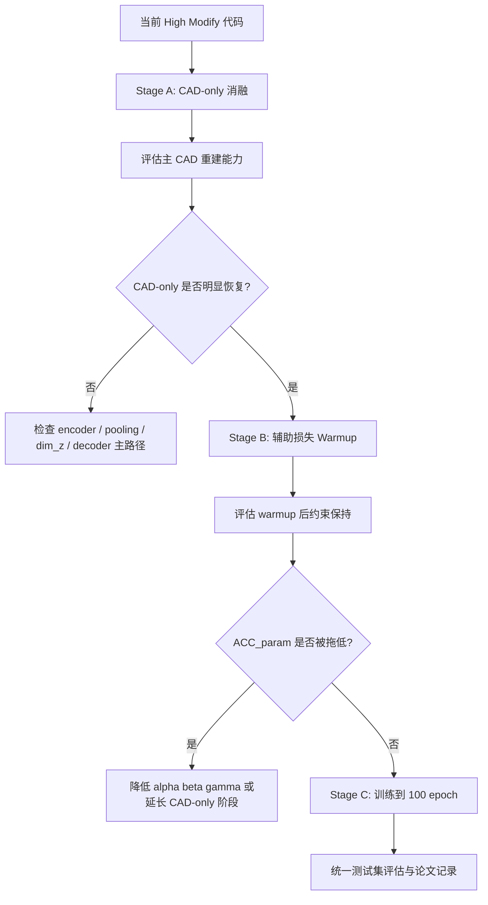

# CAD-only 消融、辅助损失 Warmup 与 100 Epoch 训练方案

<!-- markdownlint-disable MD024 -->

本文档面向 `constraint_fused_deepcad_simplify_modify2_low_riskbased_high_modify` 当前训练结果低于原始 DeepCAD 的问题，给出一套独立、可执行、可复现实验方案。方案目标不是立即修改模型结构，而是先用消融实验判断性能下降来自哪里，再用辅助损失 warmup 重新组织训练，使 High Modify 版本在保持 `P(S | z)` 生成闭包的前提下，逐步恢复 CAD 序列重建能力并提升约束关系保持能力。

本文档遵循项目技术方案规范，包含方案目标、整体架构、模块架构、训练计划、评估协议、风险与总结。每个核心模块均给出模块作用、模块原理、代码或命令草案、举例说明。

---

## 1. 方案目标

### 1.1 背景与问题

当前 High Modify 版本在测试集上的结果为：

| 指标 | 当前 High Modify | 原始 DeepCAD 参考 | 差距 |
| --- | ---: | ---: | ---: |
| `ACC_cmd` | 0.9671 | 0.9936 | -0.0265 |
| `ACC_param` | 0.8690 | 0.9759 | -0.1069 |
| `ratio_h` | 0.8965 | 0.9510 | -0.0545 |
| `ratio_v` | 0.9148 | 0.9574 | -0.0426 |
| `parallel_recall_index_aligned` | 0.7377 | 0.8617 | -0.1240 |
| `perpendicular_recall_index_aligned` | 0.8595 | 0.9279 | -0.0684 |

训练日志显示当前模型大约只训练到 `epoch=25`，`loss_args` 仍在明显波动。由于原始 DeepCAD 对照模型来自 `ckpt_epoch1000.pth`，当前结果不能直接说明 High Modify 架构无效，更可能是以下因素叠加：

1. 训练轮数不足，参数离散值重建尚未充分收敛。
2. `alpha=3.0`、`beta=1.0`、`gamma=3.0` 的辅助损失早期过强，影响主 CAD 重建。
3. `dim_z=512`、segment-separated pooling、decoder-side recon 等新模块增加了优化难度。
4. 当前 `train_metrics.csv` 重复写入，干扰人工观察趋势。

### 1.2 核心目标

本方案目标是建立三阶段训练验证闭环：

1. **CAD-only 消融**：关闭所有辅助损失，只保留命令分类和参数重建，验证 High Modify 主自编码路径是否具备恢复原始 DeepCAD 重建能力的基础。
2. **辅助损失 Warmup**：在主任务已经稳定后，逐步引入 `pred_loss`、`recon_loss` 和 `geom_loss`，避免早期梯度竞争。
3. **训练到 100 epoch**：固定最优 warmup 策略训练至 100 epoch，并在统一测试集上评估序列精度、几何关系保持和解析稳定性。

### 1.3 验收目标

短期验收目标不是立刻超过原始 DeepCAD，而是判断问题归因：

| 阶段 | 验收重点 | 期望现象 |
| --- | --- | --- |
| CAD-only | 主路径是否能收敛 | `ACC_cmd`、`ACC_param` 显著高于当前 epoch 25 结果 |
| Warmup | 辅助损失是否不再拖累参数重建 | `ACC_param` 不明显低于 CAD-only，同时约束指标提升 |
| 100 epoch | 是否形成可论文使用的稳定证据 | `n_parse_fail_pred`、extrude mismatch 降低，四类约束指标稳定 |

---

## 2. 整体架构

### 2.1 实验整体流程



### 2.2 实验矩阵

| 实验 ID | 目的 | `alpha` | `beta` | `gamma` | `enable_soft_geometry` | 训练轮数 | 说明 |
| --- | --- | ---: | ---: | ---: | --- | ---: | --- |
| `H0_current` | 当前结果复现 | 3.0 | 1.0 | 3.0 | true | 当前 checkpoint | 作为问题基线 |
| `H1_cad_only_100` | 主路径能力消融 | 0.0 | 0.0 | 0.0 | false | 100 | 只优化 `loss_cmd + loss_args` |
| `H2_warmup_mild_100` | 温和辅助损失 | 0 → 1.0 | 0 → 0.5 | 0 → 1.0 | true | 100 | 推荐首选 |
| `H3_warmup_strong_100` | 辅助损失增强 | 0 → 2.0 | 0 → 0.7 | 0 → 2.0 | true | 100 | 仅当 H2 不足时尝试 |
| `H4_no_geom_100` | 几何损失消融 | 0 → 1.0 | 0 → 0.5 | 0.0 | false | 100 | 判断 `geom_loss` 是否拖累参数 |

### 2.3 指标闭环

每个实验必须记录以下三类指标：

| 指标类别 | 字段 |
| --- | --- |
| 序列重建 | `ACC_cmd`、`ACC_param`、各命令 acc、Line/Arc/Circle/Ext 参数 acc |
| 约束保持 | `ratio_h`、`ratio_v`、`parallel_recall_index_aligned`、`perpendicular_recall_index_aligned` |
| 解析稳定性 | `n_parse_fail_pred`、`n_samples_extrude_count_mismatch`、`n_extrudes_skipped_line_count_mismatch_total` |

---

## 3. 模块架构

### 3.1 CAD-only 消融模块

#### 模块作用

CAD-only 消融用于回答一个核心问题：在关闭所有约束辅助监督后，High Modify 的 encoder、bottleneck 和 latent-only decoder 是否能单独学好 `P(S | z)`。

如果 CAD-only 仍然明显低于原始 DeepCAD，说明主要问题在主自编码路径，如 `dim_z=512`、segment-separated pooling、约束 token 融合或训练轮数；如果 CAD-only 明显恢复，而开启辅助损失后下降，则说明主要问题是辅助损失权重和调度。

#### 模块原理

训练总损失从：

```text
L = L_cad + alpha * L_pred + beta * L_recon + gamma * L_geom
```

退化为：

```text
L = L_cad
L_cad = L_cmd + L_args
```

其中 `L_cmd` 和 `L_args` 仍使用 DeepCAD 原始的命令分类和参数离散交叉熵，保持 `loss_args_weight=2.0`。

#### 命令草案

```bat
@echo off
cd /d "%~dp0.."
python -m constraint_fused_deepcad_simplify_modify2_low_riskbased_high_modify.train ^
  --data_root data ^
  --proj_dir proj_log/constraint_fused_deepcad_simplify_modify2_low_riskbased_high_modify ^
  --exp_name cf_high_modify_cad_only_100 ^
  --batch_size 64 ^
  --nr_epochs 100 ^
  --alpha 0 ^
  --beta 0 ^
  --gamma 0 ^
  --disable_soft_geometry ^
  -g 0
```

#### 举例说明

若 `H1_cad_only_100` 在 epoch 100 的 `ACC_param` 从当前 `0.8690` 提升到接近 `0.95+`，说明 High Modify 主路径有恢复空间，后续应重点调辅助损失 warmup。若仍停留在 `0.87~0.90`，应优先检查主结构，而不是继续加大约束损失。

---

### 3.2 辅助损失 Warmup 模块

#### 模块作用

辅助损失 warmup 用于避免训练早期约束预测、关系重建和软几何损失过早主导梯度。它让模型先学会重建 CAD 命令与参数，再逐步学习几何关系。

#### 模块原理

将辅助权重设计为随 epoch 或 step 变化的函数：

```text
w(t) = clamp((t - t_start) / (t_end - t_start), 0, 1)

alpha_t = alpha_final * w(t)
beta_t  = beta_final  * w(t)
gamma_t = gamma_final * w(t)
```

推荐首版按 epoch 调度：

| 训练区间 | 目标 | `alpha_t` | `beta_t` | `gamma_t` |
| --- | --- | ---: | ---: | ---: |
| epoch 1-10 | CAD-only 预热 | 0 | 0 | 0 |
| epoch 11-30 | 线性 warmup | 0 → 1.0 | 0 → 0.5 | 0 → 1.0 |
| epoch 31-100 | 稳定联合训练 | 1.0 | 0.5 | 1.0 |

#### 代码草案

建议在训练编排层加入权重调度，而不是改变损失定义本身。示例：

```python
def scheduled_aux_weights(epoch, alpha_final=1.0, beta_final=0.5, gamma_final=1.0):
    if epoch <= 10:
        ratio = 0.0
    elif epoch <= 30:
        ratio = float(epoch - 10) / 20.0
    else:
        ratio = 1.0
    return {
        "alpha": alpha_final * ratio,
        "beta": beta_final * ratio,
        "gamma": gamma_final * ratio,
    }
```

接入位置建议在每个 epoch 开始或每个 batch 前更新 `cfg.alpha`、`cfg.beta`、`cfg.gamma`：

```python
weights = scheduled_aux_weights(
    epoch,
    alpha_final=cfg.alpha,
    beta_final=cfg.beta,
    gamma_final=cfg.gamma,
)
cfg.alpha = weights["alpha"]
cfg.beta = weights["beta"]
cfg.gamma = weights["gamma"]
```

更稳妥的实现方式是不要直接覆盖最终配置，而是在 `execute(batch, loss_weights_override=None)` 中传入当前权重，避免 checkpoint 和 `config.txt` 中的最终目标权重被动态值污染。

#### 举例说明

以 `H2_warmup_mild_100` 为例，命令行最终权重写为：

```bat
--alpha 1.0 --beta 0.5 --gamma 1.0
```

训练时第 1-10 epoch 实际使用 `0, 0, 0`，第 20 epoch 实际使用约 `0.5, 0.25, 0.5`，第 31 epoch 后才使用完整权重。

---

### 3.3 100 Epoch 训练模块

#### 模块作用

100 epoch 训练用于形成阶段性可比结果。它不是最终论文极限训练，而是比当前 epoch 25 更可靠的中程训练基线，可用于判断 High Modify 方案是否值得继续训练到更长周期。

#### 模块原理

训练过程保持三条原则：

1. 主任务优先：`loss_cmd + loss_args` 始终直接进入总损失。
2. 辅助任务渐进：约束预测、关系重建和 soft geometry 不在训练早期抢占优化方向。
3. 评估多 checkpoint：不能只看 `latest`，需要评估 `ckpt_epoch25`、`ckpt_epoch50`、`ckpt_epoch75`、`ckpt_epoch100`。

#### 命令草案

温和 warmup 推荐训练命令：

```bat
@echo off
cd /d "%~dp0.."
python -m constraint_fused_deepcad_simplify_modify2_low_riskbased_high_modify.train ^
  --data_root data ^
  --proj_dir proj_log/constraint_fused_deepcad_simplify_modify2_low_riskbased_high_modify ^
  --exp_name cf_high_modify_warmup_mild_100 ^
  --batch_size 64 ^
  --nr_epochs 100 ^
  --alpha 1.0 ^
  --beta 0.5 ^
  --gamma 1.0 ^
  --save_frequency 5 ^
  -g 0
```

评估命令模板：

```bat
@echo off
cd /d "%~dp0.."
python -m constraint_fused_deepcad_simplify_modify2_low_riskbased_high_modify.evaluate ^
  --data_root data ^
  --proj_dir proj_log/constraint_fused_deepcad_simplify_modify2_low_riskbased_high_modify ^
  --exp_name cf_high_modify_warmup_mild_100 ^
  --ckpt ckpt_epoch100 ^
  --eval_split test
```

#### 举例说明

如果 `ckpt_epoch50` 的 `ACC_param` 已经明显高于当前 `0.8690`，但约束指标还未恢复，可以继续训练并观察 `ckpt_epoch75/100`。如果 `ACC_param` 在加入 warmup 后比 CAD-only 低超过 2 个百分点，应降低 `alpha/beta/gamma` 或延长 CAD-only 预热到 20 epoch。

---

### 3.4 日志与结果归档模块

#### 模块作用

该模块保证每个实验有独立日志目录、配置快照、训练曲线、测试集 summary 和重建精度文件，避免不同实验互相覆盖。

#### 模块原理

每个实验使用独立 `exp_name`：

```text
cf_high_modify_cad_only_100
cf_high_modify_warmup_mild_100
cf_high_modify_warmup_strong_100
cf_high_modify_no_geom_100
```

每个实验目录应包含：

```text
config.txt
model/latest.pth
model/ckpt_epoch*.pth
artifacts/train_metrics.csv
artifacts/test_eval_*/summary.json
artifacts/reconstruction_*_acc_stat.txt
```

#### 代码草案

当前 `train.py` 同时调用：

```python
append_csv_row(metrics_csv, row)
tracker.append_train_metrics(row)
```

而 `tracker.append_train_metrics(row)` 写入的也是同一个 `artifacts/train_metrics.csv`。建议只保留一个写入路径：

```python
append_csv_row(metrics_csv, row)
# tracker.append_train_metrics(row)  # 避免重复写入同一 CSV
```

或让 `ExperimentTracker` 改写到独立文件，例如：

```text
artifacts/train_metrics_tracker.csv
```

#### 举例说明

如果不修复重复写入，统计训练趋势时必须按 `(epoch, step)` 去重，否则窗口均值和日志长度都会被误导。该问题不影响反向传播，但会影响实验分析。

---

## 4. 详细实施计划

### 4.1 Phase 0：准备与冻结当前基线

#### 目标

冻结当前 `H0_current` 的配置、checkpoint 和测试结果，作为后续对照。

#### 执行清单

1. 复制或记录当前 `cf_high_modify/config.txt`。
2. 记录当前测试集 `summary.json` 和 `reconstruction_*_acc_stat.txt`。
3. 记录当前训练到的 epoch 和 step。
4. 修复或在分析脚本中处理 `train_metrics.csv` 重复行。

#### 产出物

| 文件 | 说明 |
| --- | --- |
| `H0_current_config.txt` | 当前配置快照 |
| `H0_current_summary.json` | 当前约束评估结果 |
| `H0_current_acc_stat.txt` | 当前命令与参数重建结果 |

---

### 4.2 Phase 1：CAD-only 消融

#### 目标

验证 High Modify 的主自编码路径在关闭辅助损失后是否能恢复到较高 `ACC_cmd` 和 `ACC_param`。

#### 推荐配置

| 参数 | 值 |
| --- | --- |
| `exp_name` | `cf_high_modify_cad_only_100` |
| `batch_size` | 64，显存允许时优先 128/256 |
| `nr_epochs` | 100 |
| `alpha` | 0 |
| `beta` | 0 |
| `gamma` | 0 |
| `enable_soft_geometry` | false |
| `save_frequency` | 5 |

#### 评估点

| checkpoint | 动作 |
| --- | --- |
| `ckpt_epoch25` | 与当前 `H0_current` 对比，判断是否因配置差异或训练状态导致 |
| `ckpt_epoch50` | 判断主任务中期收敛趋势 |
| `ckpt_epoch100` | 作为 CAD-only 主结论 |

#### 判定规则

| 现象 | 结论 | 下一步 |
| --- | --- | --- |
| `ACC_param` 明显提升，接近原始 DeepCAD | 主路径可训练，辅助损失是主要风险 | 进入 Phase 2 |
| `ACC_param` 仍低 | 主架构或训练条件存在问题 | 检查 `dim_z`、pooling、batch size、训练轮数 |
| `ACC_cmd` 提升但 `ACC_param` 不提升 | 参数通道优化不足 | 增大 batch、延长训练、检查 `loss_args` 与参数分布 |

---

### 4.3 Phase 2：辅助损失 Warmup

#### 目标

在 CAD-only 预热基础上逐步加入约束监督，观察约束指标是否提升，同时保护 `ACC_param`。

#### 推荐配置 H2

| 参数 | 值 |
| --- | --- |
| `exp_name` | `cf_high_modify_warmup_mild_100` |
| `alpha_final` | 1.0 |
| `beta_final` | 0.5 |
| `gamma_final` | 1.0 |
| `warmup_start_epoch` | 10 |
| `warmup_end_epoch` | 30 |
| `nr_epochs` | 100 |

#### 备选配置 H3

| 参数 | 值 |
| --- | --- |
| `exp_name` | `cf_high_modify_warmup_strong_100` |
| `alpha_final` | 2.0 |
| `beta_final` | 0.7 |
| `gamma_final` | 2.0 |
| `warmup_start_epoch` | 10 |
| `warmup_end_epoch` | 40 |
| `nr_epochs` | 100 |

#### 判定规则

| 现象 | 结论 | 调整建议 |
| --- | --- | --- |
| 约束指标提升，`ACC_param` 下降小于 1% | warmup 有效 | 保留 H2 |
| 约束指标提升，`ACC_param` 下降超过 2% | 辅助损失仍偏强 | 降低 `gamma` 或延长 CAD-only |
| `geom_loss` 下降但测试约束指标不升 | soft geometry 代理目标不可靠 | 跑 H4 no-geom |
| `pred_loss/recon_loss` 很低但约束指标低 | 辅助头学会标签但没有改善 logits | 降低辅助头权重，强化主任务 |

---

### 4.4 Phase 3：训练到 100 Epoch 与统一评估

#### 目标

选择 `H1`、`H2`、`H4` 至少三组实验训练到 100 epoch，并统一测试集评估。

#### 推荐执行顺序

1. `H1_cad_only_100`
2. `H2_warmup_mild_100`
3. `H4_no_geom_100`
4. 如果 H2 指标不足，再跑 `H3_warmup_strong_100`

#### 统一结果表

最终结果建议整理为：

| 实验 | epoch | `ACC_cmd` | `ACC_param` | `ratio_h` | `ratio_v` | `parallel` | `perpendicular` | `parse_fail` | `ext_mismatch` |
| --- | ---: | ---: | ---: | ---: | ---: | ---: | ---: | ---: | ---: |
| 原始 DeepCAD | 1000 | 0.9936 | 0.9759 | 0.9510 | 0.9574 | 0.8617 | 0.9279 | 29 | 64 |
| H0 current | 25 | 0.9671 | 0.8690 | 0.8965 | 0.9148 | 0.7377 | 0.8595 | 315 | 523 |
| H1 CAD-only | 100 | 待填 | 待填 | 待填 | 待填 | 待填 | 待填 | 待填 | 待填 |
| H2 warmup mild | 100 | 待填 | 待填 | 待填 | 待填 | 待填 | 待填 | 待填 | 待填 |
| H4 no geom | 100 | 待填 | 待填 | 待填 | 待填 | 待填 | 待填 | 待填 | 待填 |

---

## 5. 推荐代码改造点

### 5.1 新增辅助损失调度配置

建议在 `config_constraint_fused_high_modify.py` 中增加：

```python
parser.add_argument("--aux_schedule", type=str, default="constant", choices=["constant", "warmup"])
parser.add_argument("--aux_warmup_start_epoch", type=int, default=10)
parser.add_argument("--aux_warmup_end_epoch", type=int, default=30)
```

示例：

```bat
--aux_schedule warmup ^
--aux_warmup_start_epoch 10 ^
--aux_warmup_end_epoch 30 ^
--alpha 1.0 ^
--beta 0.5 ^
--gamma 1.0
```

### 5.2 新增权重调度函数

建议在 `train.py` 或独立 `application/loss_schedule.py` 中实现：

```python
def resolve_aux_weights(cfg, epoch: int) -> tuple[float, float, float]:
    if getattr(cfg, "aux_schedule", "constant") != "warmup":
        return cfg.alpha, cfg.beta, cfg.gamma

    start = cfg.aux_warmup_start_epoch
    end = cfg.aux_warmup_end_epoch
    if epoch <= start:
        ratio = 0.0
    elif epoch >= end:
        ratio = 1.0
    else:
        ratio = float(epoch - start) / float(max(end - start, 1))
    return cfg.alpha * ratio, cfg.beta * ratio, cfg.gamma * ratio
```

### 5.3 避免重复写入训练日志

建议在 `train.py` 中保留一个 CSV 写入入口：

```python
append_csv_row(metrics_csv, row)
# tracker.append_train_metrics(row)
```

或调整 `ExperimentTracker.append_train_metrics` 写入不同文件。否则每个 `(epoch, step)` 会重复两行。

### 5.4 日志中记录实际辅助权重

为了分析 warmup 是否生效，建议每行训练日志额外记录：

```python
aux_alpha=float(current_alpha)
aux_beta=float(current_beta)
aux_gamma=float(current_gamma)
```

这样后续可以区分配置最终权重与当前 batch 实际权重。

---

## 6. 风险与回退策略

| 风险 | 表现 | 回退策略 |
| --- | --- | --- |
| CAD-only 仍不收敛 | `ACC_param` 低、`loss_args` 高 | 增大 batch、训练更久、尝试 `dim_z=256` 对照 |
| warmup 后参数下降 | `ACC_param` 明显低于 CAD-only | 降低 `gamma`，延长 CAD-only 预热 |
| 几何损失代理失真 | `geom_loss` 下降但测试约束不升 | 关闭 `geom_loss`，只保留 `pred/recon` |
| 约束头过拟合 | `pred_loss/recon_loss` 很低但主指标差 | 降低 `alpha/beta`，加强主任务 |
| 评估波动 | 不同 checkpoint 差异大 | 评估 25/50/75/100，多点取趋势 |

---

## 7. 最终建议

首轮推荐只跑三组：

1. `H1_cad_only_100`：确定主路径上限。
2. `H2_warmup_mild_100`：验证温和辅助监督是否能兼顾 `ACC_param` 和约束保持。
3. `H4_no_geom_100`：确认 `geom_loss` 是否是拖慢参数重建的主要来源。

若 `H1` 明显好于当前结果，而 `H2` 比 `H1` 的 `ACC_param` 下降不超过 1% 且约束指标提升，则 High Modify 后续可以保留 warmup 策略继续训练更长周期。若 `H1` 本身不理想，应暂缓研究更强约束损失，优先检查主自编码路径、latent 容量、pooling 方式和训练资源配置。

本方案的核心判断标准是：**辅助损失必须服务于最终 CAD 序列的几何关系保持，不能以牺牲命令与参数重建为代价提前主导训练。**
