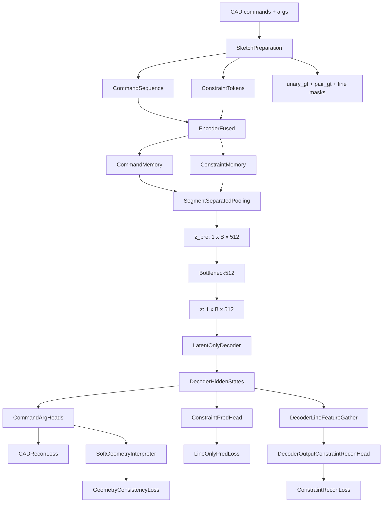
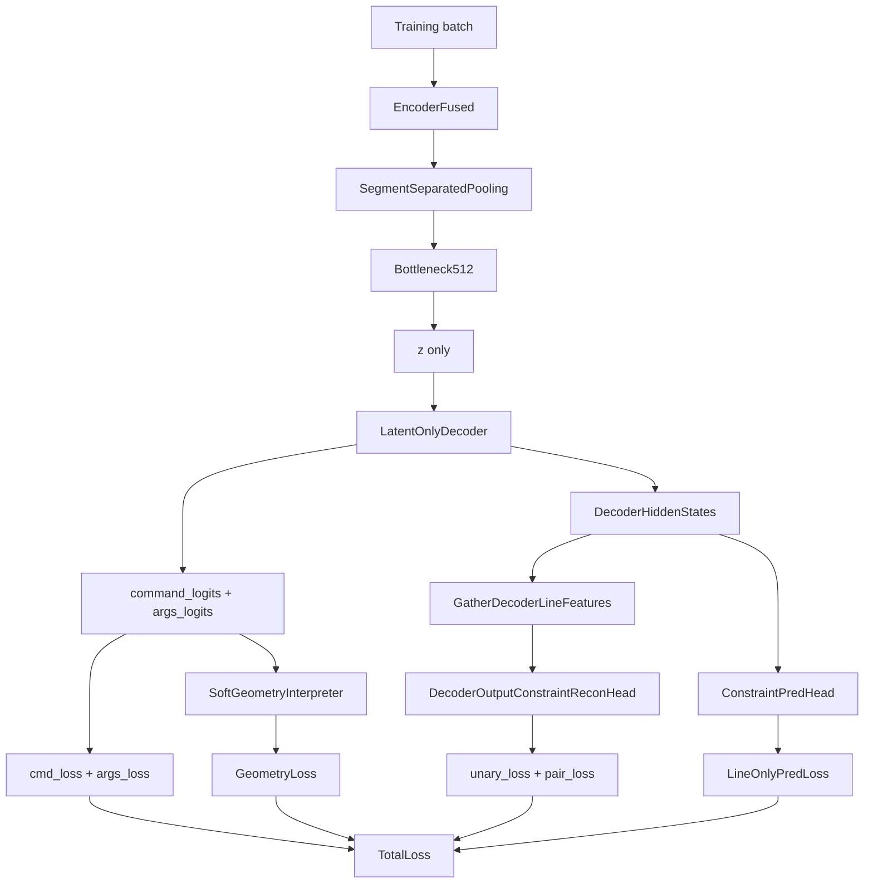

# Constraint-Fused DeepCAD High Modify DDD技术方案

本文档面向 `Constraint-Fused DeepCAD` 的 **High Modify 架构调整版**。它不是对 `5_constraint_fused_deepcad_simplify_modify2_low_risk` 的增量说明，而是一份独立完整的新版技术方案。

High Modify 方案以老师指出的四个问题为直接输入，重新约束 CF-DeepCAD 的生成闭包、约束监督位置、潜变量容量和约束感知池化方式：

1. 解码器训练和推理必须保持原始 DeepCAD 的生成闭包 `P(S | z)`，`z` 是生成 CAD 命令和参数的唯一必需条件，`constraint_memory` 不能作为主解码路径的必要输入。
2. `ConstraintReconHead` 不能直接从 `z` 重建约束，而应基于 Decoder Layer 之后的输出重建，使约束监督作用在可解释的解码表示上。
3. 当前 `z` 为 `1 x 256`，可能不足以同时承载命令重建和约束结构信息，需要设计可控的 latent 扩容方案。
4. 当前 Constraint-Aware Pooling 默认是全序列 masked mean，命令 token 与约束 token 被混合平均，应该改为命令与约束分离的池化策略。

本文档遵循项目技术方案规范，包含 **方案目标**、**整体架构**、**模块架构**、**训练与评估策略**、**代码改造清单** 和 **总结**。每个核心模块均包含模块作用、模块原理、代码草案与举例说明。

<!-- markdownlint-disable MD024 -->

---

## 1. 方案目标

### 1.1 问题背景

原始 DeepCAD 的核心生成假设是：

```text
z ~ N(0, I)
S ~ P(S | z)
```

其中 `S` 是完整 CAD 序列，包含命令 token 与参数离散值。模型训练时通过 encoder 将输入 CAD 序列压缩为 `z`，decoder 只以 `z` 为条件重建 CAD 序列；推理时随机采样 `z` 也应能独立生成 CAD 序列。

CF-DeepCAD 的目标是在不破坏上述生成闭包的前提下，让 `z` 对水平、竖直、平行、垂直等几何约束有更强表达能力。但 low risk 版本存在以下架构风险：

| 问题 | 当前风险 | High Modify 处理方式 |
| --- | --- | --- |
| Decoder 依赖 `constraint_memory` | 训练时 decoder 可通过 cross-attn 直接读取约束 token 记忆，形成 `P(S \| z, C)` | 移除主生成路径上的 constraint cross-attn，decoder 只接收 `z` |
| ReconHead 直接用 `z` | 约束重建损失直接作用于 latent，可能把 `z` 变成绕过 decoder 的约束表 | 约束重建改为基于 decoder hidden states 的 line features |
| `z` 容量不足 | `1 x 256` 同时保存命令和约束，容量可能不足 | 推荐扩容为单 token `1 x 512`，内部保留命令/约束分流 |
| pooling 混合平均 | full-sequence masked mean 混合命令 token 与约束 token | 使用 segment-separated pooling 分别池化命令和约束 |

### 1.2 总体目标

High Modify 的目标是：

> 保留 DeepCAD `P(S | z)` 的生成闭包，在 encoder 侧融合约束结构并扩容 latent，在 decoder 后输出侧施加约束监督，使约束信息通过 `z` 影响最终 CAD 序列，而不是通过推理期必需的外部 `constraint_memory` 影响生成。

### 1.3 技术目标

| 目标 | 说明 | 验收方式 |
| --- | --- | --- |
| 保持 latent-only decoder | decoder 的命令和参数生成只依赖 `z` | `decoder.forward(z)` 是主接口，训练和推理一致 |
| 约束监督后移 | 约束预测、unary recon、pair recon 均基于 decoder hidden states 或 logits | recon head 不再接收 `z` 作为直接输入 |
| 扩容 latent | 将默认 `dim_z` 从 256 提升到 512 | `z` shape 为 `(1, batch, 512)` |
| 分离池化 | command memory 与 constraint memory 分别池化后再融合 | 不再使用 joint masked mean 作为默认策略 |
| 保持可生成性 | 随机采样 `z` 无需 constraint token 即可生成 CAD | `generate_from_random(batch, dim_z)` 不需要外部约束 |
| 保持主任务优先 | 命令分类和参数重建仍是主任务 | 总损失以 `cmd_loss + args_loss` 为主 |

### 1.4 非目标

以下内容不属于 High Modify 首版范围：

1. 不引入推理期硬约束投影、后处理 snapping 或 rule-based 几何修正。
2. 不改变四类约束的定义：`Horizontal`、`Vertical`、`Parallel`、`Perpendicular`。
3. 不要求推理阶段输入约束 token、约束矩阵或人工草图约束。
4. 不把约束损失直接作用于 `z` 本身。
5. 不用辅助头替代 CAD 命令与参数主解码路径。

### 1.5 设计原则

1. **生成闭包优先**：命令和参数主解码路径必须是 `P(S | z)`。
2. **约束监督后置**：约束损失作用于 decoder layer 之后的表示或输出。
3. **编码侧融合，解码侧闭包**：约束信息可以进入 encoder 形成更好的 `z`，但不能成为 decoder 必需输入。
4. **容量扩充要保持单一 latent contract**：扩容后仍暴露为单 token `z`，保证随机采样路径简单。
5. **辅助任务服务主任务**：约束预测、关系重建和 soft geometry 监督都服务于最终 CAD 序列质量。

---

## 2. 整体架构

### 2.1 DDD 限界上下文

High Modify 将系统划分为五个限界上下文：

| 限界上下文 | 职责 | High Modify 变化 |
| --- | --- | --- |
| Sketch Preparation Context | 从 CAD vec 中提取命令、参数、line mask、约束标签与关系矩阵 | 数据契约保持不变 |
| Constraint-Fused Encoding Context | 联合编码命令流和约束 token，形成更强 latent | 使用命令/约束分离池化，输出扩容 `z` |
| Latent Bottleneck Context | 将 pooled representation 映射为可采样 latent | 默认 `dim_z=512`，保持单 token |
| Latent-Only Generation Context | 只以 `z` 生成 CAD 命令和参数 | 移除 decoder 主路径上的 `constraint_memory` |
| Decoder-Side Constraint Supervision Context | 基于 decoder hidden states 预测约束 | recon head 从 decoder line features 重建 |

### 2.2 核心信息流



### 2.3 训练信息流

训练阶段可以使用 ground-truth constraint tokens 进入 encoder，帮助形成结构化 latent：



```text
commands, args, constraint_tokens
        │
        ▼
EncoderFused
        │
        ├─ command_memory
        ├─ constraint_memory
        ▼
SegmentSeparatedPooling
        │
        ▼
z_pre -> Bottleneck512 -> z
        │
        ▼
LatentOnlyDecoder(z)
        │
        ├─ command_logits / args_logits -> CAD 主重建损失
        ├─ hidden_states -> line constraint prediction loss
        ├─ hidden_states -> unary / pair reconstruction loss
        └─ args_logits -> soft geometry consistency loss
```

关键点：

1. 约束 token 只在 encoder 侧参与 `z` 的形成。
2. decoder 不接收 `constraint_memory`。
3. 所有约束相关损失都在 decoder 输出之后计算。
4. 训练目标迫使 `z` 携带能被 decoder 使用的约束结构，而不是让 decoder 直接读取外部约束表。

### 2.4 推理信息流

推理阶段分为两类：

```text
重建推理：
CAD input -> EncoderFused -> z -> LatentOnlyDecoder -> CAD output

随机生成：
z ~ N(0, I) -> LatentOnlyDecoder -> CAD output
```

重建推理可以通过 encoder 获得 `z`；随机生成只需要采样 `z`。两者的 decoder 调用方式一致：

```python
decoder_output = decoder(z)
```

### 2.5 与 Low Risk 的关键差异

| 维度 | Low Risk | High Modify |
| --- | --- | --- |
| decoder 输入 | `z` + optional `constraint_memory` | 只允许 `z` |
| cross-attn | 训练默认可开启 | 主路径移除 |
| recon head 输入 | `z` + encoder line features | decoder line features |
| pooling 默认策略 | full joint masked mean | command / constraint separated pooling |
| latent 宽度 | `1 x 256` | 推荐 `1 x 512` |
| 约束损失位置 | 可直接压到 `z` 分支 | decoder layer 后 |

---

## 3. 模块架构

### 3.1 模块：`SketchPreparation`

#### 模块作用

`SketchPreparation` 负责把原始 CAD vec 转换为训练所需的结构化 batch，包括命令、参数、约束标签、约束 token、line mask 和约束重建 target。

#### 模块原理

该模块不改变现有数据契约。High Modify 仍复用以下字段：

| 字段 | 形状 | 说明 |
| --- | --- | --- |
| `command` | `(B, S)` | CAD 命令 token |
| `args` | `(B, S, N_ARGS)` | CAD 参数离散值 |
| `constraint_tags` | `(B, S, 4)` | token-level 约束标签 |
| `c_types` | `(B, T)` | 约束 token 类型 |
| `c_line_a` | `(B, T)` | 约束关联 line A |
| `c_line_b` | `(B, T)` | 约束关联 line B |
| `unary_gt` | `(B, L, 2)` | horizontal / vertical target |
| `pair_gt` | `(B, L, L, 2)` | parallel / perpendicular target |
| `line_cmd_mask` | `(B, S)` | 哪些命令位置对应 line |
| `line_index_map` | `(B, S)` | 命令位置到 line index 的映射 |

#### 代码草案

```python
batch = {
    "command": command,
    "args": args,
    "constraint_tags": constraint_tags,
    "c_types": c_types,
    "c_line_a": c_line_a,
    "c_line_b": c_line_b,
    "unary_gt": unary_gt,
    "pair_gt": pair_gt,
    "line_cmd_mask": line_cmd_mask,
    "line_index_map": line_index_map,
}
```

#### 举例说明

如果一个 sketch 中有 4 条线，其中第 0 条线水平、第 1 条线竖直、第 0 条线与第 2 条线平行，则：

```text
unary_gt[0, 0, Horizontal] = 1
unary_gt[0, 1, Vertical] = 1
pair_gt[0, 0, 2, Parallel] = 1
pair_gt[0, 2, 0, Parallel] = 1
```

这些 target 不直接监督 `z`，而是在 decoder 生成 hidden states 后监督 line-level 输出。

### 3.2 模块：`EncoderFused`

#### 模块作用

`EncoderFused` 负责在 encoder 侧融合 CAD 命令流和约束 token，使约束结构影响最终 latent `z`。

#### 模块原理

High Modify 允许约束 token 进入 encoder，因为 encoder 的职责是从训练样本中提取结构化 latent。该过程不破坏 `P(S | z)`，因为 decoder 最终仍只依赖 `z`。

```text
command embedding + constraint tag embedding -> e_cmd
constraint token embedding -> e_con
concat(e_cmd, e_con) + segment embedding -> e_joint
TransformerEncoder(e_joint) -> memory
memory[:S] -> command_memory
memory[S:] -> constraint_memory
```

注意：`constraint_memory` 不传入 decoder 主路径，只传给 pooling 或用于诊断。

#### 代码草案

```python
class EncoderFused(nn.Module):
    def forward(
        self,
        commands,
        args,
        constraint_tags,
        c_types,
        c_line_a,
        c_line_b,
        cmd_padding_mask,
        constraint_padding_mask,
        groups=None,
    ) -> dict:
        e_cmd = self.embedding(commands, args, groups, constraint_tags)
        e_con = self.constraint_token_enc(c_types, c_line_a, c_line_b)

        s_cmd, batch_size, _ = e_cmd.shape
        seg_ids = build_segment_ids(s_cmd, e_con.size(0), batch_size, e_cmd.device)
        e_joint = torch.cat([e_cmd, e_con], dim=0) + self.segment_embed(seg_ids)
        mask_joint = torch.cat([cmd_padding_mask, constraint_padding_mask], dim=1)

        memory = self.encoder(e_joint, src_key_padding_mask=mask_joint)

        return {
            "memory": memory,
            "command_memory": memory[:s_cmd],
            "constraint_memory": memory[s_cmd:],
            "cmd_padding_mask": cmd_padding_mask,
            "constraint_padding_mask": constraint_padding_mask,
        }
```

#### 举例说明

当某个样本包含两条平行线的约束 token 时，encoder self-attention 可以让对应 line command token 感知该 pair relation。最终进入 decoder 的不是原始 pair matrix，而是包含该结构信息的 `z`。

### 3.3 模块：`SegmentSeparatedPooling`

#### 模块作用

替代 full-sequence masked mean，分别从 `command_memory` 和 `constraint_memory` 中提取全局表示，再融合为扩容前的 `z_pre`。

#### 模块原理

当前 masked mean 存在两个问题：

1. 命令 token 数量通常远多于 constraint token，约束信息容易被平均稀释。
2. 命令和约束语义不同，直接混合平均会破坏结构边界。

High Modify 使用分离池化：

```text
z_cmd = masked_mean(command_memory)
z_con = masked_mean(constraint_memory)
z_mix = fusion(z_cmd, z_con)
z_pre = projection(concat(z_cmd, z_con, z_mix))
```

推荐输出维度为 `512`，使后续 bottleneck 得到 `1 x B x 512` latent。

#### 代码草案

```python
class SegmentSeparatedPooling(nn.Module):
    def __init__(self, d_model: int = 256, pooled_dim: int = 512):
        super().__init__()
        self.cmd_proj = nn.Sequential(
            nn.Linear(d_model, d_model),
            nn.LayerNorm(d_model),
            nn.GELU(),
        )
        self.con_proj = nn.Sequential(
            nn.Linear(d_model, d_model),
            nn.LayerNorm(d_model),
            nn.GELU(),
        )
        self.gate = nn.Sequential(
            nn.Linear(d_model * 2, d_model),
            nn.Sigmoid(),
        )
        self.out_proj = nn.Sequential(
            nn.Linear(d_model * 3, pooled_dim),
            nn.LayerNorm(pooled_dim),
            nn.Tanh(),
        )

    def masked_mean(self, memory: torch.Tensor, padding_mask: torch.Tensor) -> torch.Tensor:
        valid = (~padding_mask).transpose(0, 1).unsqueeze(-1).float()
        denom = valid.sum(dim=0).clamp_min(1.0)
        return (memory * valid).sum(dim=0) / denom

    def forward(
        self,
        command_memory: torch.Tensor,
        constraint_memory: torch.Tensor,
        cmd_padding_mask: torch.Tensor,
        constraint_padding_mask: torch.Tensor,
    ) -> dict:
        z_cmd = self.cmd_proj(self.masked_mean(command_memory, cmd_padding_mask))
        z_con = self.con_proj(self.masked_mean(constraint_memory, constraint_padding_mask))
        gate = self.gate(torch.cat([z_cmd, z_con], dim=-1))
        z_mix = gate * z_cmd + (1.0 - gate) * z_con
        z_pre = self.out_proj(torch.cat([z_cmd, z_con, z_mix], dim=-1)).unsqueeze(0)
        return {
            "z_pre": z_pre,
            "z_cmd": z_cmd,
            "z_con": z_con,
            "z_gate": gate,
        }
```

#### 举例说明

假设一个样本有 60 个 CAD command token 和 8 个 constraint token。full masked mean 会把 68 个 token 一起平均；分离池化先得到命令摘要 `z_cmd` 和约束摘要 `z_con`，再由 gate 学习当前样本中二者的融合比例，避免约束 token 被 token 数量差异淹没。

### 3.4 模块：`Bottleneck512`

#### 模块作用

将 `SegmentSeparatedPooling` 输出的 `z_pre` 映射到最终 latent `z`，并保持单 token latent contract。

#### z 扩容路线比较

| 方案 | 形式 | 优点 | 风险 |
| --- | --- | --- | --- |
| 方案 A：单一全局 `1 x 512` | `z: (1, B, 512)` | 最接近 DeepCAD，decoder 接口简单，随机采样简单 | 命令/约束语义只在内部隐式区分 |
| 方案 B：命令/约束分区 latent | `z_cmd: (1, B, 256)`, `z_con: (1, B, 256)` | 语义边界清晰，便于分析 | decoder 可能被设计成依赖两个条件，容易滑向 `P(S \| z_cmd, z_con)` 的多输入接口 |
| 方案 C：多 token latent | `z: (K, B, D)` | 容量更强，表达更灵活 | 与原始 DeepCAD 单 token latent 差异大，改动 decoder 风险高 |

推荐采用 **方案 A 的外部接口 + 方案 B 的内部语义**：

```text
z_cmd, z_con 只作为 pooling 内部中间量
concat / gated fusion -> z_pre: 1 x B x 512
Bottleneck512 -> z: 1 x B x 512
decoder 只看到一个 z
```

这样既扩容 latent，又不改变 decoder 的必需条件数量。

#### 代码草案

```python
class Bottleneck512(nn.Module):
    def __init__(self, pooled_dim: int = 512, dim_z: int = 512):
        super().__init__()
        self.bottleneck = nn.Sequential(
            nn.Linear(pooled_dim, dim_z),
            nn.LayerNorm(dim_z),
            nn.Tanh(),
        )

    def forward(self, z_pre: torch.Tensor) -> torch.Tensor:
        return self.bottleneck(z_pre)
```

#### 举例说明

如果 `z_pre.shape == (1, 64, 512)`，则 `Bottleneck512` 输出 `z.shape == (1, 64, 512)`。decoder 接收的仍是单个 latent tensor：

```python
decoder_output = decoder(z)
```

### 3.5 模块：`LatentOnlyDecoderAdapter`

#### 模块作用

负责保持 CAD 命令和参数主生成路径的 `P(S | z)` 闭包。

#### 模块原理

Low Risk 中的 decoder adapter 允许：

```text
hidden_states = decoder(z)
hidden_states = cross_attn(hidden_states, constraint_memory)
logits = fcn(hidden_states)
```

这会把训练路径变成近似 `P(S | z, constraint_memory)`。High Modify 改为：

```text
hidden_states = decoder(z)
logits = fcn(hidden_states)
```

`constraint_memory` 不进入该模块。

#### 代码草案

```python
class LatentOnlyDecoderAdapter(nn.Module):
    def __init__(self, cfg):
        super().__init__()
        self.decoder = Decoder(cfg)
        self.constraint_pred_head = ConstraintPredHead(cfg.d_model, cfg.constraint_pred_dim)

    def forward(self, z: torch.Tensor) -> dict:
        src = self.decoder.embedding(z)
        hidden_states = self.decoder.decoder(
            src,
            z,
            tgt_mask=None,
            tgt_key_padding_mask=None,
        )
        command_logits, args_logits = self.decoder.fcn(hidden_states)
        command_logits, args_logits, hidden_states = _make_batch_first(
            command_logits,
            args_logits,
            hidden_states,
        )
        return {
            "command_logits": command_logits,
            "args_logits": args_logits,
            "hidden_states": hidden_states,
            "constraint_pred_logits": self.constraint_pred_head(hidden_states),
        }
```

#### 举例说明

训练重建和随机生成使用相同接口：

```python
# reconstruction
z = bottleneck(pooling(encoder_outputs)["z_pre"])
decoder_output = decoder(z)

# random generation
z = torch.randn(1, batch_size, cfg.dim_z, device=device)
decoder_output = decoder(z)
```

两条路径都不需要 `constraint_memory`。

### 3.6 模块：`DecoderLineFeatureGather`

#### 模块作用

从 decoder layer 输出的 sequence hidden states 中提取 line-level features，为约束重建提供输入。

#### 模块原理

decoder 输出 `hidden_states` 的形状为 `(B, S, d_model)`。约束 target 的空间是 line-level：

```text
unary_gt: B x L x 2
pair_gt: B x L x L x 2
```

因此需要根据 `line_cmd_mask` 和 `line_index_map` 把 sequence-level 表示聚合为 line-level 表示：

```text
hidden_states[B, S, D] -> decoder_line_features[B, L, D]
```

#### 代码草案

```python
def gather_decoder_line_features(
    hidden_states: torch.Tensor,
    line_cmd_mask: torch.Tensor,
    line_index_map: torch.Tensor,
    max_lines: int,
) -> torch.Tensor:
    batch_size, _seq_len, dim = hidden_states.shape
    out = hidden_states.new_zeros(batch_size, max_lines, dim)
    counts = hidden_states.new_zeros(batch_size, max_lines, 1)

    for batch_idx in range(batch_size):
        active_positions = torch.nonzero(
            line_cmd_mask[batch_idx].bool(),
            as_tuple=False,
        ).flatten()
        for pos in active_positions.tolist():
            line_idx = int(line_index_map[batch_idx, pos].item())
            if 0 <= line_idx < max_lines:
                out[batch_idx, line_idx] += hidden_states[batch_idx, pos]
                counts[batch_idx, line_idx] += 1.0

    return out / counts.clamp_min(1.0)
```

#### 举例说明

如果 CAD 序列中第 12 个 token 是第 3 条 line 的命令，则：

```text
line_cmd_mask[b, 12] = True
line_index_map[b, 12] = 3
```

`hidden_states[b, 12]` 会被聚合到 `decoder_line_features[b, 3]`。若同一条 line 有多个相关 token，可取平均。

### 3.7 模块：`DecoderOutputConstraintReconHead`

#### 模块作用

基于 decoder line features 重建 unary / pair 约束，替代直接从 `z` 重建约束的做法。

#### 模块原理

High Modify 的 recon head 输入是：

```text
decoder_line_features: B x L x d_model
line_mask: B x L
```

输出是：

```text
unary_logits: B x L x 2
pair_logits: B x L x L x 2
```

unary 约束由单条 line feature 预测；pair 约束由两条 line feature 的组合预测。为了保持 pair 矩阵对称，输出做对称化：

```text
pair_logits[i, j] = 0.5 * (score(i, j) + score(j, i))
```

#### 代码草案

```python
class DecoderOutputConstraintReconHead(nn.Module):
    def __init__(self, d_model: int = 256, hidden_dim: int = 256):
        super().__init__()
        self.unary_head = nn.Sequential(
            nn.Linear(d_model, hidden_dim),
            nn.GELU(),
            nn.Linear(hidden_dim, 2),
        )
        self.line_proj = nn.Sequential(
            nn.Linear(d_model, hidden_dim),
            nn.LayerNorm(hidden_dim),
            nn.GELU(),
        )
        self.pair_head = nn.Sequential(
            nn.Linear(hidden_dim * 4, hidden_dim),
            nn.GELU(),
            nn.Linear(hidden_dim, 2),
        )

    def forward(self, decoder_line_features: torch.Tensor) -> tuple[torch.Tensor, torch.Tensor]:
        line = self.line_proj(decoder_line_features)
        left = line.unsqueeze(2)
        right = line.unsqueeze(1)
        pair_in = torch.cat(
            [
                left.expand(-1, -1, line.size(1), -1),
                right.expand(-1, line.size(1), -1, -1),
                torch.abs(left - right).expand(-1, -1, line.size(1), -1),
                (left * right).expand(-1, -1, line.size(1), -1),
            ],
            dim=-1,
        )
        unary_logits = self.unary_head(decoder_line_features)
        pair_logits = self.pair_head(pair_in)
        pair_logits = 0.5 * (pair_logits + pair_logits.transpose(1, 2))
        return unary_logits, pair_logits
```

#### 举例说明

如果 decoder 已经在第 0 条和第 2 条 line 的 hidden states 中表达了相似方向，则 pair scorer 应输出：

```text
pair_logits[b, 0, 2, Parallel] -> high
pair_logits[b, 2, 0, Parallel] -> high
```

该监督会推动 decoder hidden states 学习可解释的 line relation，而不是要求 `z` 直接记住完整 `L x L` 矩阵。

### 3.8 模块：`ConstraintPredHead`

#### 模块作用

基于 decoder hidden states 预测 token-level 或 line-token-level constraint tags。

#### 模块原理

`ConstraintPredHead` 已经是 decoder 后监督，High Modify 保留它，但要求默认只在真实 line command 位置计算 loss，避免 padding、非线命令和 extrude token 稀释监督。

#### 代码草案

```python
class ConstraintPredHead(nn.Module):
    def __init__(self, d_model: int, out_dim: int = 4):
        super().__init__()
        self.proj = nn.Linear(d_model, out_dim)

    def forward(self, hidden_states: torch.Tensor) -> torch.Tensor:
        return self.proj(hidden_states)


def line_only_constraint_pred_loss(
    logits: torch.Tensor,
    target: torch.Tensor,
    padding_mask: torch.Tensor,
    line_cmd_mask: torch.Tensor,
) -> torch.Tensor:
    valid = (~padding_mask).bool() & line_cmd_mask.bool()
    if not valid.any():
        return logits.sum() * 0.0
    return F.binary_cross_entropy_with_logits(logits[valid], target[valid])
```

#### 举例说明

如果一个 CAD 序列中只有 20 个 token 是 line command，则 pred loss 只在这 20 个位置计算，而不是在完整序列上平均。

### 3.9 模块：`SoftGeometryInterpreter`

#### 模块作用

将 decoder 的参数 logits 转换为 soft line geometry，并计算可微几何一致性损失。

#### 模块原理

该模块仍位于 decoder 输出之后，符合 High Modify 的约束监督原则。它可以从参数 logits 中得到 line 起点、终点或方向的 soft estimate，然后计算 horizontal / vertical / parallel / perpendicular 的几何一致性。

#### 代码草案

```python
soft_lines = interpreter(
    decoder_output["args_logits"],
    line_cmd_mask=line_cmd_mask,
    line_index_map=line_index_map,
    max_lines=cfg.max_lines,
)

geom_loss, geom_metrics = constraint_evaluator(
    soft_lines,
    unary_gt,
    pair_gt,
    line_mask=line_mask,
)
```

#### 举例说明

对于 parallel target，若两条 line 的方向向量为 `v_i` 和 `v_j`，可用叉积或夹角的 soft penalty：

```text
parallel_loss(i, j) = |cross(normalize(v_i), normalize(v_j))|
```

该 loss 来自 decoder 输出的参数分布，而不是 latent `z`。

### 3.10 模块：`LossComposer`

#### 模块作用

统一组合主任务损失和辅助约束损失。

#### 模块原理

High Modify 的总损失为：

```text
loss =
    loss_cmd_weight  * cmd_ce
  + loss_args_weight * args_ce
  + alpha            * line_pred_loss
  + beta             * decoder_recon_loss
  + gamma            * soft_geom_loss
```

其中：

```text
decoder_recon_loss = unary_recon_loss + pair_recon_loss
```

所有辅助损失都从 decoder 后输出计算。

#### 代码草案

```python
composed = LossComposer(
    alpha=cfg.alpha,
    beta=cfg.beta,
    gamma=cfg.gamma,
    pos_weight=cfg.pos_weight,
).compose(
    cmd_loss=loss_cmd,
    pred_loss=pred_loss,
    unary_logits=unary_logits,
    pair_logits=pair_logits,
    unary_gt=unary_gt,
    pair_gt=pair_gt,
    line_mask=line_mask,
    geom_loss=geom_loss,
)
```

#### 举例说明

训练早期应优先保证 `cmd_ce` 和 `args_ce` 正常下降；如果辅助损失过强导致主重建变差，应降低 `alpha / beta / gamma` 或采用 warmup。

### 3.11 模块：`TrainingUseCase`

#### 模块作用

串联 encoder、pooling、bottleneck、latent-only decoder 和 decoder-side auxiliary heads，形成训练闭环。

#### 模块原理

训练流程必须满足：

1. 约束 token 可以进入 encoder。
2. pooling 形成扩容 `z_pre`。
3. bottleneck 输出单 token `z`。
4. decoder 只接收 `z`。
5. recon head 使用 decoder hidden states。

#### 代码草案

```python
encoder_outputs = encoder(
    commands=commands.transpose(0, 1),
    args=args.transpose(0, 1),
    groups=groups.transpose(0, 1),
    constraint_tags=constraint_tags.transpose(0, 1),
    c_types=c_types.transpose(0, 1),
    c_line_a=c_line_a.transpose(0, 1),
    c_line_b=c_line_b.transpose(0, 1),
    cmd_padding_mask=cmd_padding_mask,
    constraint_padding_mask=constraint_padding_mask,
)

pool_outputs = pooling(
    command_memory=encoder_outputs["command_memory"],
    constraint_memory=encoder_outputs["constraint_memory"],
    cmd_padding_mask=cmd_padding_mask,
    constraint_padding_mask=constraint_padding_mask,
)

z = bottleneck(pool_outputs["z_pre"])
decoder_output = decoder(z)

decoder_line_features = gather_decoder_line_features(
    decoder_output["hidden_states"],
    line_cmd_mask=line_cmd_mask,
    line_index_map=line_index_map,
    max_lines=cfg.max_lines,
)
unary_logits, pair_logits = recon_head(decoder_line_features)
```

#### 举例说明

即使训练 batch 中有 constraint token，decoder 调用仍然是：

```python
decoder_output = decoder(z)
```

这保证训练路径和随机生成路径一致。

---

## 4. 训练策略与消融实验

### 4.1 推荐默认配置

| 参数 | 推荐值 | 说明 |
| --- | --- | --- |
| `d_model` | 256 | 保持 transformer hidden size 不变 |
| `dim_z` | 512 | 扩容 latent |
| `pooling_strategy` | `segment_separated` | 命令与约束分离池化 |
| `enable_decoder_cross_attn` | false / removed | 主路径禁止 constraint memory |
| `recon_input` | `decoder_hidden` | 约束重建来自 decoder hidden states |
| `line_only_pred_loss` | true | 只在线命令位置计算 pred loss |
| `alpha` | 1.0 - 3.0 | line tag 辅助监督权重 |
| `beta` | 1.0 | decoder-side recon 权重 |
| `gamma` | 1.0 - 3.0 | soft geometry 权重 |

### 4.2 训练阶段建议

| 阶段 | 目标 | 策略 |
| --- | --- | --- |
| Stage 0 | 验证结构可跑通 | 小 batch、少 step，检查 shape 与 loss 是否正常 |
| Stage 1 | 稳定主重建 | 低辅助权重训练，确保 cmd / args loss 正常下降 |
| Stage 2 | 加强约束监督 | 提升 `alpha / beta / gamma`，观察约束指标 |
| Stage 3 | 完整评估 | 在 test split 运行 reconstruction 与 constraint evaluation |

### 4.3 消融实验设计

| 实验 | latent | pooling | recon source | decoder input | 目的 |
| --- | --- | --- | --- | --- | --- |
| A0 | 256 | masked mean | z + encoder line | z + constraint_memory | Low Risk baseline |
| A1 | 256 | masked mean | decoder hidden | z only | 验证监督后移的影响 |
| A2 | 512 | masked mean | decoder hidden | z only | 验证 z 扩容的影响 |
| A3 | 512 | segment separated | decoder hidden | z only | High Modify 完整方案 |
| A4 | 512 | segment separated | decoder hidden | z only, no geom | 验证 soft geometry 贡献 |

### 4.4 核心评估指标

| 指标 | 说明 |
| --- | --- |
| `cmd_acc` | 命令重建准确率 |
| `args_acc` | 参数重建准确率 |
| `ratio_h` | 水平线约束保持比例 |
| `ratio_v` | 竖直线约束保持比例 |
| `parallel_recall_index_aligned` | 平行关系召回 |
| `perpendicular_recall_index_aligned` | 垂直关系召回 |
| `unary_recon_loss` | decoder-side unary 重建损失 |
| `pair_recon_loss` | decoder-side pair 重建损失 |
| `geom_loss` | soft geometry consistency loss |

### 4.5 预期现象

1. A1 相比 A0，可能初期 recon loss 更难下降，但更符合生成闭包。
2. A2 相比 A1，主重建和约束指标应更稳定，因为 `z` 容量提升。
3. A3 相比 A2，parallel / perpendicular 指标应更敏感，因为约束 token 不再被 masked mean 稀释。
4. 如果 A3 主重建下降明显，应降低辅助损失权重或增加 warmup。

---

## 5. 代码改造清单

本文档当前只定义技术方案。后续实现时建议新建独立包，例如：

```text
constraint_fused_deepcad_high_modify/
├─ application/
│  ├─ train_use_case.py
│  ├─ loss_composer.py
│  ├─ differentiable_sketch_interpreter.py
│  └─ evaluate_constraints.py
├─ config/
│  └─ config_constraint_fused_high_modify.py
├─ domain/
│  ├─ entities.py
│  └─ services.py
├─ encoding/
│  ├─ encoder_fused.py
│  ├─ pooling.py
│  ├─ bottleneck.py
│  └─ constraint_token_encoder.py
├─ generation/
│  ├─ decoder_adapter.py
│  ├─ constraint_pred_head.py
│  └─ decoder_output_recon_head.py
├─ sketch_preparation/
│  ├─ batch_assembler_high_modify.py
│  └─ constraint_extractor_high_modify.py
├─ train.py
├─ infer.py
├─ reconstruct.py
└─ evaluate.py
```

### 5.1 重点修改点

| 文件 | 修改点 |
| --- | --- |
| `encoding/pooling.py` | 新增 `SegmentSeparatedPooling`，默认替代 `MaskedMeanPooling` |
| `encoding/bottleneck.py` | 新增 `Bottleneck512` 或扩展原 bottleneck 支持 `pooled_dim != dim_z` |
| `generation/decoder_adapter.py` | 删除 `constraint_memory` 参数和 `OptionalConstraintCrossAttn` 主路径 |
| `generation/decoder_output_recon_head.py` | 新增 decoder hidden states 约束重建头 |
| `domain/services.py` | `ConstraintReconstructionDomainService` 改为接收 decoder line features |
| `application/train_use_case.py` | decoder 调用改为 `decoder(z)`，recon 输入改为 `decoder_output["hidden_states"]` |
| `config/config_constraint_fused_high_modify.py` | 默认 `dim_z=512`、`pooling_strategy=segment_separated` |
| `application/loss_composer.py` | 保持主任务优先，辅助损失从 decoder 后输出计算 |

### 5.2 需要移除或禁用的结构

以下结构不再进入主生成路径：

```python
decoder(
    z,
    constraint_memory=encoder_outputs["constraint_memory"],
    constraint_mask=encoder_outputs["constraint_mask"],
)
```

替换为：

```python
decoder(z)
```

以下结构不再作为 recon head 输入：

```python
z_sq = latent.tensor.squeeze(0)
unary_logits, pair_logits = recon_head(z_sq, encoder_line_features)
```

替换为：

```python
decoder_line_features = gather_decoder_line_features(
    decoder_output["hidden_states"],
    line_cmd_mask,
    line_index_map,
    max_lines,
)
unary_logits, pair_logits = recon_head(decoder_line_features)
```

---

## 6. 风险与对策

### 6.1 风险：去掉 decoder cross-attn 后约束指标短期下降

原因是 decoder 不能再直接读取约束 token，必须通过 `z` 间接获得约束信息。

对策：

1. 使用 `dim_z=512` 扩容。
2. 使用 segment-separated pooling 避免约束信息被平均稀释。
3. 使用 decoder-side recon loss 迫使 decoder hidden states 表达 line relation。

### 6.2 风险：`z=512` 增加训练难度

对策：

1. 保持 `d_model=256` 不变，只扩容 latent。
2. 使用 `LayerNorm + Tanh` 稳定 bottleneck。
3. 初期降低辅助损失权重，先保证主重建。

### 6.3 风险：decoder hidden states 的 line 聚合不稳定

对策：

1. 继续复用 `line_cmd_mask` 和 `line_index_map`。
2. 对无效 line 使用 `line_mask` 屏蔽 loss。
3. 优先只聚合真实 line command，不聚合非 line token。

### 6.4 风险：pair relation 类别稀疏

对策：

1. 对 BCE 使用 `pos_weight`。
2. pair loss 仅在有效 line pair 上计算。
3. 记录 per-type recall，避免只看平均 loss。

---

## 7. 对老师意见的逐条回应

### 7.1 关于 decoder 不应依赖 `constraint_memory`

High Modify 明确把 decoder 主路径定义为：

```text
P(S | z)
```

训练和推理均调用：

```python
decoder_output = decoder(z)
```

`constraint_memory` 只允许存在于 encoder 输出、pooling 输入或诊断日志中，不进入命令和参数生成路径。

### 7.2 关于 `ConstraintReconHead` 不应直接从 `z` 重建

High Modify 将 recon head 输入改为：

```text
decoder hidden states -> decoder line features -> unary / pair logits
```

因此 unary / pair 重建损失作用于 decoder layer 之后的 line-level 表征，符合“约束损失作用于可解释输出或中间解码表示”的原则。

### 7.3 关于 `z=1x256` 容量不足

High Modify 比较了三种扩容路线，推荐采用：

```text
内部：z_cmd + z_con 分流
外部：单 token z = 1 x B x 512
```

这既提升容量，又保持随机采样生成的简单性。

### 7.4 关于 pooling 需要命令与约束分离

High Modify 将默认 pooling 改为 `SegmentSeparatedPooling`：

```text
command_memory -> z_cmd
constraint_memory -> z_con
concat / gate -> z_pre
```

它避免全序列 masked mean 对约束 token 的稀释，并保留命令与约束的语义边界。

---

## 8. 总结

High Modify 的核心不是让 decoder 更直接地读取约束，而是让 encoder 生成更强的 `z`，再让 decoder 后的辅助监督逼迫 `z` 中的约束信息真正转化为 CAD 序列输出。

最终架构可以概括为：

```text
训练阶段：
CAD + constraints -> EncoderFused -> SegmentSeparatedPooling -> z -> LatentOnlyDecoder -> CAD output
                                                       decoder hidden states -> constraint auxiliary losses

推理阶段：
z -> LatentOnlyDecoder -> CAD output
```

该方案同时满足四个关键要求：

1. decoder 的主生成路径只依赖 `z`。
2. 约束重建基于 decoder layer 后输出。
3. latent 从 `1 x 256` 扩容到推荐的 `1 x 512`。
4. Constraint-Aware Pooling 从 joint masked mean 改为命令/约束分离池化。

因此，High Modify 版本更符合原始 DeepCAD 的生成建模目标，也更适合作为后续论文中“约束感知但不破坏生成闭包”的主方案。
