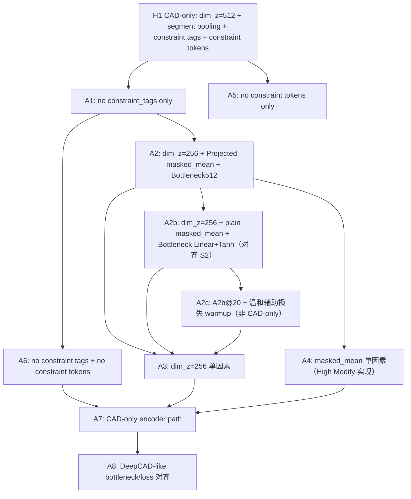

# Constraint-Fused DeepCAD High Modify 主路径消融定位实验方案

本文档用于定位 `constraint_fused_deepcad_simplify_modify2_low_riskbased_high_modify` 在 CAD-only 训练后仍与原始 DeepCAD 存在 `ACC_cmd`、`ACC_param` 差距的原因。当前重点不是继续调大辅助约束损失，而是先确认 High Modify 的主自编码路径中，哪些结构改动削弱了 CAD 参数重建能力。

**A2b@20 已闭合主路径 latent 栈选型**（`ACC_param`=0.9380）。在继续 A3/A4 结构单因素消融的同时，新增 **A2c（A2b → 辅助损失续训）**：在 A2b 最优栈上从 `ckpt_epoch20` 接入温和辅助监督，验证能否在保持 `ACC_param` 的前提下提升约束指标。

---

## 1. 方案目标

### 1.1 背景与现象

当前已完成的 CAD-only 消融说明：关闭 `alpha/beta/gamma` 后，High Modify 的主任务明显恢复，但仍低于原始 DeepCAD。

| 模型 | checkpoint | `ACC_cmd` | `ACC_param` | 说明 |
| --- | ---: | ---: | ---: | --- |
| 原始 DeepCAD | epoch 1000 | 0.9936 | 0.9759 | 参考上限 |
| H0 High Modify current | latest | 0.9671 | 0.8690 | 辅助损失较强的问题基线 |
| H1 CAD-only | epoch 20 | 0.9714 | 0.9050 | 关闭辅助损失后明显恢复 |
| A2b plain+S2 bn | epoch 20 | 0.9808 | 0.9380 | `dim_z=256` + plain mean + DeepCAD bottleneck（CAD-only）；**已优于 H1@20** |

这说明辅助损失确实会影响主 CAD 重建，但 H1 仍不是原始 DeepCAD 主路径；**A2b@20 表明对齐 S2 的 pooling/bottleneck 栈可进一步抬升主路径 ACC**。H1 的 encoder 仍包含 `constraint_tags`、constraint token、joint transformer、segment-separated pooling、`dim_z=512` 和带 `LayerNorm` 的 bottleneck。因此下一步需要做主路径消融，判断差距来自哪一类结构变化。

### 1.2 核心问题

本方案要回答四个问题：

1. 仅 `constraint_tags` 加到 CAD token embedding 上，是否已经造成输入分布偏移？
2. `dim_z=512` 是否使 latent 分布或 decoder 优化变难？
3. `segment_separated` pooling 是否损失了 CAD 参数细节？
4. constraint token 即使不参与辅助损失，是否仍干扰了 CAD token 表征？
5. A2 训练 `loss_args` 偏高，究竟来自「`dim_z=256` + joint masked mean」本身，还是来自 High Modify 的 **Projected pooling + Bottleneck512** 实现栈？
6. 在 **A2b 主路径已稳定** 的前提下，温和辅助损失（`α/β/γ`）能否在 **不明显牺牲 `ACC_param`** 的情况下提升 `ratio_h/v` 与 parallel/perpendicular？

### 1.3 验收目标

| 目标 | 判定标准 |
| --- | --- |
| 定位主路径瓶颈 | 至少找到一个消融变量能显著改善 `ACC_param` 或证明其影响很小 |
| 区分训练不足与结构问题 | 对比同 epoch 的 `loss_args`、`ACC_param` 和参数分项 |
| 保持生成闭包 | 所有实验的主 decoder 仍只以 `z` 为必要输入，保持 `P(S | z)` |
| A2b→A2c 续训 | `ACC_param` 相对 A2b@20 下降 **≤ 1%**（警戒 2%）；至少一类约束指标（`ratio_h` / `ratio_v` / parallel / perpendicular）提升 **≥ 0.01** |

---

## 2. 整体架构

### 2.1 消融思路

主路径消融采用“逐步退回原始 DeepCAD”的方式。每次只改变一个或少数强相关变量，观察 `ACC_param` 是否恢复。



### 2.2 实验矩阵

| 实验 ID | `exp_name` | 目的 | 关键改动 | 预期作用 |
| --- | --- | --- | --- | --- |
| H1 | `cf_high_modify_cad_only_100` | 当前 CAD-only 基线 | `dim_z=512`、`segment_separated`、保留 constraint token/tag | 问题参照 |
| A1 | `cf_high_modify_ablate_no_constraint_tags_100` | 阶段 1：constraint tag 消融 | 仅不加 `constraint_tags`，仍保留 constraint token 与原 pooling | 判断 tag embedding 是否直接扰动 CAD token |
| A2 | `cf_high_modify_ablate_dimz256_masked_mean_100` | 阶段 2：**dim_z + pooling 合并（High Modify 实现）** | `dim_z=256` + `pooling_strategy=masked_mean`（代码路径为 **ProjectedMaskedMeanPooling + Bottleneck512**），其余同 H1 | 快速验证 latent 与 pooling 联合；**不与 S2 训练曲线直接可比** |
| A2b | `cf_high_modify_ablate_dimz256_plain_mean_s2_bn_100` | 阶段 2b：**与 S2 对齐的 pooling/bottleneck**（**已完成 epoch20 评估**） | `dim_z=256` + **plain `MaskedMeanPooling`** + **`Bottleneck(Linear+Tanh)`**（同 `cf_simplify_modify2` / 原始 DeepCAD），CAD-only，其余 encoder 仍同 H1 | @20：`ACC_param`=**0.9380**，`loss_args`=**0.9527**；优于 H1@20 与 A2@18；隔离 **Projected+Bottleneck512** 拖累 |
| A2c | `cf_high_modify_ablate_dimz256_a2c_warmup_mild_100` | 阶段 2c：**A2b → 辅助损失续训**（**非 CAD-only**） | 结构同 A2b；**自 A2b `ckpt_epoch20.pth` 仅加载权重**；开启 `enable_soft_geometry` + **H2 mild 目标权重** + **短 warmup**（epoch 21–31） | 在更优主路径上验证约束监督；对照 A2b@20 / H2@20 |
| A3 | `cf_high_modify_ablate_dimz256_100` | 阶段 3：`dim_z` 单因素 | `--dim_z 256 --pooled_dim 256`，pooling 仍为 segment | 在 A2/A2b 之后隔离 latent 维度贡献 |
| A4 | `cf_high_modify_ablate_masked_mean_100` | 阶段 3：pooling 单因素 | `--pooling_strategy masked_mean`，`dim_z` 仍为 512（High Modify 实现） | 在 A2/A2b 之后隔离 pooling 贡献 |
| A5 | `cf_high_modify_ablate_no_constraint_tokens_100` | 阶段 4：constraint token 消融 | 不拼 constraint token，但保留 `constraint_tags` | 判断 token 拼接是否干扰 CAD 表征 |
| A6 | `cf_high_modify_ablate_no_constraint_input_100` | 阶段 4：约束输入消融 | 不拼 constraint token，不加 `constraint_tags` | 判断全部 constraint 输入是否干扰 CAD 表征 |
| A7 | `cf_high_modify_ablate_cad_encoder_like_100` | CAD-only encoder 对照 | 不拼 token、不加 tags、`masked_mean`、`dim_z=256` | 定位 encoder 融合路径影响 |
| A8 | `cf_high_modify_ablate_deepcad_like_100` | DeepCAD-like 主路径 | A7 + 原始 bottleneck/loss mask 对齐 | 验证是否接近原始 AE |

### 2.3 推荐执行顺序

执行分四阶段，**均以 H1（`cf_high_modify_cad_only_100`）为对照基线**，同 epoch（建议 20 / 50 / 100）横向比较 `ACC_param`。

| 阶段 | 实验 | 目的 |
| --- | --- | --- |
| **阶段 1** | A1 | 最高优先级：仅去掉 `constraint_tags`，最小单因素，判断 tag embedding 是否扰动 CAD 重建 |
| **阶段 2** | **A2（dim_z + pooling 合并，High Modify 实现）** | A1 完成后跑：`dim_z=256` + 当前代码中的 `masked_mean`（Projected + Bottleneck512） |
| **阶段 2b** | **A2b（plain mean + DeepCAD bottleneck，对齐 S2）** | A2 跑到 epoch 20 后**必做对照**：与 `cf_simplify_modify2` 相同 pooling/bottleneck 栈，区分「结构假设」与「实现过重」 |
| **阶段 2c** | **A2c（A2b@20 + 温和辅助损失）** | A2b 主路径闭合后**推荐并行**：从 `ckpt_epoch20` 续训至 epoch 50/100，检验约束指标收益 |
| **阶段 3** | A3、A4（独立） | 在 A2/A2b 结果基础上做单因素消融，区分贡献来自 `dim_z` 还是 pooling |
| **阶段 4** | A5 → A6 → A7 → A8 | constraint 输入与 encoder 路径消融；A7 可视为 A6 + A2 的 CAD-only 对照 |

**阶段 2 与阶段 3 的读数规则：**

- 若 **A2 明显优于 H1、且优于 A1**：latent/pooling 是主嫌疑，阶段 3 用 A3、A4 判断哪一项占主导；若 A3≈A4≈H1 但 A2 仍高，说明两项存在协同，保留 A2 配置进入 A7。
- 若 **A2 与 H1 接近**：阶段 3 的 A3、A4 仍可跑（成本低），但优先级可下调，尽快进入 A5/A6。
- 若 **A2 优于 A3 且优于 A4**：两项均有贡献，合并收益大于单因素；论文归因写「联合」而非单一模块。
- 若 **A2b 的 `loss_args` 明显低于 A2、且 ACC@20 优于 A2**：说明 A2 的劣势主要来自 **Projected pooling + Bottleneck512**，而非 `dim_z=256` + joint masked mean 假设本身；论文与后续默认栈应对齐 S2/DeepCAD bottleneck。
- 若 **A2≈A2b 且均劣于 H1**：实现栈不是主因，继续 A3/A4/A5/A6。
- **A2 不替代 A3/A4**：合并实验不能分解单因素效应，故阶段 3 的独立 A3、A4 仍为必做项（可与阶段 4 中不冲突的实验并行 GPU）。
- **A2b 不替代 A2**：A2 反映当前 high_modify 仓库默认 `masked_mean` 行为；A2b 用于与 S2 / 原始 DeepCAD 的 **公平训练 loss 对比**。
- **A2c 判定（相对 A2b@20，`ACC_param`=0.9380）**：
  - `ACC_param` 下降 **≤ 1%** 且 `ratio_h` / `parallel` / `perpendicular` 至少一项 **≥ +0.01** → 保留 A2c 配置，后续主训练以 A2b 栈 + mild 辅助为准。
  - `ACC_param` 下降 **1%–2%** → 降低 `gamma` 至 **0.5** 或延长 warmup 至 epoch 21–40。
  - `ACC_param` 下降 **> 2%** → 辅助仍过强，维持 A2b CAD-only 或仅开 `alpha/beta`（见 A2c 备选表）。
- **A2c 与 H2 的区别**：H2 从 H1（`dim_z=512` + segment pooling）@50 续训；A2c 从 **A2b（plain mean + 256 维）@20** 续训，主路径更强，故采用 **更短 warmup**（21–31）而非 H2 文档中的 11–30。

**早停：** 任一组在 epoch 20 的 `ACC_param` 仍明显劣于 H1@20（0.9050），可停止该组后续 epoch，把算力留给后续阶段。A2c 若 epoch 30 `ACC_param` 仍 **≥ 0.928**（相对 A2b@20 降幅 ≤1%），可继续训至 100 epoch。

---

## 3. 模块架构

### 3.1 仅不加 `constraint_tags` 消融模块（A1）

#### 模块作用

这是最高优先级消融，用于验证 `constraint_tags` 直接加到 CAD token embedding 上是否已经造成输入分布偏移。它只移除 CAD token 上的 tag embedding，不改变 constraint token、joint transformer、segment pooling、`dim_z=512` 或 decoder。

#### 模块原理

当前 CAD token embedding 为：

```text
e_cmd = command_embed + arg_embed + group_embed + constraint_tag_embed
```

A1 将其改为：

```text
e_cmd = command_embed + arg_embed + group_embed
```

其余路径保持不变：

```text
[e_cmd, e_constraint_token] -> joint transformer -> segment_separated pooling -> z -> decoder
```

如果 A1 明显提升 `ACC_param`，说明问题可能不是 constraint token 本身，而是 `constraint_tags` 作为逐 token 加性偏置改变了 CAD command/args 表征分布。

#### 配置与代码草案

建议增加配置：

```python
parser.add_argument("--disable_constraint_tags", dest="use_constraint_tags", action="store_false")
parser.set_defaults(use_constraint_tags=True)
```

在 `EncoderFused.forward` 中：

```python
tag_input = constraint_tags if getattr(self.cfg, "use_constraint_tags", True) else None
e_cmd = self.embedding(commands, args, groups, tag_input)
```

#### 命令草案

```bat
python -m constraint_fused_deepcad_simplify_modify2_low_riskbased_high_modify.train ^
  --data_root data ^
  --proj_dir proj_log/constraint_fused_deepcad_simplify_modify2_low_riskbased_high_modify ^
  --exp_name cf_high_modify_ablate_no_constraint_tags_100 ^
  --batch_size 64 ^
  --nr_epochs 100 ^
  --alpha 0 --beta 0 --gamma 0 ^
  --disable_soft_geometry ^
  --disable_constraint_tags ^
  --save_frequency 5 ^
  -g 0
```

#### 举例说明

若 A1 在 epoch 20 的 `ACC_param` 明显高于 H1 的 `0.9050`，例如提升到 `0.92+`，说明 tag embedding 是主路径首要嫌疑。若 A1 基本不变，再继续检查 constraint token、pooling 和 latent 维度。

### 3.2 dim_z + pooling 合并消融模块（A2，阶段 2）

#### 模块作用

在 A1 完成后、独立 A3/A4 之前，同时启用 `dim_z=256` 与 `pooling_strategy=masked_mean`，基于 H1 其余配置（仍保留 constraint token/tag，除非 A1 已证明应去 tags）。用于快速判断「latent 维度 + joint masked mean」联合后 `ACC_param` 能否显著恢复。

**实现说明（与 A2b 区分）：** 在 `high_modify` 代码中，`masked_mean` 并非 `cf_simplify_modify2` 的 plain 实现，而是 **`ProjectedMaskedMeanPooling` + `Bottleneck512`**。因此 A2 的 `loss_args` **不应**与 S2 的 `train_metrics.csv` 直接对比绝对值。

#### 模块原理

单因素 A3、A4 只能回答「哪一项有影响」；A2 回答「在 **当前 high_modify 实现** 下，dim_z 与 masked_mean 联合是否优于 H1」。若 A2 明显高于 H1 而 A3、A4 各自提升有限，说明两项存在协同。

```text
H1 路径中同时替换：
  dim_z: 512 -> 256，pooled_dim: 512 -> 256
  pooling: segment_separated -> masked_mean（代码：ProjectedMaskedMeanPooling）
  bottleneck: Bottleneck512（Linear + LayerNorm + Tanh）
其余：constraint_tags + constraint tokens + joint transformer 不变（与 H1 对齐）
```

#### 命令草案

```bat
python -m constraint_fused_deepcad_simplify_modify2_low_riskbased_high_modify.train ^
  --data_root data ^
  --proj_dir proj_log/constraint_fused_deepcad_simplify_modify2_low_riskbased_high_modify ^
  --exp_name cf_high_modify_ablate_dimz256_masked_mean_100 ^
  --batch_size 64 ^
  --nr_epochs 100 ^
  --dim_z 256 ^
  --pooled_dim 256 ^
  --pooling_strategy masked_mean ^
  --alpha 0 --beta 0 --gamma 0 ^
  --disable_soft_geometry ^
  --save_frequency 5 ^
  -g 0
```

**与 A1 的衔接：** 若 A1 已显著优于 H1，A2 可在同配置上加 `--disable_constraint_tags` 作为可选 follow-up（`exp_name` 建议另开，如 `..._no_tags_dimz256_masked_mean_100`），不作为本方案必跑项。

#### 举例说明

若 A2@20 的 `ACC_param` 达到 `0.93+` 而 H1@20 为 `0.9050`，说明 latent/pooling 联合是重要瓶颈；再跑独立 A3、A4@20：若 A3≈0.91、A4≈0.91、A2≈0.93，则论文归因写「需同时对齐维度与池化」。若 A2 的 `loss_args` 偏高，**必须**再跑 A2b 排除实现栈因素。

### 3.2b plain masked mean + DeepCAD Bottleneck 对照（A2b，阶段 2b，对齐 S2）

#### 模块作用

在 A2 使用 High Modify 默认 `masked_mean` 实现时，训练 `loss_args` 可能与 `cf_simplify_modify2`（S2）不可比。A2b 在 **相同 CAD-only 与 `dim_z=256`** 前提下，将 pooling/bottleneck **与 S2 对齐**，用于回答：

> A2 训练不佳，是因为「256 维 + joint masked mean」无效，还是因为 **Projected pooling + Bottleneck512** 加重了优化难度？

#### 模块原理

`cf_simplify_modify2`（S2）与原始 DeepCAD 的 latent 路径为：

```text
joint memory -> MaskedMeanPooling（无投影，输出 d_model=256）
            -> Bottleneck: Linear(256 -> dim_z) + Tanh
            -> decoder(z)
```

High Modify 当前 A2 路径为：

```text
joint memory -> ProjectedMaskedMeanPooling: mean + Linear + LayerNorm + Tanh -> pooled_dim
            -> Bottleneck512: Linear + LayerNorm + Tanh -> dim_z
            -> decoder(z)
```

A2b 在 **high_modify 包**内显式切换为 S2 栈，encoder 仍保留 H1 的 constraint token/tag 与 joint transformer（与 A2 一致），仅替换 pooling/bottleneck：

```text
[e_cmd, e_con] -> joint transformer
              -> plain MaskedMeanPooling(mask_joint)   # 同 simplify_modify2/pooling.py
              -> z_pre: [1, B, d_model]
              -> DeepCADBottleneck: Linear(d_model, dim_z) + Tanh   # 同 model/autoencoder.Bottleneck
              -> decoder(z)
```

| 组件 | S2 / 原始 DeepCAD | A2（当前） | A2b |
| --- | --- | --- | --- |
| Pooling | plain `MaskedMeanPooling` | `ProjectedMaskedMeanPooling` | plain `MaskedMeanPooling` |
| Bottleneck | `Linear + Tanh` | `Linear + LayerNorm + Tanh`（Bottleneck512） | `Linear + Tanh` |
| `dim_z` | 256 | 256 | 256 |
| α/β/γ | S2 默认非 0；A2b 设为 0 | 0 | 0 |
| Encoder | simplify 融合路径 | high_modify 融合路径 | **同 A2（high_modify 融合）** |

**对比口径：**

- **A2 vs A2b**：隔离 pooling/bottleneck 实现（同 epoch、同 CAD-only）。
- **A2b vs S2 `train_metrics`**：`loss_args` 绝对值可比；ACC 仍须各自 checkpoint 评估（decoder/recon 路径仍可能不同）。
- **A2b vs H1**：看 plain mean + 256 维是否优于 segment + 512 维。

#### 配置与代码草案

建议在 `config_constraint_fused_high_modify.py` 增加：

```python
parser.add_argument(
    "--pooling_strategy",
    type=str,
    default="segment_separated",
    choices=["segment_separated", "masked_mean", "masked_mean_plain"],
)
parser.add_argument(
    "--bottleneck_type",
    type=str,
    default="layernorm_tanh",
    choices=["layernorm_tanh", "deepcad_tanh"],
)
```

在 `EncoderFused` 中：

```python
if self.pooling_strategy == "masked_mean_plain":
    pool_outputs = {"z_pre": self.masked_mean_plain(memory, mask_joint)}
elif self.pooling_strategy == "segment_separated":
    ...
else:
    pool_outputs = self.masked_mean(memory, mask_joint)  # Projected
```

在 `build_train_use_case` 中：

```python
if getattr(cfg, "bottleneck_type", "layernorm_tanh") == "deepcad_tanh":
    bottleneck = DeepCADBottleneck(cfg.d_model, cfg.dim_z)
else:
    bottleneck = Bottleneck512(cfg.pooled_dim, cfg.dim_z)
```

`DeepCADBottleneck` 与 `model.autoencoder.Bottleneck` 一致：`nn.Linear(d_model, dim_z)` + `nn.Tanh()`；`z_pre` 为 `(1, B, d_model)`，**不使用 `pooled_dim` 投影层**。

#### 命令草案

```bat
python -m constraint_fused_deepcad_simplify_modify2_low_riskbased_high_modify.train ^
  --data_root data ^
  --proj_dir proj_log/constraint_fused_deepcad_simplify_modify2_low_riskbased_high_modify ^
  --exp_name cf_high_modify_ablate_dimz256_plain_mean_s2_bn_100 ^
  --batch_size 64 ^
  --nr_epochs 100 ^
  --dim_z 256 ^
  --pooling_strategy masked_mean_plain ^
  --bottleneck_type deepcad_tanh ^
  --alpha 0 --beta 0 --gamma 0 ^
  --disable_soft_geometry ^
  --save_frequency 5 ^
  -g 0
```

**说明：** `masked_mean_plain` 与 `deepcad_tanh` 已在 `constraint_fused_deepcad_simplify_modify2_low_riskbased_high_modify` 落地（P2b-01）；plain mean 输出 `d_model` 维，bottleneck 输入维为 `d_model` 而非 `pooled_dim`。

#### 实验结果（test split，2026-05-21 评估）

汇总见 `proj_log/.../cf_high_modify_ablate_dimz256_plain_mean_s2_bn_100/artifacts/a2b_all_checkpoint_eval_summary.csv`。

| checkpoint | `ACC_cmd` | `ACC_param` | `ratio_h` | `ratio_v` | `parallel` | `perpendicular` | `parse_fail` |
| --- | ---: | ---: | ---: | ---: | ---: | ---: | ---: |
| epoch 5 | 0.9652 | 0.9051 | 0.8945 | 0.9036 | 0.7293 | 0.8925 | 412 |
| epoch 10 | 0.9745 | 0.9230 | 0.9081 | 0.9147 | 0.7485 | 0.8935 | 171 |
| epoch 15 | 0.9766 | 0.9315 | 0.9190 | 0.9220 | 0.7784 | 0.8927 | 213 |
| **epoch 20** | **0.9808** | **0.9380** | **0.9239** | **0.9257** | **0.7830** | **0.9021** | **119** |

训练 `loss_args`（epoch 内均值，step 去重）：5→10→15→20 为 **1.44→1.17→1.05→0.95**；epoch20 **0.9527**，略低于 S2@20（**0.9814**），明显低于 A2@18（**1.3441**）。

#### 举例说明（已观测）

- **已满足**：A2b@20 `loss_args` **≈ S2@20 且低于 A2@18**；`ACC_param` **0.9380 ≥ A2@18（0.9100）且 > H1@20（0.9050）** → 应将 **plain mean + DeepCAD bottleneck** 作为后续默认 latent 栈，而非 Projected + Bottleneck512。
- **未满足**：A2b 未劣于 H1@20，故「实现栈不是主因」分支不成立。
- **残留差距**：距原始 DeepCAD（`ACC_param` 0.9759）仍约 **0.038**；Arc 第 3 维、Ext 中部参数仍偏弱（见 `reconstruction_test_a2b_epoch20_acc_acc_stat.txt`）。

---

### 3.2c A2b 续训 + 温和辅助损失（A2c，阶段 2c，非 CAD-only）

#### 模块作用

A2b 已证明 **plain mean + DeepCAD bottleneck + `dim_z=256`** 下主路径 `loss_args` 可稳定下降且 `ACC_param@20` 优于 H1/A2。A2c 回答：在 **不推倒重来** 的前提下，从 A2b 的 `ckpt_epoch20` 继续训练并 **开启辅助监督**，能否在可接受的 `ACC_param` 代价下提升水平/竖直/平行/垂直等约束保持指标。

与 Warmup 方案中的 **H2** 不同：A2c 的 encoder/latent 栈为 **A2b**（非 H1 的 segment + 512 维），且预训练 checkpoint 更强（`ACC_param` 0.9380 vs H1@20 的 0.9050），因此辅助权重采用 **H2 mild 终值、更短 warmup**，避免重复 H0（`α=β=γ=3/1/3` 从头训练）的过强辅助。

#### 模块原理

总损失恢复为：

```text
L = L_cad + alpha_t * L_pred + beta_t * L_recon + gamma_t * L_geom
L_cad = L_cmd + L_args   # loss_args_weight=2.0 不变
```

结构配置 **与 A2b 完全一致**（须写在 `config.txt` 中以便评估复现）：

```text
dim_z=256
pooling_strategy=masked_mean_plain
bottleneck_type=deepcad_tanh
# encoder：仍保留 constraint_tags + constraint token + joint transformer（同 A2b/H1）
```

**权重调度（推荐首跑 A2c-mild）** 使用仓库已有 `resolve_aux_weights`（`application/loss_schedule.py`），按 **全局 epoch 编号**（从 A2b 续上的 21 起算）：

| 全局 epoch | 阶段 | `alpha_t` | `beta_t` | `gamma_t` | 说明 |
| --- | --- | ---: | ---: | ---: | --- |
| 1–20 | （A2b 已完成） | 0 | 0 | 0 | CAD-only 预训练，见 A2b 实验 |
| **21** | 续训起点 | **0** | **0** | **0** | 载入 A2b 权重后第 1 个 epoch 仍不施加辅助，缓冲分布切换 |
| **22–31** | 线性 warmup | 0 → **1.0** | 0 → **0.5** | 0 → **1.0** | `aux_warmup_start_epoch=21`，`aux_warmup_end_epoch=31` |
| **32–100** | 稳定联合 | **1.0** | **0.5** | **1.0** | 完整 mild 辅助 |

**推荐终值 `α/β/γ`（命令行配置，即 warmup 目标）**：

| 参数 | 推荐值 | 依据 |
| --- | ---: | --- |
| `alpha` | **1.0** | 对齐 `H2_warmup_mild` / `cf_simplify_modify2` 常用 pred 强度；低于 H0 的 3.0，避免压制 `loss_args` |
| `beta` | **0.5** | 关系重建（pair/unary）中等权重；H2 mild 与 S2 默认量级 |
| `gamma` | **1.0** | soft geometry 与 pred 同量级；**须** `--enable_soft_geometry`（勿加 `--disable_soft_geometry`） |

**不推荐首跑**：`α=β=γ=3/1/3`（H0 配置）——在弱主路径上已证明拖累 `ACC_param`；A2c 仅在 mild 约束指标不足时再试 **A2c-strong**（`2.0 / 0.7 / 2.0`，warmup 延长至 epoch 21–40）。

**备选配置（按需）**：

| 配置 ID | `alpha` | `beta` | `gamma` | `aux_warmup` | 适用 |
| --- | ---: | ---: | ---: | --- | --- |
| **A2c-mild（推荐）** | 1.0 | 0.5 | 1.0 | 21–31 | 默认首跑 |
| A2c-conservative | 0.5 | 0.25 | 0.5 | 21–35 | epoch 30 `ACC_param` 降幅 >1% 时 |
| A2c-strong | 2.0 | 0.7 | 2.0 | 21–40 | mild 约束提升不足且 ACC 仍稳时 |

#### 初始化与续训约定

| 项 | 约定 |
| --- | --- |
| 预训练权重 | `proj_log/constraint_fused_deepcad_simplify_modify2_low_riskbased_high_modify/cf_high_modify_ablate_dimz256_plain_mean_s2_bn_100/model/ckpt_epoch20.pth` |
| 加载范围 | **仅** `model_state_dict`（encoder / bottleneck / decoder / recon_head 等） |
| 不加载 | A2b 的 `optimizer_state_dict`、`scheduler_state_dict`（CAD-only 阶段的动量不适用于新损失项） |
| `TrainClock` | 从 **epoch=21**、`step` 与 A2b epoch20 末步衔接（或重置 optimizer 后从 21 起计，以 `train_metrics.csv` 连续为准） |
| 新实验目录 | **必须** 新 `exp_name`：`cf_high_modify_ablate_dimz256_a2c_warmup_mild_100`，禁止覆盖 A2b 目录 |

**前置实现（训练入口）**：Warmup 记录中的 `--init_weights_from` 当前需在 `train.py` 接回：若路径存在则 `load_state_dict(model_state_dict, strict=True)`，且不恢复 optimizer/clock。在实现前可临时在训练启动脚本中手动加载同一 checkpoint。实现后 A2c 命令如下。

#### 命令草案（A2c-mild，推荐）

```bat
python -m constraint_fused_deepcad_simplify_modify2_low_riskbased_high_modify.train ^
  --data_root data ^
  --proj_dir proj_log/constraint_fused_deepcad_simplify_modify2_low_riskbased_high_modify ^
  --exp_name cf_high_modify_ablate_dimz256_a2c_warmup_mild_100 ^
  --batch_size 64 ^
  --nr_epochs 100 ^
  --dim_z 256 ^
  --pooling_strategy masked_mean_plain ^
  --bottleneck_type deepcad_tanh ^
  --aux_schedule warmup ^
  --aux_warmup_start_epoch 21 ^
  --aux_warmup_end_epoch 31 ^
  --alpha 1.0 ^
  --beta 0.5 ^
  --gamma 1.0 ^
  --save_frequency 5 ^
  --init_weights_from proj_log/constraint_fused_deepcad_simplify_modify2_low_riskbased_high_modify/cf_high_modify_ablate_dimz256_plain_mean_s2_bn_100/model/ckpt_epoch20.pth ^
  -g 0
```

说明：

- **不要** 传 `--disable_soft_geometry`（否则 `gamma` 无效）。
- **不要** 传 `--alpha 0 --beta 0 --gamma 0`（A2c 目的即开启辅助）。
- `init_weights_from` 落地前，将上式最后一行替换为项目内等价的权重加载步骤。

#### 评估协议

与 §4.2 一致；**对照基线**：

| 对照 | 用途 |
| --- | --- |
| **A2b@20** | 续训前 CAD-only 上限（`ACC_param`=0.9380） |
| H1@20 / H2@20 | 旧栈 + 辅助的横向参考（非同结构，仅作历史对照） |
| 原始 DeepCAD | 上限参考 |

建议评估点：**epoch 30、50、100**（或续训后的 25/30/50），因 warmup 在 epoch 31 结束。

#### 举例说明（预期读数）

- 若 **A2c@30** `ACC_param` **≥ 0.928**（较 A2b@20 降 ≤1%）且 `parallel` **≥ 0.80** → mild 辅助有效，可作为论文「主路径 + 约束」默认配置。
- 若 **约束升、ACC_param 降 >2%** → 改用 A2c-conservative 或延长 epoch 21 的零辅助缓冲（`start_epoch=22`）。
- 若 **ACC 与约束均优于 H2@20** → 证明 **A2b 栈** 优于 H1 栈 的辅助续训起点，后续无需回到 H2 路径。

---

### 3.3 `dim_z=256` 单因素消融模块（A3，阶段 3）

#### 模块作用

在 A2 之后独立运行，隔离 `dim_z=512` 的影响。原始 DeepCAD 的 `ConfigAE` 使用 `dim_z=256`；本实验在 H1 的 segment pooling 与 constraint 输入不变的前提下，仅改 latent 维度。

#### 模块原理

将 latent 维度和 pooling 输出维度同时设为 256：

```text
z_pre: [1, B, 256]
z = Linear(256 -> 256) -> Tanh
Decoder(z)
```

若 A3 的 `ACC_param` 明显高于 H1，说明当前 `dim_z=512` 不是有效增益，可能改变了 decoder 接收的 latent 分布。

#### 命令草案

```bat
python -m constraint_fused_deepcad_simplify_modify2_low_riskbased_high_modify.train ^
  --data_root data ^
  --proj_dir proj_log/constraint_fused_deepcad_simplify_modify2_low_riskbased_high_modify ^
  --exp_name cf_high_modify_ablate_dimz256_100 ^
  --batch_size 64 ^
  --nr_epochs 100 ^
  --dim_z 256 ^
  --pooled_dim 256 ^
  --alpha 0 --beta 0 --gamma 0 ^
  --disable_soft_geometry ^
  --save_frequency 5 ^
  -g 0
```

#### 举例说明

与 A2、A4 对照：若 A3≈H1 但 A2 明显优于 H1，则 `dim_z` 单因素不足；若 A3 单独已接近 A2，则 pooling 可次要。

### 3.4 `masked_mean` pooling 单因素消融模块（A4，阶段 3）

#### 模块作用

在 A2 之后独立运行，隔离 `segment_separated` pooling 的影响。原始 DeepCAD 对 encoder memory 做 masked mean pooling；本实验在 H1 的 `dim_z=512` 与 constraint 输入不变的前提下，仅改 pooling。

#### 模块原理

将：

```text
z_pre = f(z_cmd, z_con, gate)
```

退化为：

```text
z_pre = ProjectedMaskedMeanPooling(joint_memory)  # High Modify 默认 masked_mean 实现
```

若 A4 明显提升 `ACC_param`，说明 segment-separated pooling 的融合方式可能过度压缩或扰动参数细节。与 A2b 对照可进一步判断：A4 与 A2b 的差异在 `dim_z=512` vs `256`，而非 plain vs projected pooling。

#### 命令草案

```bat
python -m constraint_fused_deepcad_simplify_modify2_low_riskbased_high_modify.train ^
  --data_root data ^
  --proj_dir proj_log/constraint_fused_deepcad_simplify_modify2_low_riskbased_high_modify ^
  --exp_name cf_high_modify_ablate_masked_mean_100 ^
  --batch_size 64 ^
  --nr_epochs 100 ^
  --pooling_strategy masked_mean ^
  --alpha 0 --beta 0 --gamma 0 ^
  --disable_soft_geometry ^
  --save_frequency 5 ^
  -g 0
```

#### 举例说明

与 A2、A3 对照：若 A4≈H1 但 A2 明显优于 H1，则 pooling 单因素不足；若 A4 单独已接近 A2，则 `dim_z` 可次要。

### 3.5 去除 constraint token/tag 模块（A5、A6）

#### 模块作用

验证 constraint 输入是否在无辅助损失时仍干扰 CAD token 表征。当前 CAD-only 只关闭 loss，但 encoder 仍接收 `constraint_tags` 并拼接 constraint token。

- **A5**：不拼 constraint token，保留 `constraint_tags`
- **A6**：不拼 token、不加 tags（全部 constraint 输入关闭）

#### 模块原理

新增配置建议：

```python
parser.add_argument("--encoder_constraint_mode", type=str, default="fused",
                    choices=["fused", "no_tags", "no_tokens", "cad_only"])
```

| 模式 | 对应实验 | 行为 |
| --- | --- | --- |
| `fused` | H1 | `constraint_tags` + constraint token |
| `no_tags` | A1 | 仅不加 `constraint_tags`，仍拼接 constraint token |
| `no_tokens` | A5 | 保留 `constraint_tags`，不拼接 constraint token |
| `cad_only` | A6 | 不加 tags、不拼 token，只编码 CAD 序列 |

`cad_only` 模式应尽量复用原始 DeepCAD 的 CAD embedding、encoder 和 masked mean。

#### 代码草案

```python
if encoder_constraint_mode == "cad_only":
    e_cmd = self.embedding(commands, args, groups, constraint_tags=None)
    memory = self.encoder(e_cmd, src_key_padding_mask=cmd_padding_mask)
    pool_outputs = self.masked_mean(memory, cmd_padding_mask)
else:
    # current fused path
```

#### 举例说明

若 A5/A6/A7 明显提升 `ACC_param`，说明问题主要来自 constraint 输入进入主 encoder，而不是训练轮数或 decoder 容量。

### 3.6 DeepCAD-like 对齐模块（A7、A8）

#### 模块作用

- **A7**：CAD-only encoder 对照（`cad_only` + `dim_z=256` + `masked_mean`）
- **A8**：在 A7 仍不能解释差距时，对齐原始 DeepCAD 的 bottleneck 和 loss/mask 细节

#### 模块原理

当前 High Modify bottleneck 为：

```text
Linear -> LayerNorm -> Tanh
```

原始 DeepCAD bottleneck 为：

```text
Linear -> Tanh
```

若 encoder 已接近原始但指标仍低，应检查 `LayerNorm`、loss mask、padding mask、evaluation tolerance 是否完全一致。

#### 代码草案

```python
parser.add_argument("--bottleneck_type", type=str, default="layernorm_tanh",
                    choices=["layernorm_tanh", "deepcad_tanh"])
```

#### 举例说明

若 A8 才明显接近原始 DeepCAD，说明此前差距来自 bottleneck/loss 实现细节，而不是 constraint fusion 本身。

---

## 4. 训练与评估协议

### 4.1 训练协议

所有主路径消融实验默认使用：

```text
alpha=0
beta=0
gamma=0
enable_soft_geometry=false
batch_size=64
save_frequency=5
nr_epochs=100
```

为节省时间，先按 `ckpt_epoch20`、`ckpt_epoch50`、`ckpt_epoch100` 三个点评估。若前 20 epoch 已明显劣于 H1，可提前停止。

### 4.2 评估协议

每个 checkpoint 必须记录：

| 指标类别 | 字段 |
| --- | --- |
| 序列重建 | `ACC_cmd`、`ACC_param`、Line/Arc/Circle/Ext 参数 acc |
| 训练趋势 | `loss_cmd_only`、`loss_args`、最近 100/500 step 均值 |
| 解析稳定性 | `n_parse_fail_pred`、`n_samples_extrude_count_mismatch` |
| 约束保持 | `ratio_h`、`ratio_v`、parallel/perpendicular recall |

### 4.3 判定规则

| 现象 | 结论 | 下一步 |
| --- | --- | --- |
| A1 明显优于 H1 | `constraint_tags` 的加性 embedding 是主要风险 | 跑 A2；可选 no_tags 版 A2；再测 A5/A6 |
| A2 明显优于 H1，且优于 A3、A4 | latent 与 pooling 联合是主要风险 | 阶段 3 仍跑 A3/A4 做归因；A7 采用 `dim_z=256` + pooling；若 A2b 优于 A2 则 A7 用 **plain mean + deepcad_tanh** |
| A2 明显优于 H1，A3≈A4≈H1 | 两项单因素弱、联合强 | 论文写协同效应；A7 必须保留 A2/A2b 中更优配置 |
| A2≈H1，A3 或 A4 单独更优 | 单因素即可解释 | 只保留有效项进入 A7，不必强推双改 |
| A2b 明显优于 A2（loss 或 ACC） | **Projected + Bottleneck512** 拖累训练 | 默认栈改为 plain mean + DeepCAD bottleneck；A8 与 A2b 合并验证 |
| A2≈A2b 且均劣于 H1 | 非实现栈主因 | 继续 A3/A4/A5/A6 |
| A3 明显优于 H1（相对 A4） | `dim_z=512` 是主因 | A7 优先 `dim_z=256`，pooling 可保持 H1 |
| A4 明显优于 H1（相对 A3） | `segment_separated` 损失参数细节 | A7 优先 `masked_mean`，`dim_z` 可保持 512 |
| A5/A6/A7 明显优于 H1 | constraint 输入干扰主 AE | 主 decoder 训练阶段禁止 constraint 输入进入 encoder |
| A7 仍低于原始 DeepCAD | 结构差距不止 encoder fusion | 做 A8 对齐 bottleneck/loss |
| A1/A2/A3/A4 均无明显提升 | 更可能是 constraint token 或训练设置 | 优先 A5/A6，或延长 H1 训练 |
| A2c 相对 A2b@20：`ACC_param` 降 ≤1% 且约束升 | A2b + mild 辅助可作为默认生产配置 | 训至 epoch 100；Warmup 方案以 A2c 替代 H2 主线 |
| A2c：`ACC_param` 降 1%–2% | 辅助略强 | 用 A2c-conservative 或 `gamma=0.5` |
| A2c：`ACC_param` 降 >2% | 辅助仍拖累主任务 | 保持 A2b CAD-only；仅结构消融 |

---

## 5. 风险与回退策略

| 风险 | 表现 | 回退策略 |
| --- | --- | --- |
| 实验矩阵过大 | 多组 100 epoch 时间过长 | 先跑到 epoch 20/25 做早期筛选 |
| 单因素消融结果不稳定 | `ACC_param` 波动小于 0.5% | 以 epoch 50 或多 checkpoint 趋势判定 |
| `cad_only` encoder 破坏辅助头输入 | recon/pred head 输入不完整 | 主路径消融只评估 CAD 重建，辅助头可保留但不作为判定 |
| 与原始 DeepCAD 不完全一致 | 仍有 bottleneck/loss 差异 | 用 A7/A8 做更严格对齐 |
| A2 与 A3/A4 结论冲突 | 单因素与联合效应难判 | 以 epoch 50 趋势为准；必要时补 A2@50 与 A3/A4@50 |
| A2 `loss_args` 高但 ACC 未评估 | 误判为结构失败 | 先 A2@20 ACC；再跑 A2b 对比 S2 训练曲线 |
| A2 与 S2 训练 loss 不可比 | 对比结论失真 | 用 A2b 与 S2 比 `loss_args`；用 ACC 与 H1/原始 DeepCAD 比 |
| A2c 从 A2b 续训但结构参数不一致 | 加载失败或 silent mismatch | `dim_z` / `pooling_strategy` / `bottleneck_type` 必须与 A2b `config.txt` 一致 |
| `init_weights_from` 未实现 | 无法从 ep20 起步 | 优先接回 `train.py` 加载逻辑；勿用 `--continue` 覆盖 A2b 目录 |

---

## 6. 总结

本方案的核心判断是：H1 CAD-only 已证明辅助损失会拖累主任务，但它还没有证明 High Modify 主路径本身等价于原始 DeepCAD。**A2b@20（`ACC_param`=0.9380）已优于 H1@20（0.9050）与 A2@18（0.9100）**，并证实 **Projected pooling + Bottleneck512** 是 A2 相对劣化的重要实现因素；后续默认 latent 栈应对齐 **plain mean + DeepCAD bottleneck**。

主路径消融按 **A1 → A2 → A2b → A2c（A2b@20 + mild 辅助）→ A3/A4 单因素 → A5/A6/A7/A8** 推进：A2b 阶段 2b 已闭合；**A2c 推荐 `α=1.0, β=0.5, γ=1.0`，`aux_warmup` epoch 21–31**，从 `cf_high_modify_ablate_dimz256_plain_mean_s2_bn_100/model/ckpt_epoch20.pth` 仅加载模型权重续训至新实验 `cf_high_modify_ablate_dimz256_a2c_warmup_mild_100`。

若 A1 显著改善，应优先避免把 `constraint_tags` 作为 CAD token 加性偏置；A3/A4 用于解释 A2/A2b 联合收益；A7 应采用 **A2b 栈**；**A2c 成功**则替代 Warmup 方案中以 H1 为起点的 H2 主线；若 A2c 相对 A2b@20 的 `ACC_param` 降幅 >2%，则生产配置保持 A2b CAD-only，约束仅作评估或更弱辅助。
