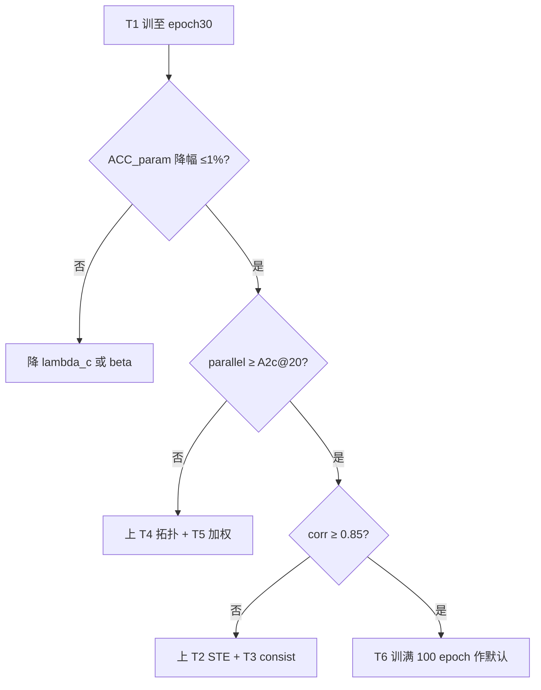

# 训练约束与硬角度对齐实验方案（T 系列）

本文档针对 **A2c-mild** 阶段暴露的问题：训练日志中 `geom_loss`、`pair_recon_loss` 下降，但与 `evaluate.py` 输出的 **test 硬约束指标**（`ratio_h/v`、`parallel_recall_index_aligned`、`perpendicular_recall_index_aligned`）不同步甚至脱钩。

**目标**：设计新一代辅助监督，使 **训练时可优化的约束损失** 与 **测试约束指标** 在定义、拓扑门控与角度判据上同源；同时把 **软几何** 与 **硬角度（0.1°）** 通过可微代理 + STE 离散化关联起来。

**前置结论（A2c@20，已跑通）**：相对 A2b@20，`ACC_param` 0.9380→**0.9441**，`parallel` 0.7830→**0.8066**（+0.024），说明 mild 辅助在「旧损失栈」下仍有效；但训练分项 `geom_parallel`（~0.03）与 test `parallel`（~0.81）**数值尺度与语义均不一致**，不宜用前者预测后者。T 系列在 **A2b 栈 + A2c@20 权重** 上迭代，不推倒主路径。

**架构约束**：遵守 `CF-DeepCADAgreement.mdc`——推理仍为 `P(S|z)`；约束仅作训练监督；辅助损失只作用于 decoder 之后可解释输出，不直接对 `z` 算几何损失。

---

## 1. 方案目标

### 1.1 问题复述（A2c 实证）

| 维度 | 训练侧（当前） | 测试侧（`evaluate_constraints.py`） |
| --- | --- | --- |
| 几何来源 | `DifferentiableSketchInterpreter` 对 **args logits 软量化** + **GT `line_index_map`** | `logits_to_vec` **argmax** → `CADSequence.from_vector` → 硬线段方向 |
| 平行判据 | `geom_parallel` = 在 **GT pair 槽位** 上对 `(1 - |cos|)` 求平均 | `parallel_recall_index_aligned`：GT 平行对，pred 硬角 **< 0.1°** |
| 关系监督 | `pair_recon`：decoder hidden → 矩阵 BCE | 不使用 recon_head；只看重建 CAD 几何 |
| 拓扑 | GT 线位有效即可算 loss | 仅当 **extrude 数一致且线数一致** 的 extrude 计入分母 |
| 结果 | `geom_*`、`pair_recon` 持续下降 | `parallel` 可能停滞（早期 epoch）或仅间接提升（@20 才明显） |

**核心矛盾**：优化目标与验收指标 **不是同一个泛函**；`pair_recon↓` 与 `geom_parallel↓` **不能**作为 test `parallel↑` 的可靠代理。

### 1.2 本方案要达成的两个要求

| # | 要求 | 可操作定义 |
| --- | --- | --- |
| **R1** | **训练 loss ≈ 测试约束指标** | 训练日志中的 `L_constraint_train` 与 test `summary.json` 四项 recall **同公式、同门控**（仅将硬比较换为可微 surrogate）；epoch 级 **Pearson 相关系数 ≥ 0.85**（在 val 子集或 test 上统计） |
| **R2** | **软几何与硬角度强关联** | 软方向 `unit` 经 **STE 离散参数** 与 **硬角度 surrogate** 双重约束；`geom_parallel`（软）与 `hard_parallel`（surrogate）梯度同向；开启 T 模式后 **硬 surrogate 项占约束 loss ≥ 50%** |

### 1.3 验收标准（相对 A2c@20 / A2b@20）

| 级别 | 主路径 | 约束（test） | 训练–测试一致性 |
| --- | --- | --- | --- |
| **必达** | `ACC_param` 降幅 ≤ **1%**（≥ 0.934） | `parallel` ≥ **0.8066**（不低于 A2c@20） | `corr(L_constraint_train, parallel_test) ≥ 0.85` |
| **期望** | `ACC_param` ≥ **0.944** | `parallel` ≥ **0.82** | 训练曲线「约束 loss↓」时 test `parallel` **单调不降**（允许噪声 ±0.005） |
| **上限参考** | 原始 DeepCAD 0.9759 | DeepCAD test parallel 0.8617 | — |

---

## 2. 整体架构

### 2.1 设计原则

1. **单一真相源（Single Source of Truth）**：把 `EvaluateConstraintSatisfactionUseCase` 的 index-aligned 逻辑抽成 **`ConstraintMetricCore`**，训练用 **surrogate**，测试用 **hard**。
2. **主路径不变**：`L_cmd = loss_cmd_only + loss_args` 仍为第一优先级；`L_constraint_train` 仅为辅助项，带 warmup。
3. **渐进启用**：T1→T6 逐步加模块，避免一次改太多无法归因。

```mermaid
flowchart TB
  subgraph infer [推理 P(S given z) 不变]
    z[z] --> dec[Decoder]
    dec --> cmd[command_logits]
    dec --> arg[args_logits]
    cmd --> argmax[argmax 序列]
  end
  subgraph train_aux [训练辅助 仅 T 系列]
    arg --> ste[STE Interpreter]
    arg --> hid[decoder_hidden]
    ste --> units[unit directions]
    units --> core[ConstraintMetricCore]
    core --> Lhard[L_hard_surrogate]
    hid --> pair[pair_logits]
    pair --> Lconsist[L_pair_consist]
    Lhard --> Lc[L_constraint_train]
    Lconsist --> Lc
  end
  subgraph test [测试]
    argmax --> parse[CAD parse]
    parse --> core2[ConstraintMetricCore hard]
    core2 --> metrics[ratio_h/v parallel perp]
  end
  Lc -.->|同公式 surrogate| core2
```

### 2.2 实验矩阵（T 系列）

基线栈与 A2c 相同：`dim_z=256`、`masked_mean_plain`、`deepcad_tanh`；起点权重 **A2c `ckpt_epoch20.pth`**（或 A2c@20 若更优）。

| 实验 ID | `exp_name` | 相对 A2c 改动 | 验证假设 |
| --- | --- | --- | --- |
| **T1** | `cf_high_modify_t1_hard_surrogate` | 用 **`L_constraint_train`（硬角度 surrogate）** 替代 `gamma * geom_loss`（软）；保留 `beta * pair_recon` | R1：同 test 公式可微 |
| **T2** | `cf_high_modify_t2_ste_interp` | T1 + **STE 硬量化 interpreter** | R2：软量化→离散参数 |
| **T3** | `cf_high_modify_t3_pair_geom_consist` | T2 + **`L_pair_consist`**（pair_logits ↔ unit 点积） | 闭合 recon 与几何 |
| **T4** | `cf_high_modify_t4_pred_topology` | T3 + **pred 线数门控**（与 test 同 skip 规则） | 训练/test 拓扑一致 |
| **T5** | `cf_high_modify_t5_parallel_emphasis` | T4 + **平行项加权** `w_par=2.0` + 可选降 `w_perp` | 对准 parallel 瓶颈 |
| **T6** | `cf_high_modify_t6_full_align` | T5 + **val 硬指标在线评估**（每 N epoch） | 闭环验证 R1 |

**推荐顺序**：**T1**（核心）→ T2 → T3 → T4；对照基线用已有 **A2c@20**（旧 soft geom + pair BCE），不单独开实验。若 T1 已满足 R1，可跳过部分后续。T5/T6 为打磨项。

**与 A2c / 主路径消融关系**：

- **不替代** A2b/A2c 已完成的结论；T 系列是 **A2c 之上的「损失对齐」分支**。
- A3/A4/A5 结构消融可与 T1 并行（不同 GPU），但论文叙事建议：**结构用 A 系列，监督对齐用 T 系列**。

---

## 3. 模块架构

### 3.1 共享约束度量核心（`ConstraintMetricCore`）

#### 模块作用

统一训练 surrogate 与测试 hard 指标的 **分母/分子定义**，避免两套代码漂移。

#### 模块原理

对 batch 内每个样本，在 **extrude 对齐、线数相等** 的 extrude 上：

- **ratio_h**：在 GT 水平线索引集合 H 上，surrogate = `sigmoid((angle_thresh - angle(u_i, ex)) / tau)`；hard = 指示函数「angle < 0.1°」。
- **ratio_v**：同上，参考轴为 `ey`。
- **parallel_recall**：对 GT 平行对 (i, j)，surrogate = `sigmoid((angle_thresh - angle(u_i, u_j)) / tau)`；hard = 指示函数「angle < 0.1°」。
- **perpendicular_recall**：surrogate = `sigmoid((angle_thresh - |angle(u_i, u_j) - 90°|) / tau)`。

**约束训练损失（与 test 四项 recall 同构）**：

```
L_constraint_train = 1 - (R_h + R_v + R_parallel + R_perp) / 4
```

其中 `R_h`、`R_v`、`R_parallel`、`R_perp` 为 batch 内有效样本的加权平均 recall（与 `summary.json` 的全局「分子/分母」定义同构；实现上用 sum/sum）。

**总训练损失**：

```
L = L_cmd + alpha * L_pred + beta * L_recon + lambda_c * L_constraint_train
```

T1 起建议 **`lambda_c` 替代原 `gamma * geom_loss`**；`alpha`、`beta` 保持 mild（1.0 / 0.5），T5 可略调。

#### 代码（新增/重构）

| 文件 | 职责 |
| --- | --- |
| `application/constraint_metric_core.py` | **新建**：`compute_axis_recall_surrogate`、`compute_pair_recall_surrogate`、`aggregate_constraint_loss` |
| `application/evaluate_constraints.py` | **重构**：`parallel_perpendicular_recall_index_aligned` 调用 core 的 hard 路径 |
| `application/geometry_constraint.py` | **保留**作 ablation；T 系列默认不走旧 `geom_loss` |
| `config_constraint_fused_high_modify.py` | 新增 `--constraint_loss_mode {soft,hard_align}`、`--hard_angle_tau`、`--constraint_parallel_weight` 等 |

**伪代码（训练一步）**：

```python
units = interpreter(args_logits, mode="ste")  # T2+
metrics = constraint_metric_core(
    unit=units["unit"],
    line_mask=pred_or_gt_line_mask,  # T4: pred topology
    gt_horizontal_idx, gt_vertical_idx,
    gt_parallel_pairs, gt_perpendicular_pairs,
    mode="surrogate",
    angle_thresh_deg=0.1,
    tau=cfg.hard_angle_tau,
)
L_constraint_train = metrics["loss"]  # 1 - mean(recalls)
loss = loss_cmd + alpha*pred_loss + beta*recon_loss + lambda_c * L_constraint_train
```

#### 举例说明

- 某 extrude GT 有 2 条平行对，pred 软角 surrogate 各 0.95、0.40 → 该 extrude 平行 recall=0.675；与 test 硬判 1/0 再平均 **逻辑一致**。
- 若 pred 线数 5、GT 线数 4：T4 下 **该 extrude 不计入分母**（与 test `skipped_line_mismatch` 一致），避免「训练在 GT 槽位上算、测试却 skip」的偏差。

---

### 3.2 STE 硬量化解释器（`DifferentiableSketchInterpreter` 增强）

#### 模块作用

让用于约束的线段端点与 **argmax 离散参数** 一致，缩小 soft dequantize 与 test 解析坐标差。

#### 模块原理

- **前向**：`hard_idx = argmax(softmax(logits))`，坐标 `bin[hard_idx]`（与 `evaluate_ae_acc` 离散格一致）。
- **反向**：STE，`grad` 回传到 logits（与 DeepCAD 参数 CE 共用 args_logits）。
- **模式开关**：`mode="soft"`（旧 A2c）、`mode="ste"`（T2+ 默认）。

#### 代码

修改 `application/differentiable_sketch_interpreter.py`：

```python
def soft_dequantize_ste(self, arg_logits):
    probs = F.softmax(arg_logits, dim=-1)
    hard = probs.argmax(dim=-1)
    soft = (probs * bins).sum(-1)
    coords = bin_lookup(hard)  # forward hard
    return coords + (soft - soft.detach())  # STE
```

#### 举例说明

- 某角度参数 logits 在相邻 bin 间摇摆：旧 soft mean 可能 45.2°，argmax 后 44°；STE 强制 forward 用 44°，**hard_parallel surrogate 与 test 更一致**。

---

### 3.3 硬角度可微代理（`HardAngleSurrogate`）

#### 模块作用

实现 R2：用与 test **相同角度阈值** 的可微版本替代 `(1-|cos|)` 平行残差。

#### 模块原理

```
sigma_tau(x) = sigmoid(x / tau)
s_parallel   = sigma_tau(angle_thresh - angle(u_i, u_j))
```

- `tau` 初值 **2.0°**，按 cosine schedule 退火至 **0.05°**（逼近硬阈值阶跃）。
- **与旧 `geom_parallel` 并存日志**（仅监控，不进 T1+ 主 loss）。

#### 代码

置于 `constraint_metric_core.py` 或 `application/hard_angle_surrogate.py`。

#### 举例说明

- 例：`tau=2°`、夹角 1° → surrogate ≈ 0.88；`tau=0.1°` → surrogate ≈ 1.0，与 hard hit 一致。

---

### 3.4 Pair–几何一致性损失（`L_pair_consist`，T3）

#### 模块作用

把 `pair_recon`（hidden 矩阵）与 **args→unit** 几何绑在同一表示上，避免「矩阵 BCE↓ 但平行 recall 不动」。

#### 模块原理

对 GT 平行槽位 (i, j)：

```
p_hat_ij = |dot(u_i, u_j)|
L_pair_consist = BCE(pair_logits_ij, stopgrad(p_hat_ij))
```

（垂直关系可用「|p_hat_ij| 接近 0」的映射。）

```
L = L_cmd + beta * L_recon + beta_c * L_pair_consist + lambda_c * L_constraint_train
```

T3 可将 **`beta` 降至 0.25**，避免矩阵 BCE 与 surrogate 重复拉扯。

#### 代码

在 `train_use_case.py` 的 `execute()` 中，于 `pair_logits` 与 `soft_lines["unit"]` 计算后插入。

#### 举例说明

- `pair_logits` 预测 0.9 平行，但 unit 夹角 30°：consist 项大，梯度同时推 logits 与 args。

---

### 3.5 Pred 拓扑门控（T4）

#### 模块作用

训练侧应用与 test 相同的 **线数/段数对齐规则**，使「结构错误」样本的约束 loss 不虚假降低。

#### 模块原理

1. 从 **pred command argmax**（STE）统计每 extrude `n_pred_lines`。
2. 仅当 `n_pred_lines == n_gt_lines` 且 `n_pred_ext == n_gt_ext` 时，在该 extrude 上计算四项 recall。
3. 可选 **结构辅助**：`L_struct = |n_pred_lines - n_gt_lines|`（hinge），权重 `lambda_s` 取小值（0.1）。

#### 代码

新增 `application/pred_topology.py`：`build_pred_line_mask(command_logits, gt_line_count)`。

#### 举例说明

- pred 多画一条线 → 该 extrude **整段不计入** `L_constraint_train`；与 test 中 `skipped_line_mismatch` 一致，避免训练「在错误拓扑上」优化软几何。

---

### 3.6 平行项加权与在线硬评估（T5/T6）

#### 模块作用

- **T5**：在 `L_constraint_train` 内对 parallel surrogate 乘 `w_par=2.0`（`w_perp=0.5` 可选），对准 test 瓶颈。
- **T6**：每 **5 epoch** 在 **val** 上跑与 test 相同的 hard `aggregate_metrics`（可 `sample_count=512` 提速），写入 `val_constraint_hard.json`，与 `L_constraint_train` 画在同一张表。

#### 模块原理

训练日志新增列：

`hard_ratio_h`, `hard_ratio_v`, `hard_parallel`, `hard_perpendicular`, `L_constraint_train`

**验收 R1**：对 epoch 序列计算 `corr(L_constraint_train, hard_parallel_val)`。

#### 举例说明

- epoch 20：`L_constraint_train=0.22` ↔ val `hard_parallel=0.78`；epoch 30：0.18 ↔ 0.81，**同向下降/上升**。

---

## 4. 训练与评估协议

### 4.1 公共训练配置

| 项 | 值 |
| --- | --- |
| 起点 | `cf_high_modify_ablate_dimz256_a2c_warmup_mild_100/model/ckpt_epoch20.pth` 或 `ckpt_epoch20`（A2c 已优于 A2b@20 时优先 A2c） |
| `pooling_strategy` | `masked_mean_plain` |
| `bottleneck_type` | `deepcad_tanh` |
| `dim_z` | 256 |
| Warmup | `aux_warmup_start_epoch=1`, `end_epoch=11`（方案 B，**全局 epoch 从 1 计**） |
| `alpha/beta` | 1.0 / 0.5（T3 起 `beta` 可 0.25） |
| `lambda_c` | 1.0（替代原 `gamma`，用于 `L_constraint_train`） |
| `constraint_loss_mode` | T1+ =`hard_align`（旧线对照见 A2c，`soft` geom 仅日志） |
| `nr_epochs` | 100 |
| `save_frequency` | 5 |

### 4.2 T1 命令草案（核心实验）

```bat
python -m constraint_fused_deepcad_simplify_modify2_low_riskbased_high_modify.train ^
  --data_root data ^
  --proj_dir proj_log/constraint_fused_deepcad_simplify_modify2_low_riskbased_high_modify ^
  --exp_name cf_high_modify_t1_hard_surrogate ^
  --batch_size 64 --nr_epochs 100 --dim_z 256 ^
  --pooling_strategy masked_mean_plain --bottleneck_type deepcad_tanh ^
  --constraint_loss_mode hard_align ^
  --hard_angle_tau 2.0 --hard_angle_tau_min 0.05 ^
  --constraint_parallel_weight 1.0 ^
  --aux_schedule warmup --aux_warmup_start_epoch 1 --aux_warmup_end_epoch 11 ^
  --alpha 1.0 --beta 0.5 --lambda_constraint 1.0 ^
  --gamma 0 ^
  --init_weights_from proj_log/constraint_fused_deepcad_simplify_modify2_low_riskbased_high_modify/cf_high_modify_ablate_dimz256_a2c_warmup_mild_100/model/ckpt_epoch20.pth ^
  --save_frequency 5 -g 0
```

说明：`--gamma 0` 表示不再使用旧 `geom_loss` 进反传；`geom_*` 可保留日志对比。

### 4.3 评估协议（与主路径方案一致）

| 评估点 | 内容 |
| --- | --- |
| epoch 20 / 30 / 50 / 100 | test：`evaluate` + `evaluate_ae_acc.py` |
| 对照 | **A2c@20**、A2b@20、原始 DeepCAD |
| T6 额外 | val 硬指标 `val_constraint_hard.json` |

**必报列**：

- 主路径：`ACC_cmd`, `ACC_param`
- 约束：`ratio_h`, `ratio_v`, `parallel`, `perpendicular`, `parse_fail`, `ext_mismatch`
- 训练对齐：`L_constraint_train`, `hard_parallel`（val）, `corr(epoch)`

### 4.4 判定流程



---

## 5. 实现任务清单（代码）

| 优先级 | 任务 ID | 内容 | 文件 |
| --- | --- | --- | --- |
| P0 | T-impl-01 | 抽取 `ConstraintMetricCore`（hard + surrogate） | `constraint_metric_core.py` |
| P0 | T-impl-02 | `train_use_case` 接入 `L_constraint_train` | `train_use_case.py` |
| P0 | T-impl-03 | config：`constraint_loss_mode`, `lambda_constraint`, `hard_angle_tau` | `config_constraint_fused_high_modify.py` |
| P0 | T-impl-04 | `train_metrics.csv` 增列 `L_constraint_train`, `hard_*` 分项 | `train.py` |
| P1 | T-impl-05 | STE interpreter | `differentiable_sketch_interpreter.py` |
| P1 | T-impl-06 | `L_pair_consist` | `train_use_case.py` |
| P2 | T-impl-07 | pred 拓扑门控 | `pred_topology.py` |
| P2 | T-impl-08 | epoch 级 val 硬评估脚本 | `scripts/val_hard_constraint.py` |
| P3 | T-impl-09 | 重构 `evaluate_constraints` 调用 core | `evaluate_constraints.py` |

---

## 6. 风险与边界

| 风险 | 缓解 |
| --- | --- |
| STE 梯度方差大 | `tau` 退火；`lambda_c` warmup |
| `L_constraint_train` 不可微区域 | surrogate 全程 smooth |
| 主路径 ACC 下降 | `lambda_c` cap（≤1.0）；保守版 0.5 |
| 实现漂移 | **hard 与 surrogate 共用 core** |
| 推理依赖约束 | **禁止**；推理路径不加载 `constraint_loss_mode` |

---

## 7. 总结

| 项 | 内容 |
| --- | --- |
| **动机** | A2c 表明旧 soft geom + pair BCE 与 test 指标 **不同源**，loss↓ 不能保证 parallel↑ |
| **手段** | **ConstraintMetricCore** 统一公式 + **STE 离散化** + **pair–geom 一致** + **pred 拓扑门控** |
| **实验** | T1→T6 渐进；**T1 为最小可验证 R1 的核心实验**；对照基线为 A2c@20 |
| **验收** | test `parallel` 不低于 A2c@20；`corr(L_constraint_train, hard_parallel) ≥ 0.85` |
| **架构** | 仍 `P(S|z)`；辅助损失仅在 decoder 后可解释输出上 |

**建议下一步**：实现 **T-impl-01～04** 后启动 **T1** 训练至 epoch 30，对比 **A2c@20** 与 T1 的 `L_constraint_train` 日志，确认「训练约束 loss 曲线」与 test `parallel` **同向** 再推进 T2–T6。

---

## 附录 A：A2c@20 对照快照（已测）

| 指标 | A2b@20 | A2c@20 |
| --- | --- | --- |
| ACC_param | 0.9380 | **0.9441** |
| parallel | 0.7830 | **0.8066** |
| perpendicular | 0.9021 | **0.9043** |
| 训练 geom_parallel（ep20 均值） | — | **~0.028** |

说明：test parallel 已提升，但 **训练 geom_parallel 数值与 test parallel 仍不可比**；T 系列旨在消除该可比性障碍。

## 附录 B：与现有文档关系

| 文档 | 关系 |
| --- | --- |
| `主路径消融定位实验方案.md` | A 系列结构消融；T 系列在其后做 **监督对齐** |
| `CAD-only消融与辅助损失Warmup训练100epoch方案.md` | H2/Warmup 历史线；T 系列替代「仅调 α/β/γ」思路 |
| `训练约束与硬角度对齐实验记录模板.md` | T 系列专用记录（§4 评估、§6 loss、§6.1 R1 corr） |
