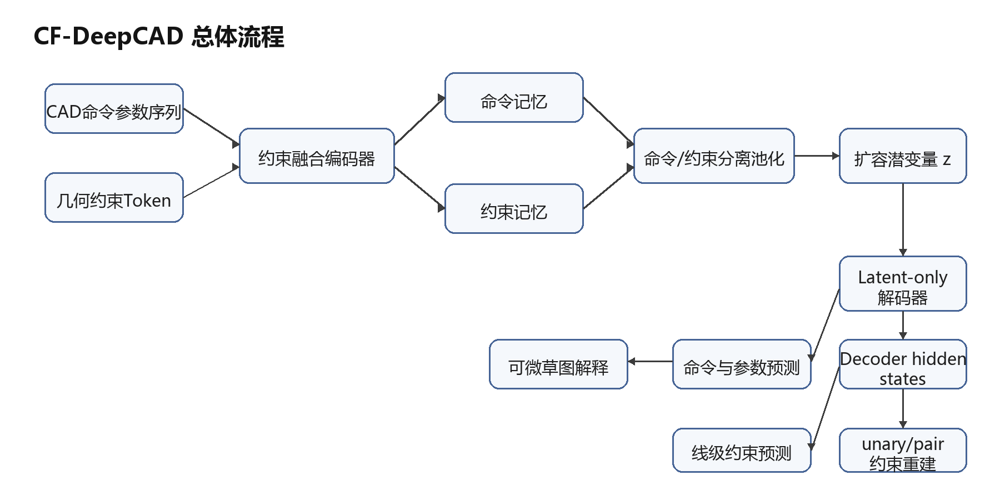

# 面向参数化 CAD 草图几何关系保持的约束融合自编码网络

## A Constraint-Fused Autoencoding Network for Geometric Relation Preservation in Parametric CAD Sketches

## 1. 引言

CAD 模型是工业产品设计、机械制造和数字孪生系统中的核心数据形态。与普通三维网格或点云不同，工程 CAD 模型不仅包含最终几何外形，还包含能够表达设计意图的参数化构造历史。典型建模过程往往由二维草图和三维特征操作组成：设计者首先在草图平面上绘制点、线、圆弧等几何元素，并通过水平、竖直、平行、垂直、重合、相切等约束限定其相对关系；随后通过拉伸、旋转、切除等操作形成三维实体。因此，对 CAD 模型进行生成、压缩或重建时，仅恢复命令序列和数值参数并不足够，模型还应尽可能保持原始设计中的几何关系与参数化结构。

DeepCAD [1] 首次系统地将 CAD 建模历史表示为可学习的命令-参数序列，并利用 Transformer 自编码器构建 CAD 潜在空间。该工作证明了深度网络可以在大规模 CAD 数据上学习构造序列的分布，并在自编码和随机生成任务中获得较好效果。然而，DeepCAD 的主要优化目标是命令分类和参数离散值预测。对于草图中实际存在的结构性关系，网络只能通过坐标参数间接学习。例如，两条线段是否平行，在序列参数层面对应多个坐标之间的耦合关系；如果训练目标只逐项监督坐标离散值，模型可以得到较高的参数准确率，却仍可能破坏平行或垂直关系。对工程设计而言，这类关系破坏会削弱模型的可编辑性和可复用性。

本文关注一个具体问题：**在不破坏 DeepCAD 生成闭包的条件下，如何将草图几何约束有效注入网络，使重建结果同时保持序列精度和几何关系一致性？** 原始 DeepCAD 的核心建模假设可以写为 $S \sim P(S \mid z)$，即解码器在训练和推理时均以潜变量 $z$ 作为生成 CAD 命令与参数的唯一必需条件。若在主解码路径中额外引入外部约束记忆，模型可能退化为 $P(S \mid z, C)$，从而削弱随机采样 $z$ 独立生成 CAD 序列的能力。因此，约束融合必须在增强几何关系表达的同时，保持 latent-only decoder 的生成契约。

该问题包含四个挑战。第一，约束是线级或线对级对象，而 DeepCAD 的标准输入是顺序命令 token，二者粒度不一致。第二，平行和垂直属于 pair-level 关系，若全部压缩进低容量潜变量，容易造成关系信息损失。第三，约束 token 与命令 token 的语义不同，若直接做全序列平均池化，约束信息可能被数量更多的命令 token 稀释。第四，辅助约束监督若直接作用在 $z$ 上，模型可能在潜变量旁路中记忆约束表，而不是让约束信息真正转化为解码后的 CAD 序列。

针对上述挑战，本文提出 CF-DeepCAD。该方法以 DeepCAD 的命令-参数序列为基础，新增四类几何约束的结构化表示，并通过约束融合编码器、命令/约束分离池化、扩容潜变量、latent-only 解码器和解码器侧约束监督实现端到端训练。本文的主要贡献如下：

1. **提出保持生成闭包的草图约束融合 CAD 自编码框架。** 在原始命令序列之外显式建模水平、竖直、平行和垂直关系，使约束 token 与 CAD token 在编码器中联合建模，但主解码路径仍严格保持 $P(S \mid z)$。
2. **提出命令/约束分离的约束感知池化机制。** 由编码器输出分别池化命令记忆和约束记忆，再通过门控融合形成扩容潜变量，避免全序列 masked mean 对约束 token 的语义稀释。
3. **提出基于解码器输出的约束关系重建模块。** 不再直接从 $z$ 重建约束，而是从 decoder hidden states 聚合 line-level features，并在解码表示上预测 unary 与 pair 关系，使约束监督作用于可解释的解码后表示。
4. **构建面向约束保持的多任务训练目标与评估协议。** 本文综合命令参数重建、线级约束预测、decoder-side 约束重建和可微几何一致性损失，并为后续实验设计序列级和约束级评估指标。

## 2. 相关工作

### 2.1 CAD 表示学习与生成

CAD 深度生成研究试图从传统的几何文件或边界表示中学习设计对象的结构分布。早期三维生成方法多以体素、点云或网格为对象 [6-8]，这些表示适合描述形状外观，但难以保留 CAD 构造历史和参数化可编辑性。CSGNet [9] 将形状表示为构造实体几何程序，为神经网络生成可解释的几何程序提供了思路。ShapeAssembly [10] 进一步通过结构化程序描述三维形状装配关系。相比之下，DeepCAD [1] 直接面向 CAD 建模序列，能够表达草图曲线、拉伸特征及其参数，是参数化 CAD 生成方向的重要基线。

近年来，CAD 数据集也逐渐从几何形状扩展到设计过程和草图关系。ABC 数据集 [2] 为三维 CAD 曲面和边界表示研究提供了大规模基础。Fusion 360 Gallery [3] 关注真实设计过程中的建模序列。SketchGraphs [4] 则将草图约束作为图结构建模，为草图关系学习提供了大规模数据视角。这些工作共同表明，CAD 模型不仅是几何外形，更是包含拓扑关系、特征树和设计意图的结构化对象。

### 2.2 序列模型与矢量图形生成

Transformer [5] 已成为处理离散序列和结构化 token 的基础架构，在自然语言、图像 patch 序列、矢量图形和程序生成中均表现突出。SketchRNN [11] 将手绘草图表示为笔画序列，DeepSVG [12] 使用层级 Transformer 生成可缩放矢量图形。CAD 命令序列与 SVG、草图笔画类似，都具有“命令类型 + 参数”的组合结构，但 CAD 还额外包含严格的几何约束和工程语义。本文借鉴序列模型的表示能力，同时针对 CAD 草图关系设计显式约束融合机制。

### 2.3 几何约束与可编辑设计意图

传统 CAD 系统中的几何约束通常由专用求解器维护，用户可通过水平、竖直、平行、垂直、同心等约束表达设计意图。神经网络若忽略这些关系，生成结果虽然视觉相似，却可能难以在工程环境中继续编辑。SketchGraphs [4] 将草图约束构造成图学习问题，说明约束关系可以作为监督信号进入学习系统。本文与图式约束预测不同，目标不是单独恢复约束图，而是将约束关系嵌入 CAD 自编码器，使生成的命令参数本身更好地满足几何关系。

### 2.4 多任务学习与结构监督

多任务学习通过共享表示同时优化多个相关目标，常用于在主任务之外注入结构先验 [13]。在形状重建中，辅助几何损失可改善潜空间的可解释性和最终几何质量 [6, 8]。本文将 CAD 重建视作主任务，将线级约束预测、线对关系重建和可微几何一致性作为辅助任务。不同于简单叠加损失，本文强调监督位置与生成闭包的一致性：约束 token 可以在编码阶段帮助形成更强的 $z$，但约束损失应作用于 decoder layer 之后的表示或输出，而不应直接把 $z$ 变成绕过解码器的约束表。

## 3. 问题定义

给定一个 CAD 构造序列 $S = \{(c_t, a_t)\}_{t=1}^{T}$，其中 $c_t$ 表示第 $t$ 个命令类型，$a_t$ 表示该命令对应的离散参数。对于草图中的线段集合 $L = \{l_i\}_{i=1}^{N}$，本文考虑四类几何约束：

$$
C = C^h \cup C^v \cup C^p \cup C^o
$$

其中 $C^h$ 表示水平线约束，$C^v$ 表示竖直线约束，$C^p$ 表示平行线对约束，$C^o$ 表示垂直线对约束。水平和竖直约束是 unary 约束，其对象为单条线段；平行和垂直约束是 pair 约束，其对象为线段对。

原始 DeepCAD 的生成假设为：

$$
\begin{aligned} z &\sim \mathcal{N}(0, I) \\ S &\sim P(S \mid z) \end{aligned}
$$

其中，$z$ 表示 CAD 序列的连续潜变量，`N(0, I)` 为均值为零、协方差为单位矩阵的标准正态先验；$S \sim P(S \mid z)$ 表示完整 CAD 命令参数序列由给定潜变量 $z$ 的条件分布生成。该假设刻画了 DeepCAD 的基本生成闭包：解码器在训练重建和随机生成时均应以 $z$ 作为生成 $S$ 的唯一必需条件。换言之，一旦从先验分布中采样得到 $z$，模型应能够不依赖外部约束记忆、关系矩阵或人工约束 token，直接生成合法的 CAD 序列。本文后续的约束融合设计均以保持这一闭包为前提，即约束信息可以在编码阶段参与潜变量形成，也可以作为解码输出后的辅助监督，但不应成为主解码路径的额外必需输入。

本文目标是在学习编码器 $E_\theta$ 和解码器 $D_\phi$ 的同时，使重建序列

$$
\hat{S} = D_\phi(z), \quad z = E_\theta(S, C)
$$

满足两个要求：

1. **序列重建一致性**：命令类别与参数值尽可能接近原始序列。
2. **几何关系保持性**：重建草图中的线段应尽可能保持原始草图中的水平、竖直、平行和垂直关系。

与把解码器显式建模为 $P(S \mid z, C)$ 的条件生成不同，本文保持 $P(S \mid z)$ 的主解码闭包。约束 $C$ 可以进入编码器和辅助监督，用于塑造更具几何结构表达能力的 $z$；但在解码阶段，CAD 命令与参数的主预测只以 $z$ 为必需输入。换言之，本文要学习的是一种约束增强的 latent 表示，而不是一个推理期必须外部提供约束记忆的解码器。

## 4. 方法

### 4.1 方法概览

CF-DeepCAD 的总体思想是：**在编码侧融合几何约束，在解码侧保持 latent-only 生成，并把约束监督后移到 decoder 输出之后。** 具体而言，模型包含五个关键组成部分：

1. **约束表示层**：将水平/竖直等 unary 约束表示为线级多标签，将平行/垂直等 pair 约束表示为关系 token 和线对矩阵。
2. **约束融合编码器**：在与 DeepCAD 相同的命令-参数嵌入主干之上，对每个序列位置叠加线级 `constraint_tags` 投影（可选）；再将 CAD token 与约束 token 拼接后输入 Transformer，以学习命令、参数与约束之间的上下文关联。
3. **命令/约束分离池化与扩容潜变量**：分别从命令记忆和约束记忆中提取全局表示，经门控融合与瓶颈映射得到单 token $z$，默认潜变量维度由 256 扩展为 512。
4. **latent-only 解码器**：解码器只接收 $z$，输出命令 logits、参数 logits 和 decoder hidden states；`constraint_memory` 不进入 CAD 命令与参数的主生成路径。
5. **解码器侧多粒度监督**：从 decoder hidden states 聚合 line-level features，进行线级约束预测、unary/pair 约束重建，并由参数 logits 计算可微几何一致性损失。

整体流程如下。

在该结构中，`constraint_memory` 只参与 encoder-side pooling 或诊断，不作为 decoder 主路径输入；约束重建也不直接从 $z$ 出发，而是从 decoder hidden states 中抽取 line features 后进行预测。

### 4.1.1 符号与算子约定

为使后文记法简洁一致，除另行说明外，本文对下列算子采用统一约定：

- $Concat(u, v)$：将 $u$ 与 $v$ 在最后一个特征维上首尾相接，得到维数为二者特征维之和的向量；记号 $[u; v]$ 与 $Concat(u, v)$ 同义。
- $Attention(Q, K, V)$：缩放点积注意力，即 $softmax(QK^T / \sqrt{d_k})V$，其中 $d_k$ 为查询/键投影后的特征维；其多头形式见 4.3 节，经典定义可参见文献 [5]。
- $MultiHead(\cdot)$：在多个注意力头并行计算后，将各头输出在特征维上拼接并经输出投影得到最终表示。
- $Dropout(\cdot)$：训练阶段对输入按给定保留概率作 Bernoulli 采样并随机置零的正则化算子；推理阶段按惯例关闭或采用确定性缩放。
- $LN(\cdot)$：层归一化，在特征维上对激活作均值方差归一化后再施加可学习仿射变换。
- $\zeta(\cdot)$：将线级四维约束标签向量 $\eta_t \in R^4$ 映射至 $R^d$ 的浅层可学习投影，用于 CAD 命令 token 主体的加性校正。

### 4.2 约束表示：从坐标关系到结构监督

DeepCAD 原始序列中的线段由命令及其端点参数隐式定义。若直接从坐标参数学习平行或垂直关系，模型需要在高维离散参数空间中自行发现复杂耦合。本文将这类隐式关系显式化。

对于第 $i$ 条线段，定义 unary 标签：

$$
u_i = [y_i^h, y_i^v] \in \{0, 1\}^2
$$

其中 $y_i^h = 1$ 表示该线段为水平线，$y_i^v = 1$ 表示该线段为竖直线。对于线段对 $(i, j)$，定义 pair 标签：

$$
p_{ij} = [y_{ij}^p, y_{ij}^o] \in \{0, 1\}^2
$$

其中 $y_{ij}^p = 1$ 表示 $l_i$ 与 $l_j$ 平行，$y_{ij}^o = 1$ 表示二者垂直。由于平行和垂直关系是无向关系，理论上有 $p_{ij} = p_{ji}$。

同时，本文构造约束 token：

$$
\tau_k = (r_k, i_k, j_k)
$$

其中 $r_k$ 为离散约束类型，$i_k$、$j_k$ 为约束所涉线段在局部线索引中的编号。为在序列接口上保持 unary 约束与 pair 约束的表示一致，本文在数据预处理阶段对一元轴向约束令 $j_k = i_k$。每个 $\tau_k$ 既作为结构化约束 token 进入编码器输入序列，又与 unary / pair 标签矩阵共同构成训练中的辅助监督项。

受序列长度与计算资源限制，约束 token 序列在实际实现中截断或填充至固定长度上界 $M_{max} = 128$：当提取到的约束数超过 $M_{max}$ 时，仅保留前 $M_{max}$ 项；不足时以空约束类型填充，并在编码器的注意力计算中借助填充掩码屏蔽无效位置。下文记号 $M$ 表示有效约束项数目，张量维数则统一由 $M_{max}$ 对齐。

约束 token 的连续表示定义如下。离散三元组 $\tau_k$ 经可学习嵌入映射为 $e_k^{con} \in R^d$。记 $\phi(\cdot)$ 为类型嵌入算子，将离散约束类型映射至 $R^d$；记 $\lambda(\cdot)$ 为线索引嵌入算子，将离散线段下标映射至 $R^{d_l}$。$F: R^{2d_l} \to R^d$ 为由仿射变换与非线性激活构成的前馈融合映射。对第 $k$ 个约束，定义

$$
e_k^{con} = LN\left(W \times \left(\phi(r_k) + F(Concat(\lambda(i_k), \lambda(j_k)))\right) + b\right).
$$

其中 $W \in R^{d \times d}$、$b \in R^d$ 为可学习参数。当约束为一元轴向关系时，有 $i_k = j_k$，此时 $Concat(\lambda(i_k), \lambda(j_k))$ 退化为同一线段嵌入的复制拼接，仍由同一 $F$ 映射至 $R^d$，从而无需在模型结构中引入分支。

### 4.3 约束融合编码器

原始 DeepCAD 在每个序列位置 $t$ 上以命令类型嵌入与参数嵌入（及可选的分组嵌入）之和作为 token 主体，再施加可学习位置编码。本文保留上述命令-参数嵌入主干 $\Psi_{cmd}(c_t)$、$\Psi_{arg}(a_t)$（及与 DeepCAD 一致的可选 $\Psi_{grp}(g_t)$），但在进入位置编码之前，对每个位置额外叠加线级约束标签的投影项 $\zeta(\eta_t)$（可选，第一版先不叠加）。具体地，记 $\eta_t \in R^4$ 为第 $t$ 个命令位置上的线级约束指示向量，其四维分量依次对应水平、竖直、平行、垂直四类几何关系在该位置的参与情况。对非线段命令位置，$\eta_t$ 为零向量。据此，CAD 命令在进入联合 Transformer 之前的嵌入可写为

$$
\begin{aligned} e_t^{pre} &= \Psi_{cmd}(c_t) + \Psi_{arg}(a_t) + \Psi_{grp}(g_t) + \zeta(\eta_t), \\ e_t^{cad} &= PE(e_t^{pre}). \end{aligned}
$$

其中ζ(η_t)为可选，第一版先不叠加，设经上式得到的 CAD 命令参数 token 嵌入序列为 $e_t^{cad}$，约束 token 嵌入为 §4.2 所定义之 $e_k^{con}$。本文将二者拼接为联合序列：

$$
X = [e_1^{cad}, \ldots, e_T^{cad}, e_1^{con}, \ldots, e_M^{con}]
$$

为区分命令 token 与约束 token，加入 segment embedding：

$$
\tilde{x}_n = x_n + s_{g(n)}
$$

其中，$x_n$ 表示联合序列 $X$ 中第 $n$ 个 token 的原始嵌入，$g(n) \in \{0, 1\}$ 为第 $n$ 个 token 的分段编号，$s_{g(n)}$ 表示由该编号查表得到的可学习 segment embedding。本文采用与实现一致的二值编号：当 $1 \le n \le T$ 时，$x_n$ 来自 CAD 命令参数序列，令 $g(n)=0$；当 $T < n \le T+M$ 时，$x_n$ 来自约束 token 序列，令 $g(n)=1$。因此，上式等价于为 CAD token 加上同一个 0 号分段向量 $s_0$，为约束 token 加上另一个 1 号分段向量 $s_1$。该设计的作用是向 Transformer 显式标记 token 的语义来源，使其在联合自注意力中既能建模命令与约束之间的关联，又不会混淆“建模操作 token”和“几何关系 token”两类不同对象。

例如，当 $T=60$、$M=8$ 时，联合序列前 60 个位置对应 CAD 命令参数 token，均满足 $g(n)=0$；后 8 个位置对应约束 token，均满足 $g(n)=1$。经过 segment embedding 修正后，即使二者被拼接进同一个 Transformer 编码器，模型仍可根据分段向量区分其来源。随后使用 Transformer 编码器得到联合记忆：

$$
H = TransformerEncoder(\tilde{X})
$$

编码器输出被拆分为两部分：

$$
\begin{aligned} H^{cad} &= H_{1:T} \\ H^{con} &= H_{(T+1):(T+M)} \end{aligned}
$$

其中 $H^{cad}$ 作为命令记忆，保留每个命令位置的局部上下文；$H^{con}$ 作为约束记忆，保留每个约束 token 的结构信息。需要强调的是，$H^{con}$ 不传入 decoder 主生成路径，而只用于分离池化、诊断分析或训练日志统计。这样可以允许约束在编码侧塑造 $z$，同时避免解码器在训练或推理时依赖外部约束记忆。

全局潜变量 $z$ 由命令/约束分离池化和瓶颈层获得。若直接使用 full-sequence masked mean 将命令 token 与约束 token 一起平均，会存在两个问题：一是命令 token 数量通常远多于约束 token，约束信息容易被平均稀释；二是命令和约束语义不同，直接混合平均会破坏结构边界。因此，CF-DeepCAD 使用命令/约束分离池化：

$$
\begin{aligned} z_{cmd} &= MaskedMean(H^{cad}) \\ z_{con} &= MaskedMean(H^{con}) \\ g &= \sigma(W_g [z_{cmd}; z_{con}] + b_g) \\ z_{mix} &= g \odot z_{cmd} + (1 - g) \odot z_{con} \\ z_{pre} &= W_o [z_{cmd}; z_{con}; z_{mix}] + b_o \end{aligned}
$$

其中，$z_{cmd}$ 表示 CAD 命令流的全局摘要，$z_{con}$ 表示约束 token 的结构摘要；$[z_{cmd}; z_{con}]$ 表示在特征维上拼接两个向量；$W_g$ 和 $b_g$ 分别为门控网络的可学习权重矩阵和偏置；$\sigma(\cdot)$ 为 Sigmoid 函数，用于把门控值压缩到 $[0,1]$ 区间；$g$ 是逐维门控向量，用来控制每个特征维度更偏向命令摘要还是约束摘要；$\odot$ 表示逐元素乘法。由此，$z_{mix} = g \odot z_{cmd} + (1 - g) \odot z_{con}$ 表示一种自适应加权融合：当某一维的 $g$ 接近 1 时，该维更依赖命令摘要 $z_{cmd}$；当 $g$ 接近 0 时，该维更依赖约束摘要 $z_{con}$。最后，$W_o$ 和 $b_o$ 为输出投影层的可学习参数，$[z_{cmd}; z_{con}; z_{mix}]$ 将命令摘要、约束摘要和门控融合摘要再次拼接，并投影为瓶颈层输入 $z_{pre}$。

上述三行公式的直观含义是：模型不是简单地把命令信息和约束信息平均相加，而是先学习一个门控向量 $g$，让网络根据样本自身内容决定“哪些维度应更多保留命令重建信息，哪些维度应更多引入约束结构信息”。这样可以在保持主任务重建能力的同时，减少约束 token 在全局池化中被稀释的风险。随后通过瓶颈映射得到最终潜变量：

$$
z = B(z_{pre})
$$

本文推荐采用单 token $1 \times 512$ 作为默认 latent 形式。该设计兼顾两方面需求：一方面，相比原始 $1 \times 256$，更大的潜变量容量有助于同时承载命令重建和约束结构信息；另一方面，外部接口仍保持单一 $z$，因此随机生成路径仍可写为：

$$
z \sim \mathcal{N}(0, I), \quad \hat{S} = D_\phi(z)
$$

本文不采用多 token latent 或显式 $z_{cmd}, z_{con}$ 双输入 decoder，因为这类设计可能把解码器接口扩展为多个必需条件，削弱 $P(S \mid z)$ 的建模约束。在本文中，$z_{cmd}$ 与 $z_{con}$ 仅是 pooling 模块内部中间量，最终暴露给 decoder 的仍是单一潜变量 $z$。

### 4.4 约束感知解码器

原始 DeepCAD 解码器主要以全局潜变量 $z$ 为条件生成命令和参数。本文延续这一生成契约，不在主解码路径中引入 `constraint_memory`。给定 $z \in R^{1 \times B \times 512}$，解码器输出序列隐状态：

$$
G = DecoderLayer(z)
$$

再由命令头与参数头得到：

$$
\begin{aligned} P_{cmd} &= f_{cmd}(G), \\ P_{arg} &= f_{arg}(G) \end{aligned}
$$

其中 $P_{cmd}$ 表示命令类别 logits，$P_{arg}$ 表示参数离散值 logits。需要强调的是，解码器的命令与参数预测仅以上述隐状态 $G$ 为输入，而 $G$ 又完全由潜变量 $z$ 生成。因此，CF-DeepCAD 的主生成路径始终保持为 $P(S \mid z)$：约束信息只能通过编码阶段形成的潜变量间接影响解码结果，不能作为解码器额外读取的外部条件。为了使这种间接影响真正作用于输出序列，本文在 decoder hidden states、命令参数 logits 以及由 logits 解析得到的软几何上施加辅助监督，从而推动 $z$ 中的约束结构转化为最终 CAD 序列的几何关系保持能力。

训练重建与随机生成使用相同 decoder 接口：

$$
\begin{aligned} \text{reconstruction:}\quad & z = E_\theta(S, C), \quad \hat{S} = D_\phi(z) \\ \text{generation:}\quad & z \sim \mathcal{N}(0, I), \quad \hat{S} = D_\phi(z) \end{aligned}
$$

这使模型在训练和推理之间保持一致，避免训练期依赖外部约束、推理期约束不可用的分布落差。

### 4.5 约束关系重建模块

CF-DeepCAD 的约束关系重建模块不直接从 $z$ 预测约束矩阵，而是基于 decoder hidden states 聚合得到的线级解码表示进行 unary 与 pair 预测。这样可以使约束监督作用于 decoder layer 之后的可解释表示，而不是把 $z$ 变成绕过 decoder 的约束表。

设 $G \in R^{B \times T \times d}$ 为 decoder hidden states，`line_cmd_mask` 表示哪些位置对应 line command，`line_index_map` 表示命令位置到线索引的映射。第 $i$ 条线段的解码表示定义为：

$$
q_i^{dec} = Mean(\{G_t \mid line\_index\_map(t) = i,\ line\_cmd\_mask(t) = 1\})
$$

#### 4.5.1 线级一元轴向关系重建（水平与竖直）

对第 $i$ 条线段，记真实一元标签为 $u_i = [y_i^h, y_i^v]$。本文由单条线段的解码表示预测水平与竖直 logits：

$$
\hat{U}_i = f_u(q_i^{dec})
$$

训练时，仅在真实存在的线段索引集合上对 $\hat{U}$ 与 $U$ 计算带正样本权重的二元交叉熵。该分支不替代解码器输出的离散坐标，而是要求 decoder hidden states 显式表达“哪些线索引上存在轴向约束”。

#### 4.5.2 线级成对关系重建（平行与垂直）

平行和垂直约束的基本对象是线段对 $(l_i, l_j)$。本文从两条线段的解码表示构造成对关系特征：

$$
m_{ij} = [q_i^{dec}; q_j^{dec}; |q_i^{dec} - q_j^{dec}|; q_i^{dec} \odot q_j^{dec}]
$$

随后使用前馈网络预测该线段对的平行与垂直关系 logits，并通过对称化保证无向关系一致：

$$
\hat{P}_{ij} = \frac{1}{2} \cdot (f_p(m_{ij}) + f_p(m_{ji}))
$$

综合 unary 与 pair 两个分支，约束重建损失为：

$$
L_{rec} = BCE_w(\hat{U}, U) + BCE_w(\hat{P}, P)
$$

其中 $BCE_w$ 表示带正样本权重的二元交叉熵，用于缓解约束标签稀疏造成的类别不平衡。由于 $q_i^{dec}$ 来自 decoder layer 之后，$L_{rec}$ 会推动解码表示具备可解释的 line relation，而不是直接把约束监督压在潜变量 $z$ 上。

### 4.6 线级约束预测与监督聚焦（可选，与ζ(η_t)状态同）

本文在解码隐状态上增加线级约束预测头，用于预测每个命令位置是否参与水平、竖直、平行或垂直关系。关键改进在于，损失只在真实线段命令位置计算。设 $m_t^{line} \in \{0, 1\}$ 表示第 $t$ 个命令是否为线段命令，$\hat{y}_t \in [0, 1]^C$ 为预测概率，$y_t \in \{0, 1\}^C$ 为目标标签，$C = 4$ 表示水平、竖直、平行、垂直四个约束通道。令有效线段命令数量为：

$$
N_{line} = \sum_t m_t^{line}
$$

线级约束预测损失定义为有效线段位置及其约束通道上的平均二元交叉熵：

$$
L_{pred} = \frac{1}{N_{line} \cdot C + \varepsilon} \cdot \sum_t m_t^{line} \cdot \sum_{c=1}^{C} BCE(\hat{y}_{t,c}, y_{t,c})
$$

这样做的动机是：非线段命令，如拉伸、起始和结束标记，并不直接承载草图线段约束。如果将这些位置全部纳入 BCE，大量零标签会使模型倾向于学习“多数位置无约束”的平凡解，从而稀释真正线段位置上的监督。LINE-only 策略使辅助头更专注于约束实际发生的几何对象。

### 4.7 可微几何一致性损失

仅依赖约束标签预测或关系矩阵重建，仍难以保证解码得到的离散参数在几何空间中满足相应约束。为进一步缩小辅助监督与最终几何输出之间的差距，本文在训练阶段引入可微草图解释器，将参数 logits 映射为连续的软线段端点，并在该连续几何空间中构造一致性约束。

设第 $i$ 条线段的软起点和软终点分别为 $a_i, b_i \in R^2$。其归一化方向向量定义为：

$$
d_i = \frac{b_i - a_i}{\max(\lVert b_i - a_i \rVert_2, \varepsilon)}
$$

对于单线段轴向约束，水平线段应满足 $d_{iy} = 0$，竖直线段应满足 $d_{ix} = 0$，因此本文定义如下残差项：

$$
r_h(i) = d_{iy}^2, \quad r_v(i) = d_{ix}^2.
$$

对于线段对约束，本文采用归一化方向向量的内积刻画两条线段的相对方向。由于 CAD 草图中的线段方向不区分正反，平行关系对应 $|d_i \cdot d_j| \to 1$，垂直关系对应 $|d_i \cdot d_j| \to 0$。由此得到平行与垂直残差：

$$
r_p(i, j) = 1 - |d_i \cdot d_j|, \quad r_o(i, j) = |d_i \cdot d_j|.
$$

几何一致性损失仅在真实约束成立且对应几何对象有效的索引处计算。记 $m_i \in \{0, 1\}$ 为线段 $i$ 的有效性指示变量，$u_i^h$、$u_i^v$ 分别为水平与竖直的一元约束标签，$p_{ij}$、$o_{ij}$ 分别为平行与垂直的二元关系标签。记 $N_{geom}$ 为所有有效几何约束项数量，则：

$$
\begin{aligned} L_{geom} = \frac{1}{\max(N_{geom}, 1)} \cdot (&\sum_{i: m_i u_i^h = 1} r_h(i) \\ &+ \sum_{i: m_i u_i^v = 1} r_v(i) \\ &+ \sum_{(i,j): m_i m_j p_{ij} = 1} r_p(i, j) \\ &+ \sum_{(i,j): m_i m_j o_{ij} = 1} r_o(i, j)). \end{aligned}
$$

该损失项作为定义于连续几何空间上的结构正则，与命令及参数的离散重建损失联合优化，但不取代后者对序列语义及离散取值的监督。

### 4.8 总体训练目标

模型总损失由四部分组成：

$$
L = L_{cmd} + \alpha \cdot L_{pred}\;(\text{optional, same status as } \zeta(\eta_t)) + \beta \cdot L_{rec} + \gamma \cdot L_{geom}
$$

其中 $L_{cmd}$ 为命令类别和参数离散值的交叉熵损失；$L_{pred}$ 为线级约束预测损失；$L_{rec}$ 为 §4.5 定义的 decoder-side unary 与 pair 约束重建损失；$L_{geom}$ 为由参数 logits 导出的可微几何一致性损失。实验中将优先保证 $L_{cmd}$ 稳定下降，再逐步调节 $\alpha$、$\beta$、$\gamma$，避免辅助损失压过主重建任务。

## 5. 实验设计

### 5.1 数据集与任务

本文计划使用 DeepCAD 公开数据划分中的测试集进行评估。每个样本以向量化命令序列形式表示，包括草图曲线命令和三维拉伸命令。本文评估自编码重建任务：模型输入原始 CAD 序列及训练阶段可用的约束结构，编码得到潜变量 $z$，再由 latent-only decoder 输出重建序列，并与真实序列及其几何关系进行比较。

与方法设计一致，随机生成任务中不输入约束 token 或约束矩阵，而是直接采样 $z \sim \mathcal{N}(0, I)$ 并调用同一解码器生成 CAD 序列。当前论文阶段尚未产生实验数据，以下实验表格仅保留占位结构。

### 5.2 对比方法

本文拟与官网下载的原始 DeepCAD 自编码预训练模型进行比较。DeepCAD 作为强基线，已经能够较好地重建命令与参数序列。本文方法将在相同训练数据划分上训练，并报告序列重建指标与约束保持指标。

为分析 CF-DeepCAD 各组成部分的作用，本文计划设置模块级消融实验。消融实验不作为独立方法命名，而是在统一 CF-DeepCAD 框架内分别去除或替换单个组件，例如取消命令/约束分离池化、减小潜变量容量、将约束重建输入由 decoder hidden states 改为其它表示，或关闭可微几何一致性损失。所有消融均服务于解释最终 CF-DeepCAD 的设计必要性。

为避免评估口径差异，所有约束指标将基于同一测试样本集合与同一几何解析规则统计。对于命令和参数准确率，沿用 DeepCAD 仓库中自编码评估脚本的定义：命令准确率统计命令类别是否一致；参数准确率仅在命令预测正确时统计有效参数是否落入给定容差内。

### 5.3 评估指标

本文使用两类指标。

**序列级重建指标。** 命令准确率 $ACC_{cmd}$ 与参数准确率 $ACC_{param}$ 用于衡量模型对原始 CAD 序列的重建能力。

**约束保持指标。** 对水平和竖直约束，本文统计 index-aligned 保持率，即在原始草图中被判定为水平或竖直的线段位置，重建草图中相同索引线段是否仍满足对应方向关系。对平行和垂直约束，本文统计 index-aligned 召回率，即原始草图中满足平行或垂直的线对，在重建草图中相同索引线对是否仍满足关系。四类方向关系的判断均采用角度容差；评估程序中同时记录几何解析失败样本数和拉伸数量不匹配样本数，用以反映结构稳定性。

## 6. 实验结果与分析

### 6.1 序列重建性能

表 1 计划报告 DeepCAD 与本文方法在测试集上的命令与参数重建准确率。当前阶段暂无实验数据，数值暂留空白。

表 1 序列级自编码重建精度

| 方法             | $ACC_{cmd}$ | $ACC_{param}$ |
| -------------- | --------- | ----------- |
| DeepCAD（官方预训练） | 0.9936    | 0.9759      |
| CF-DeepCAD（本文） |           |             |

待实验完成后，本节将分析 CF-DeepCAD 是否在保持 $P(S \mid z)$ 生成闭包的同时维持或提升命令参数重建能力。重点关注命令/参数主任务是否稳定，以及扩容潜变量和分离池化是否能在不引入推理期外部约束依赖的条件下支撑结构信息表达。

### 6.2 几何关系保持性能

表 2 计划报告四类几何关系保持指标。当前阶段暂无实验数据，数值暂留空白。

表 2 草图几何约束保持性能

| 方法             | 水平保持率  | 竖直保持率  | 平行召回率  | 垂直召回率  | 解析失败数 | 拉伸数不匹配 |
| -------------- | ------ | ------ | ------ | ------ | ----- | ------ |
| DeepCAD（官方预训练） | 0.9510 | 0.9574 | 0.8617 | 0.9279 | 29    | 64     |
| CF-DeepCAD（本文） |        |        |        |        |       |        |

待实验完成后，本节将重点观察两类现象。第一，latent-only decoder 是否仍能通过扩容 $z$ 和分离池化保留足够的约束信息。第二，decoder-side 约束重建与可微几何一致性是否能把编码阶段学到的关系结构转化为最终参数输出中的方向关系保持。

### 6.3 消融分析

表 3 计划给出 CF-DeepCAD 关键模块的消融结果。该表不是比较不同数据集或不同评估脚本，也不是引入多个正式方法名称，而是在同一测试集、同一几何解析规则下，逐步观察最终模型中各组件的作用。当前阶段暂无实验数据，数值暂留空白。

表 3 约束融合模块消融结果

| 设置            | 实验目的                       | 主要做法                                                      | 平行召回率 | 垂直召回率 | 结果解释 |
| ------------- | -------------------------- | --------------------------------------------------------- | ----- | ----- | ---- |
| 完整 CF-DeepCAD | 验证最终方法整体效果                 | 使用分离池化、$z = 512$、latent-only decoder、decoder-side 约束重建与几何损失 |       |       |      |
| 去除分离池化        | 验证命令/约束分离池化的贡献             | 将命令记忆与约束记忆改为联合 masked mean 池化                             |       |       |      |
| 减小潜变量容量       | 验证 latent 容量对约束表达的影响       | 将 $z$ 从 512 维减小为 256 维                                    |       |       |      |
| 替换重建监督位置      | 验证 decoder-side recon 的必要性 | 不使用 decoder line features 作为约束重建输入                        |       |       |      |
| 去除几何损失        | 验证 soft geometry 的贡献       | 关闭 $L_{geom}$，仅保留离散重建与约束预测/重建损失                             |       |       |      |

待实验完成后，本节将围绕三个问题展开分析。首先，分离池化是否能避免约束 token 被全序列平均稀释。其次，$z = 512$ 是否能缓解命令重建与约束结构共同压缩的容量瓶颈。最后，decoder-side 约束重建与可微几何损失是否能把编码阶段学到的关系结构转化为最终参数输出中的方向关系保持。

### 6.4 结果讨论

由于当前阶段尚未产生实验数据，本节暂不对具体指标作结论性描述。根据方法设计，CF-DeepCAD 预期产生三类影响。

第一，latent-only decoder 要求模型通过 $z$ 将约束信息传递给解码器，因此训练稳定性会更依赖潜变量容量、pooling 策略和辅助损失权重。该设计的收益是训练和随机生成阶段保持同一解码接口。

第二，$z = 512$ 与命令/约束分离池化应有助于缓解上述信息瓶颈。扩容 latent 提供更高表示容量，分离池化则避免约束 token 在命令 token 主导的平均过程中被稀释。

第三，decoder-side recon loss 与 soft geometry loss 的作用不在于替代主解码路径，而在于让解码后的隐状态和参数分布对几何关系更加敏感。若实验结果显示几何指标提升而命令参数准确率保持稳定，将支持“编码侧融合、解码侧闭包、监督后置”的设计判断。

### 6.5 未来应用前景

本文计划首先验证自编码重建任务，即在输入完整 CAD 序列和相应约束信息的条件下，重建与输入一致的命令参数序列，并考察重建结果是否保持原有几何关系。因此，本节讨论的应用均属于基于当前方法的潜在扩展方向，而非本文已经完成验证的任务。其共同前提是：在后续工作中需要重新定义相应任务输入、训练目标和评估协议。

首先，该方法可扩展到**约束保持型 CAD 重建与自动补全**。当前论文关注完整输入条件下的约束保持重建；若要进一步实现自动补全，需要在训练阶段构造缺失条件重建任务，例如随机遮蔽部分命令、参数或草图元素，并要求模型在可见命令和已有约束条件下恢复完整序列。

其次，该方法有望扩展到**保持生成闭包的 CAD 随机生成与方案探索**。由于 CF-DeepCAD 不要求推理阶段输入约束记忆，随机采样 $z$ 后即可调用 latent-only decoder 生成 CAD 序列。未来可进一步研究如何在不破坏 $P(S \mid z)$ 的前提下，让潜空间方向与几何关系变化具有更强可解释性。

再次，该方法可作为**CAD 模型修复与格式迁移**的候选技术基础。在文件转换、压缩或历史模型恢复过程中，草图参数可能发生扰动，导致原本应当平行或垂直的线段出现轻微偏移。约束融合自编码器具有在重建过程中保持基础几何关系的潜力，因此未来可探索将其用于低质量 CAD 序列清理或跨平台数据迁移后的关系恢复。

最后，该方法可为**智能设计辅助与工程知识检查**提供表示基础。本文模型在训练中显式建模线级和线对级关系，因此其约束预测分支可作为设计关系识别的初步信号。未来若扩展更多约束类型，并结合传统 CAD 约束求解器或人工交互机制，有可能进一步支持设计意图识别、草图约束推荐和参数化建模质量检查。

## 7. 局限性

尽管 CF-DeepCAD 在架构上更严格地保持 DeepCAD 的生成闭包，仍存在以下局限。

首先，本文仅考虑水平、竖直、平行和垂直四类常见关系，尚未覆盖重合、相等长度、相切、同心、对称等更复杂约束。真实 CAD 草图中的约束系统通常更加丰富，未来可扩展为多类型约束图建模。

其次，本文采用软几何损失和神经网络预测来增强约束保持，并未在推理阶段调用传统几何约束求解器。因此模型输出仍可能在部分样本上偏离严格约束。若面向工业级参数化编辑，可考虑将神经生成与约束求解器结合，形成“学习生成 + 硬约束投影”的混合框架。

再次，latent-only decoder 要求所有必要约束信息都通过 $z$ 间接影响输出。相比允许 decoder 直接读取 `constraint_memory` 的结构，该设计更符合随机生成闭包，但也可能增加训练难度，并对 latent 容量、pooling 策略和辅助损失权重更敏感。

最后，本文当前阶段尚未完成实验，序列准确率、约束保持指标、消融结果和三维实体级几何误差均需后续补充。虽然方法设计上已避免推理期外部约束依赖，但其实际性能仍需要在统一测试划分和评估脚本下验证。

## 8. 结论

本文针对 DeepCAD 在草图几何关系保持方面的不足，提出了约束融合 CAD 自编码网络 CF-DeepCAD。该方法通过约束 token 联合编码、命令/约束分离池化、扩容潜变量、latent-only 解码器和 decoder-side 约束监督，将草图中的水平、竖直、平行和垂直关系显式纳入训练闭环，同时保持原始 DeepCAD 的 $P(S \mid z)$ 生成闭包。

与直接让 decoder 读取外部 `constraint_memory` 的方案不同，本文强调“编码侧融合、解码侧闭包、监督后置”：约束信息可以帮助形成更强的潜变量，但命令与参数生成只依赖 $z$；约束重建不直接压在 $z$ 上，而是作用于 decoder layer 之后的 line-level 表示。这一设计更适合作为后续随机生成、潜空间采样和工程 CAD 序列建模的基础。

未来工作将从三个方向展开：一是完成统一测试划分下的重建、约束保持和消融实验；二是扩展更多约束类型并建立统一约束图编码器；三是在随机生成和条件编辑任务中研究如何保持 latent-only 生成闭包，同时提升 CAD 生成模型的工程可用性。

## 参考文献

[1] Wu R, Xiao C, Zheng C. DeepCAD: A Deep Generative Network for Computer-Aided Design Models. *Proceedings of the IEEE/CVF International Conference on Computer Vision*, 2021: 6772-6782.

[2] Koch S, Matveev A, Jiang Z, et al. ABC: A Big CAD Model Dataset for Geometric Deep Learning. *Proceedings of the IEEE/CVF Conference on Computer Vision and Pattern Recognition*, 2019: 9601-9611.

[3] Willis K D D, Pu Y, Luo J, et al. Fusion 360 Gallery: A Dataset and Environment for Programmatic CAD Construction from Human Design Sequences. *ACM Transactions on Graphics*, 2021, 40(4): 1-24.

[4] Seff A, Ovadia Y, Zhou W, Adams R P. SketchGraphs: A Large-Scale Dataset for Modeling Relational Geometry in Computer-Aided Design. *arXiv preprint arXiv:2007.08506*, 2020.

[5] Vaswani A, Shazeer N, Parmar N, et al. Attention Is All You Need. *Advances in Neural Information Processing Systems*, 2017, 30.

[6] Fan H, Su H, Guibas L J. A Point Set Generation Network for 3D Object Reconstruction from a Single Image. *Proceedings of the IEEE Conference on Computer Vision and Pattern Recognition*, 2017: 605-613.

[7] Achlioptas P, Diamanti O, Mitliagkas I, Guibas L. Learning Representations and Generative Models for 3D Point Clouds. *Proceedings of the International Conference on Machine Learning*, 2018: 40-49.

[8] Yang G, Huang X, Hao Z, Liu M Y, Belongie S, Hariharan B. PointFlow: 3D Point Cloud Generation with Continuous Normalizing Flows. *Proceedings of the IEEE/CVF International Conference on Computer Vision*, 2019: 4541-4550.

[9] Sharma G, Goyal R, Liu D, Kalogerakis E, Maji S. CSGNet: Neural Shape Parser for Constructive Solid Geometry. *Proceedings of the IEEE Conference on Computer Vision and Pattern Recognition*, 2018: 5515-5523.

[10] Jones R K, Barton T, Xu X, et al. ShapeAssembly: Learning to Generate Programs for 3D Shape Structure Synthesis. *ACM Transactions on Graphics*, 2020, 39(6): 1-20.

[11] Ha D, Eck D. A Neural Representation of Sketch Drawings. *International Conference on Learning Representations*, 2018.

[12] Carlier A, Danelljan M, Alahi A, Timofte R. DeepSVG: A Hierarchical Generative Network for Vector Graphics Animation. *Advances in Neural Information Processing Systems*, 2020, 33: 16351-16361.

[13] Caruana R. Multitask Learning. *Machine Learning*, 1997, 28(1): 41-75.

[14] Kingma D P, Welling M. Auto-Encoding Variational Bayes. *International Conference on Learning Representations*, 2014.

[15] Goodfellow I, Pouget-Abadie J, Mirza M, et al. Generative Adversarial Nets. *Advances in Neural Information Processing Systems*, 2014, 27.

[16] Rezende D J, Mohamed S. Variational Inference with Normalizing Flows. *Proceedings of the International Conference on Machine Learning*, 2015: 1530-1538.

[17] Kipf T N, Welling M. Semi-Supervised Classification with Graph Convolutional Networks. *International Conference on Learning Representations*, 2017.

[18] Battaglia P W, Hamrick J B, Bapst V, et al. Relational Inductive Biases, Deep Learning, and Graph Networks. *arXiv preprint arXiv:1806.01261*, 2018.

[19] Loshchilov I, Hutter F. Decoupled Weight Decay Regularization. *International Conference on Learning Representations*, 2019.

[20] Paszke A, Gross S, Massa F, et al. PyTorch: An Imperative Style, High-Performance Deep Learning Library. *Advances in Neural Information Processing Systems*, 2019, 32.

## 附录 A：实验复现说明

本文当前阶段尚未产生实验数据。后续主实验应在相同测试划分上进行，并保持同一评估脚本、角度阈值、参数容差和几何解析规则。若重新训练或更换权重，应重新运行自编码重建、命令参数准确率评估和约束保持评估，并用同一评估口径更新表 1 至表 3。

Chamfer 距离评估需要 OpenCASCADE 几何内核和测试集点云。若本地环境具备相关依赖，可按 DeepCAD 原始评估流程生成测试点云，并在相同重建结果上统计平均 Chamfer 距离、截尾均值、中位数和无效实体比例。

## 附录 B：符号表

| 符号       | 含义                             |
| -------- | ------------------------------ |
| $S$      | CAD 命令参数序列                     |
| $c_t$    | 第 $t$ 个命令类型                    |
| $a_t$    | 第 $t$ 个命令对应的参数向量               |
| $L$      | 草图线段集合                         |
| $C^h$    | 水平约束集合                         |
| $C^v$    | 竖直约束集合                         |
| $C^p$    | 平行约束集合                         |
| $C^o$    | 垂直约束集合                         |
| $z$      | CAD 序列潜变量                      |
| $H^{cad}$  | 命令记忆                           |
| $H^{con}$  | 约束记忆                           |
| $G$      | Decoder hidden states          |
| $L_{cmd}$  | 命令与参数重建损失                      |
| $L_{pred}$ | 线级约束预测损失                       |
| $L_{rec}$  | decoder-side unary/pair 约束重建损失 |
| $L_{geom}$ | 可微几何一致性损失                      |

