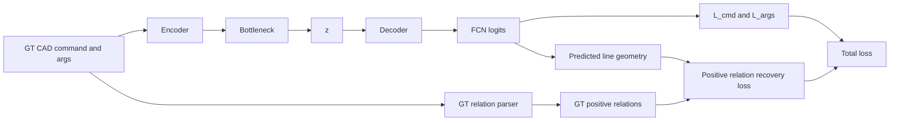

# DeepCAD 逐步添加几何约束技术方案

## 1. 方案目标

### 1.1 背景

原始 DeepCAD 的核心生成路径是：

```text
CAD command/args -> Encoder -> Bottleneck -> z -> Decoder -> command_logits/args_logits
```

训练目标以离散 CAD 序列重建为主，即命令分类损失 `L_cmd` 与参数分类损失 `L_args`。推理阶段只需要潜变量 `z`，解码器根据 `P(S | z)` 生成完整 CAD 序列。

此前 A2c 使用软几何残差约束，训练侧的 `geom_*` 指标可以下降，但最终测试侧需要经过 `argmax -> CAD vector -> CADSequence -> index-aligned 几何指标`，训练目标与评估口径存在差异。A2d 进一步引入 GT 关系监督和 hard BCE，但双向监督会把所有 GT=0 的 line/pair 都作为强负样本，容易产生额外梯度冲击。

**S2 实验进一步暴露的问题**：当前正样本 BCE 使用 `score = 1 - uy²` 等软代理，在 0.1° 尺度上迅速饱和——测试要求 `angle < 0.1°`，但训练 loss 在远大于 0.1° 的误差范围内已近乎为零，无法有效驱动 0.1° 精度优化。详见专项文档：`训练测试约束指标对齐问题与方案.md`。

本方案回到原始 DeepCAD 主路径，只增加一个几何约束模块，并采用更保守的正关系监督：

```text
只奖励/约束 GT 中明确存在的几何关系被恢复。
```

### 1.2 目标

1. 保留原始 DeepCAD 的主生成闭包 `P(S | z)`。
2. 保留原始 DeepCAD 的主任务损失权重：`L_cmd + 2.0 * L_args`。
3. 只新增一个辅助损失 `L_geom`。
4. `L_geom` 的 GT 关系来自真实 CAD 序列解析，而不是外部推理条件。
5. `L_geom` 第一版只监督 GT 中明确存在的水平、竖直、平行、垂直关系，不对所有 GT=0 样本施加强负样本惩罚。
6. 实验路线按“先复现原始 DeepCAD，再逐步接入几何模块”的方式推进，避免一次性引入过多结构变量。

### 1.3 非目标

本方案不引入 `constraint_memory` 作为 decoder 必需输入，不修改随机采样 `z` 独立生成 CAD 序列的能力。

本方案不引入 A2d 中的 `L_pred`、`L_recon`、constraint token、constraint head 等额外辅助任务。

本方案第一版不采用 A2d 的双向 hard BCE 负样本惩罚，不默认使用 `gamma_para=3`、`pos_weight=5.0`、强总辅助权重或长 warmup 强辅助配置。

---

## 2. 整体架构

### 2.1 总体数据流



### 2.2 总损失

总损失固定为三类损失：

```text
L_total = L_cmd + 2.0 * L_args + gamma_geom * L_geom
```

其中：

- `L_cmd`：原始 DeepCAD 命令分类交叉熵。
- `L_args`：原始 DeepCAD 参数离散分类交叉熵，权重固定为 `2.0`。
- `L_geom`：新增几何正关系恢复损失。
- `gamma_geom`：唯一新增主调参项，第一版建议从小权重开始。

### 2.3 生成闭包

几何约束只在训练期作为辅助监督参与反传。推理阶段仍是：

```text
z -> Decoder -> command_logits/args_logits -> argmax -> CAD vector
```

不需要输入 GT 关系、不需要输入 constraint token、不需要输入外部约束 memory。

---

## 3. 原始 DeepCAD 基线

### 3.1 模块作用

原始 DeepCAD 的作用是把离散 CAD 序列压缩为潜变量 `z`，再从 `z` 重建 CAD 命令与参数。

### 3.2 模块原理

1. `CADEmbedding` 将 command、args、position 等信息嵌入为 token 表示。
2. `Encoder` 对输入序列编码，并通过 masked mean pooling 得到全局表示。
3. `Bottleneck` 将全局表示映射到潜变量 `z`，默认 `dim_z=256`，并使用 `Tanh` 约束潜空间范围。
4. `Decoder` 使用 `ConstEmbedding` 生成固定长度目标 token，再通过全局 `z` 加性注入生成每个位置的 hidden state。
5. `FCN` 输出 `command_logits` 与 `args_logits`。
6. `CADLoss` 使用命令交叉熵与参数交叉熵训练重建。

### 3.3 代码级结构

```python
outputs = model(commands, args)
command_logits = outputs["command_logits"]
args_logits = outputs["args_logits"]

loss_cmd = cross_entropy(command_logits, target_commands)
loss_args = cross_entropy(args_logits, target_args)

loss_total = loss_cmd + 2.0 * loss_args
```

### 3.4 举例说明

如果一个样本的真实序列包含 `Line -> Line -> Arc -> Ext -> EOS`，原始 DeepCAD 的目标是让 decoder 在对应位置预测正确命令，并在每个命令的有效参数槽上预测正确离散参数。无效参数槽由 `CMD_ARGS_MASK` 屏蔽，不参与参数损失。

---

## 4. GT 关系提取模块

### 4.1 模块作用

GT 关系提取模块从训练样本的真实 CAD 向量中解析 line 级与 line-pair 级几何关系，生成 `L_geom` 的监督标签。

输出包括：

```text
gt_horizontal:      [B, max_lines]
gt_vertical:        [B, max_lines]
gt_parallel:        [B, max_lines, max_lines]
gt_perpendicular:   [B, max_lines, max_lines]
line_mask:          [B, max_lines]
pair_mask:          [B, max_lines, max_lines]
line_index_map:     [B, S]
```

### 4.2 模块原理

对每个 CAD 样本：

1. 从 GT command/args 中提取有效 `Line`。
2. 按 profile / sketch 内顺序建立 line index。
3. 计算每条 line 的真实方向 `u_i = normalize(end_i - start_i)`。
4. 对单条 line 生成水平、竖直标签。
5. 对 line pair 生成平行、垂直标签。

### 4.3 单线标签

给定 GT 线段方向：

```text
u_i = (ux_i, uy_i)
```

水平标签：

```text
gt_horizontal_i = 1, if angle(line_i, x_axis) < angle_thresh
```

竖直标签：

```text
gt_vertical_i = 1, if angle(line_i, y_axis) < angle_thresh
```

### 4.4 双线标签

给定两条 GT 线段方向：

```text
u_i, u_j
dot_abs = |u_i · u_j|
```

平行标签：

```text
gt_parallel_ij = 1, if undirected_angle(u_i, u_j) < angle_thresh
```

垂直标签：

```text
gt_perpendicular_ij = 1, if |undirected_angle(u_i, u_j) - 90| < angle_thresh
```

### 4.5 代码级伪实现

```python
def build_gt_relations(gt_commands, gt_args, max_lines, angle_thresh):
    gt_lines = parse_gt_lines(gt_commands, gt_args)

    line_mask = build_line_mask(gt_lines, max_lines)
    unit = normalize(gt_lines.end - gt_lines.start)

    gt_horizontal = is_horizontal(unit, angle_thresh).float()
    gt_vertical = is_vertical(unit, angle_thresh).float()

    dot_abs = torch.abs((unit.unsqueeze(2) * unit.unsqueeze(1)).sum(dim=-1))
    angle = torch.rad2deg(torch.acos(dot_abs.clamp(0.0, 1.0)))

    gt_parallel = (angle < angle_thresh).float()
    gt_perpendicular = (torch.abs(angle - 90.0) < angle_thresh).float()

    pair_mask = line_mask.unsqueeze(2) * line_mask.unsqueeze(1)
    pair_mask = pair_mask * remove_self_pairs(max_lines)

    return {
        "gt_horizontal": gt_horizontal,
        "gt_vertical": gt_vertical,
        "gt_parallel": gt_parallel,
        "gt_perpendicular": gt_perpendicular,
        "line_mask": line_mask,
        "pair_mask": pair_mask,
        "line_index_map": gt_lines.line_index_map,
    }
```

### 4.6 举例说明

一个 sketch 中有四条线：

```text
line0: 水平
line1: 竖直
line2: 水平
line3: 斜线
```

则 GT 正关系可能是：

```text
gt_horizontal: [1, 0, 1, 0]
gt_vertical:   [0, 1, 0, 0]
gt_parallel:   (0, 2) = 1
gt_perpendicular: (0, 1) = 1, (1, 2) = 1
```

这些标签只表示“应该恢复的关系”。例如 `line3` 不是水平，并不代表训练时要强迫它远离水平；第一版不对 `gt_horizontal[3]=0` 施加强负样本惩罚。

---

## 5. 预测线几何解析模块

### 5.1 模块作用

预测线几何解析模块从 decoder/FCN 输出后的 `args_logits` 中解析每条预测 line 的可微方向 `unit`，用于计算预测几何关系分数。

### 5.2 模块原理

对每个预测 Line：

1. 从 `args_logits` 得到每个参数槽的软离散值。
2. 将离散值映射到归一化坐标或网格坐标。
3. 根据 Line 端点规则计算预测线段方向。
4. 得到 `pred_unit = (ux, uy)`。

本模块只依赖 decoder 输出，不改动 decoder 的输入条件。

### 5.3 起点规则

建议继承 A2d 的修正解释器思想：

```text
Line start = 同一 sketch/profile 内上一条 curve 的 end
第一条 Line start = (0, 0)
跨 SOL 边界不继承上一 sketch 的 end
Line unit = normalize(end - start)
```

但为了实验可控，修正解释器应作为显式开关记录在 config 中。若本方案从原始 DeepCAD 新建实现，建议第一版直接采用修正后的几何语义，并在文档与 config 中注明，避免与旧 A2c 的伪方向解释混淆。

### 5.4 代码级伪实现

```python
def interpret_pred_lines(args_logits, commands, line_index_map, max_lines):
    pred_args = soft_argmax_args(args_logits)
    line_end = gather_line_endpoints(pred_args, commands, line_index_map, max_lines)
    line_start = gather_previous_curve_end(line_end, commands, line_index_map)

    direction = line_end - line_start
    unit = direction / direction.norm(dim=-1, keepdim=True).clamp_min(1e-6)

    valid = build_pred_line_valid(commands, line_index_map, max_lines)
    return {
        "unit": unit,
        "valid": valid,
    }
```

### 5.5 举例说明

如果 decoder 对某条 GT 水平 line 的预测终点略有偏差，但方向仍接近水平：

```text
pred_unit = (0.998, 0.063)
score_h = 1 - 0.063^2 = 0.996
```

则正关系恢复损失会鼓励该预测继续保持水平关系，而不会要求所有非水平 GT 线都远离水平。

---

## 6. 正关系 L_geom 模块

### 6.1 模块作用

`L_geom` 用 GT 中明确存在的几何关系监督预测 line geometry。第一版只计算正关系恢复损失：

```text
GT=1 的关系参与损失
GT=0 的关系不参与损失
```

### 6.2 模块原理

给定预测方向：

```text
unit_i = (ux_i, uy_i)
```

预测关系分数为：

```text
score_h_i    = 1 - uy_i^2
score_v_i    = 1 - ux_i^2
score_par_ij = |unit_i · unit_j|
score_perp_ij = 1 - |unit_i · unit_j|
```

这些分数越接近 `1`，表示越满足对应关系。

### 6.3 正关系恢复损失

第一版不使用双向 BCE，而是只对 GT 正样本计算恢复损失：

```text
L_h = mean(positive_loss(score_h_i),    where gt_horizontal_i = 1)
L_v = mean(positive_loss(score_v_i),    where gt_vertical_i = 1)
L_p = mean(positive_loss(score_par_ij), where gt_parallel_ij = 1)
L_o = mean(positive_loss(score_perp_ij), where gt_perpendicular_ij = 1)
```

推荐第一版使用温和的正样本 BCE：

```text
logit = (score - 0.5) * bce_scale
positive_loss(score) = BCEWithLogits(logit, target=1)
```

也可使用等价的正样本残差：

```text
positive_loss(score) = 1 - score
```

为了更接近 A2d 的 score/logit 形式，同时避免强负样本，本方案建议采用“正样本 BCE”：

```text
L_h = BCEWithLogits((score_h - 0.5) * scale, 1) * gt_horizontal * line_mask
```

其中 `gt_horizontal` 同时作为正样本 mask，而不是作为 0/1 双向 target。

### 6.4 L_geom 汇总

第一版建议四类关系等权：

```text
L_geom = L_h + L_v + L_parallel + L_perpendicular
```

如果某一类 GT 正样本在 batch 内不存在，则该项返回 `0`，不影响反传。

后续若需要调权，可使用温和权重：

```text
L_geom = w_h * L_h + w_v * L_v + w_parallel * L_parallel + w_perpendicular * L_perpendicular
```

但第一版不建议直接使用 A2d 的 `gamma_parallel=3.0`。

### 6.5 代码级伪实现

```python
def positive_bce(score, positive_mask, scale=4.0):
    logit = (score - 0.5) * scale
    target = torch.ones_like(score)
    loss = F.binary_cross_entropy_with_logits(logit, target, reduction="none")
    loss = loss * positive_mask
    denom = positive_mask.sum().clamp_min(1.0)
    return loss.sum() / denom


def compute_positive_geom_loss(pred_unit, gt_rel, pred_valid):
    line_mask = gt_rel["line_mask"] * pred_valid
    pair_mask = gt_rel["pair_mask"] * line_mask.unsqueeze(2) * line_mask.unsqueeze(1)

    score_h = 1.0 - pred_unit[..., 1].pow(2)
    score_v = 1.0 - pred_unit[..., 0].pow(2)

    dot_abs = torch.abs((pred_unit.unsqueeze(2) * pred_unit.unsqueeze(1)).sum(dim=-1))
    score_parallel = dot_abs
    score_perpendicular = 1.0 - dot_abs

    mask_h = gt_rel["gt_horizontal"] * line_mask
    mask_v = gt_rel["gt_vertical"] * line_mask
    mask_parallel = gt_rel["gt_parallel"] * pair_mask
    mask_perpendicular = gt_rel["gt_perpendicular"] * pair_mask

    loss_h = positive_bce(score_h, mask_h)
    loss_v = positive_bce(score_v, mask_v)
    loss_parallel = positive_bce(score_parallel, mask_parallel)
    loss_perpendicular = positive_bce(score_perpendicular, mask_perpendicular)

    loss_geom = loss_h + loss_v + loss_parallel + loss_perpendicular
    return {
        "loss_geom": loss_geom,
        "geom_h": loss_h,
        "geom_v": loss_v,
        "geom_parallel": loss_parallel,
        "geom_perpendicular": loss_perpendicular,
    }
```

### 6.6 与 A2d 的差异

A2d hard BCE 的形式是：

```text
BCE(logit, target=gt_label)
```

这会同时惩罚：

```text
GT=1 但预测不满足关系
GT=0 但预测满足关系
```

本方案第一版改为：

```text
BCE(logit, target=1) only where gt_label=1
```

也就是：

```text
只监督“该水平的要水平、该竖直的要竖直、该平行的要平行、该垂直的要垂直”。
不监督“没有标为水平的必须远离水平、没有标为平行的必须远离平行”。
```

这样更贴近 `ratio_h/ratio_v/parallel/perpendicular` 的 recall 型评估逻辑，也能降低负样本过多对主 CAD 重建的干扰。

### 6.7 举例说明

若 GT 中 `(line0, line2)` 是平行关系：

```text
gt_parallel[0, 2] = 1
```

预测方向为：

```text
unit_0 = (0.99, 0.01)
unit_2 = (0.97, 0.04)
```

则：

```text
score_parallel = |unit_0 · unit_2| ≈ 0.96
```

正关系损失较小。

若另一个 pair `(line0, line3)` 没有 GT 平行关系：

```text
gt_parallel[0, 3] = 0
```

第一版不会因为它预测得接近平行而产生强负样本损失。这样可以避免模型为了避开大量负样本而把线方向推离合理几何。

### 6.8 训练-测试约束指标对齐问题（已知局限）

#### 模块作用

记录 S2 正样本 BCE 与 test 硬角度 recall 之间的 **度量不对齐** 问题，并指向改进路线，避免仅调 `bce_scale` / `gamma_geom` 却无法提升 test `parallel` / `perpendicular`。

#### 模块原理

| 维度 | 训练（S2 `_positive_bce`） | 测试（`angle_thresh=0.1°`） |
|------|---------------------------|----------------------------|
| 水平 | `score_h = 1 - uy² → 1` | `angle(u, ex) < 0.1°` |
| 平行 | `score_par = \|u_i·u_j\| → 1` | `angle(u_i, u_j) < 0.1°` |
| 判定 | 连续软得分 + BCE | 硬阈值 0/1 hit |

小角度数值例（水平）：θ=0.1° 时 `score_h≈0.999997`、θ=1° 时 `score_h≈0.9997`，但测试上 1° 已判失败。BCE 在 score≈1 区间梯度极小，**无法有效优化 0.1° 精度**。

#### 改进方向（详见专项文档）

1. **Phase 5A（首选）**：角度 Hinge Loss，`relu(angle_deg - angle_thresh)`，与 `undirected_angle_deg` 同定义。
2. **Phase 5B（进阶）**：硬角度 Surrogate + `ConstraintMetricCore`，训练 recall 与 test `summary.json` 同公式。
3. **Phase 5C（辅助）**：STE 硬量化解释器，缩小 soft 坐标与 test argmax 偏差。

专项文档：`训练测试约束指标对齐问题与方案.md`。

#### 举例说明

GT 要求水平，预测 `unit=(0.9998, 0.01745)`（约 1° 偏差）：

```text
当前 BCE：score_h=0.9997，L_h≈0.003（几乎无惩罚）
角度 Hinge：angle_h≈1.0°，L_h=relu(1.0-0.1)=0.9（明确惩罚）
测试评估：1.0° > 0.1° → miss
```

---

## 7. 训练流程设计

### 7.1 模块作用

训练流程负责在原始 DeepCAD 重建路径上接入 `L_geom`，并保存与评估可追溯的实验产物。

### 7.2 前向流程

```python
outputs = model(commands, args)

loss_cmd, loss_args = cad_loss(outputs, commands, args)

gt_rel = build_gt_relations(commands, args)
pred_lines = interpret_pred_lines(
    args_logits=outputs["args_logits"],
    commands=commands,
    line_index_map=gt_rel["line_index_map"],
    max_lines=max_lines,
)

geom_losses = compute_positive_geom_loss(
    pred_unit=pred_lines["unit"],
    gt_rel=gt_rel,
    pred_valid=pred_lines["valid"],
)

loss_total = loss_cmd + 2.0 * loss_args + gamma_geom * geom_losses["loss_geom"]
```

### 7.3 调度建议

为了避免早期预测参数尚未成形时几何损失产生噪声，建议采用三阶段路线：

```text
S0: 原始 DeepCAD 复现，不启用 L_geom
S1: 只启用 GT 关系提取与预测关系日志，不反传 L_geom
S2: 启用小权重 L_geom
S3: 在 ACC 稳定前提下微调 gamma_geom
```

第一版建议：

```text
gamma_geom = 0.1 或 0.2
bce_scale = 4.0
negative_weight = 0.0
```

`L_args` 权重固定为 `2.0`，不参与调参。

### 7.4 训练产物

每次实验应至少保存：

```text
proj_log/<方案名>/<exp_name>/config.txt
proj_log/<方案名>/<exp_name>/model/
proj_log/<方案名>/<exp_name>/artifacts/train_metrics.csv
proj_log/<方案名>/<exp_name>/artifacts/manifest.json
```

训练日志建议记录：

```text
loss_cmd
loss_args
loss_geom
geom_h
geom_v
geom_parallel
geom_perpendicular
positive_count_h
positive_count_v
positive_count_parallel
positive_count_perpendicular
```

### 7.5 举例说明

如果 S2 中观察到：

```text
ACC_param 基本不降
geom_parallel 正样本恢复损失下降
test parallel 上升
```

说明正关系监督有效，可以进入 S3 微调。

如果观察到：

```text
loss_args 明显升高
ACC_param 下降超过 1 pt
test 几何指标无提升
```

说明 `gamma_geom` 仍然过强，优先降低 `gamma_geom`，而不是引入负样本惩罚。

---

## 8. 评估流程

### 8.1 模块作用

评估流程用于确认新增 `L_geom` 是否真的改善最终 CAD 硬解码结果，而不是只改善训练期几何 loss。

### 8.2 离散重建指标

沿用原始 DeepCAD 评估：

```text
ACC_cmd
ACC_param
```

其中 `ACC_param` 必须在命令预测正确且参数槽有效时才统计。方案优先保证 `ACC_cmd/ACC_param` 不显著退化。

### 8.3 几何关系指标

按统一评估口径统计：

```text
ratio_h
ratio_v
parallel
perpendicular
parse_fail
ext_mismatch
```

建议优先使用 index-aligned 口径：

```text
GT 中存在的 line 或 pair 作为分母
预测同索引 line 或 pair 是否恢复对应关系作为分子
```

这与本方案的正关系监督方向一致。

### 8.4 验收标准

建议阶段性验收：

```text
ACC_param 下降 <= 1 pt
parse_fail 不明显增加
ext_mismatch 不明显增加
ratio_h / ratio_v / parallel / perpendicular 至少一项提升 >= 0.01
```

如果 `ACC_param` 明显下降，即使几何指标局部提升，也不应作为主方案推进。

---

## 9. 逐步实验路线

### 9.1 S0：原始 DeepCAD 复现

#### S0 模块作用

建立本方案自己的原始 DeepCAD 基线，确认训练、重建、评估链路可复现。

#### S0 配置

```text
loss = L_cmd + 2.0 * L_args
gamma_geom = 0
```

#### 观察指标

```text
ACC_cmd
ACC_param
ratio_h
ratio_v
parallel
perpendicular
```

### 9.2 S1：GT 关系提取与日志自检

#### S1 模块作用

只接入 GT 关系提取、预测线方向解析与日志统计，不让 `L_geom` 反传。

#### S1 配置

```text
gamma_geom = 0
enable_geom_logging = true
```

#### 检查内容

```text
line_count 是否合理
gt_horizontal / gt_vertical 正样本数量是否合理
gt_parallel / gt_perpendicular 正样本数量是否合理
pred_unit 是否存在 NaN
pair_mask 是否排除了 padding 与 self-pair
```

### 9.3 S2：启用弱正关系 L_geom

#### S2 模块作用

验证正关系恢复损失是否能在不破坏主重建的前提下改善几何指标。

#### S2 配置

```text
loss = L_cmd + 2.0 * L_args + gamma_geom * L_geom
gamma_geom = 0.1
negative_weight = 0.0
```

#### 判定

若 `ACC_param` 稳定且几何指标提升，则进入 S3；若主任务退化，降低 `gamma_geom` 或延后启用 `L_geom`。

### 9.4 S3：温和调参

#### 可调项

```text
gamma_geom: 0.05 / 0.1 / 0.2 / 0.5
bce_scale: 2.0 / 4.0 / 6.0
relation_weights: 默认全 1，仅在明确单项欠拟合时微调
```

#### 不建议项

```text
不直接启用双向 hard BCE
不直接设置 gamma_parallel = 3.0
不把 L_args 权重从 2.0 改掉
不引入 L_pred / L_recon
```

### 9.5 S4：可选极弱负样本抑制

如果后续发现模型出现大量假阳性关系，并且这些假阳性确实影响最终重建，可选加入极弱 confident-negative margin：

```text
L_neg = mean(max(score - high_threshold, 0)^2, where gt_label = 0)
L_geom = L_pos + lambda_neg * L_neg
```

建议默认：

```text
lambda_neg = 0
```

只有在 S2/S3 证明正关系监督有效后，才考虑：

```text
lambda_neg = 0.01 或 0.05
high_threshold = 0.95
```

---

## 10. 风险控制

### 10.1 主路径风险

风险：几何损失过早或过强，导致 `loss_args` 上升，最终 `ACC_param` 下降。

控制：

```text
gamma_geom 从 0.1 开始
必要时延后启用 L_geom
L_args 权重固定 2.0
不引入额外辅助任务
```

### 10.2 负样本风险

风险：把所有 GT=0 关系作为负样本，会把“未标注为水平”误解为“必须远离水平”，影响合理几何。

控制：

```text
第一版只做 GT 正关系恢复
GT=0 不参与默认损失
负样本只作为后续极弱可选项
```

### 10.3 解析风险

风险：预测 line 方向解析与最终评估解析不一致，导致训练指标与测试指标再次脱节。

控制：

```text
GT 关系提取与测试评估使用相同 line 顺序和 index-aligned 口径
记录 angle_thresh / grid_size / eval_split
预测解析采用明确的 Line start/end 规则
```

### 10.4 训练-测试约束度量不对齐风险

风险：S2 正样本 BCE 优化 `score→1`，测试判定 `angle < 0.1°`；训练 `geom_*↓` 与 test `parallel↑` 可能脱钩。

控制：

```text
优先采用角度 Hinge 或 hard angle surrogate 替代 BCE(score)
训练与测试共用 --angle_thresh 0.1
以 summary.json 四项 recall 为最终验收，不以训练 geom_* 代替
详见：训练测试约束指标对齐问题与方案.md
```

### 10.5 实验对比风险

风险：不同实验混用评估脚本、阈值或 ratio 口径，导致结论不可比。

控制：

```text
同一主表必须使用同一评估脚本
固定 eval_split
固定 angle_thresh
固定 grid_size
记录 parse_fail 与 ext_mismatch
```

---

## 11. 推荐配置草案

### 11.1 默认训练配置

```text
loss_cmd_weight = 1.0
loss_args_weight = 2.0
gamma_geom = 0.1
geom_positive_only = true
geom_negative_weight = 0.0
geom_bce_scale = 4.0
geom_relation_weights = {
    horizontal: 1.0,
    vertical: 1.0,
    parallel: 1.0,
    perpendicular: 1.0
}
```

### 11.2 推荐开关

```text
--enable_geom_loss
--geom_positive_only
--gamma_geom 0.1
--geom_bce_scale 4.0
--geom_negative_weight 0.0
```

### 11.3 推荐记录字段

```text
geom_positive_only
gamma_geom
geom_bce_scale
geom_negative_weight
angle_thresh
grid_size
eval_split
loss_cmd_weight
loss_args_weight
```

---

## 12. 总结

本方案的核心是：在原始 DeepCAD 的 `P(S | z)` 主生成路径上，只增加一个训练期几何正关系恢复损失。

与 A2c 相比，本方案从 GT CAD 中提取明确的 line / pair 关系作为监督来源；S2 首版仍使用软 score + 正样本 BCE，已识别与 0.1° 硬角度评估的度量不对齐问题，改进方案见 `训练测试约束指标对齐问题与方案.md`。

与 A2d 相比，本方案只保留“GT 关系提取并监督预测关系”的思想，不采用双向 hard BCE 的强负样本惩罚，也不引入 `L_pred`、`L_recon`、强 `gamma_para` 或额外约束输入。

最终目标是让模型在保持原始 DeepCAD 重建能力的前提下，提高 GT 中水平、竖直、平行、垂直关系的恢复率：

```text
L_total = L_cmd + 2.0 * L_args + gamma_geom * L_geom
```

其中 `L_geom` 第一版只约束：

```text
GT 中明确存在的几何关系应被预测序列恢复。
```
