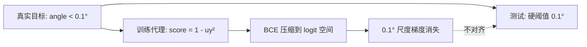
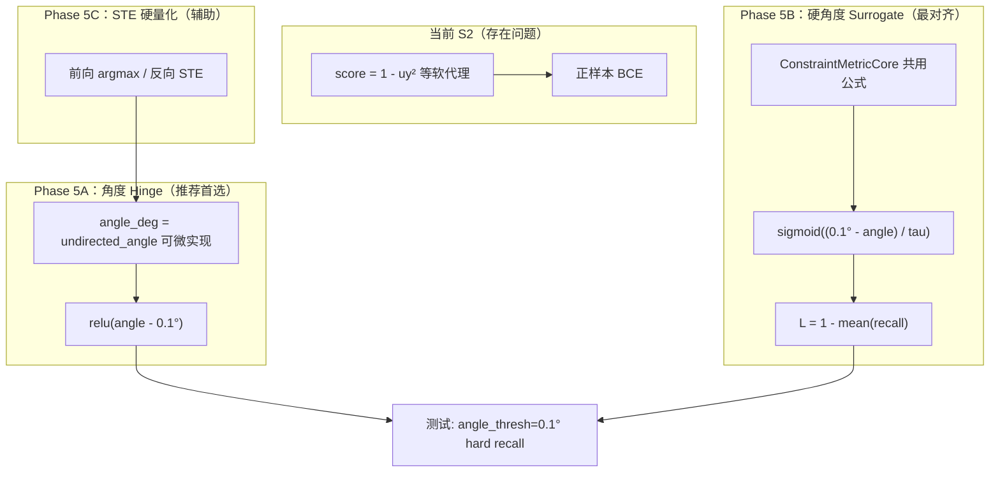

# 训练-测试约束指标对齐问题与改进方案

> 来源：`constraint_fused_deepcad_step/application/geometry_constraint.py`（`PositiveRelationConstraintEvaluator`）与 `evaluate_constraints.py`（`EvaluateConstraintSatisfactionUseCase`）的对照分析。
>
> 关联文档：`DeepCAD逐步添加几何约束技术方案.md`、`DeepCAD逐步添加几何约束任务清单.md`；可参考 `6_constraint_fused_deepcad_high_modify/训练约束与硬角度对齐实验方案.md`。

---

## 1. 方案目标

### 1.1 问题背景

当前 Step 方案（S2）在训练时使用 **正样本 BCE + 软几何 score** 计算 `L_geom`：

```text
score_h = 1 - uy²
logit = (score_h - 0.5) * bce_scale
L_h = BCEWithLogits(logit, target=1)  only where gt_horizontal = 1
```

测试集评估则使用 **硬角度阈值**（默认 `angle_thresh = 0.1°`）：

```text
hit_h  iff  undirected_angle_deg(pred_dir, x_axis) < 0.1°
hit_par iff  undirected_angle_deg(u_i, u_j) < 0.1°
hit_perp iff |undirected_angle_deg(u_i, u_j) - 90°| < 0.1°
```

实验观察：训练期 `geom_h`、`geom_parallel` 等子项可以下降，但 test `summary.json` 中的 `ratio_h`、`parallel`、`perpendicular` 改善有限，甚至出现 **训练 loss ↓ 与测试 recall 不同步** 的现象。

### 1.2 核心问题（一句话）

> 训练优化的是「软 score 接近 1」，测试判定的是「角度 < 0.1°」；两者在 0.1° 精度尺度上 **数学不对齐**，导致测试期望的约束精度无法被当前损失有效驱动。

### 1.3 改进目标

1. 使训练损失在 **角度定义** 上与测试评估一致（共用 `undirected_angle_deg` 语义）。
2. 使 0.1° 阈值附近仍保留 **有效梯度**，避免 score 饱和区「假收敛」。
3. 保持 Step 方案架构约束：仍只监督 GT 正关系；不引入 A2d 双向 hard BCE 强负样本；不改变 `P(S | z)` 生成闭包。
4. 训练日志指标可与 test `summary.json` 建立 **可解释的对应关系**（理想情况：Pearson 相关系数 ≥ 0.85）。

### 1.4 非目标

- 不在本阶段引入 `constraint_memory`、constraint token、`L_pred`、`L_recon`。
- 不默认恢复 A2d 双向 hard BCE（`GT=0` 强负样本惩罚）。
- 不要求第一版就实现完整 `ConstraintMetricCore`（可作为 Phase 5+ 进阶项）。

---

## 2. 问题诊断

### 2.1 训练 vs 测试：两套「满足约束」的定义

| 维度 | 训练（当前 `_positive_bce`） | 测试（`EvaluateConstraintSatisfactionUseCase`） |
|------|------------------------------|------------------------------------------------|
| 水平判定 | `score_h = 1 - uy² → 1` | `angle(u, ex) < 0.1°` |
| 竖直判定 | `score_v = 1 - ux² → 1` | `angle(u, ey) < 0.1°` |
| 平行判定 | `score_par = \|u_i·u_j\| → 1` | `angle(u_i, u_j) < 0.1°` |
| 垂直判定 | `score_perp = 1 - \|u_i·u_j\| → 1` | `\|angle - 90°\| < 0.1°` |
| 判定类型 | 连续软得分 + BCE | 硬阈值阶跃（0/1 hit） |
| 精度尺度 | 在 ~1° 量级即接近饱和 | 要求 0.1° 精度 |

### 2.2 数值饱和：水平约束为例

设线与 x 轴夹角为 θ（度），单位向量 `uy = sin(θ)`，则 `score_h = 1 - uy² = cos²θ`。

| 夹角 θ | uy | score_h = 1 - uy² | 测试是否通过（< 0.1°） | BCE loss（scale=4，近似） |
|--------|-----|-------------------|------------------------|---------------------------|
| 0.1° | 0.00175 | **0.999997** | ✅ 通过 | ~0.001 |
| 0.5° | 0.00873 | 0.999924 | ❌ 失败 | ~0.001 |
| 1.0° | 0.01745 | 0.999696 | ❌ 失败 | ~0.003 |
| 5.0° | 0.08716 | 0.992403 | ❌ 失败 | ~0.05 |
| 10° | 0.17365 | 0.969848 | ❌ 失败 | ~0.13 |

关键观察：

1. **0.1° 到 5°**，`score_h` 仅从 0.999997 变到 0.992，曲线几乎平坦。
2. 测试上 0.5° 已判失败，但训练 loss 仍认为「几乎完美」。
3. BCE 在 `score ≈ 1` 时梯度极小；且 `logit = (score - 0.5) * 4` 在 `score=1` 时 logit 上限仅为 2，无法表达「比 0.88 概率更确信」。

### 2.3 梯度消失机制



三层原因：

| 层级 | 机制 | 后果 |
|------|------|------|
| 度量空间 | `1 - uy² ≈ 1 - θ²`（小角度近似），对 0.1° 分辨率极差 | 0.1° 与 1° 的 score 差异 < 0.001 |
| 损失形式 | BCE 推动 score→1，不直接优化「是否在 0.1° 内」 | loss 在 score>0.99 后迅速饱和 |
| 评估形式 | 硬阈值 recall，与软 score 无单调对应 | `geom_parallel↓` 不一定带来 `parallel↑` |

### 2.4 与 A2c 现象的关联

`6_constraint_fused_deepcad_high_modify` 实验记录中已观察到：

```text
训练 geom_parallel ≈ 0.028（下降）
测试 parallel = 0.8066（未同步提升）
```

根因同类：**软几何代理指标与硬角度 recall 脱钩**。Step 方案的正样本 BCE 缓解了 A2d 双向负样本冲击，但未解决度量空间不对齐问题。

---

## 3. 整体架构：改进路线对比



| 方案 | 对齐程度 | 实现复杂度 | 推荐阶段 |
|------|----------|------------|----------|
| A. 角度 Hinge Loss | 高 | 低 | **Phase 5 首选** |
| B. 硬角度 Surrogate + tau 退火 | 最高（与 recall 同构） | 中 | Phase 5+ |
| C. uy² 残差（A2c 旧路径） | 低 | 最低 | 不推荐作 0.1° 主损失 |
| D. 缩放二次残差 `(θ/0.1)²` | 中高 | 低 | 可作 Hinge 变体 |
| E. STE 硬量化解释器 | 辅助（缩小 soft/hard 坐标差） | 中 | 与 A/B 配合 |

---

## 4. 改进方案模块

### 4.1 方案 A：角度 Hinge Loss（推荐首选）

#### 模块作用

用与测试 **完全相同的角度定义** 直接惩罚「超出 `angle_thresh`」的部分，替代 `BCE(score)`。

#### 模块原理

可微角度计算（与 `undirected_angle_deg` 一致）：

```python
def angle_from_x_deg(ux, uy):
    """undirected_angle_deg(u, ex)，ex=(1,0)"""
    return torch.rad2deg(torch.asin(uy.abs().clamp(0, 1)))

def angle_from_y_deg(ux, uy):
    """undirected_angle_deg(u, ey)，ey=(0,1)"""
    return torch.rad2deg(torch.asin(ux.abs().clamp(0, 1)))

def undirected_angle_deg(u_i, u_j):
    dot = (u_i * u_j).sum(-1).abs().clamp(0, 1)
    return torch.rad2deg(torch.acos(dot))
```

正样本 Hinge 损失（只监督 GT=1 位置）：

```text
excess = relu(angle_deg - angle_thresh)
L_h = mean(excess * gt_horizontal * valid)
L_par = mean(excess_ij * gt_parallel * pair_valid)
L_perp = mean(relu(|angle_ij - 90°| - angle_thresh) * gt_perpendicular * pair_valid)
```

**与测试对齐**：`excess = 0` 当且仅当测试判为 hit。

#### 代码（替换 `_positive_bce`）

```python
class AngleAlignedConstraintEvaluator(nn.Module):
    def __init__(self, angle_thresh: float = 0.1):
        super().__init__()
        self.angle_thresh = float(angle_thresh)

    def _positive_hinge(self, angle_deg, positive_mask):
        pos_count = positive_mask.sum()
        if pos_count <= 0:
            return angle_deg.sum() * 0.0
        excess = F.relu(angle_deg - self.angle_thresh)
        return (excess * positive_mask).sum() / pos_count.clamp_min(1.0)

    def forward(self, soft_lines, unary_gt, pair_gt, line_mask=None):
        unit = soft_lines["unit"]
        valid = soft_lines["valid"]
        if line_mask is not None:
            valid = valid * line_mask.float()

        angle_h = torch.rad2deg(torch.asin(unit[..., 1].abs().clamp(0, 1)))
        angle_v = torch.rad2deg(torch.asin(unit[..., 0].abs().clamp(0, 1)))

        unit_i, unit_j = unit.unsqueeze(2), unit.unsqueeze(1)
        dot_abs = (unit_i * unit_j).sum(dim=-1).abs().clamp(0, 1)
        angle_ij = torch.rad2deg(torch.acos(dot_abs))
        angle_perp_err = (angle_ij - 90.0).abs()

        pair_valid = valid.unsqueeze(2) * valid.unsqueeze(1)
        eye = torch.eye(valid.size(1), device=valid.device).unsqueeze(0)
        pair_valid = pair_valid * (1.0 - eye)

        mask_h = unary_gt[..., 0] * valid
        mask_v = unary_gt[..., 1] * valid
        mask_par = pair_gt[..., 0] * pair_valid
        mask_perp = pair_gt[..., 1] * pair_valid

        loss_h = self._positive_hinge(angle_h, mask_h)
        loss_v = self._positive_hinge(angle_v, mask_v)
        loss_par = self._positive_hinge(angle_ij, mask_par)
        loss_perp = self._positive_hinge(angle_perp_err, mask_perp)

        return {
            "geom_h": loss_h, "geom_v": loss_v,
            "geom_parallel": loss_par, "geom_perpendicular": loss_perp,
            "loss_geom": loss_h + loss_v + loss_par + loss_perp,
        }
```

配置：直接复用 `--angle_thresh 0.1`，训练与测试共用同一参数。

#### 举例说明

GT 要求水平，预测 `unit = (0.9998, 0.01745)`（约 1° 偏差）：

```text
angle_h = asin(0.01745) ≈ 1.0°
excess = relu(1.0 - 0.1) = 0.9°
L_h = 0.9
```

同一向量在当前 BCE 下：`score_h = 0.9997`，`L_h ≈ 0.003`（几乎无惩罚）。

| θ | hinge `relu(θ-0.1)` | 当前 BCE |
|---|----------------------|----------|
| 0.05° | 0 | ~0.001 |
| 0.5° | **0.4** | ~0.001 |
| 1.0° | **0.9** | ~0.003 |
| 5.0° | **4.9** | ~0.05 |

0.1° 附近梯度清晰，与测试阈值直接对应。

---

### 4.2 方案 B：硬角度 Surrogate（与 test recall 同构）

#### 模块作用

将测试的硬阈值 `{0, 1}` 替换为可微 surrogate，使训练 loss 与 `summary.json` 四项 recall **同公式、同分母**。

#### 模块原理

```text
sigma_tau(x) = sigmoid(x / tau)
s_h = sigma_tau(angle_thresh - angle_h_deg)
s_par = sigma_tau(angle_thresh - angle_ij_deg)
s_perp = sigma_tau(angle_thresh - |angle_ij - 90°|)
```

- `tau` 初值建议 **2.0°**（梯度平滑，便于优化）
- 按 cosine schedule 退火至 **0.05°**（逼近硬阈值阶跃）

约束训练损失（与 test recall 同构）：

```text
R_h = sum(s_h * mask_h) / sum(mask_h)
L_constraint = 1 - (R_h + R_v + R_par + R_perp) / 4
```

总损失：

```text
L_total = L_cmd + 2.0 * L_args + lambda_c * L_constraint
```

`lambda_c` 替代原 `gamma_geom * L_geom`（T1+ 路线，见 high_modify 方案）。

#### 代码（核心）

```python
def hard_angle_surrogate(angle_deg, thresh, tau):
    return torch.sigmoid((thresh - angle_deg) / tau)

def constraint_recall_loss(surrogate, mask):
    return 1.0 - (surrogate * mask).sum() / mask.sum().clamp_min(1.0)
```

#### 举例说明

`tau = 2.0°`，`angle_thresh = 0.1°`：

| 夹角 | surrogate | 硬测试 hit |
|------|-----------|------------|
| 0.05° | ~0.51 | 1 |
| 0.1° | 0.50 | 1 |
| 1.0° | ~0.38 | 0 |
| 5.0° | ~0.08 | 0 |

`tau = 0.1°` 时 surrogate 逼近硬判，与 test 一致。

实现落点：新建 `application/constraint_metric_core.py`；重构 `evaluate_constraints.py` 调用 core 的 hard 路径（详见 `6_constraint_fused_deepcad_high_modify/训练约束与硬角度对齐实验方案.md` §3.1）。

---

### 4.3 方案 C：uy² 残差（A2c 旧路径，不推荐）

#### 模块作用

`constraint_fused_deepcad_simplify_modify2_low_risk` 中使用的软残差：

```text
r_h = uy²
r_par = 1 - |u_i · u_j|
r_perp = |u_i · u_j|
```

#### 为何不推荐作 0.1° 主损失

| θ | uy² | relu(θ - 0.1) |
|---|-----|---------------|
| 0.1° | 3×10⁻⁶ | 0 |
| 1° | 3×10⁻⁴ | 0.9 |
| 5° | 7.6×10⁻³ | 4.9 |

`uy²` 在 0.1°~1° 区间绝对值极小，梯度 `2·uy` 在 0.1° 时仅 0.0035，信号弱于 Hinge。比 BCE 更直接，但仍不适合 0.1° 精度目标。

---

### 4.4 方案 D：缩放二次残差（Hinge 变体）

#### 模块原理

```text
L_h = mean( (angle_h / angle_thresh)² * gt_horizontal * valid )
```

| θ | (θ/0.1)² |
|---|----------|
| 0.1° | 1 |
| 1° | 100 |
| 5° | 2500 |

对 0.1° 附近敏感，实现简单；但没有方案 B 与 recall 同构的优势。

---

### 4.5 方案 E：STE 硬量化解释器（辅助）

#### 模块作用

缩小训练 `soft_dequantize` 与测试 `argmax` 离散化之间的坐标偏差。

#### 模块原理

```python
def soft_dequantize_ste(self, arg_logits):
    probs = F.softmax(arg_logits, dim=-1)
    hard = probs.argmax(dim=-1)
    soft = (probs * bins).sum(-1)
    coords = bin_lookup(hard)           # 前向：与 evaluate 一致
    return coords + (soft - soft.detach())  # 反向：STE 回传梯度
```

#### 举例说明

某角度 logits 在相邻 bin 间摇摆：

```text
训练 soft mean → 44.7°
测试 argmax    → 45.0°
```

STE 强制前向用 44° 或 45° 离散格，使角度 surrogate 与 test 解析一致。与方案 A/B 配合使用，不单独解决度量不对齐。

---

## 5. 推荐实施路线

### 5.1 Phase 5A（最小改动，立竿见影）

1. 在 `geometry_constraint.py` 新增 `geom_loss_mode` 开关：`bce`（当前）/ `angle_hinge`（新默认）。
2. 用方案 A 替换 `_positive_bce`，`angle_thresh` 复用 config `--angle_thresh`。
3. 保留正样本 mask 逻辑（`GT=1` only），不引入双向负样本。
4. 新增单元测试：验证 `angle=0.05° → loss≈0`、`angle=1° → loss>0`、`GT=0` 不贡献 loss。

### 5.2 Phase 5B（中期，提升 train-test 相关性）

1. 抽取 `ConstraintMetricCore`（hard + surrogate 双路径）。
2. 训练用 surrogate，评估用 hard，共用分母/分子定义。
3. 引入 `tau` 退火 schedule；日志记录 `R_h`、`R_v`、`R_parallel`、`R_perp`。
4. 验收：训练 `R_parallel` 与 test `parallel` 的 Pearson ≥ 0.85。

### 5.3 Phase 5C（若 ACC_param 仍拖累约束）

1. `DifferentiableSketchInterpreter` 增加 `mode="ste"`。
2. 约束损失路径默认走 STE，主 CAD CE 仍可用 soft。

---

## 6. 不建议的做法

| 做法 | 原因 |
|------|------|
| 仅增大 `geom_bce_scale` | 只放大饱和区梯度，不改变 0.1° 分辨率 |
| 仅增大 `gamma_geom` | 放大错误信号，可能伤害 `ACC_cmd` / `ACC_param` |
| 继续调 score 公式但不改角度空间 | `1-uy²`、`｜dot｜` 等与 0.1° 硬判不在同一度量 |
| 直接恢复 A2d 双向 hard BCE | 解决对齐之外会引入强负样本冲击，违背 Step 方案定位 |
| 只看训练 `geom_*` 判断约束恢复 | 与 test recall 可脱钩，必须以 `summary.json` 为准 |

---

## 7. 配置草案（Phase 5A）

```text
--geom_loss_mode angle_hinge     # bce | angle_hinge | surrogate
--angle_thresh 0.1               # 训练与测试共用
--gamma_geom 0.1
--geom_positive_only true
```

Phase 5B 追加：

```text
--geom_loss_mode surrogate
--hard_angle_tau 2.0
--hard_angle_tau_min 0.05
--hard_angle_tau_anneal_epochs 30
```

---

## 8. 验证与验收

### 8.1 单元测试

- `angle=0.05°`，`gt=1` → `loss_h ≈ 0`
- `angle=1.0°`，`gt=1` → `loss_h ≈ 0.9`（hinge）
- `gt=0` → 该项不进入 loss
- 梯度可回传到 `args_logits`

### 8.2 训练-测试相关性

在 val/test 子集统计：

```text
corr(epoch_mean_R_parallel, test_parallel) >= 0.85
```

### 8.3 最终指标

仍以统一评估为准：

```text
summary.json: ratio_h, ratio_v, parallel, perpendicular
per_sample_counts.csv
ACC_cmd, ACC_param
```

---

## 9. 总结

当前 Step 方案 S2 的 `_positive_bce` 存在 **train-test metric mismatch**：

```text
训练：优化 score = 1 - uy² 接近 1（在 ~1° 尺度即饱和）
测试：判定 angle < 0.1°（硬阈值 recall）
```

这不是调参能彻底解决的问题，需要把损失改到 **与 `undirected_angle_deg` 相同的角度空间**。

**首选改法（Phase 5A）**：`relu(angle_deg - angle_thresh)` 正样本 Hinge，直接对齐 0.1° 阈值。

**进阶改法（Phase 5B）**：`sigmoid((angle_thresh - angle) / tau)` surrogate + `ConstraintMetricCore`，使训练 loss 与 test recall 同公式。

**辅助手段（Phase 5C）**：STE 硬量化，缩小 soft 坐标与 test argmax 坐标差。

改进后总损失形式不变：

```text
L_total = L_cmd + 2.0 * L_args + gamma_geom * L_geom
```

变化的是 `L_geom` 内部的 **约束度量定义**，使其与 `angle_thresh = 0.1°` 的测试口径一致。
